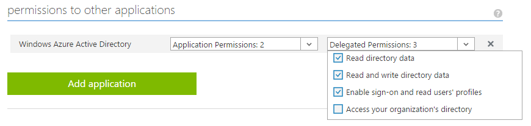

<properties
	pageTitle="The Azure AD v2.0 endpoint | Microsoft Azure"
	description="An comparison between the original Azure AD and the v2.0 endpoints."
	services="active-directory"
	documentationCenter=""
	authors="dstrockis"
	manager="mbaldwin"
	editor=""/>

<tags
	ms.service="active-directory"
	ms.workload="identity"
	ms.tgt_pltfrm="na"
	ms.devlang="na"
	ms.topic="article"
	ms.date="05/31/2016"
	ms.author="dastrock"/>

# What's different about the v2.0 endpoint?

If you're familiar with Azure Active Directory or have integrated apps with Azure AD in the past, there may be some differences in the v2.0 endpoint that you would not expect.  This document calls out those differences for your understanding.

> [AZURE.NOTE]
	Not all Azure Active Directory scenarios & features are supported by the v2.0 endpoint.  To determine if you should use the v2.0 endpoint, read about [v2.0 limitations](active-directory-v2-limitations.md).


## Microsoft accounts and Azure AD accounts
the v2.0 endpoint allow developers to write apps that accept sign-in from both Microsoft Accounts and Azure AD accounts, using a single auth endpoint.  This gives you the ability to write your app completely account-agnostic; it can be ignorant of the type of account that the user signs in with.  Of course, you *can* make your app aware of the type of account being used in a particular session, but you don't have to.

For instance, if your app calls the [Microsoft Graph](https://graph.microsoft.io), some additional functionality and data will be available to enterprise users, such as their SharePoint sites or Directory data.  But for many actions, such as [Reading a user's mail](https://graph.microsoft.io/docs/api-reference/v1.0/resources/message), the code can be written exactly the same for both Microsoft Accounts and Azure AD accounts.  

Integrating your app with Microsoft Accounts and Azure AD accounts is now one simple process.  You can use a single set of endpoints, a single library, and a single app registration to gain access to both the consumer and enterprise worlds.  To learn more about the v2.0 endpoint, check out [the overview](active-directory-appmodel-v2-overview.md).


## New app registration portal
the v2.0 endpoint can only be registered in a new location: [apps.dev.microsoft.com](https://apps.dev.microsoft.com).  This is the portal where you can obtain an Application Id, customize the appearance of your app's sign-in page, and more.  All you need to access the portal is a Microsoft powered account - either personal or work/school account.  

We will continue to add more and more functionality to this App Registration Portal over time.  The intent is that this portal will be the new location where you can go to manage anything and everything having to do with your Microsoft apps.


## One app Id for all platforms
In the original Azure Active Directory service, you may have registered several different apps for a single project.  You were forced to use separate app registrations for your native clients and web apps:


For example, if you built both a website and an iOS app, you had to register them separately, using two different Application Ids.  If you had a website and a backend web api, you might have registered each as a separate app in Azure AD.  If you had an iOS app and an Android app, you also might have registered two different apps.  

<!-- You may have even registered different apps for each of your build environments - one for dev, one for test, and one for production. -->

Now, all you need is a single app registration and a single Application Id for each of your projects.  You can add several "platforms" to a each project, and provide the appropriate data for each platform you add.  Of course, you can create as many apps as you like depending on your requirements, but for the majority of cases only one Application Id should be necessary.

<!-- You can also label a particular platform as "production-ready" when it is ready to be published to the outside world, and use that same Application Id safely in your development environments. -->

Our aim is that this will lead to a more simplified app management and development experience, and create a more consolidated view of a single project that you might be working on.


## Scopes, not resources
In the original Azure AD service, an app can behave as a **resource**, or a recipient of tokens.  A resource can define a number of **scopes** or **oAuth2Permissions** that it understands, allowing client apps to request tokens to that resource for a certain set of scopes.  Consider the Azure AD Graph API as an example of a resource:

- Resource Identifier, or `AppID URI`: `https://graph.windows.net/`
- Scopes, or `OAuth2Permissions`: `Directory.Read`, `Directory.Write`, etc.  

All of this holds true for the the v2.0 endpoint.  An app can still behave as resource, define scopes, and be identified by a URI.  Client apps can still request access to those scopes.  However, the way in which a client requests those permissions has changed.  In the past, an OAuth 2.0 authorize request to Azure AD might have looked like:

```
GET https://login.microsoftonline.com/common/oauth2/authorize?
client_id=2d4d11a2-f814-46a7-890a-274a72a7309e
&resource=https%3A%2F%2Fgraph.windows.net%2F
...
```

where the **resource** parameter indicated which resource the client app is requesting authorization for.  Azure AD computed the permissions required by the app based on static configuration in the Azure Portal, and issued tokens accordingly.  Now, the same OAuth 2.0 authorize request looks like:

```
GET https://login.microsoftonline.com/common/oauth2/v2.0/authorize?
client_id=2d4d11a2-f814-46a7-890a-274a72a7309e
&scope=https%3A%2F%2Fgraph.windows.net%2Fdirectory.read%20https%3A%2F%2Fgraph.windows.net%2Fdirectory.write
...
```

where the **scope** parameter indicates which resource and permissions the app is requesting authorization for. The desired resource is still very present in the request - it is simply encompassed in each of the values of the scope parameter.  Using the scope parameter in this manner allows the v2.0 endpoint to be more compliant with the OAuth 2.0 specification, and aligns more closely with common industry practices.  It also enables apps to perform [incremental consent](#incremental-and-dynamic-consent), which is described in the next section.

## Incremental and dynamic consent
Apps registered in the generally available Azure AD service needed to specify their required OAuth 2.0 permissions in the Azure Portal, at app creation time:



The permissions an app required were configured **statically**.  While this allowed configuration of the app to exist in the Azure Portal and kept the code nice and simple, it presents a few issues for developers:

- An app had to know all of the permissions it would ever need at app creation time.  Adding permissions over time was a difficult process.
- An app had to know all of the resources it would ever access ahead of time.  It was difficult to create apps that could access an arbitrary number of resources.
- An app had to request all the permissions it would ever need upon the user's first sign-in.  In some cases this led to a very long list of permissions, which discouraged end-users from approving the app's access on initial sign-in.

With the v2.0 endpoint, you can specify the permissions your app needs **dynamically**, at runtime, during regular usage of your app.  To do so, you can specify the scopes your app needs at any given point in time by including them in the `scope` parameter of an authorization request:

```
GET https://login.microsoftonline.com/common/oauth2/v2.0/authorize?
client_id=2d4d11a2-f814-46a7-890a-274a72a7309e
&scope=https%3A%2F%2Fgraph.windows.net%2Fdirectory.read%20https%3A%2F%2Fgraph.windows.net%2Fdirectory.write
...
```

The above requests permission for the app to read an Azure AD user's directory data, as well as write data to their directory.  If the user has consented to those permissions in the past for this particular app, they will simply enter their credentials and be signed into the app.  If the user has not consented to any of these permissions, the v2.0 endpoint will ask the user for consent to those permissions.  To learn more, you can read up on [permissions, consent, and scopes](active-directory-v2-scopes.md).

Allowing an app to request permissions dynamically via the `scope` parameter gives you full control over your user's experience.  If you wish, you can choose to frontload your consent experience and ask for all permissions in one initial authorization request.  Or if your app requires a large number of permissions, you can choose to gather those permissions from the user incrementally, as they attempt to use certain features of your app over time.

## Well-known scopes

#### Offline access
the v2.0 endpoint may require the use of a new well-known permission for apps - the `offline_access` scope.  All apps will need to request this permission if they need to access resources on the behalf of a user for a prolonged period of time, even when the user may not be actively using the app.  The `offline_access` scope will appear to the user in consent dialogs as "Access your data offline", which the user must agree to.  Requesting the `offline_access` permission will enable your web app to receive OAuth 2.0 refresh_tokens from the v2.0 endpoint.  Refresh_tokens are long-lived, and can be exchanged for new OAuth 2.0 access_tokens for extended periods of access.  

If your app does not request the `offline_access` scope, it will not receive refresh_tokens.  This means that when you redeem an authorization_code in the [OAuth 2.0 authorization code flow](active-directory-v2-protocols.md#oauth2-authorization-code-flow), you will only receive back an access_token from the `/token` endpoint.  That access_token will remain valid for a short period of time (typically one hour), but will eventually expire.  At that point in time, your app will need to redirect the user back to the `/authorize` endpoint to retrieve a new authorization_code.  During this redirect, the user may or may not need to enter their credentials again or re-consent to permissions, depending on the the type of app.

To learn more about OAuth 2.0, refresh_tokens, and access_tokens, check out the [v2.0 protocol reference](active-directory-v2-protocols.md).

#### OpenID, profile, & email

In the original Azure Active Directory service, the most basic OpenID Connect sign-in flow would provide a wealth of information about the user in the resulting id_token.  The claims in an id_token can include the user's name, preferred username, email address, object ID, and more.

We are now restricting the information that the `openid` scope affords your app access to.  The ‘openid’ scope will only allow your app to sign the user in, and receive an app-specific identifier for the user.  If you want to obtain personally identifiable information (PII) about the user in your app, your app will need to request additional permissions from the user.  We are introducing two new scopes – the `email` and `profile` scopes – which allow you to do so.

The `email` scope is very straightforward – it allows your app access to the user’s primary email address via the `email` claim in the id_token.  The `profile` scope affords your app access to all other basic information about the user – their name, preferred username, object ID, and so on.

This allows you to code your app in a minimal-disclosure  fashion – you can only ask the user for the set of information that your app requires to do its job.  For more information on these scopes, refer to [the v2.0 scope reference](active-directory-v2-scopes.md). 

## Token Claims

The claims in tokens issued by the v2.0 endpoint will not be identical to tokens issued by the generally available Azure AD endpoints - apps migrating to the new service should not assume a particular claim will exist in id_tokens or access_tokens.   Tokens issued by the v2.0 endpoint are compliant with the OAuth 2.0 and OpenID Connect specifications, but may follow different semantics than the generally available Azure AD service.

To learn about the specific claims emitted in v2.0 tokens, see the [v2.0 token reference](active-directory-v2-tokens.md).

## Limitations
There are a few restrictions to be aware of when using the v2.0 point.  Please refer to the [v2.0 limitations doc](active-directory-v2-limitations.md) to see if any of these restrictions apply to your particular scenario.
