<properties
	pageTitle="Azure Active Directory v2.0 Android app | Microsoft Azure"
	description="How to build an Android app that signs in users with both personal Microsoft account and work or school accounts and calls the Graph API by using third party libraries."
	services="active-directory"
	documentationCenter=""
	authors="brandwe"
	manager="mbaldwin"
	editor=""/>

<tags
	ms.service="active-directory"
	ms.workload="identity"
	ms.tgt_pltfrm="na"
	ms.devlang="na"
	ms.topic="article"
	ms.date="05/31/2016"
	ms.author="brandwe"/>

#  Add sign-in to an Android app using a third-party library with Graph API using the v2.0 endpoint

The Microsoft identity platform uses open standards such as OAuth2 and OpenID Connect. Developers can use any library they want to integrate with our services. To help developers use our platform with other libraries, we've written a few walkthroughs like this one to demonstrate how to configure third-party libraries to connect to the Microsoft identity platform. Most libraries that implement [the RFC6749 OAuth2 spec](https://tools.ietf.org/html/rfc6749) can connect to the Microsoft identity platform.

With the application that this walkthrough creates, users can sign in to their organization and then search for themselves in their organization by using the Graph API.

If you're new to OAuth2 or OpenID Connect, much of this sample configuration may not make sense to you. We recommend that you read [2.0 Protocols - OAuth 2.0 Authorization Code Flow](active-directory-v2-protocols-oauth-code.md) for background.

> [AZURE.NOTE] Some features of our platform that do have an expression in the OAuth2 or OpenID Connect standards, such as Conditional Access and Intune policy management, require you to use our open source Microsoft Azure Identity Libraries.

The v2.0 endpoint does not support all Azure Active Directory scenarios and features.

> [AZURE.NOTE] To determine if you should use the v2.0 endpoint, read about [v2.0 limitations](active-directory-v2-limitations.md).


## Download the code from GitHub
The code for this tutorial is maintained [on GitHub]https://github.com/Azure-Samples/active-directory-android-native-oidcandroidlib-v2).  To follow along, you can  [download the app's skeleton as a .zip](https://github.com/Azure-Samples/active-directory-android-native-oidcandroidlib-v2/archive/skeleton.zip) or clone the skeleton:

```
git clone --branch skeleton git@github.com:Azure-Samples/active-directory-android-native-oidcandroidlib-v2.git
```

You can also just download the sample and get started right away:

```
git@github.com:Azure-Samples/active-directory-android-native-oidcandroidlib-v2.git
```

## Register an app
Create a new app at the [Application registration portal](https://apps.dev.microsoft.com), or follow the detailed steps at [How to register an app with the v2.0 endpoint](active-directory-v2-app-registration.md).  Make sure to:

- Copy the **Application Id** that's assigned to your app because you'll need it soon.
- Add the **Mobile** platform for your app.
- Copy the **Redirect URI** from the portal. You must use the default value of `https://login.microsoftonline.com/common/oauth2/nativeclient`.


## Download the NXOAuth2 third-party library and create a workspace

For this walkthrough, you will use the OIDCAndroidLib from GitHub, which is an OAuth2 library based on the OpenID Connect code of Google. It implements the native application profile and supports the authorization endpoint of the user. These are all the things that you'll need to integrate with the Microsoft identity platform.

Clone the OIDCAndroidLib repo to your computer.

```
git@github.com:kalemontes/OIDCAndroidLib.git
```

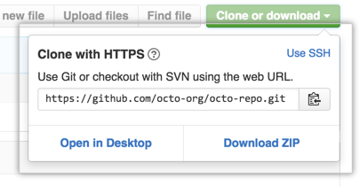

## Set up your Android Studio environment

1. Create a new Android Studio project and accept the defaults in the wizard.

	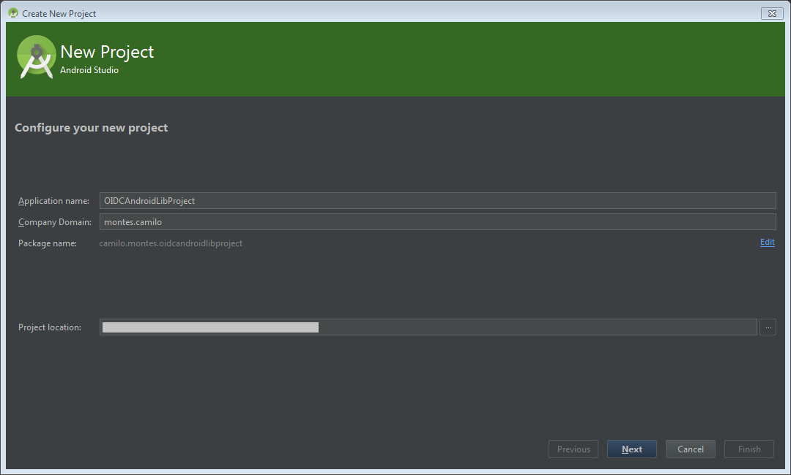

	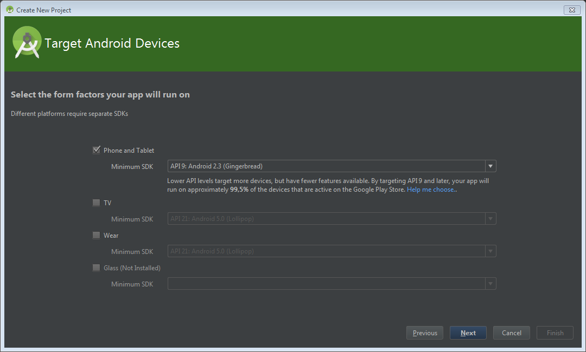

	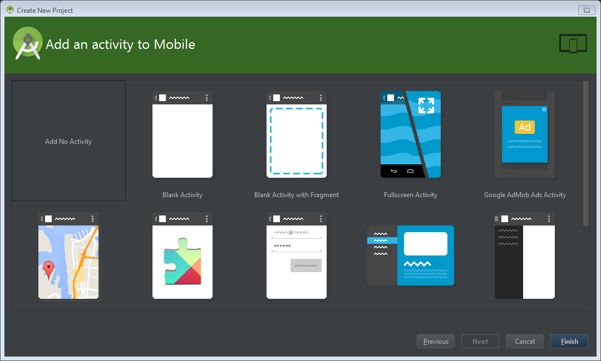

2. To set up your project modules, move the cloned repo to the project location. You can also create the project and then clone it directly to the project location.

	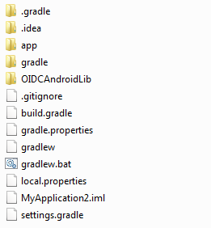

3. Open the project modules settings by using the context menu or by using the Ctrl+Alt+Maj+S shortcut.

	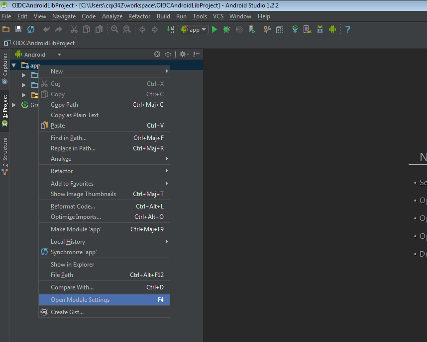

4. Remove the default app module because you only want the project container settings.

	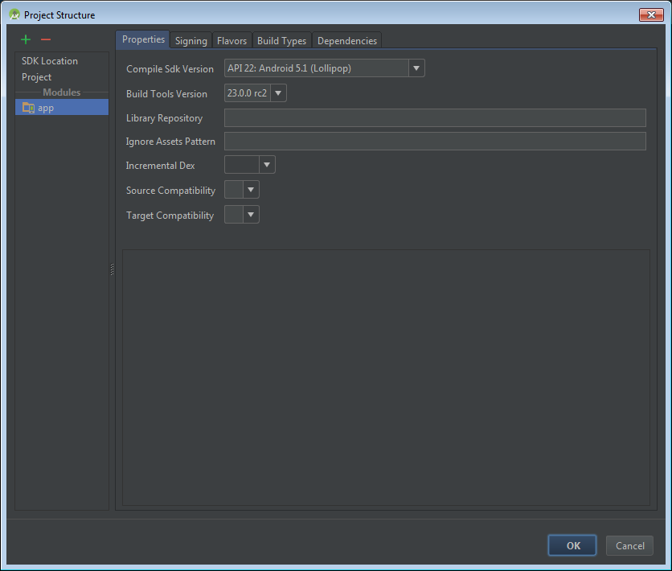

5. Import modules from the cloned repo to the current project.

	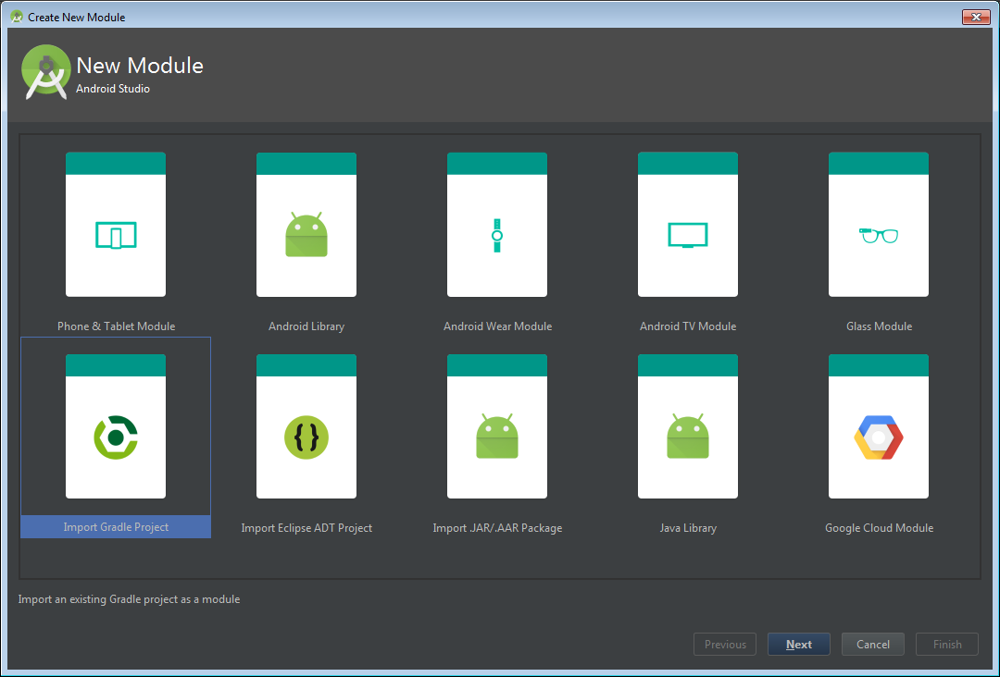
	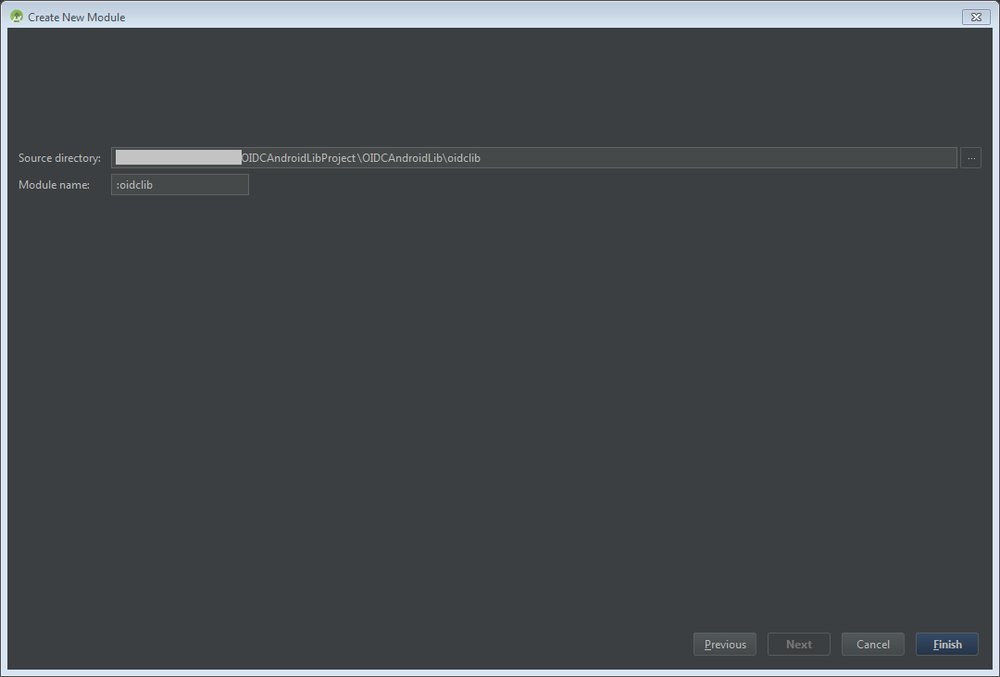

6. Repeat these steps for the `oidlib-sample` module.

7. Check the oidclib dependencies on the `oidlib-sample` module.

	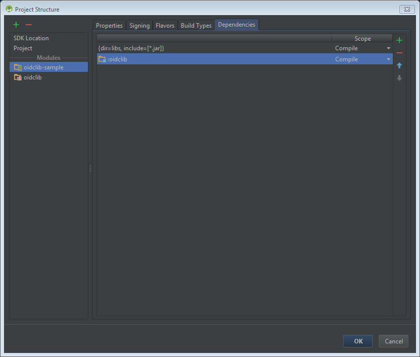

8. Click **OK** and wait for gradle sync.

	Your settings.gradle should look like:

	

9. Build the sample app to make sure that the sample running correctly.

	You won't be able to use this with Azure Active Directory yet. We'll need to configure some endpoints first. This is to ensure you don't have an Android Studio issues before we start customizing the sample app.

10. Build and run `oidlib-sample` as the target in Android Studio.

	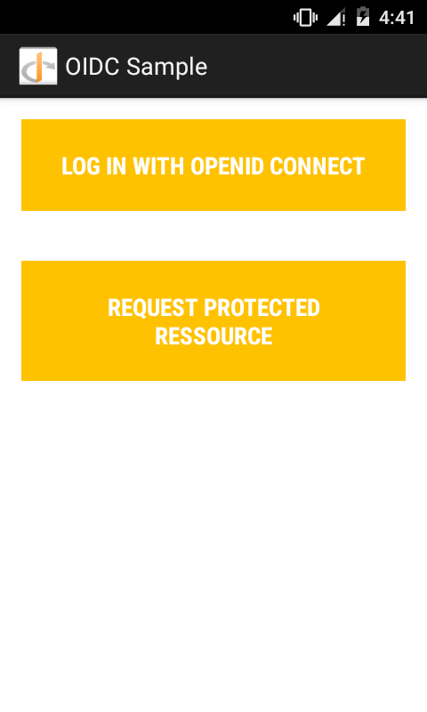

11. Delete the `app ` directory that was left when you removed the module from the project because Android Studio doesn't delete it for safety.

	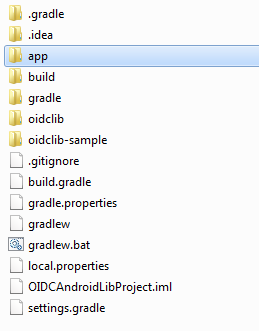

12. Open the **Edit Configurations** menu to remove the run configuration that was also left when you removed the module from the project.

	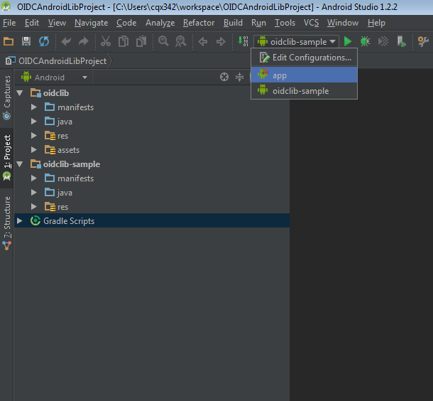
	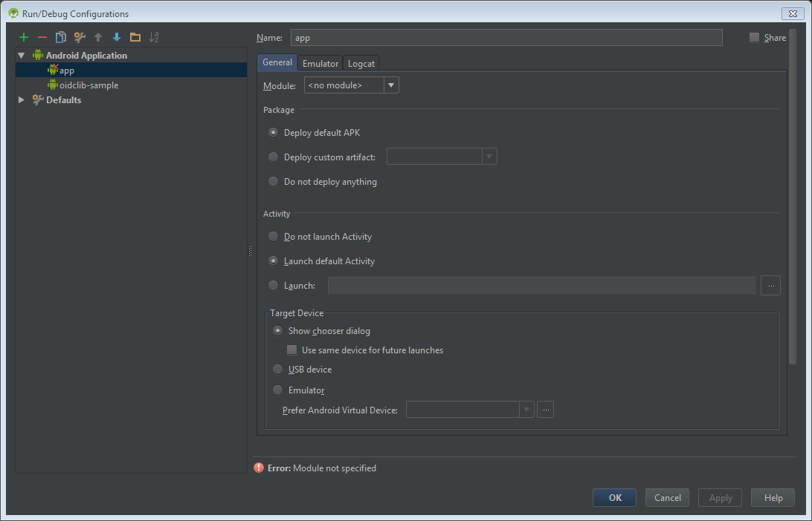

## Configure the endpoints of the sample

Now that you have the `oidlib-sample` running successfully, let's edit some endpoints to get this working with Azure Active Directory.

### Configure your client by editing the oidc_clientconf.xml file

1. Because you are using OAuth2 flows only to get a token and call the Graph API, set the client to do OAuth2 only. OIDC will come in a later example.

	```xml
	    <bool name="oidc_oauth2only">true</bool>
	```

2. Configure your client ID that you received from the registration portal.

	```xml
	    <string name="oidc_clientId">86172f9d-a1ae-4348-aafa-7b3e5d1b36f5</string>
	    <string name="oidc_clientSecret"></string>
	```

3. Configure your redirect URI with the one below.

	```xml
	    <string name="oidc_redirectUrl">https://login.microsoftonline.com/common/oauth2/nativeclient</string>
	```

4. Configure your scopes that you need in order to access the Graph API.

	```xml
	    <string-array name="oidc_scopes">
	        <item>openid</item>
	        <item>https://graph.microsoft.com/User.Read</item>
	        <item>offline_access</item>
	    </string-array>
	```

The `User.Read` value in `oidc_scopes` allows you to read the basic profile the signed in user.
You can learn more about all the available scopes at [Microsoft Graph permission scopes](https://graph.microsoft.io/docs/authorization/permission_scopes).

If you'd like explanations about `openid` or `offline_access` as scopes in OpenID Connect, see [2.0 Protocols - OAuth 2.0 Authorization Code Flow](active-directory-v2-protocols-oauth-code.md).

### Configure your client endpoints by editing the oidc_endpoints.xml file

- Open the `oidc_endpoints.xml` file and make the following changes:

	```xml
	<!-- Stores OpenID Connect provider endpoints. -->
	<resources>
	    <string name="op_authorizationEnpoint">https://login.microsoftonline.com/common/oauth2/v2.0/authorize</string>
	    <string name="op_tokenEndpoint">https://login.microsoftonline.com/common/oauth2/v2.0/token</string>
	    <string name="op_userInfoEndpoint">https://www.example.com/oauth2/userinfo</string>
	    <string name="op_revocationEndpoint">https://www.example.com/oauth2/revoketoken</string>
	</resources>
	```

These endpoints should never change if you are using OAuth2 as your protocol.

> [AZURE.NOTE]
The endpoints for `userInfoEndpoint` and `revocationEndpoint` are currently not supported by Azure Active Directory. If you leave these with the default example.com value, you will be reminded that they are not available in the sample :-)


## Configure a Graph API call

- Open the `HomeActivity.java` file and make the following changes:

	```Java
	   //TODO: set your protected resource url
	    private static final String protectedResUrl = "https://graph.microsoft.com/v1.0/me/";
	```

Here a simple Graph API call returns our information.

Those are all the changes that you need to do. Run the `oidlib-sample` application, and click **Sign in**.

After you've successfully authenticated, select the **Request Protected Resource** button to test your call to the Graph API.

## Get security updates for our product

We encourage you to get notifications about security incidents by visiting the [Security TechCenter](https://technet.microsoft.com/security/dd252948) and subscribing to Security Advisory Alerts.
