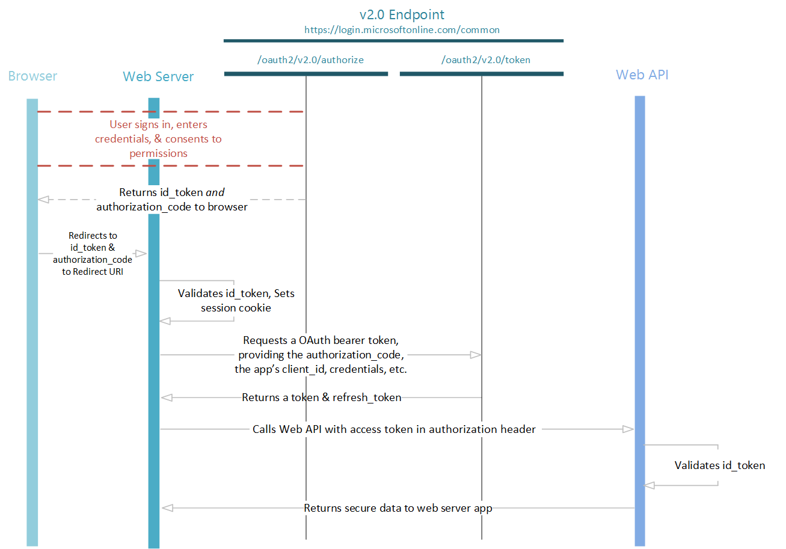

<properties
	pageTitle="Azure AD v2.0 OpenID Connect Protocol | Microsoft Azure"
	description="Building web applications using Azure AD's v2.0 implementation of the OpenID Connect authentication protocol."
	services="active-directory"
	documentationCenter=""
	authors="dstrockis"
	manager="msmbaldwin"
	editor=""/>

<tags
	ms.service="active-directory"
	ms.workload="identity"
	ms.tgt_pltfrm="na"
	ms.devlang="na"
	ms.topic="article"
	ms.date="06/23/2016"
	ms.author="dastrock"/>

# v2.0 Protocols - OpenID Connect
OpenID Connect is an authentication protocol built on top of OAuth 2.0 that can be used to securely sign users into web applications.  Using the v2.0 endpoint's implementation of OpenID Connect, you can add sign in and API access to your web based applications.  This guide will show you how to do so in a language-independent manner, describing how to send and receive HTTP messages without using any of our open-source libraries.

> [AZURE.NOTE]
	Not all Azure Active Directory scenarios & features are supported by the v2.0 endpoint.  To determine if you should use the v2.0 endpoint, read about [v2.0 limitations](active-directory-v2-limitations.md).

[OpenID Connect](http://openid.net/specs/openid-connect-core-1_0.html) extends the OAuth 2.0*authorization* protocol for use as an *authentication* protocol, which allows you to perform single sign-on using OAuth.  It introduces the concept of an `id_token`, which is a security token that allows the client to verify the identity of the user and obtain basic profile information about the user.  Because it extends OAuth 2.0, it also enables apps to securely acquire **access_tokens** which can be used to access resources that are secured by an [authorization server](active-directory-v2-protocols.md#the-basics).  OpenID Connect is our recommendation if you are building a [web application](active-directory-v2-flows.md#web-apps) that is hosted on a server and accessed via a browser.

## Protocol Diagram - Sign In
The most basic sign-in flow contains the following steps - each of them is described in detail below.


## Send the sign-in request
When your web app needs to authenticate the user, it can direct the user to the `/authorize` endpoint.  This request is similar to the first leg of the [OAuth 2.0 Authorization Code Flow](active-directory-v2-protocols-oauth-code.md), with a few important distinctions:

- The request must include the scope `openid` in the `scope` parameter.
- The `response_type` parameter must include `id_token`
- The request must include the `nonce` parameter

```
// Line breaks for legibility only

GET https://login.microsoftonline.com/{tenant}/oauth2/v2.0/authorize?
client_id=6731de76-14a6-49ae-97bc-6eba6914391e
&response_type=id_token
&redirect_uri=http%3A%2F%2Flocalhost%2Fmyapp%2F
&response_mode=form_post
&scope=openid
&state=12345
&nonce=678910
```

> [AZURE.TIP] Click the link below to execute this request! After signing in, your browser should be redirected to `https://localhost/myapp/` with an `id_token` in the address bar.  Note that this request uses `response_mode=query` (for tutorial purposes only).  It is recommended to use `response_mode=form_post`.
    <a href="https://login.microsoftonline.com/common/oauth2/v2.0/authorize?client_id=6731de76-14a6-49ae-97bc-6eba6914391e&response_type=id_token&redirect_uri=http%3A%2F%2Flocalhost%2Fmyapp%2F&scope=openid&response_mode=query&state=12345&nonce=678910" target="_blank">https://login.microsoftonline.com/common/oauth2/v2.0/authorize...</a>

| Parameter | | Description |
| ----------------------- | ------------------------------- | --------------- |
| tenant | required | The `{tenant}` value in the path of the request can be used to control who can sign into the application.  The allowed values are `common`, `organizations`, `consumers`, and tenant identifiers.  For more detail, see [protocol basics](active-directory-v2-protocols.md#endpoints). |
| client_id | required | The Application Id that the registration portal ([apps.dev.microsoft.com](https://apps.dev.microsoft.com)) assigned your app. |
| response_type | required | Must include `id_token` for OpenID Connect sign-in.  It may also include other response_types, such as `code`. |
| redirect_uri | recommended | The redirect_uri of your app, where authentication responses can be sent and received by your app.  It must exactly match one of the redirect_uris you registered in the portal, except it must be url encoded. |
| scope | required | A space-separated list of scopes.  For OpenID Connect, it must include the scope `openid`, which translates to the "Sign you in" permission in the consent UI.  You may also include other scopes in this request for requesting consent. |
| nonce | required | A value included in the request, generated by the app, that will be included in the resulting id_token as a claim.  The app can then verify this value to mitigate token replay attacks.  The value is typically a randomized, unique string that can be used to identify the origin of the request.  |
| response_mode | recommended | Specifies the method that should be used to send the resulting authorization_code back to your app.  Can be one of 'query', 'form_post', or 'fragment'.  For web applications we recommend using `response_mode=form_post` to ensure the most secure transfer of tokens to your application.  
| state | recommended | A value included in the request that will also be returned in the token response.  It can be a string of any content that you wish.  A randomly generated unique value is typically used for [preventing cross-site request forgery attacks](http://tools.ietf.org/html/rfc6749#section-10.12).  The state is also used to encode information about the user's state in the app before the authentication request occurred, such as the page or view they were on. |
| prompt | optional | Indicates the type of user interaction that is required.  The only valid values at this time are 'login', 'none', and 'consent'.  `prompt=login` will force the user to enter their credentials on that request, negating single-sign on.  `prompt=none` is the opposite - it will ensure that the user is not presented with any interactive prompt whatsoever.  If the request cannot be completed silently via single-sign on, the v2.0 endpoint will return an error.  `prompt=consent` will trigger the OAuth consent dialog after the user signs in, asking the user to grant permissions to the app. |
| login_hint | optional | Can be used to pre-fill the username/email address field of the sign in page for the user, if you know their username ahead of time.  Often apps will use this parameter during re-authentication, having already extracted the username from a previous sign-in using the `preferred_username` claim. |
| domain_hint | optional | Can be one of `consumers` or `organizations`.  If included, it will skip the email-based discovery process that user goes through on the v2.0 sign in page, leading to a slightly more streamlined user experience.  Often apps will use this parameter during re-authentication, by extracting the `tid` claim from the id_token.  If the `tid` claim value is `9188040d-6c67-4c5b-b112-36a304b66dad`, you should use `domain_hint=consumers`.  Otherwise, use `domain_hint=organizations`. |
At this point, the user will be asked to enter their credentials and complete the authentication.  The v2.0 endpoint will also ensure that the user has consented to the permissions indicated in the `scope` query parameter.  If the user has not consented to any of those permissions, it will ask the user to consent to the required permissions.  Details of [permissions, consent, and multi-tenant apps are provided here](active-directory-v2-scopes.md).

Once the user authenticates and grants consent, the v2.0 endpoint will return a response to your app at the indicated `redirect_uri`, using the method specified in the `response_mode` parameter.

#### Successful response
A successful response using `response_mode=form_post` looks like:

```
POST /myapp/ HTTP/1.1
Host: localhost
Content-Type: application/x-www-form-urlencoded

id_token=eyJ0eXAiOiJKV1QiLCJhbGciOiJSUzI1NiIsIng1dCI6Ik1uQ19WWmNB...&state=12345
```

| Parameter | Description |
| ----------------------- | ------------------------------- |
| id_token | The id_token that the  app requested. You can use the id_token to verify the user's identity and begin a session with the user.  More details on id_tokens and their contents is included in the [v2.0 endpoint token reference](active-directory-v2-tokens.md).  |
| state | If a state parameter is included in the request, the same value should appear in the response. The  app should verify that the state values in the request and response are identical. |

#### Error response
Error responses may also be sent to the `redirect_uri` so the app can handle them appropriately:

```
POST /myapp/ HTTP/1.1
Host: localhost
Content-Type: application/x-www-form-urlencoded

error=access_denied&error_description=the+user+canceled+the+authentication
```

| Parameter | Description |
| ----------------------- | ------------------------------- |
| error | An error code string that can be used to classify types of errors that occur, and can be used to react to errors. |
| error_description | A specific error message that can help a developer identify the root cause of an authentication error.  |

#### Error codes for authorization endpoint errors

The following table describes the various error codes that can be returned in the `error` parameter of the error response.

| Error Code | Description | Client Action |
|------------|-------------|---------------|
| invalid_request | Protocol error, such as a missing required parameter. | Fix and resubmit the request. This is a development error is typically caught during initial testing.|
| unauthorized_client | The client application is not permitted to request an authorization code. | This usually occurs when the client application is not registered in Azure AD or is not added to the user's Azure AD tenant. The application can prompt the user with instruction for installing the application and adding it to Azure AD. |
| access_denied | Resource owner denied consent | The client application can notify the user that it cannot proceed unless the user consents. |
| unsupported_response_type | The authorization server does not support the response type in the request. | Fix and resubmit the request. This is a development error is typically caught during initial testing.|
|server_error | The server encountered an unexpected error. | Retry the request. These errors can result from temporary conditions. The client application might explain to the user that its response is delayed due a temporary error. |
| temporarily_unavailable | The server is temporarily too busy to handle the request. | Retry the request. The client application might explain to the user that its response is delayed due a temporary condition. |
| invalid_resource |The target resource is invalid because it does not exist, Azure AD cannot find it, or it is not correctly configured.| This indicates the resource, if it exists, has not been configured in the tenant. The application can prompt the user with instruction for installing the application and adding it to Azure AD. |

## Validate the id_token
Just receiving an id_token is not sufficient to authenticate the user; you must validate the id_token's signature and verify the claims in the token per your app's requirements.  The v2.0 endpoint uses [JSON Web Tokens (JWTs)](http://self-issued.info/docs/draft-ietf-oauth-json-web-token.html) and public key cryptography to sign tokens and verify that they are valid.

You can choose to validate the `id_token` in client code, but a common practice is to send the `id_token` to a backend server and perform the validation there.  Once you've validated the signature of the id_token, there are a few claims you will be required to verify.  See the [v2.0 token reference](active-directory-v2-tokens.md) for more information, including [Validating Tokens](active-directory-v2-tokens.md#validating-tokens) and [Important Information About Signing Key Rollover](active-directory-v2-tokens.md#validating-tokens).  We recommend making use of a library for parsing and validating tokens - there is at least one available for most languages and platforms.
<!--TODO: Improve the information on this-->

You may also wish to validate additional claims depending on your scenario.  Some common validations include:

- Ensuring the user/organization has signed up for the app.
- Ensuring the user has proper authorization/privileges
- Ensuring a certain strength of authentication has occurred, such as multi-factor authentication.

For more information on the claims in an id_token, see the [v2.0 endpoint token reference](active-directory-v2-tokens.md).

Once you have completely validated the id_token, you can begin a session with the user and use the claims in the id_token to obtain information about the user in your app.  This information can be used for display, records, authorizations, etc.

## Send a sign out request

The OpenIdConnect `end_session_endpoint` is not currently supported by the v2.0 endpoint. This means your app cannot send a request to the v2.0 endpoint to end a user's session and clear cookies set by the v2.0 endpoint.
To sign a user out, your app can simply end its own session with the user, and leave the user's session with the v2.0 endpoint in-tact.  The next time the user tries to sign in, they will see a "choose account" page, with their actively signed-in accounts listed.
On that page, the user can choose to sign out of any account, ending the session with the v2.0 endpoint.

<!--

When you wish to sign the user out of the app, it is not sufficient to clear your app's cookies or otherwise end the session with the user.  You must also redirect the user to the v2.0 endpoint for sign out.  If you fail to do so, the user will be able to re-authenticate to your app without entering their credentials again, because they will have a valid single sign-on session with the v2.0 endpoint.

You can simply redirect the user to the `end_session_endpoint` listed in the OpenID Connect metadata document:

```
GET https://login.microsoftonline.com/common/oauth2/v2.0/logout?
post_logout_redirect_uri=http%3A%2F%2Flocalhost%2Fmyapp%2F
```

| Parameter | | Description |
| ----------------------- | ------------------------------- | ------------ |
| post_logout_redirect_uri | recommended | The URL which the user should be redirected to after successful logout.  If not included, the user will be shown a generic message by the v2.0 endpoint.  |

-->

## Protocol Diagram - Token Acquisition
Many web apps need to not only sign the user in, but also access a web service on behalf of that user using OAuth.  This scenario combines OpenID Connect for user authentication while simultaneously acquiring an authorization_code that can be used to get access_tokens using the OAuth Authorization Code Flow.

The full OpenID Connect sign-in and token acquisition flow looks something like this - each step is described in detail below.



## Get access tokens
To acquire access tokens, you'll need to slightly modify the sign in request from above:

```
// Line breaks for legibility only

GET https://login.microsoftonline.com/{tenant}/oauth2/v2.0/authorize?
client_id=6731de76-14a6-49ae-97bc-6eba6914391e		// Your registered Application Id
&response_type=id_token+code
&redirect_uri=http%3A%2F%2Flocalhost%2Fmyapp%2F 	  // Your registered Redirect Uri, url encoded
&response_mode=form_post						      // 'query', 'form_post', or 'fragment'
&scope=openid%20                                      // Include both 'openid' and scopes your app needs  
offline_access%20										 
https%3A%2F%2Fgraph.microsoft.com%2Fmail.read
&state=12345						 				 // Any value, provided by your app
&nonce=678910										 // Any value, provided by your app
```

> [AZURE.TIP] Click the link below to execute this request! After signing in, your browser should be redirected to `https://localhost/myapp/` with an `id_token` and a `code` in the address bar.  Note that this request uses `response_mode=query` (for tutorial purposes only).  It is recommended to use `response_mode=form_post`.
    <a href="https://login.microsoftonline.com/common/oauth2/v2.0/authorize?client_id=6731de76-14a6-49ae-97bc-6eba6914391e&response_type=id_token+code&redirect_uri=http%3A%2F%2Flocalhost%2Fmyapp%2F&response_mode=query&scope=openid%20offline_access%20https%3A%2F%2Fgraph.microsoft.com%2Fmail.read&state=12345&nonce=678910" target="_blank">https://login.microsoftonline.com/common/oauth2/v2.0/authorize...</a>

By including permission scopes in the request and using `response_type=code+id_token`, the v2.0 endpoint will ensure that the user has consented to the permissions indicated in the `scope` query parameter, and return your app an authorization code to exchange for an access token.

#### Successful response
A successful response using `response_mode=form_post` looks like:

```
POST /myapp/ HTTP/1.1
Host: localhost
Content-Type: application/x-www-form-urlencoded

id_token=eyJ0eXAiOiJKV1QiLCJhbGciOiJSUzI1NiIsIng1dCI6Ik1uQ19WWmNB...&code=AwABAAAAvPM1KaPlrEqdFSBzjqfTGBCmLdgfSTLEMPGYuNHSUYBrq...&state=12345
```

| Parameter | Description |
| ----------------------- | ------------------------------- |
| id_token | The id_token that the  app requested. You can use the id_token to verify the user's identity and begin a session with the user.  More details on id_tokens and their contents is included in the [v2.0 endpoint token reference](active-directory-v2-tokens.md).  |
| code | The authorization_code that the  app requested. The  app can use the authorization code to request an access token for the target resource.  Authorization_codes are very short lived, typically they expire after about 10 minutes. |
| state | If a state parameter is included in the request, the same value should appear in the response. The  app should verify that the state values in the request and response are identical. |

#### Error response
Error responses may also be sent to the `redirect_uri` so the app can handle them appropriately:

```
POST /myapp/ HTTP/1.1
Host: localhost
Content-Type: application/x-www-form-urlencoded

error=access_denied&error_description=the+user+canceled+the+authentication
```

| Parameter | Description |
| ----------------------- | ------------------------------- |
| error | An error code string that can be used to classify types of errors that occur, and can be used to react to errors. |
| error_description | A specific error message that can help a developer identify the root cause of an authentication error.  |

For a description of the possible error codes and their recommended client action, please see [Error codes for authorization endpoint errors](#error-codes-for-authorization-endpoint-errors).

Once you've gotten an authorization `code` and an `id_token`, you can sign the user in and get access tokens on their behalf.  To sign the user in, you must validate the `id_token` exactly as described [above](#validating-the-id-token).  To get access tokens, you can follow the steps described in our [OAuth protocol documentation](active-directory-v2-protocols-oauth-code.md#request-an-access-token).
