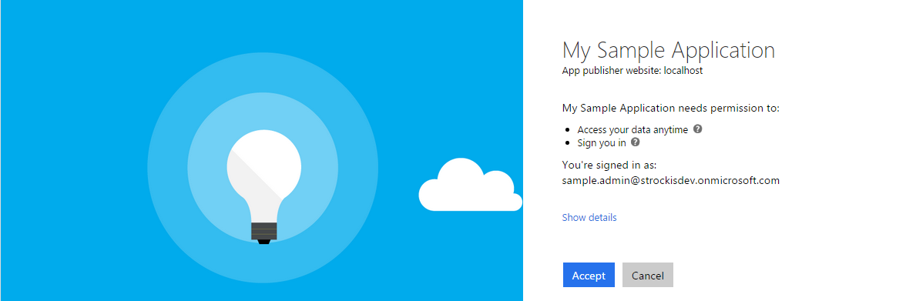

<properties
	pageTitle="Azure AD v2.0 Scopes, permissions, & consent | Microsoft Azure"
	description="A description of authorization in the Azure AD v2.0 endpoint, including scopes, permissions, and consent."
	services="active-directory"
	documentationCenter=""
	authors="dstrockis"
	manager="mbaldwin"
	editor=""/>

<tags
	ms.service="active-directory"
	ms.workload="identity"
	ms.tgt_pltfrm="na"
	ms.devlang="na"
	ms.topic="article"
	ms.date="05/31/2016"
	ms.author="dastrock"/>

# Scopes, permissions, & consent in the v2.0 endpoint

Apps that integrate with Azure AD follow a particular authorization model that allows users to control how an app can access their data.  The v2.0 implementation of this authorization model has been updated, changing how an app must interact with Azure AD.  This topic covers the basic concepts of this authorization model, including scopes, permissions, and consent.

> [AZURE.NOTE]
	Not all Azure Active Directory scenarios & features are supported by the v2.0 endpoint.  To determine if you should use the v2.0 endpoint, read about [v2.0 limitations](active-directory-v2-limitations.md).

## Scopes & permissions

Azure AD implements the [OAuth 2.0](active-directory-v2-protocols.md) authorization protocol, which is a method for allowing a 3rd party app to access web-hosted resources on behalf of a user.  Any web-hosted resource that integrates with Azure AD will have a resource identifier, or **App ID URI**.  For example, some of Microsoft's web-hosted resources include:

- The Office 365 Unified Mail API: `https://outlook.office.com`
- The Azure AD Graph API: `https://graph.windows.net`
- The Microsoft Graph: `https://graph.microsoft.com`

The same is true for any 3rd party resources that has integrated with Azure AD.  Any of these resources can also define a set of permissions that can be used to divide up the functionality of that resource into smaller chunks.  As an example, the Microsoft Graph has defined a few permissions:

- Read a user's calendar
- Write to a user's calendar
- Send mail as a user
- [+ more](https://graph.microsoft.io)

By defining these permissions, the resource can have fine-grained control over its data and how it is exposed to the outside world.  A 3rd party app can then request these permissions from an end-user - and the end-user must approve the permissions before the app can act on their behalf.  By chunking the resource's functionality into smaller permission sets, 3rd party apps can be built to request only the specific permissions that they need in order to perform their duty.  It also enables end users to know exactly how an app will use their data, so that they are more confident that the app is not behaving with malicious intent.

In Azure AD and OAuth, these permissions are known as **scopes**.  You may also see them referred to as **oAuth2Permissions**.  A scope is represented in Azure AD as a string value.  Sticking with the Microsoft Graph example, the scope value for each permission is:

- Read a user's calendar: `Calendar.Read`
- Write to a user's calendar: `Mail.ReadWrite`
- Send mail as a user: `Mail.Send`

An app can request these permissions by specifying the scopes in requests to the v2.0 endpoint, as described below.


## Consent

In an [OpenID Connect or OAuth 2.0](active-directory-v2-protocols.md) authorization request, an app can request the permissions it needs using the `scope` query parameter.  For example, when a user signs into an app, the app would send a request like the following (with line breaks for readability):

```
GET https://login.microsoftonline.com/common/oauth2/v2.0/authorize?
client_id=6731de76-14a6-49ae-97bc-6eba6914391e
&response_type=code
&redirect_uri=http%3A%2F%2Flocalhost%2Fmyapp%2F
&response_mode=query
&scope=
https%3A%2F%2Fgraph.microsoft.com%2Fcalendar.read%20
https%3A%2F%2Fgraph.microsoft.com%2Fmail.send
&state=12345
```

The `scope` parameter is a space-separated list of scopes that the app is requesting.  Each individual scope is indicated by appending the scope value to the resource's identifier (App ID URI).  The above request indicates that the app needs permission to read the user's calendar and send mail as the user.

After the user enters their credentials, the v2.0 endpoint will check for a matching record of **user consent**.  If the user has not consented to any of the requested permissions in the past, the v2.0 endpoint will ask the user to grant the requested permissions.  



When the user approves the permission, the consent will be recorded so that the user does not have to re-consent on subsequent sign-ins.

## Using permissions

After the user consents to permissions for your app, your app can acquire access tokens that represent your app's permission to access a resource in some capacity.  A given access token can only be used for a single resorce, but encoded inside it will be every permission that your app has been granted for that resource.  To acquire an access token, your app can make a request to the v2.0 token endpoint:

```
POST common/oauth2/v2.0/token HTTP/1.1
Host: https://login.microsoftonline.com
Content-Type: application/json

{
	"grant_type": "authorization_code",
	"client_id": "6731de76-14a6-49ae-97bc-6eba6914391e",
	"scope": "https://outlook.office.com/mail.read https://outlook.office.com/mail.send",
	"code": "AwABAAAAvPM1KaPlrEqdFSBzjqfTGBCmLdgfSTLEMPGYuNHSUYBrq..."
	"redirect_uri": "https://localhost/myapp",
	"client_secret": "zc53fwe80980293klaj9823"  // NOTE: Only required for web apps
}
```

The resulting access token can then be used in HTTP requests to the resource - it will reliably indicate to the resource that your app has the proper permission to perform a given task.  

For more detail on the OAuth 2.0 protocol and how to acquire access tokens, see the [v2.0 endpoint protocol reference](active-directory-v2-protocols.md).

## OpenId Connect scopes

The v2.0 implementation of OpenID Connect has a few well-defined scopes that do not apply to any particular resource - `openid`, `email`, `profile`, and `offline_access`.

#### OpenId

If an app performs sign-in using [OpenID Connect](active-directory-v2-protocols.md#openid-connect-sign-in-flow), it must request the `openid` scope.  The `openid` scope will show up in the work account consent screen as the "Sign you in" permission, and in the personal Microsoft account consent screen as the "View your profile and connect to apps and services using your Microsoft account" permission.  This permission enables an app to receive a unique identifier for the user in the form of the `sub` claim.  It also affords the app access to the user info endpoint.  The `openid` scope can also be used at the v2.0 token endpoint to acquire id_tokens, which can be used to secure HTTP calls between different components of an app.

#### Email

The `email` scope can be included along with the `openid` scope and any others.  It affords the app access to the user's primary email address in the form of the `email` claim.  The `email` claim will only be included in tokens if an email address is associated with the user account, which is not always the case.  If using the `email` scope, your app should be prepared to handle the case in which the `email` claim does not exist in the token.

#### Profile

The `profile` scope can be included along with the `openid` scope and any others.  It affords the app access to a wealth of information about the user.  This includes, but is not limited to, the user's given name, surname, preferred username, object ID, and so on.  For a complete list of the profile claims available in id_tokens for a given user, refer to the [v2.0 token reference](active-directory-v2-tokens.md).

#### Offline_access

The [`offline_access` scope](http://openid.net/specs/openid-connect-core-1_0.html#OfflineAccess) allows your app to access resources on behalf of the user for an extended period of time.  In the work account consent screen, this scope will appear as the "Access your data anytime" permission.  In the personal Microsoft account consent screen, it will appear as the "Access your info anytime" permission.  When a user approves the `offline_access` scope, your app will be enabled to receive refresh tokens from the v2.0 token endpoint.  Refresh tokens are long-lived and allow your app to acquire new access tokens as older ones expire.

If your app does not request the `offline_access` scope, it will not receive refresh_tokens.  This means that when you redeem an authorization_code in the [OAuth 2.0 authorization code flow](active-directory-v2-protocols.md#oauth2-authorization-code-flow), you will only receive back an access_token from the `/token` endpoint.  That access_token will remain valid for a short period of time (typically one hour), but will eventually expire.  At that point in time, your app will need to redirect the user back to the `/authorize` endpoint to retrieve a new authorization_code.  During this redirect, the user may or may not need to enter their credentials again or re-consent to permissions, depending on the the type of app.

For more information on how to get and use refresh tokens, refer to the [v2.0 protocol reference](active-directory-v2-protocols.md).
