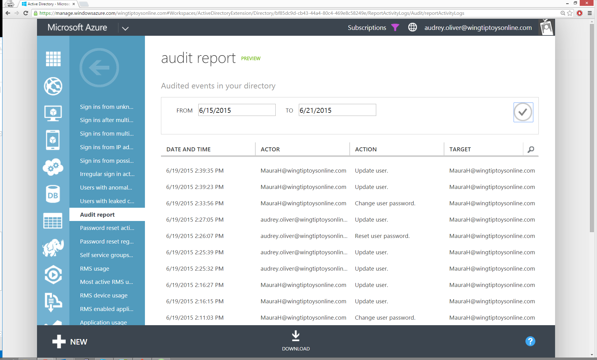
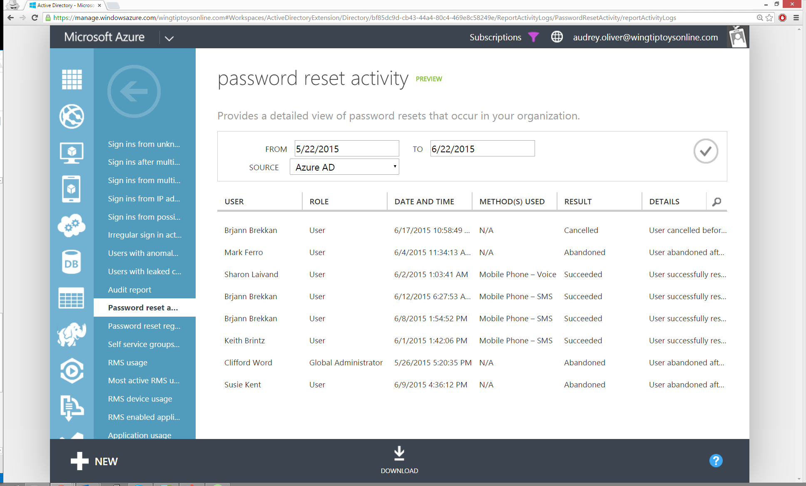
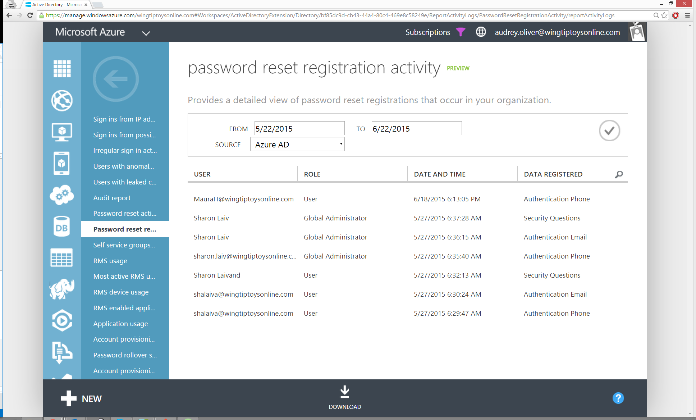
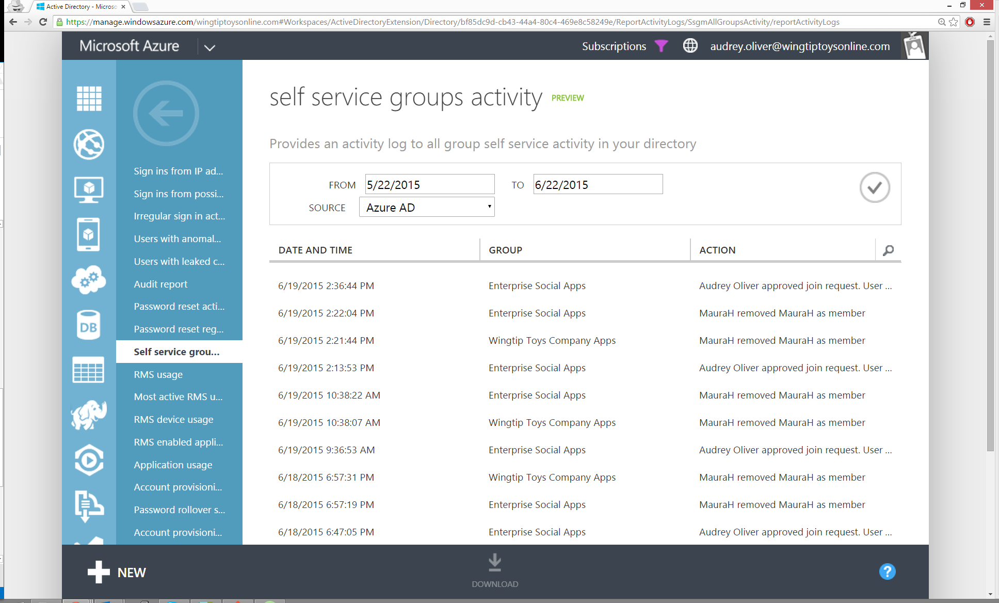
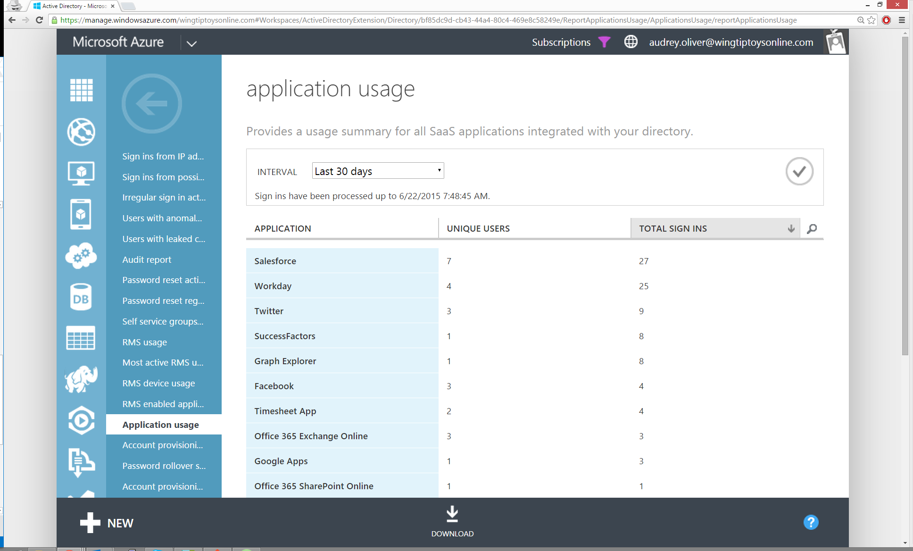
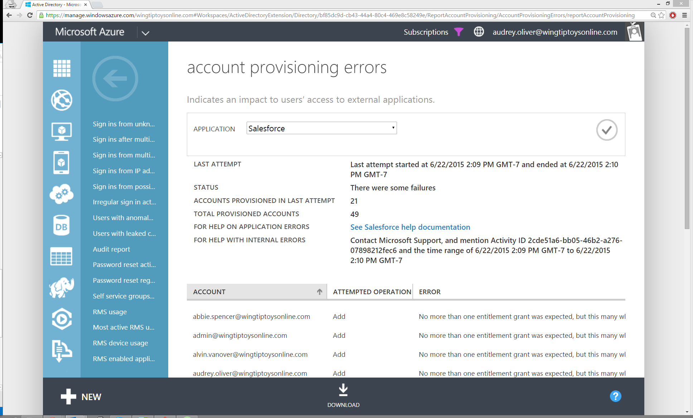

# View your access and usage reports
*This documentation is part of the [Azure Active Directory Reporting Guide](active-directory-reporting-guide.md).*

You can use Azure Active Directory's access and usage reports to gain visibility into the integrity and security of your organization’s directory. With this information, a directory admin can better determine where possible security risks may lie so that they can adequately plan to mitigate those risks.

In the Azure Management Portal, reports are categorized in the following ways:

* Anomaly reports – Contain sign in events that we found to be anomalous. Our goal is to make you aware of such activity and enable you to be able to make a determination about whether an event is suspicious.
* Integrated Application reports – Provides insights into how cloud applications are being used in your organization. Azure Active Directory offers integration with thousands of cloud applications.
* Error reports – Indicate errors that may occur when provisioning accounts to external applications.
* User-specific reports – Display device/sign in activity data for a specific user.
* Activity logs – Contain a record of all audited events within the last 24 hours, last 7 days, or last 30 days, as well as group activity changes, and password reset and registration activity.

> [!NOTE]
> * Some advanced anomaly and resource usage reports are only available when you enable [Azure Active Directory Premium](active-directory-get-started-premium.md). Advanced reports help you improve access security, respond to potential threats and get access to analytics on device access and application usage.
> * Azure Active Directory Premium and Basic editions are available for customers in China using the worldwide instance of Azure Active Directory. Azure Active Directory Premium and Basic editions are not currently supported in the Microsoft Azure service operated by 21Vianet in China. For more information, contact us at the [Azure Active Directory Forum](https://feedback.azure.com/forums/169401-azure-active-directory/).
> 
> 

## Reports
| Report | Description |
| --- | --- |
| **Anomalous activity reports** | |
| [Sign ins from unknown sources](active-directory-reporting-sign-ins-from-unknown-sources.md) |May indicate an attempt to sign in without being traced. |
| [Sign ins after multiple failures](active-directory-reporting-sign-ins-after-multiple-failures.md) |May indicate a successful brute force attack. |
| [Sign ins from multiple geographies](active-directory-reporting-sign-ins-from-multiple-geographies.md) |May indicate that multiple users are signing in with the same account. |
| [Sign ins from IP addresses with suspicious activity](active-directory-reporting-sign-ins-from-ip-addresses-with-suspicious-activity.md) |May indicate a successful sign in after a sustained intrusion attempt. |
| [Sign ins from possibly infected devices](active-directory-reporting-sign-ins-from-possibly-infected-devices.md) |May indicate an attempt to sign in from possibly infected devices. |
| [Irregular sign in activity](active-directory-reporting-irregular-sign-in-activity.md) |May indicate events anomalous to users’ sign in patterns. |
| [Users with anomalous sign in activity](active-directory-reporting-users-with-anomalous-sign-in-activity.md) |Indicates users whose accounts may have been compromised. |
| Users with leaked credentials |Users with leaked credentials |
| **Activity logs** | |
| Audit report |Audited events in your directory |
| Password reset activity |Provides a detailed view of password resets that occur in your organization. |
| Password reset registration activity |Provides a detailed view of password reset registrations that occur in your organization. |
| Self service groups activity |Provides an activity log to all group self service activity in your directory |
| **Integrated applications** | |
| Application usage |Provides a usage summary for all SaaS applications integrated with your directory. |
| Account provisioning activity |Provides a history of attempts to provision accounts to external applications. |
| Password rollover status |Provides a detailed overview of automatic password rollover status of SaaS applications. |
| Account provisioning errors |Indicates an impact to users’ access to external applications. |
| **Rights management** | |
| RMS usage |Provides a summary for Rights Management usage |
| Most active RMS users |Lists top 1000 active users who accessed RMS-protected files |
| RMS device usage |Lists devices used for accessing RMS-protected files |
| RMS enabled application usage |Provides usage of RMS enabled applications |

## Report editions
| Report | Free | Basic | Premium |
| --- | --- | --- | --- |
| **Anomalous activity reports** | | | |
| Sign ins from unknown sources |✓ |✓ |✓ |
| Sign ins after multiple failures |✓ |✓ |✓ |
| Sign ins from multiple geographies |✓ |✓ |✓ |
| Sign ins from IP addresses with suspicious activity | | |✓ |
| Sign ins from possibly infected devices | | |✓ |
| Irregular sign in activity | | |✓ |
| Users with anomalous sign in activity | | |✓ |
| Users with leaked credentials | | |✓ |
| **Activity logs** | | | |
| Audit report |✓ |✓ |✓ |
| Password reset activity | | |✓ |
| Password reset registration activity | | |✓ |
| Self service groups activity | | |✓ |
| **Integrated applications** | | | |
| Application usage | | |✓ |
| Account provisioning activity |✓ |✓ |✓ |
| Password rollover status | | |✓ |
| Account provisioning errors |✓ |✓ |✓ |
| **Rights managment** | | | |
| RMS usage | | |RMS Only |
| Most active RMS users | | |RMS Only |
| RMS device usage | | |RMS Only |
| RMS enabled application usage | | |RMS Only |

## Anomalous activity reports

The anomalous sign in activity reports flag suspicious sign in activity to Office365, Azure Management Portal, Azure AD Access Panel, Sharepoint Online, Dynamics CRM Online, and other Microsoft online services.

All of these reports, except the "Sign ins after multiple failures" report, also flag suspicious <i>federated</i> sign ins to the aforementioned services, regardless of the federation provider. 

The following reports are available: 
<ul>

<li>[Sign ins from unknown sources](active-directory-reporting-sign-ins-from-unknown-sources.md).</li>

<li>[Sign ins after multiple failures](active-directory-reporting-sign-ins-after-multiple-failures.md).</li>

<li>[Sign ins from multiple geographies](active-directory-reporting-sign-ins-from-multiple-geographies.md).</li>

<li>[Sign ins from IP addresses with suspicious activity](active-directory-reporting-sign-ins-from-ip-addresses-with-suspicious-activity.md).</li>

<li>[Irregular sign in activity](active-directory-reporting-irregular-sign-in-activity.md).</li>

<li>[Sign ins from possibly infected devices](active-directory-reporting-sign-ins-from-possibly-infected-devices.md).</li>

<li>[Users with anomalous sign in activity](active-directory-reporting-users-with-anomalous-sign-in-activity.md).</li>

<li>Users with leaked credentials</li></ul>

## Activity logs
### Audit report
| Description | Report location |
|:--- |:--- |
| Shows a record of all audited events within the last 24 hours, last 7 days, or last 30 days.   For more information, see [Azure Active Directory Audit Report Events](active-directory-reporting-audit-events.md) |Directory > Reports tab |

### Password reset activity
| Description | Report location |
|:--- |:--- |
| Shows all password reset attempts that have occurred in your organization. |Directory > Reports tab |

### Password reset registration activity
| Description | Report location |
|:--- |:--- |
| Shows all password reset registrations that have occurred in your organization |Directory > Reports tab |

### Self service groups activity
| Description | Report location |
|:--- |:--- |
| Shows all activity for the self-service managed groups in your directory. |Directory > Users > <i>User</i> > Devices tab |

## Integrated applications reports
### Application usage: summary
| Description | Report location |
|:--- |:--- |
| Use this report when you want to see usage for all the SaaS applications in your directory. This report is based on the number of times users have clicked on the application in the Access Panel. |Directory > Reports tab |

This report includes sign ins to *all* applications that your directory has access to, including pre-integrated Microsoft applications.

Pre-integrated Microsoft applications include Office 365, Sharepoint, the Azure Management Portal, and others.

### Application usage: detailed
| Description | Report location |
|:--- |:--- |
| Use this report when you want to see how much a specific SaaS application is being used. This report is based on the number of times users have clicked on the application in the Access Panel. |Directory > Reports tab |

### Application dashboard
| Description | Report location |
|:--- |:--- |
| This report indicates cumulative sign ins to the application by users in your organization, over a selected time interval. The chart on the dashboard page will help you identify trends for all usage of that application. |Directory > Application > Dashboard tab |

## Error reports
### Account provisioning errors
| Description | Report location |
|:--- |:--- |
| Use this to monitor errors that occur during the synchronization of accounts from SaaS applications to Azure Active Directory. |Directory > Reports tab |

## User-specific reports
### Devices
| Description | Report location |
|:--- |:--- |
| Use this report when you want to see the IP address and geographical location of devices that a specific user has used to access Azure Active Directory. |Directory > Users > <i>User</i> > Devices tab |

### Activity
| Description | Report location |
|:--- |:--- |
| Shows the sign in activity for a user. The report includes information like the application signed into, device used, IP address, and location. We do not collect the history for users that sign in with a Microsoft account. |Directory > Users > <i>User</i> > Activity tab |

#### Sign in events included in the User Activity report
Only certain types of sign in events will appear in the User Activity report.

| Event type | Included? |
| --- | --- |
| Sign ins to the [Access Panel](http://myapps.microsoft.com/) |Yes |
| Sign ins to the [Azure Management Portal](https://manage.windowsazure.com/) |Yes |
| Sign ins to the [Microsoft Azure Portal](https://portal.azure.com/) |Yes |
| Sign ins to the [Office 365 portal](http://portal.office.com/) |Yes |
| Sign ins to a native application, like Outlook (see exception below) |Yes |
| Sign ins to a federated/provisioned app through the Access Panel, like Salesforce |Yes |
| Sign ins to a password-based app through the Access Panel, like Twitter |Yes |
| Sign ins to a custom business app that has been added to the directory |No (Coming soon) |
| Sign ins to an Azure AD Application Proxy app that has been added to the directory |No (Coming soon) |

> Note: To reduce the amount of noise in this report, sign ins by the [Microsoft Online Services Sign-In Assistant](http://community.office365.com/en-us/w/sso/534.aspx) are not shown.
> 
> 

## Things to consider if you suspect security breach
If you suspect that a user account may be compromised or any kind of suspicious user activity that may lead to a security breach of your directory data in the cloud, you may want to consider one or more of the following actions:

* Contact the user to verify the activity
* Reset the user's password
* [Enable multi-factor authentication](../multi-factor-authentication/multi-factor-authentication-get-started.md) for additional security

## View or download a report
1. In the Azure classic portal, click **Active Directory**, click the name of your organization’s directory, and then click **Reports**.
2. On the Reports page, click the report you want to view and/or download.
   
   > [!NOTE]
   > If this is the first time you have used the reporting feature of Azure Active Directory, you will see a message to Opt In. If you agree, click the check mark icon to continue.
   > 
   > 
3. Click the drop-down menu next to Interval, and then select one of the following time ranges that should be used when generating this report:
   
   * Last 24 hours
   * Last 7 days
   * Last 30 days
4. Click the check mark icon to run the report.
   * Up to 1000 events will be shown in the Azure classic portal.
5. If applicable, click **Download** to download the report to a compressed file in comma-separated values (CSV) format for offline viewing or archiving purposes.
   * Up to 75,000 events will be included in the downloaded file.
   * For more data, check out the [Azure AD Reporting API](active-directory-reporting-api-getting-started.md).

## Ignore an event
If you are viewing any anomaly reports, you may notice that you can ignore various events that show up in related reports. To ignore an event, simply highlight the event in the report and then click **Ignore**. The **Ignore** button will permanently remove the highlighted event from the report and can only be used by licensed global admins.

## Automatic email notifications
For more information about Azure AD's reporting notifications, check out [Azure Active Directory Reporting Notifications](active-directory-reporting-notifications.md).

## What's next
* [Getting started with Azure Active Directory Premium](active-directory-get-started-premium.md)
* [Add company branding to your Sign In and Access Panel pages](active-directory-add-company-branding.md)

