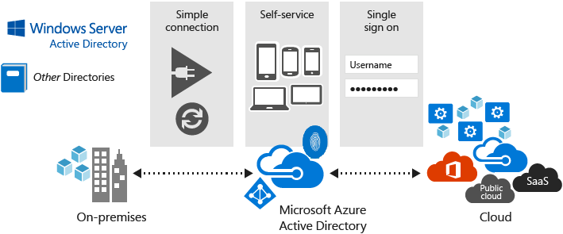

<properties
    pageTitle="What is Azure Active Directory?"
    description="Use Azure Active Directory to extend your existing on-premises identities into the cloud or develop Azure AD integrated applications."
    services="active-directory"
    documentationCenter=""
    authors="markusvi"
    manager="femila"
    editor=""/>

<tags
    ms.service="active-directory"
    ms.workload="identity"
    ms.tgt_pltfrm="na"
    ms.devlang="na"
    ms.topic="article"
    ms.date="07/13/2016"
    ms.author="markusvi"/>

# What is Azure Active Directory?

Azure Active Directory (Azure AD) is Microsoft’s multi-tenant cloud based directory and identity management service.

For IT Admins, Azure AD provides an affordable, easy to use solution to give employees and business partners single sign-on (SSO) access to [thousands of cloud SaaS Applications](http://blogs.technet.com/b/ad/archive/2014/09/03/50-saas-apps-now-support-federation-with-azure-ad.aspx) like Office365, Salesforce.com, DropBox, and Concur.

For application developers, Azure AD lets you focus on building your application by making it fast and simple to integrate with a world class identity management solution used by millions of organizations around the world.

Azure AD also includes a full suite of identity management capabilities including multi-factor authentication, device registration, self-service password management, self-service group management, privileged account management, role based access control, application usage monitoring, rich auditing and security monitoring and alerting. These capabilities can help secure cloud based applications, streamline IT processes, cut costs and help assure corporate compliance goals are met.

Additionally, with just [four clicks](http://blogs.technet.com/b/ad/archive/2014/08/04/connecting-ad-and-azure-ad-only-4-clicks-with-azure-ad-connect.aspx), Azure AD can be integrated with an existing Windows Server Active Directory, giving organizations the ability to leverage their existing on-premises identity investments to manage access to cloud based SaaS applications.

If you are an Office365, Azure or Dynamics CRM Online customer, you might not realize that you are already using Azure AD. Every Office365, Azure and Dynamics CRM tenant is actually already an Azure AD tenant. Whenever you want you can start using that tenant to manage access to thousands of other cloud applications Azure AD integrates with!

## How reliable is Azure AD?

The multi-tenant, geo-distributed, high availability design of Azure AD means that you can rely on it for your most critical business needs. Running out of 28 data centers around the world with automated failover, you’ll have the comfort of knowing that Azure AD is highly reliable and that even if a data center goes down, copies of your directory data are live in at least two more regionally dispersed data centers and available for instant access.

For more details, see [Service Level Agreements](https://azure.microsoft.com/support/legal/sla/).

## What are the benefits of Azure AD?

Your organization can use Azure AD to improve employee productivity, streamline IT processes, improve security and cut costs in many ways:

-	Quickly adopt cloud services, providing employees and partners with an easy single-sign on experience powered by Azure AD’s fully automated SaaS app access management and provisioning services capabilities.
-	Empower employees with access to world class cloud apps and service and self-services capabilities from wherever they need to work on the devices they love to use.
-	Easily and securely manage employee and vendor access to your corporate social media accounts.
-	Improve application security with Azure AD multifactor authentication and conditional access.
-	Implement consistent, self-service application access management, empowering business owners to move quickly while cutting IT costs and overhead.
-	Monitor application usage and protect your business from advanced threats with security reporting and monitoring.
-	Secure mobile (remote) access to on-premises applications.

## How can I get started?
-	If you are an IT admin:
 - [Try it out!](https://azure.microsoft.com/trial/get-started-active-directory/) - you can sign up for a free 30 trial today and deploy your first cloud solution in under 5 minutes using this link
 - Read our “Getting started with Azure AD” for tips and tricks on getting an Azure AD tenant up and running fast
-	If you are a developer:
 - Check out our [Developers Guide](active-directory-developers-guide.md) to Azure Active Directory 
 - [Start a trial](https://azure.microsoft.com/trial/get-started-active-directory/) – sign up for a free 30 day trial today and get started integrating your app with Azure AD

## Where can I learn more?

We have a ton of great resources online to help you learn all about Azure AD. Here’s a list of great articles to get you started:

- [Enabling your directory for hybrid management with Azure AD Connect](active-directory-aadconnect.md)

- [Additional security for an ever connected world](../multi-factor-authentication/multi-factor-authentication.md)

- [Automate User Provisioning and Deprovisioning to SaaS Applications with Azure Active Directory](active-directory-saas-app-provisioning.md)

- [Getting started with Azure AD Reporting](active-directory-reporting-getting-started.md)

- [Manage your passwords from anywhere](active-directory-passwords.md)

- [What is application access and single sign-on with Azure Active Directory?](active-directory-appssoaccess-whatis.md)

- [Automate User Provisioning and Deprovisioning to SaaS Applications with Azure Active Directory](active-directory-saas-app-provisioning.md)

- [How to provide secure remote access to on-premises applications](active-directory-application-proxy-get-started.md)

- [Managing access to resources with Azure Active Directory groups](active-directory-manage-groups.md)

- [What is Microsoft Azure Active Directory licensing?](active-directory-licensing-what-is.md)

- [How can I discover unsanctioned cloud apps that are used within my organization](active-directory-cloudappdiscovery-whatis.md)
