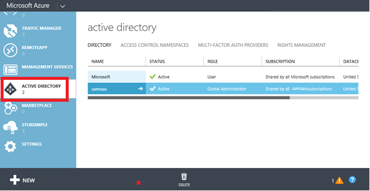
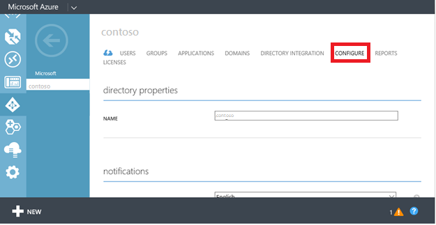
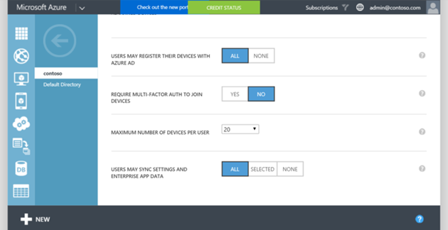
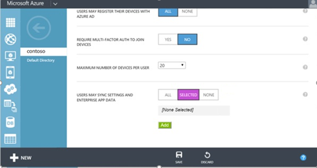
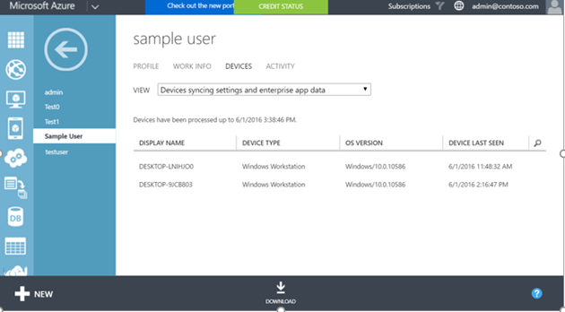

<properties
    pageTitle="Enable Enterprise State Roaming in Azure Active Directory | Microsoft Azure"
    description="Frequently asked questions about Enterprise State Roaming settings in Windows devices. Enterprise State Roaming provides users with a unified experience across their Windows devices and reduces the time needed for configuring a new device."
    services="active-directory"
    keywords="enterprise state roaming, windows cloud, how to enable enterprise state roaming"
	documentationCenter=""
	authors="femila"
	manager="swadhwa"
	editor="curtand"/>

<tags
    ms.service="active-directory"  
	ms.workload="identity"
	ms.tgt_pltfrm="na"
	ms.devlang="na"
	ms.topic="article"
	ms.date="06/07/2016"
	ms.author="femila"/>

# Enable Enterprise State Roaming in Azure Active Directory

Enterprise State Roaming is available to any organization with a Premium Azure Active Directory (Azure AD) subscription. For more details on how to get an Azure AD subscription, see the [Azure AD product page](https://azure.microsoft.com/services/active-directory).

When you enable Enterprise State Roaming, your organization will be automatically granted licenses for a free, limited-use subscription to Azure Rights Management. This free subscription is limited to encrypting and decrypting enterprise settings and application data synced by the Enterprise State Roaming service; you must have a paid subscription to use the full capabilities of Azure Rights Management.

After obtaining a Premium Azure AD subscription, follow these steps to enable Enterprise State Roaming:

1. Login to the Azure classic portal.
2. On the left, select **ACTIVE DIRECTORY**, and then select the directory for which you want to enable Enterprise State Roaming.

3. Go to the **CONFIGURE** tab on the top.

4.	Scroll down the page and select **USERS MAY SYNC SETTINGS AND ENTERPRISE APP DATA**, and then click **SAVE**.

For a Windows 10 device to roam settings with the Enterprise State Roaming service, the device must authenticate using an Azure AD identity. For devices that are joined to Azure AD, the user’s primary login is the Azure AD identity, so no additional configuration is required. For devices that use a traditional on-premises Active Directory, the IT admin must [connect the domain-joined devices to Azure AD for Windows 10 experiences](active-directory-azureadjoin-devices-group-policy.md).

## Sync data storage
Enterprise State Roaming data is hosted in one or more [Azure regions](https://azure.microsoft.com/regions/ ) that best aligns with the country/region value set in the Azure Active Directory instance. Enterprise State Roaming data is partitioned based on three major geographic regions: North America, EMEA, and APAC. Enterprise State Roaming data for the tenant is locally located with the geographical region, and is not replicated across regions.  For example, customers who have their country/region value set to one of EMEA countries like “France” or “Zambia” will have their data hosted in one or of the Azure regions within Europe.  Customers who set their country/region value in Azure AD to one of North America countries like “United States” or “Canada” will have their data hosted in one or more of the Azure regions within the US.  Customers who set their country/region value in Azure AD to one of APAC countries like “Australia” or “New Zealand” will have their data hosted in one or more of the Azure regions within Asia.  South American countries and Antarctica data will be hosted in one or more Azure regions within the US.  The country/region value is set as part of the Azure AD directory creation process and cannot be subsequently modified. 

If you need more details on data storage location, please file a ticket with [Azure support](https://azure.microsoft.com/support/options/).

## Manage Enterprise State Roaming
Azure AD global administrators can enable and disable Enterprise State Roaming in the Azure classic portal.

Global administrators can limit settings sync to specific security groups.

Global admins can also view a per-user device sync status report by selecting a particular user in the Active Directory instance **USERS** list and clicking on **DEVICES** tab and selecting view **Devices syncing settings and enterprise app data**.

##Data retention
Data synced to Azure via Enterprise State Roaming will be retained indefinitely unless a manual delete operation is performed or the data in question is determined to be stale. 

**Explicit deletion:** The data is deleted when an Azure admin deletes a user or a directory or an admin requests explicitly that data is to be deleted.

- **User deletion**: When a user is deleted in Azure AD, the user account roaming data will be marked for deletion and will be deleted between 90 to 180 days. 
- **Directory deletion**: Deleting an entire directory in Azure AD is an immediate operation. All the settings data associated with that directory will be marked for deletion and will be deleted between 90 to 180 days. 
- **On request deletion**: If the Azure AD admin wants to manually delete a specific user’s data or settings data, the admin can file a ticket with [Azure support](https://azure.microsoft.com/support/). 

**Stale data deletion**: Data that has not been accessed for one year (“the retention period”) will be treated as stale and may be deleted from Azure. The retention period is subject to change but will not be less than 90 days. The stale data may be a specific set of Windows/application settings or all settings for a user. For example:
 
- If no devices access a particular settings collection (e.g., an application is removed from the device, or a settings group such as “Theme” is disabled for all of a user’s devices), then that collection will become stale after the retention period and may be deleted. 
- If a user has turned off settings sync on all his/her devices, then none of the settings data will be accessed, and all the settings data for that user will become stale and may be deleted after the retention period. 
- If the Azure AD directory admin turns off Enterprise State Roaming for the entire directory, then all users in that directory will stop syncing settings, and all settings data for all users will become stale and may be deleted after the retention period. 

**Deleted data recovery**: The data retention policy is not configurable. Once the data has 
been permanently deleted, it will not be recoverable. However, it’s important to note that the settings data will only be deleted from Azure, not the end-user device. If any device later reconnects to the Enterprise State Roaming service, the settings will again be synced and stored in Azure.

## Related topics
- [Enterprise State Roaming overview](active-directory-windows-enterprise-state-roaming-overview.md)
- [Settings and data roaming FAQ](active-directory-windows-enterprise-state-roaming-faqs.md)
- [Group Policy and MDM settings for settings sync](active-directory-windows-enterprise-state-roaming-group-policy-settings.md)
- [Windows 10 roaming settings reference](active-directory-windows-enterprise-state-roaming-windows-settings-reference.md)
