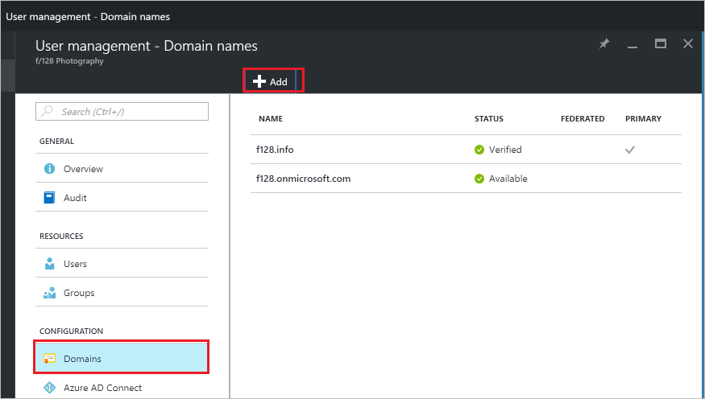
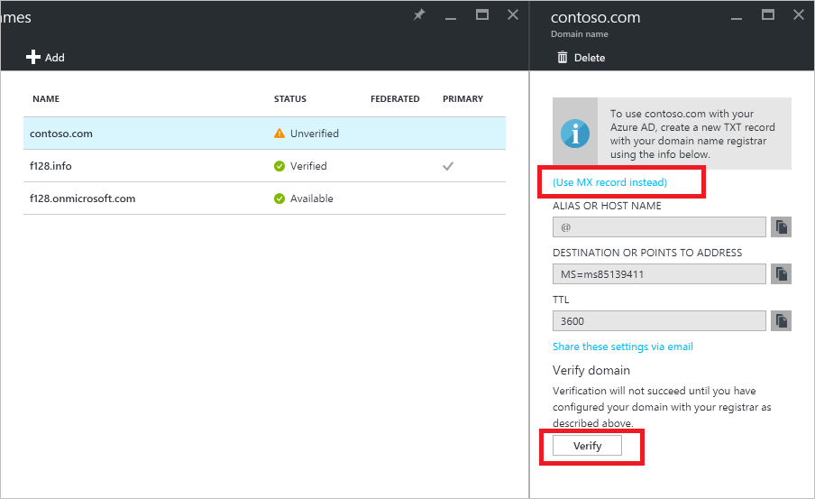

---

title: Add a custom domain to Azure AD | Microsoft Docs
description: Explains how to add a custom domain in Azure Active Directory.
services: active-directory
author: curtand
manager: femila
ms.assetid: 0a90c3c5-4e0e-43bd-a606-6ee00f163038
ms.service: active-directory
ms.workload: identity
ms.tgt_pltfrm: na
ms.devlang: na
ms.topic: article
ms.date: 08/30/2017
ms.author: curtand
ms.reviewer: jsnow
ms.custom: it-pro

---
# Quickstart: Add a custom domain name to Azure Active Directory

Every Azure AD directory comes with an initial domain name in the form of *domainname*.onmicrosoft.com. The initial domain name cannot be changed or deleted, but you can add your corporate domain name to Azure AD as well. For example, your organization probably has other domain names used to do business and users who sign in using your corporate domain name. Adding custom domain names to Azure AD allows you to assign user names in the directory that are familiar to your users, such as ‘alice@contoso.com.’ instead of 'alice@*<domain name>*.onmicrosoft.com'. The process is simple:

1. Add the custom domain name to your directory
2. Add a DNS entry for the domain name at the domain name registrar
3. Verify the custom domain name in Azure AD

## Add the custom domain name to your directory
1. Sign in to the [Azure portal](https://aad.portal.azure.com/#blade/Microsoft_AAD_IAM/ActiveDirectoryMenuBlade/Overview) with an account that's a global admin for the directory.
2. On the left, select **Domain names**.
3. On ***directory-name* - Domain names**, select **Add**.
   
   
5. On **Domain name**, enter the name of your custom domain in the box, such as 'contoso.com', and then select **Add Domain**. Be sure to include the .com, .net, or other top-level extension.
6. On ***domainname*** (that is, your new domain name is the title), gather the DNS entry information to use later to verify the custom domain name in Azure AD.
   
   

> [!TIP]
> If you plan to federate your on-premises Windows Server AD with Azure AD, then you need to select the **I plan to configure this domain for single sign-on with my local Active Directory** checkbox when you run the Azure AD Connect tool to synchronize your directories. You also need to register the same domain name you select for federating with your on-premises directory in the **Azure AD Domain** step in the wizard. You can see what that step in the wizard looks like [in these instructions](./connect/active-directory-aadconnect-get-started-custom.md#verify-the-azure-ad-domain-selected-for-federation). If you do not have the Azure AD Connect tool, you can [download it here](http://go.microsoft.com/fwlink/?LinkId=615771).

## Add a DNS entry for the domain name at the domain name registrar
The next step to use your custom domain name with Azure AD is to update the DNS zone file for the domain. Azure AD can then verify that your organization owns the custom domain name. You can use [Azure DNS](https://docs.microsoft.com/azure/dns/dns-getstarted-portal) for your Azure/Office 365/external DNS records within Azure, or add the DNS entry at [a different DNS registrar](https://support.office.com/article/Create-DNS-records-for-Office-365-when-you-manage-your-DNS-records-b0f3fdca-8a80-4e8e-9ef3-61e8a2a9ab23/).

1. Sign in to the domain name registrar for the domain. If you don't have access to update the DNS entry, ask the person or team who has this access to complete step 2 and to let you know when it is completed.
2. Update the DNS zone file for the domain by adding the DNS entry provided to you by Azure AD. The DNS entry doesn't change any behaviors such as mail routing or web hosting.

## Verify the custom domain name in Azure AD
Once you have added the DNS entry, you are ready to verify the domain name with Azure AD. A domain name can be verified only after the DNS records have propagated. This propagation often takes only seconds, but it can sometimes take an hour or more. If verification doesn’t work the first time, try again later.

1. Sign in to [Azure AD](https://aad.portal.azure.com/#blade/Microsoft_AAD_IAM/ActiveDirectoryMenuBlade/Overview) with an account that's a global admin for the directory.
2. On the left, select **Domain names**.
3. On ***directory-name* - Domain names**, select the **Add domain name** command. 
  
3. On ***directory-name* - Domain names**, select the unverified domain name that you want to verify.
4. On ***domainname*** (that is, the selected domain name is the title), select **Verify** to complete the verification.

Now you can [assign user names that include your custom domain name](active-directory-users-create-azure-portal.md). You can create cloud-based user accounts, or update previously synchronized on-premises user account information, using your custom domain name. You can also change synchronized user account domain suffix information using [Microsoft PowerShell](https://msdn.microsoft.com/library/azure/e1ef403f-3347-4409-8f46-d72dafa116e0#BKMK_ManageDomains) or the [Graph API](https://msdn.microsoft.com/Library/Azure/Ad/Graph/api/domains-operations).

> [!TIP]
> You can add up to 900 custom domain names, but only one can be [set as the primary domain name for your Azure AD directory](active-directory-domains-manage-azure-portal.md#set-the-primary-domain-name-for-your-azure-ad-directory) used by default when you create new accounts.

## Troubleshooting
If you can't verify a custom domain name, try the following troubleshooting steps:

1. **Wait an hour**. DNS records must propagate before Azure AD can verify the domain. This process can take an hour or more.
2. **Ensure the DNS record was entered, and that it is correct**. Complete this step at the website for the domain name registrar for the domain. Azure AD can't verify the domain name if 
  * The DNS entry is not present in the DNS zone file
  * It is not an exact match with the DNS entry that Azure AD provided you. 
  
  If you do not have access to update DNS records for the domain at the domain name registrar, share the DNS entry with the person or team at your organization who has this access, and ask them to add the DNS entry.
3. **Delete the domain name from another directory in Azure AD**. A domain name can be verified in only a single directory. If a domain name is currently verified in a different directory, it can't be verified in your new directory until it is deleted on the other one. To learn about deleting domain names, read [Manage custom domain names](active-directory-domains-manage-azure-portal.md).    

## Add more custom domain names
If your organization uses multiple custom domain names, such as ‘contoso.com’ and ‘contosobank.com’, you can add them, up to a maximum of 900 domain names. The steps in this article can help you add each of your domain names.

### Learn more
[Conceptual overview of custom domain names in Azure AD](active-directory-add-domain-concepts.md)

[Manage custom domain names](active-directory-domains-manage-azure-portal.md)

## Next steps
In this quickstart, you’ve learned how to add a custom domain to Azure AD. 

You can use the following link to add a new custom domain in Azure AD from the Azure portal.

> [!div class="nextstepaction"]
> [Add a custom domain](https://aad.portal.azure.com/#blade/Microsoft_AAD_IAM/ActiveDirectoryMenuBlade/QuickStart) 