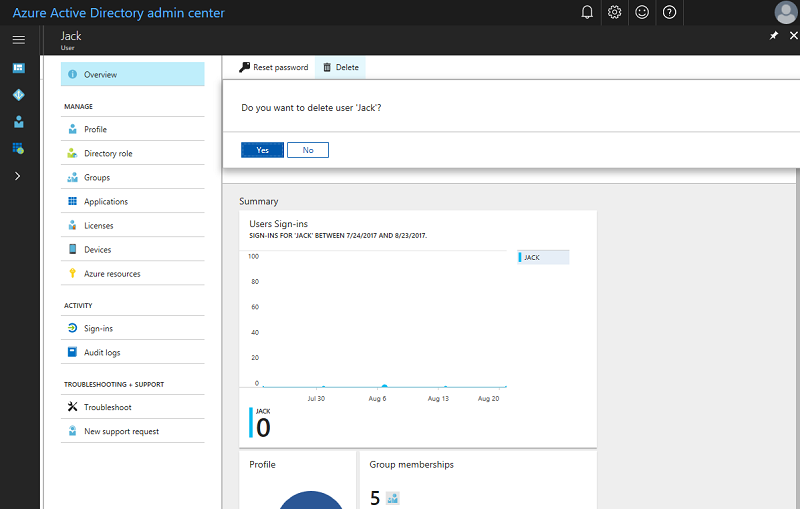

---

title: Add new users to Azure Active Directory | Microsoft Docs
description: Explains how to add new users in Azure Active Directory.
services: active-directory
documentationcenter: ''
author: curtand
manager: femila
ms.assetid: 
ms.service: active-directory
ms.workload: identity
ms.tgt_pltfrm: na
ms.devlang: na
ms.topic: article
ms.date: 08/22/2017
ms.author: curtand
ms.reviewer: jeffsta
ms.custom: it-pro

---
# Quickstart: Add new users to Azure Active Directory
This article explains how to add new users in your organization in the Azure Active Directory (Azure AD) one at a time using the Azure portal or by synchronizing your on-premises Windows Server AD user account data. 

## Add cloud-based users
1. Sign in to the [Azure Active Directory admin center](https://aad.portal.azure.com) with an account that's a global admin for the directory.
2. Select **Azure Active Directory** and then **Users and groups**.
3. On **Users and groups**, select **All users**, and then select **New user**.
   
4. Enter details for the user, such as **Name** and **User name**. The domain name portion of the user name must either be the initial default domain name "[domain name].onmicrosoft.com" or a verified, non-federated [custom domain name](add-custom-domain.md) such as "contoso.com."
5. Copy or otherwise note the generated user password so that you can provide it to the user after this process is complete.
6. Optionally, you can open and fill out the information in **Profile**, **Groups**, or **Directory role** for the user. For more information about user and administrator roles, see [Assigning administrator roles in Azure AD](active-directory-assign-admin-roles.md).
7. On **User**, select **Create**.
8. Securely distribute the generated password to the new user so that the user can sign in.

> [!TIP]
> You can also synchronize user account data from on-premises Windows Server AD. Microsoft’s identity solutions span on-premises and cloud-based capabilities, creating a single user identity for authentication and authorization to all resources, regardless of location. We call this Hybrid Identity. [Azure AD Connect](https://docs.microsoft.com/azure/active-directory/connect/active-directory-aadconnect) can be used to integrate your on-premises directories with Azure Active Directory for hybrid identity scenarios. This allows you to provide a common identity for your users for Office 365, Azure, and SaaS applications integrated with Azure AD. 

## Delete users from Azure AD
1. Sign in to the [Azure Active Directory admin center](https://aad.portal.azure.com) with an account that's a global admin for the directory.
2. Select **Users and groups**.
3. On the **Users and groups** blade, select the user to delete from the list. 
4. On the blade for the selected user, select **Overview**, and then in the command bar, select **Delete**.
   

### Learn more 
* [Add an external user](active-directory-users-create-external-azure-portal.md)

* [Assign a user to a role in your Azure AD](active-directory-users-assign-role-azure-portal.md)

## Next steps
In this quickstart, you’ve learned how to add new users to Azure AD Premium. 

You can use the following link to create a new user in Azure AD from the Azure portal.

> [!div class="nextstepaction"]
> [Add users to Azure AD](https://aad.portal.azure.com/#blade/Microsoft_AAD_IAM/UserManagementMenuBlade/All users) 