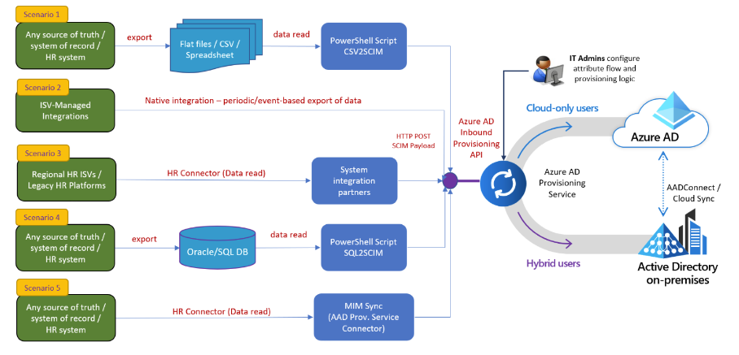

# Introduction

This document provides a conceptual overview of the Azure AD Inbound User Provisioning API.

## What problem does the Inbound Provisioning API solve? 

As the enterprise identity control plane, customers should be able to flexibly connect their Azure AD tenant to *any* authoritative system of record for inbound identity provisioning. The “system of record” could be an HR app like UltiPro, a payroll app like ADP, a spreadsheet in Google Cloud or an on-premises Oracle database. 

The MS Graph Inbound Provisioning API endpoint opens the provisioning pipeline to a broader ecosystem of customers and partners.  Customers can use automation tools of their choice to retrieve data from authoritative sources and then post the data to this API endpoint, while the IT admin still retain retains control on how the incoming data is processed and transformed with attribute mappings configured using the Azure AD provisioning service. 

## Supported Scenarios

Several inbound user provisioning scenarios can be enabled using the inbound provisioning API endpoint. The diagram below demonstrates the most common scenarios. 
> [!dive class-"mx-imgBorder:]
> 

:::image type="content" source="media/application-provisioning-api-concepts/api-workflow-scenarios.png" alt-text="Diagram that shows API scenarios.." lightbox="media/application-provisioning-api-concepts/api-workflow-scenarios.png":::

## How long will it take to provision users?
When you're using automatic user provisioning with an application, there are some things to keep in mind. First, Azure AD automatically provisions and updates user accounts in an app based on things like [user and group assignment][def]. The sync happens at a regularly scheduled time interval, typically every 40 minutes.

The time it takes for a given user to be provisioned depends mainly on whether your provisioning job is running an initial cycle or an incremental cycle.

- For **initial cycle**, the job time depends on many factors, including the number of users and groups in scope for provisioning, and the total number of users and group in the source system. The first sync between Azure AD and an app happen as fast as 20 minutes or take as long as several hours. The time depends on the size of the Azure AD directory and the number of users in scope for provisioning. A comprehensive list of factors that affect initial cycle performance are summarized later in this section.

- For **incremental cycles**, after the initial cycle, job times tend to be faster (within 10 minutes), as the provisioning service stores watermarks that represent the state of both systems after the initial cycle, improving performance of subsequent syncs. The job time depends on the number of changes detected in that provisioning cycle. If there are fewer than 5,000 user or group membership changes, the job can finish within a single incremental provisioning cycle. 

The following table summarizes synchronization times for common provisioning scenarios. In these scenarios, the source system is Azure AD and the target system is a SaaS application. The sync times are derived from a statistical analysis of sync jobs for the SaaS applications ServiceNow, Workplace, Salesforce, and G Suite.

| Scope configuration | Users, groups, and members in scope | Initial cycle time | Incremental cycle time |
| -------- | -------- | -------- | -------- |
| Sync assigned users and groups only |  < 1,000 |  < 30 minutes | < 30 minutes |
| Sync assigned users and groups only |  1,000 - 10,000 | 142 - 708 minutes | < 30 minutes |
| Sync assigned users and groups only |   10,000 - 100,000 | 1,170 - 2,340 minutes | < 30 minutes |
| Sync all users and groups in Azure AD |  < 1,000 | < 30 minutes  | < 30 minutes |
| Sync all users and groups in Azure AD |  1,000 - 10,000 | < 30 - 120 minutes | < 30 minutes |
| Sync all users and groups in Azure AD |  10,000 - 100,000  | 713 - 1,425 minutes | < 30 minutes |
| Sync all users in Azure AD|  < 1,000  | < 30 minutes | < 30 minutes |
| Sync all users in Azure AD | 1,000 - 10,000  | 43 - 86 minutes | < 30 minutes |

For the configuration **Sync assigned user and groups only**, you can use the following formulas to determine the approximate minimum and maximum expected **initial cycle** times:

- Minimum minutes =  0.01 x [Number of assigned users, groups, and group members]
- Maximum minutes = 0.08 x [Number of assigned users, groups, and group members]

Summary of factors that influence the time it takes to complete an **initial cycle**:

- The total number of users and groups in scope for provisioning.

- The total number of users, groups, and group members present in the source system (Azure AD).

- Whether users in scope for provisioning are matched to existing users in the target application, or need to be created for the first time. Sync jobs for which all users are created for the first time take about *twice as long* as sync jobs for which all users are matched to existing users.

- Number of errors in the [provisioning logs](check-status-user-account-provisioning.md). Performance is slower if there are many errors and the provisioning service has gone into a quarantine state.	

- Request rate limits and throttling implemented by the target system. Some target systems implement request rate limits and throttling, which can impact performance during large sync operations. Under these conditions, an app that receives too many requests too fast might slow its response rate or close the connection. To improve performance, the connector needs to adjust by not sending the app requests faster than the app can process them. Provisioning connectors built by Microsoft make this adjustment. 

- The number and sizes of assigned groups. Syncing assigned groups takes longer than syncing users. Both the number and the sizes of the assigned groups impact performance. If an application has [mappings enabled for group object sync](customize-application-attributes.md#editing-group-attribute-mappings), group properties such as group names and memberships are synced in addition to users. These syncs take longer than only syncing user objects.

- If performance becomes an issue, and you're attempting to provision most users and groups in your tenant, then use scoping filters. Scoping filters allow you to fine tune the data that the provisioning service extracts from Azure AD by filtering out users based on specific attribute values. For more information on scoping filters, see [Attribute-based application provisioning with scoping filters](define-conditional-rules-for-provisioning-user-accounts.md).

## Next steps
[Automate user provisioning and deprovisioning to SaaS applications with Azure Active Directory](user-provisioning.md)

[def]: ../manage-apps/assign-user-or-group-access-portal.md