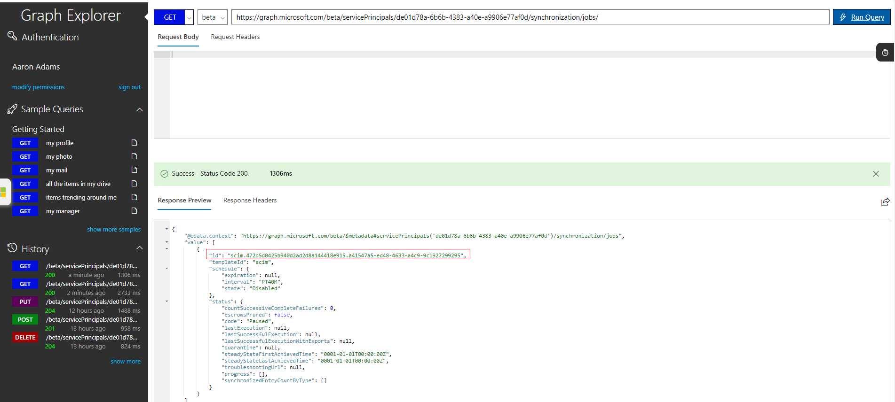
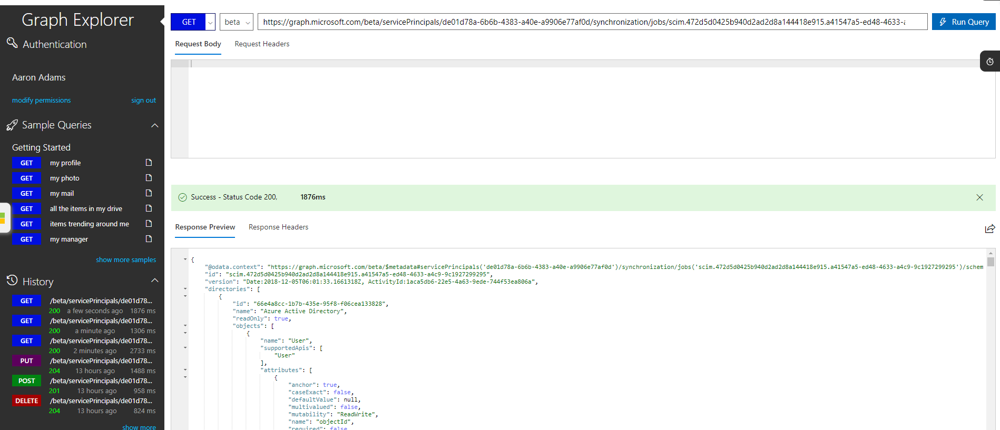

# Known issues and resolutions with SCIM 2.0 protocol compliance of the Azure AD User Provisioning service

Azure Active Directory (Azure AD) can automatically provision users and groups to any application or system that is fronted by a web service with the interface defined in the [System for Cross-Domain Identity Management (SCIM) 2.0 protocol specification](https://tools.ietf.org/html/draft-ietf-scim-api-19). 

Azure AD's support for the SCIM 2.0 protocol is described in [Using System for Cross-Domain Identity Management (SCIM) to automatically provision users and groups from Azure Active Directory to applications](use-scim-to-provision-users-and-groups.md), which lists the specific parts of the protocol that it implements in order to automatically provision users and groups from Azure AD to applications that support SCIM 2.0.

This article describes current and past issues with the Azure AD user provisioning service's adherence to the SCIM 2.0 protocol, and how to work around these issues.

## Understanding the provisioning job
The provisioning service uses the concept of a job to operate against an application. The jobID can be found in the [progress bar](application-provisioning-when-will-provisioning-finish-specific-user.md#view-the-provisioning-progress-bar). All new provisioning applications are created with a jobID starting with "scim". The scim job represents the current state of the service. Older jobs have the ID "customappsso". This job represents the state of the service in 2018. 

If you are using an application in the gallery, the job generally contains the name of the app (e.g. zoom snowFlake, dataBricks, etc.). You can skip this documentation when using a gallery application. This primarily applies for non-gallery applications with jobID SCIM or customAppSSO.

## SCIM 2.0 compliance issues and status
In the table below, any item marked as fixed means that the proper behavior can be found on the SCIM job. We have worked to ensure backwards compatibility for the changes we have made. However, we do not recommend implementing old behavior. We recommend using the new behavior for any new implementations and updating existing implementations.

> [!NOTE]
> For the changes made in 2018, you can revert back to the customappsso behavior. For the changes made since 2018, you can use the URLs to revert back to the older behavior. We have worked to ensure backwards compatibility for the changes we have made by allowing you to revert back to the old jobID or by using a flag. However, as previously mentioned, we do not recommend implementing old behavior. We recommend using the new behavior for any new implementations and updating existing implementations.

| **SCIM 2.0 compliance issue** |  **Fixed?** | **Fix date**  |  **Backwards compatibility** |
|---|---|---|
| Azure AD requires "/scim" to be in the root of the application's SCIM endpoint URL  | Yes  |  December 18, 2018 | downgrade to customappSSO |
| Extension attributes use dot "." notation before attribute names instead of colon ":" notation |  Yes  | December 18, 2018  | downgrade to customappSSO |
| Patch requests for multi-value attributes contain invalid path filter syntax | Yes  |  December 18, 2018  | downgrade to customappSSO |
| Group creation requests contain an invalid schema URI | Yes  |  December 18, 2018  |  downgrade to customappSSO |
| Update PATCH behavior to ensure compliance (e.g. active as boolean and proper group membership removals) | No | TBD| use preview flag |

## Flags to alter the SCIM behavior
Use the flags below in the tenant URL of your application in order to change the default SCIM client behavior.

:::image type="content" source="media/application-provisioning-config-problem-scim-compatibility/scim-flags.jpg" alt-text="SCIM flags to later behavior.":::

* Use the following URL to update PATCH behavior and ensure SCIM compliance (e.g. active as boolean and proper group membership removals). This behavior is currently only available when using the flag, but will become the default behavior over the next few months. Note this preview flag currently does not work with on-demand provisioning. 
  * **URL (SCIM Compliant):** aadOptscim062020
  * **SCIM RFC references:** 
    * https://tools.ietf.org/html/rfc7644#section-3.5.2
  * **Behavior:**
  ```json
   PATCH https://[...]/Groups/ac56b4e5-e079-46d0-810e-85ddbd223b09
   {
    "schemas": [
        "urn:ietf:params:scim:api:messages:2.0:PatchOp"
    ],
    "Operations": [
        {
            "op": "remove",
            "path": "members[value eq \"16b083c0-f1e8-4544-b6ee-27a28dc98761\"]"
        }
    ]
   }

    PATCH https://[...]/Groups/ac56b4e5-e079-46d0-810e-85ddbd223b09
    {
    "schemas": [
        "urn:ietf:params:scim:api:messages:2.0:PatchOp"
    ],
    "Operations": [
        {
            "op": "add",
            "path": "members",
            "value": [
                {
                    "value": "10263a6910a84ef9a581dd9b8dcc0eae"
                }
            ]
        }
    ]
    } 

    PATCH https://[...]/Users/ac56b4e5-e079-46d0-810e-85ddbd223b09
    {
    "schemas": [
        "urn:ietf:params:scim:api:messages:2.0:PatchOp"
    ],
    "Operations": [
        {
            "op": "replace",
            "path": "emails[type eq \"work\"].value",
            "value": "someone@contoso.com"
        },
        {
            "op": "replace",
            "path": "emails[type eq \"work\"].primary",
            "value": true
        },
        {
            "op": "replace",
            "value": {
                "active": false,
                "userName": "someone"
            }
        }
    ]
    }

    PATCH https://[...]/Users/ac56b4e5-e079-46d0-810e-85ddbd223b09
    {
    "schemas": [
        "urn:ietf:params:scim:api:messages:2.0:PatchOp"
    ],
    "Operations": [
        {
            "op": "replace",
            "path": "active",
            "value": false
        }
    ]
    }

    PATCH https://[...]/Users/ac56b4e5-e079-46d0-810e-85ddbd223b09
    {
    "schemas": [
        "urn:ietf:params:scim:api:messages:2.0:PatchOp"
    ],
    "Operations": [
        {
            "op": "add",
            "path": "urn:ietf:params:scim:schemas:extension:enterprise:2.0:User:department",
            "value": "Tech Infrastructure"
        }
    ]
    }
   
  ```

  * **Downgrade URL:** Once the new SCIM compliant behavior becomes the default on the non-gallery application, you can use the following URL to roll back to the old, non SCIM compliant behavior: AzureAdScimPatch2017
  


## Upgrading from the older customappsso job to the SCIM job
Following the steps below will delete your existing customappsso job and create a new scim job. 
 
1. Sign into the Azure portal at https://portal.azure.com.
2. In the **Azure Active Directory > Enterprise Applications** section of the Azure portal, locate and select your existing SCIM application.
3. In the **Properties** section of your existing SCIM app, copy the **Object ID**.
4. In a new web browser window, go to https://developer.microsoft.com/graph/graph-explorer 
   and sign in as the administrator for the Azure AD tenant where your app is added.
5. In the Graph Explorer, run the command below to locate the ID of your provisioning job. Replace "[object-id]" with the service principal ID (object ID) copied from the third step.
 
   `GET https://graph.microsoft.com/beta/servicePrincipals/[object-id]/synchronization/jobs` 

    


6. In the results, copy the full "ID" string that begins with either "customappsso" or "scim".
7. Run the command below to retrieve the attribute-mapping configuration, so you can make a backup. Use the same [object-id] as before, and replace [job-id] with the provisioning job ID copied from the last step.
 
   `GET https://graph.microsoft.com/beta/servicePrincipals/[object-id]/synchronization/jobs/[job-id]/schema`
 
    

8. Copy the JSON output from the last step, and save it to a text file. The JSON contains any custom attribute-mappings that you added to your old app, and should be approximately a few thousand lines of JSON.
9. Run the command below to delete the provisioning job:
 
   `DELETE https://graph.microsoft.com/beta/servicePrincipals/[object-id]/synchronization/jobs/[job-id]`

10. Run the command below to create a new provisioning job that has the latest service fixes.

 `POST https://graph.microsoft.com/beta/servicePrincipals/[object-id]/synchronization/jobs`
 `{   templateId: "scim"   }`
   
11. In the results of the last step, copy the full "ID" string that begins with "scim". Optionally, reapply your old attribute-mappings by running the command below, replacing [new-job-id] with the new job ID you copied, and entering the JSON output from step #7 as the request body.

 `POST https://graph.microsoft.com/beta/servicePrincipals/[object-id]/synchronization/jobs/[new-job-id]/schema`
 `{   <your-schema-json-here>   }`

12. Return to the first web browser window, and select the **Provisioning** tab for your application.
13. Verify your configuration, and then start the provisioning job. 

## Downgrading from the SCIM job to the customappsso job (not recommended)
 We allow you to downgrade back to the old behavior but don't recommend it as the customappsso does not benefit from some of the updates we make, and may not be supported forever. 

1. Sign into the Azure portal at https://portal.azure.com.
2. in the **Azure Active Directory > Enterprise Applications > Create application** section of the Azure portal, create a new **Non-gallery** application.
3. In the **Properties** section of your new custom app, copy the **Object ID**.
4. In a new web browser window, go to https://developer.microsoft.com/graph/graph-explorer 
   and sign in as the administrator for the Azure AD tenant where your app is added.
5. In the Graph Explorer, run the command below to initialize the provisioning configuration for your app.
   Replace "[object-id]" with the service principal ID (object ID) copied from the third step.

   `POST https://graph.microsoft.com/beta/servicePrincipals/[object-id]/synchronization/jobs`
   `{   templateId: "customappsso"   }`
 
6. Return to the first web browser window, and select the **Provisioning** tab for your application.
7. Complete the user provisioning configuration as you normally would.


## Next steps
[Learn more about provisioning and de-provisioning to SaaS applications](user-provisioning.md)
