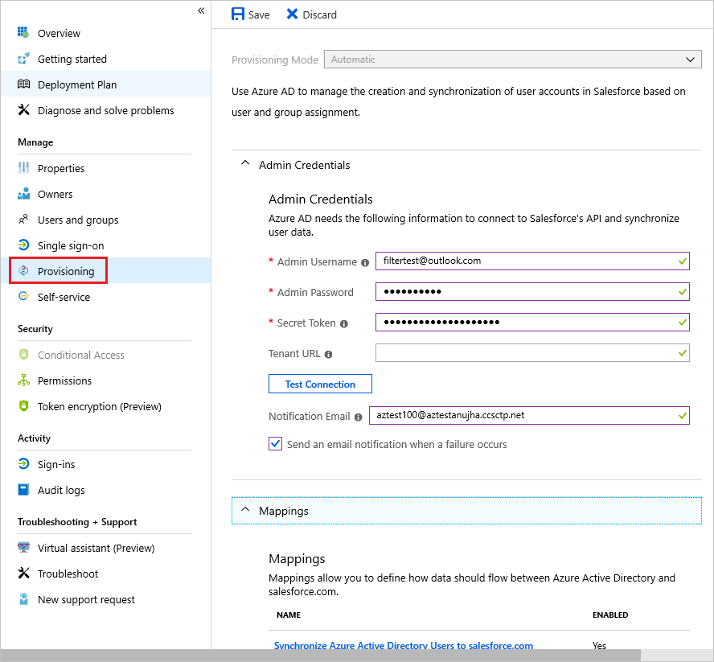

# Managing user account provisioning for enterprise apps in the Azure portal

This article describes the general steps for managing automatic user account provisioning and deprovisioning for applications that support it. *User account provisioning* is the act of creating, updating, and/or disabling user account records in an application’s local user profile store. Most cloud and SaaS applications store the role and permissions in the user's own local user profile store. The presence of such a user record in the user's local store is *required* for single sign-on and access to work. To learn more about automatic user account provisioning, see [Automate User Provisioning and Deprovisioning to SaaS Applications with Azure Active Directory](user-provisioning.md).

> [!IMPORTANT]
> Azure Active Directory (Azure AD) has a gallery that contains thousands of pre-integrated applications that are enabled for automatic provisioning with Azure AD. You should start by finding the provisioning setup tutorial specific to your application in the [List of tutorials on how to integrate SaaS apps with Azure Active Directory](../saas-apps/tutorial-list.md). You'll likely find step-by-step guidance for configuring both the app and Azure AD to create the provisioning connection.

## Finding your apps in the portal

[!INCLUDE [portal updates](~/articles/active-directory/includes/portal-update.md)]

Use the Azure portal to view and manage all applications that are configured for single sign-on in a directory. Enterprise apps are apps that are deployed and used within your organization. Follow these steps to view and manage your enterprise applications:

1. Sign in to the [Azure portal](https://portal.azure.com).
1. Browse to **Azure Active Directory** > **Enterprise applications**.
1. A list of all configured apps is shown, including apps that were added from the gallery.
1. Select any app to load its resource pane, where you can view reports and manage app settings.
1. Select **Provisioning** to manage user account provisioning settings for the selected app.

   

## Provisioning modes

The **Provisioning** pane begins with a **Mode** menu, which shows the provisioning modes supported for an enterprise application, and lets you configure them. The available options include:

* **Automatic** - This option is shown if Azure AD supports automatic API-based provisioning or deprovisioning of user accounts to this application. Select this mode to display an interface that helps administrators:

  * Configure Azure AD to connect to the application's user management API
  * Create account mappings and workflows that define how user account data should flow between Azure AD and the app
  * Manage the Azure AD provisioning service

* **Manual** - This option is shown if Azure AD doesn't support automatic provisioning of user accounts to this application. In this case, user account records stored in the application must be managed using an external process, based on the user management and provisioning capabilities provided by that application (which can include SAML Just-In-Time provisioning).

## Configuring automatic user account provisioning

Select the **Automatic** option to specify settings for admin credentials, mappings, starting and stopping, and synchronization.

### Admin Credentials

Expand **Admin Credentials** to enter the credentials required for Azure AD to connect to the application's user management API. The input required varies depending on the application. To learn about the credential types and requirements for specific applications, see the [configuration tutorial for that specific application](user-provisioning.md).

Select **Test Connection** to test the credentials by having Azure AD attempt to connect to the app's provisioning app using the supplied credentials.

### Mappings

Expand **Mappings** to view and edit the user attributes that flow between Azure AD and the target application when user accounts are provisioned or updated.

There's a preconfigured set of mappings between Azure AD user objects and each SaaS app’s user objects. Some apps also manage group objects. Select a mapping in the table to open the mapping editor, where you can view and customize them.

Supported customizations include:

* Enabling and disabling mappings for specific objects, such as the Azure AD user object to the SaaS app's user object.
* Editing the attributes that flow from the Azure AD user object to the app's user object. For more information on attribute mapping, see [Understanding attribute mapping types](customize-application-attributes.md#understanding-attribute-mapping-types).
* Filtering the provisioning actions that Azure AD runs on the targeted application. Instead of having Azure AD fully synchronize objects, you can limit the actions run.

  For example, only select **Update** and Azure AD only updates existing user accounts in an application but doesn't create new ones. Only select **Create** and Azure only creates new user accounts but doesn't update existing ones. This feature lets admins create different mappings for account creation and update workflows.

* Adding a new attribute mapping. Select **Add New Mapping** at the bottom of the **Attribute Mapping** pane. Fill out the **Edit Attribute** form and select **Ok** to add the new mapping to the list.

### Settings

Expand **Settings** to set an email address to receive notifications and whether to receive alerts on errors. Also select the scope of users to sync. Choose to sync all users and groups or only users that are assigned.

### Provisioning Status 

If provisioning is being enabled for the first time for an application, turn on the service by changing the **Provisioning Status** to **On**. This change causes the Azure AD provisioning service to run an initial cycle. It reads the users assigned in the **Users and groups** section, queries the target application for them, and then runs the provisioning actions defined in the Azure AD **Mappings** section. During this process, the provisioning service stores cached data about what user accounts it's managing. The service stores cached data so nonmanaged accounts inside the target applications that were never in scope for assignment aren't affected in deprovisioning operations. After the initial cycle, the provisioning service automatically synchronizes user and group objects on a forty-minute interval.

Change the **Provisioning Status** to **Off**  to pause the provisioning service. In this state, Azure doesn't create, update, or remove any user or group objects in the app. Change the state back to **On** and the service picks up where it left off.
