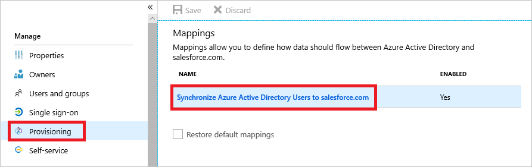
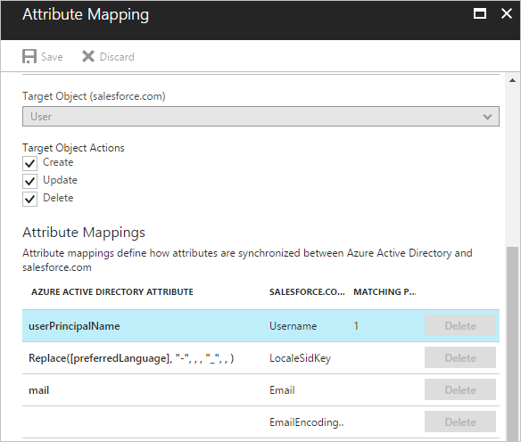
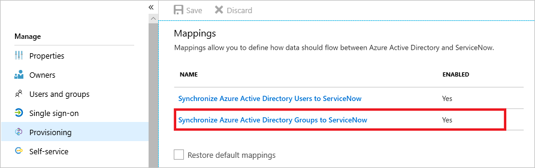
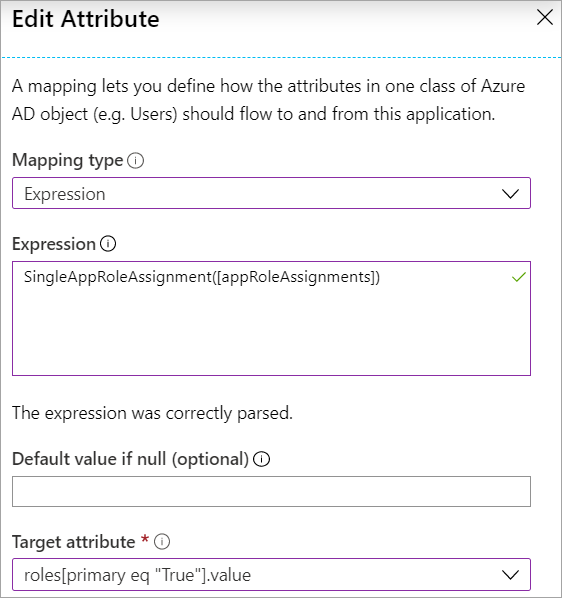
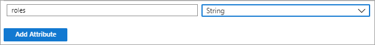
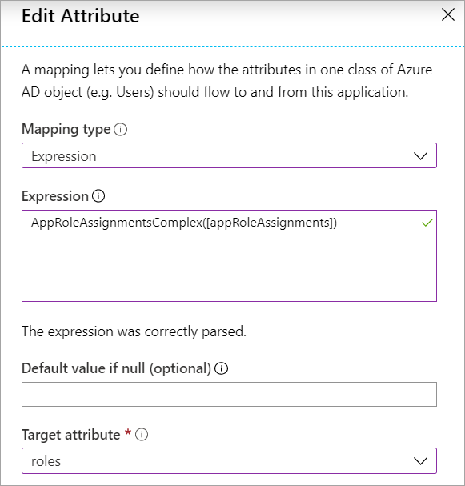

# Tutorial - Customize user provisioning attribute-mappings for SaaS applications in Azure Active Directory

Microsoft Azure AD provides support for user provisioning to third-party SaaS applications such as Salesforce, G Suite and others. If you enable user provisioning for a third-party SaaS application, the Azure portal controls its attribute values through attribute-mappings.

Before you get started, make sure you're familiar with app management and **single sign-on (SSO)** concepts. Check out the following links:
- [Quickstart Series on App Management in Azure AD](../manage-apps/view-applications-portal.md)
- [What is single sign-on (SSO)?](../manage-apps/what-is-single-sign-on.md)

There's a preconfigured set of attributes and attribute-mappings between Azure AD user objects and each SaaS app's user objects. Some apps manage other types of objects along with Users, such as Groups.

You can customize the default attribute-mappings according to your business needs. So, you can change or delete existing attribute-mappings, or create new attribute-mappings.

## Editing user attribute-mappings

Follow these steps to access the **Mappings** feature of user provisioning:

1. Sign in to the [Azure portal](https://portal.azure.com).
1. Browse to **Azure Active Directory** > **Enterprise applications**.
1. A list of all configured apps is shown, including apps that were added from the gallery.
1. Select any app to load its app management pane, where you can view reports and manage app settings.
1. Select **Provisioning** to manage user account provisioning settings for the selected app.
1. Expand **Mappings** to view and edit the user attributes that flow between Azure AD and the target application. If the target application supports it, this section lets you optionally configure provisioning of groups and user accounts.

   

1. Select a **Mappings** configuration to open the related **Attribute Mapping** screen. SaaS applications require certain attribute-mappings to function correctly. For required attributes, the **Delete** feature is unavailable.

   

   In this screenshot, you can see that the **Username** attribute of a managed object in Salesforce is populated with the **userPrincipalName** value of the linked Azure Active Directory Object.
   
   > [!NOTE]
   > Clearing **Create** doesn't affect existing users. If **Create** isn't selected, you can't create new users.   

1. Select an existing **Attribute Mapping** to open the **Edit Attribute** screen. Here you can edit the user attributes that flow between Azure AD and the target application.

   

### Understanding attribute-mapping types

With attribute-mappings, you control how attributes are populated in a third-party SaaS application.
There are four different mapping types supported:

- **Direct** – the target attribute is populated with the value of an attribute of the linked object in Azure AD.
- **Constant** – the target attribute is populated with a specific string you specified.
- **Expression** - the target attribute is populated based on the result of a script-like expression.
  For more information, see [Writing Expressions for Attribute-Mappings in Azure Active Directory](../app-provisioning/functions-for-customizing-application-data.md).
- **None** - the target attribute is left unmodified. However, if the target attribute is ever empty, it's populated with the Default value that you specify.

Along with these four basic types, custom attribute-mappings support the concept of an optional **default** value assignment. The default value assignment ensures that a target attribute is populated with a value if there's not a value in Azure AD or on the target object. The most common configuration is to leave this blank.

### Understanding attribute-mapping properties

In the previous section, you were already introduced to the attribute-mapping type property.
Along with this property, attribute-mappings also support the following attributes:

- **Source attribute** - The user attribute from the source system (example: Azure Active Directory).
- **Target attribute** – The user attribute in the target system (example: ServiceNow).
- **Default value if null (optional)** - The value that is passed to the target system if the source attribute is null. This value is only provisioned when a user is created. The "default value when null" won't be provisioned when updating an existing user. If for example, you provision all existing users in the target system with a particular Job Title (when it's null in the source system), you'll use the following [expression](../app-provisioning/functions-for-customizing-application-data.md): Switch(IsPresent([jobTitle]), "DefaultValue", "True", [jobTitle]). Make sure to replace the "Default Value" with the value to provision when null in the source system. 
- **Match objects using this attribute** – Whether this mapping should be used to uniquely identify users between the source and target systems. It's typically set on the userPrincipalName or mail attribute in Azure AD, which is typically mapped to a username field in a target application.
- **Matching precedence** – Multiple matching attributes can be set. When there are multiple, they're evaluated in the order defined by this field. As soon as a match is found, no further matching attributes are evaluated. While you can set as many matching attributes as you would like, consider whether the attributes you're using as matching attributes are truly unique and need to be matching attributes. Generally customers have 1 or 2 matching attributes in their configuration. 
- **Apply this mapping**
  - **Always** – Apply this mapping on both user creation and update actions.
  - **Only during creation** - Apply this mapping only on user creation actions.

## Matching users in the source and target  systems
The Azure AD provisioning service can be deployed in both "green field" scenarios (where users don't exist in the target system) and "brownfield" scenarios (where users already exist in the target system). To support both scenarios, the provisioning service uses the concept of matching attributes. Matching attributes allow you to determine how to uniquely identify a user in the source and match the user in the target. As part of planning your deployment, identify the attribute that can be used to uniquely identify a user in the source and target systems. Things to note:

- **Matching attributes should be unique:** Customers often use attributes such as userPrincipalName, mail, or object ID as the matching attribute.
- **Multiple attributes can be used as matching attributes:** You can define multiple attributes to be evaluated when matching users and the order in which they're evaluated (defined as matching precedence in the UI). If for example, you define three attributes as matching attributes, and a user is uniquely matched after evaluating the first two attributes, the service won't evaluate the third attribute. The service will evaluate matching attributes in the order specified and stop evaluating when a match is found.  
- **The value in the source and the target don't have to match exactly:** The value in the target can be a function of the value in the source. So, one could have an emailAddress attribute in the source and the userPrincipalName in the target, and match by a function of the emailAddress attribute that replaces some characters with some constant value.  
- **Matching based on a combination of attributes isn't supported:** Most applications don't support querying based on two properties. Therefore, it's not possible to match based on a combination of attributes. It's possible to evaluate single properties on after another.
- **All users must have a value for at least one matching attribute:** If you define one matching attribute, all users must have a value for that attribute in the source system. If for example, you define userPrincipalName as the matching attribute, all users must have a userPrincipalName. If you define multiple matching attributes (for example, both extensionAttribute1 and mail), not all users have to have the same matching attribute. One user could have a extensionAttribute1 but not mail while another user could have mail but no extensionAttribute1. 
- **The target application must support filtering on the matching attribute:** Application developers allow filtering for a subset of attributes on their user or group API. For applications in the gallery, we ensure that the default attribute mapping is for an attribute that the target application's API does support filtering on. When changing the default matching attribute for the target application, check the third party API documentation to ensure that the attribute can be filtered on.  

## Editing group attribute-mappings

A selected number of applications, such as ServiceNow, Box, and G Suite, support the ability to provision Group objects and User objects. Group objects can contain group properties such as display names and email aliases, along with group members.



Group provisioning can be optionally enabled or disabled by selecting the group mapping under **Mappings**, and setting **Enabled** to the option you want in the **Attribute Mapping** screen.

The attributes provisioned as part of Group objects can be customized in the same manner as User objects, described previously. 

> [!TIP]
> Provisioning of group objects (properties and members) is a distinct concept from [assigning groups](../manage-apps/assign-user-or-group-access-portal.md) to an application. It's possible to assign a group to an application, but only provision the user objects contained in the group. Provisioning of full group objects isn't required to use groups in assignments.

## Editing the list of supported attributes

The user attributes supported for a given application are preconfigured. Most application's user management APIs don't support schema discovery. So, the Azure AD provisioning service isn't able to dynamically generate the list of supported attributes by making calls to the application.

However, some applications support custom attributes, and the Azure AD provisioning service can read and write to custom attributes. To enter their definitions into the Azure portal, select the **Show advanced options** check box at the bottom of the **Attribute Mapping** screen, and then select **Edit attribute list for** your app.

Applications and systems that support customization of the attribute list include:

- Salesforce
- ServiceNow
- Workday to Active Directory / Workday to Azure Active Directory
- SuccessFactors to Active Directory / SuccessFactors to Azure Active Directory
- Azure Active Directory ([Azure AD Graph API default attributes](/previous-versions/azure/ad/graph/api/entity-and-complex-type-reference#user-entity) and custom directory extensions are supported). Learn more about [creating extensions](./user-provisioning-sync-attributes-for-mapping.md) and [known limitations](./known-issues.md). 
- Apps that support [SCIM 2.0](https://tools.ietf.org/html/rfc7643)
- For Azure Active Directory writeback to Workday or SuccessFactors, it's supported to update relevant metadata for supported attributes (XPATH and JSONPath), but isn't supported to add new Workday or SuccessFactors attributes beyond those included in the default schema


> [!NOTE]
> Editing the list of supported attributes is only recommended for administrators who have customized the schema of their applications and systems, and have first-hand knowledge of how their custom attributes have been defined or if a source attribute isn't automatically displayed in the Azure Portal UI. This sometimes requires familiarity with the APIs and developer tools provided by an application or system. The ability to edit the list of supported attributes is locked down by default, but customers can enable the capability by navigating to the following URL: https://portal.azure.com/?Microsoft_AAD_Connect_Provisioning_forceSchemaEditorEnabled=true . You can then navigate to your application to view the attribute list as described [above](#editing-the-list-of-supported-attributes). 

> [!NOTE]
> When a directory extension attribute in Azure AD doesn't show up automatically in your attribute mapping drop-down, you can manually add it to the "Azure AD attribute list".  When manually adding Azure AD directory extension attributes to your provisioning app, note that directory extension attribute names are case-sensitive. For example: If you have a directory extension attribute named `extension_53c9e2c0exxxxxxxxxxxxxxxx_acmeCostCenter`, make sure you enter it in the same format as defined in the directory.     

When you're editing the list of supported attributes, the following properties are provided:

- **Name** - The system name of the attribute, as defined in the target object's schema.
- **Type** - The type of data the attribute stores, as defined in the target object's schema, which can be one of the following types:
  - *Binary* - Attribute contains binary data.
  - *Boolean* - Attribute contains a True or False value.
  - *DateTime* - Attribute contains a date string.
  - *Integer* - Attribute contains an integer.
  - *Reference* - Attribute contains an ID that references a value stored in another table in the target application.
  - *String*  - Attribute contains a text string.
- **Primary Key?** - Whether the attribute is defined as a primary key field in the target object's schema.
- **Required?** - Whether the attribute is required to be populated in the target application or system.
- **Multi-value?** - Whether the attribute supports multiple values.
- **Exact case?** - Whether the attributes values are evaluated in a case-sensitive way.
- **API Expression** - Don't use, unless instructed to do so by the documentation for a specific provisioning connector (such as Workday).
- **Referenced Object Attribute** - If it's a Reference type attribute, then this menu lets you select the table and attribute in the target application that contains the value associated with the attribute. For example, if you have an attribute named "Department" whose stored value references an object in a separate "Departments" table, you would select "Departments.Name". The reference tables and the primary ID fields supported for a given application are preconfigured and currently can't be edited using the Azure portal, but can be edited using the [Microsoft Graph API](/graph/api/resources/synchronization-configure-with-custom-target-attributes).

#### Provisioning a custom extension attribute to a SCIM compliant application
The SCIM RFC defines a core user and group schema, while also allowing for extensions to the schema to meet your application's needs. To add a custom attribute to a SCIM application:
   1. Sign in to the [Azure portal](https://portal.azure.com), select **Enterprise Applications**, select your application, and then select **Provisioning**.
   2. Under **Mappings**, select the object (user or group) for which you'd like to add a custom attribute.
   3. At the bottom of the page, select **Show advanced options**.
   4. Select **Edit attribute list for AppName**.
   5. At the bottom of the attribute list, enter information about the custom attribute in the fields provided. Then select **Add Attribute**.

For SCIM applications, the attribute name must follow the pattern shown in the example below. The "CustomExtensionName" and "CustomAttribute" can be customized per your application's requirements, for example: urn:ietf:params:scim:schemas:extension:CustomExtensionName:2.0:User:CustomAttribute 

These instructions are only applicable to SCIM-enabled applications. Applications such as ServiceNow and Salesforce aren't integrated with Azure AD using SCIM, and therefore they don't require this specific namespace when adding a custom attribute.

Custom attributes can't be referential attributes, multi-value or complex-typed attributes. Custom multi-value and complex-typed extension attributes are currently supported only for applications in the gallery. The custom extension schema header is omitted in the example because it isn't sent in requests from the Azure AD SCIM client. This issue will be fixed in the future and the header will be sent in the request.  
 
**Example representation of a user with an extension attribute:**

```json
   {
     "schemas": ["urn:ietf:params:scim:schemas:core:2.0:User",
     "urn:ietf:params:scim:schemas:extension:enterprise:2.0:User"],
     "userName":"bjensen",
     "id": "48af03ac28ad4fb88478",
     "externalId":"bjensen",
     "name":{
       "formatted":"Ms. Barbara J Jensen III",
       "familyName":"Jensen",
       "givenName":"Barbara"
     },
     "urn:ietf:params:scim:schemas:extension:enterprise:2.0:User": {
     "employeeNumber": "701984",
     "costCenter": "4130",
     "organization": "Universal Studios",
     "division": "Theme Park",
     "department": "Tour Operations",
     "manager": {
       "value": "26118915-6090-4610-87e4-49d8ca9f808d",
       "$ref": "../Users/26118915-6090-4610-87e4-49d8ca9f808d",
       "displayName": "John Smith"
     }
   },
     "urn:ietf:params:scim:schemas:extension:CustomExtensionName:2.0:User": {
     "CustomAttribute": "701984",
   },
   "meta": {
     "resourceType": "User",
     "created": "2010-01-23T04:56:22Z",
     "lastModified": "2011-05-13T04:42:34Z",
     "version": "W\/\"3694e05e9dff591\"",
     "location":
 "https://example.com/v2/Users/2819c223-7f76-453a-919d-413861904646"
   }
 }
```


## Provisioning a role to a SCIM app
Use the steps below to provision roles for a user to your application. Note that the description below is specific to custom SCIM applications. For gallery applications such as Salesforce and ServiceNow, use the pre-defined role mappings. The bullets below describe how to transform the AppRoleAssignments attribute to the format your application expects.

- Mapping an appRoleAssignment in Azure AD to a role in your application requires that you transform the attribute using an [expression](../app-provisioning/functions-for-customizing-application-data.md). The appRoleAssignment attribute **shouldn't be mapped directly** to a role attribute without using an expression to parse the role details. 

- **SingleAppRoleAssignment** 
  - **When to use:** Use the SingleAppRoleAssignment expression to provision a single role for a user and to specify the primary role. 
  - **How to configure:** Use the steps described above to navigate to the attribute mappings page and use the SingleAppRoleAssignment expression to map to the roles attribute. There are three role attributes to choose from (`roles[primary eq "True"].display`, `roles[primary eq "True"].type`, and `roles[primary eq "True"].value`). You can choose to include any or all of the role attributes in your mappings. If you would like to include more than one, just add a new mapping and include it as the target attribute.

  
  - **Things to consider**
    - Ensure that multiple roles aren't assigned to a user. We can't guarantee which role will be provisioned.
    - SingleAppRoleAssignments isn't compatible with setting scope to "Sync All users and groups." 
  - **Example request (POST)** 

   ```json
    {
      "schemas": [
          "urn:ietf:params:scim:schemas:core:2.0:User"
      ],
      "externalId": "alias",
      "userName": "alias@contoso.OnMicrosoft.com",
      "active": true,
      "displayName": "First Name Last Name",
      "meta": {
           "resourceType": "User"
      },
      "roles": [
         {
               "primary": true,
               "type": "WindowsAzureActiveDirectoryRole",
               "value": "Admin"
         }
      ]
   }
   ```
  
  - **Example output (PATCH)** 
    
   ```json
   "Operations": [
     {
       "op": "Add",
       "path": "roles",
       "value": [
         {
           "value": "{\"id\":\"06b07648-ecfe-589f-9d2f-6325724a46ee\",\"value\":\"25\",\"displayName\":\"Role1234\"}"
         }
       ]
   ```  
The request formats in the PATCH and POST differ. To ensure that POST and PATCH are sent in the same format, you can use the feature flag described [here](./application-provisioning-config-problem-scim-compatibility.md#flags-to-alter-the-scim-behavior). 

- **AppRoleAssignmentsComplex** 
  - **When to use:** Use the AppRoleAssignmentsComplex expression to provision multiple roles for a user. 
  - **How to configure:** Edit the list of supported attributes as described above to include a new attribute for roles: 
  
    <br>

    Then use the AppRoleAssignmentsComplex expression to map to the custom role attribute as shown in the image below:

    <br>
  - **Things to consider**
    - All roles will be provisioned as primary = false.
    - The POST contains the role type. The PATCH request doesn't contain type. We're working on sending the type in both POST and PATCH requests.
    - AppRoleAssignmentsComplex isn't compatible with setting scope to "Sync All users and groups." 
    
  - **Example output** 
  
   ```json
   {
       "schemas": [
           "urn:ietf:params:scim:schemas:core:2.0:User"
      ],
      "externalId": "alias",
      "userName": "alias@contoso.OnMicrosoft.com",
      "active": true,
      "displayName": "First Name Last Name",
      "meta": {
           "resourceType": "User"
      },
      "roles": [
         {
               "primary": false,
               "type": "WindowsAzureActiveDirectoryRole",
               "display": "Admin",
               "value": "Admin"
         },
         {
               "primary": false,
               "type": "WindowsAzureActiveDirectoryRole",
               "display": "User",
             "value": "User"
         }
      ]
   }
   ```

  


## Provisioning a multi-value attribute
Certain attributes such as phoneNumbers and emails are multi-value attributes where you may need to specify different types of phone numbers or emails. Use the expression below for multi-value attributes. It allows you to specify the attribute type and map that to the corresponding Azure AD user attribute for the value. 

* phoneNumbers[type eq "work"].value
* phoneNumbers[type eq "mobile"].value
* phoneNumbers[type eq "fax"].value

   ```json
   "phoneNumbers": [
       {
         "value": "555-555-5555",
         "type": "work"
      },
      {
         "value": "555-555-5555",
         "type": "mobile"
      },
      {
         "value": "555-555-5555",
         "type": "fax"
      }
   ]
   ```

## Restoring the default attributes and attribute-mappings

Should you need to start over and reset your existing mappings back to their default state, you can select the **Restore default mappings** check box and save the configuration. Doing so sets all mappings and scoping filters as if the application was just added to your Azure AD tenant from the application gallery.

Selecting this option will effectively force a resynchronization of all users while the provisioning service is running.

> [!IMPORTANT]
> We strongly recommend that **Provisioning status** be set to **Off** before invoking this option.

## What you should know

- Microsoft Azure AD provides an efficient implementation of a synchronization process. In an initialized environment, only objects requiring updates are processed during a synchronization cycle.
- Updating attribute-mappings has an impact on the performance of a synchronization cycle. An update to the attribute-mapping configuration requires all managed objects to be reevaluated.
- A recommended best practice is to keep the number of consecutive changes to your attribute-mappings at a minimum.
- Adding a photo attribute to be provisioned to an app isn't supported today as you can't specify the format to sync the photo. You can request the feature on [User Voice](https://feedback.azure.com/d365community/forum/22920db1-ad25-ec11-b6e6-000d3a4f0789)
- The attribute IsSoftDeleted is often part of the default mappings for an application. IsSoftdeleted can be true in one of four scenarios (the user is out of scope due to being unassigned from the application, the user is out of scope due to not meeting a scoping filter, the user has been soft deleted in Azure AD, or the property AccountEnabled is set to false on the user). It's not recommended to remove the IsSoftDeleted attribute from your attribute mappings.
- The Azure AD provisioning service doesn't support provisioning null values.
- They primary key, typically "ID", shouldn't be included as a target attribute in your attribute mappings. 
- The role attribute typically needs to be mapped using an expression, rather than a direct mapping. See section above for more details on role mapping. 
- While you can disable groups from your mappings, disabling users isn't supported. 

## Next steps

- [Automate User Provisioning/Deprovisioning to SaaS Apps](user-provisioning.md)
- [Writing Expressions for Attribute-Mappings](functions-for-customizing-application-data.md)
- [Scoping Filters for User Provisioning](define-conditional-rules-for-provisioning-user-accounts.md)
- [Using SCIM to enable automatic provisioning of users and groups from Azure Active Directory to applications](use-scim-to-provision-users-and-groups.md)
- [List of Tutorials on How to Integrate SaaS Apps](../saas-apps/tutorial-list.md)
