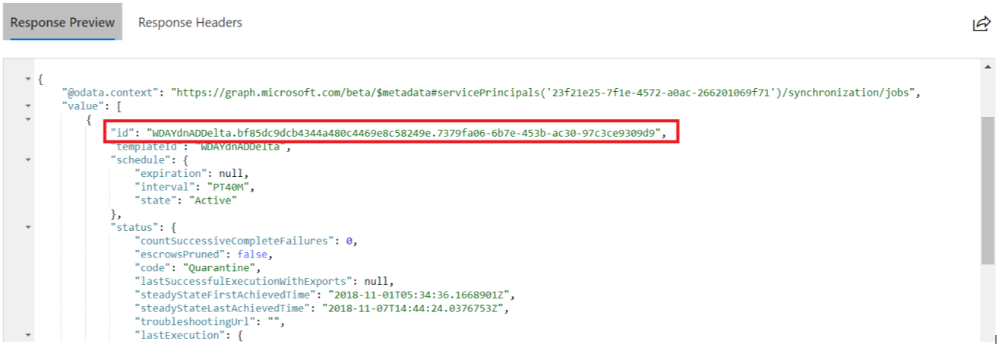
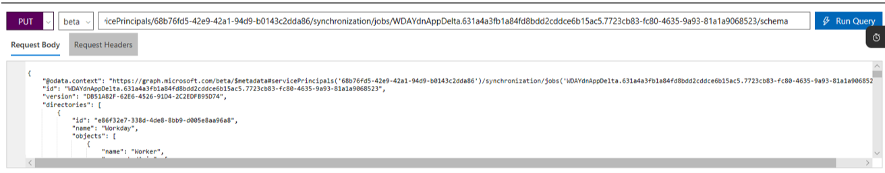

# How-to: Export provisioning configuration and roll back to a known good state

In this article, you learn how to:

- Export and import your provisioning configuration from the Microsoft Entra admin center
- Export and import your provisioning configuration by using the Microsoft Graph API

## Export and import your provisioning configuration from the Microsoft Entra admin center

### Export your provisioning configuration

[!INCLUDE [portal updates](~/articles/active-directory/includes/portal-update.md)]

To export your configuration:

1. Sign in to the [Microsoft Entra admin center](https://entra.microsoft.com) as at least a [Application Administrator](../roles/permissions-reference.md#application-administrator).
1. Browse to **Identity** > **Applications** > **Enterprise applications** and choose your application.
1. In the left navigation pane, select **provisioning**. From the provisioning configuration page, click on **attribute mappings**, then **show advanced options**, and finally **review your schema**. The schema editor opens.
1. Click on download in the command bar at the top of the page to download your schema.

### Disaster recovery - roll back to a known good state

Exporting and saving your configuration allows you to roll back to a previous version of your configuration. We recommend exporting your provisioning configuration and saving it for later use anytime you make a change to your attribute mappings or scoping filters. Open the JSON file that you downloaded, copy the entire contents. Next, replace the entire contents of the JSON payload in the schema editor, and then save. If there's an active provisioning cycle, it completes and the next cycle uses the updated schema. The next cycle is also an initial cycle, which reevaluates every user and group based on the new configuration. 

Some things to consider when rolling back to a previous configuration:

- Users are evaluated again to determine if they should be in scope. If the scoping filters have changed, a user isn't in scope anymore because they're disabled. While the behavior is the desired in most cases, there are times where you may want to prevent it. To prevent the behavior, use the [skip out of scope deletions](./skip-out-of-scope-deletions.md) functionality. 
- Changing your provisioning configuration restarts the service and triggers an [initial cycle](./how-provisioning-works.md#provisioning-cycles-initial-and-incremental).

## Export and import your provisioning configuration by using the Microsoft Graph API

You can use the Microsoft Graph API and the Microsoft Graph Explorer to export your User Provisioning attribute mappings and schema to a JSON file and import it back into Microsoft Entra ID. You can also use the steps captured here to create a backup of your provisioning configuration.

### Step 1: Retrieve your Provisioning App Service Principal ID (Object ID)

1. Sign in to the [Microsoft Entra admin center](https://entra.microsoft.com), and navigate to the Properties section of your provisioning application. For example, if you want to export your *Workday to AD User Provisioning application* mapping navigate to the Properties section of that app.
1. In the Properties section of your provisioning app, copy the GUID value associated with the *Object ID* field. This value is also called the **ServicePrincipalId** of your App and it's used in Microsoft Graph Explorer operations.

   

### Step 2: Sign into Microsoft Graph Explorer

1. Launch [Microsoft Graph Explorer](https://developer.microsoft.com/graph/graph-explorer)
1. Click on the "Sign-In with Microsoft" button and sign-in using Microsoft Entra Global Administrator or App Admin credentials.

    

1. Upon successful sign-in, you see the user account details in the left-hand pane.

### Step 3: Retrieve the Provisioning Job ID of the Provisioning App

In the Microsoft Graph Explorer, run the following GET query replacing [servicePrincipalId]  with the **ServicePrincipalId** extracted from the [Step 1](#step-1-retrieve-your-provisioning-app-service-principal-id-object-id).

```http
   GET https://graph.microsoft.com/beta/servicePrincipals/[servicePrincipalId]/synchronization/jobs
```

You get a response as shown. Copy the `id` attribute present in the response. This value is the **ProvisioningJobId** and is used to retrieve the underlying schema metadata.

   [](./media/export-import-provisioning-configuration/wd_export_03.png#lightbox)

### Step 4: Download the Provisioning Schema

In the Microsoft Graph Explorer, run the following GET query, replacing [servicePrincipalId] and [ProvisioningJobId] with the ServicePrincipalId and the ProvisioningJobId retrieved in the previous steps.

```http
   GET https://graph.microsoft.com/beta/servicePrincipals/[servicePrincipalId]/synchronization/jobs/[ProvisioningJobId]/schema
```

Copy the JSON object from the response and save it to a file to create a backup of the schema.

### Step 5: Import the Provisioning Schema

> [!CAUTION]
> Perform this step only if you need to modify the schema for configuration that cannot be changed using the Microsoft Entra admin center or if you need to restore the configuration from a previously backed up file with valid and working schema.

In the Microsoft Graph Explorer, configure the following PUT query, replacing [servicePrincipalId] and [ProvisioningJobId] with the ServicePrincipalId and the ProvisioningJobId retrieved in the previous steps.

```http
    PUT https://graph.microsoft.com/beta/servicePrincipals/[servicePrincipalId]/synchronization/jobs/[ProvisioningJobId]/schema
```

In the "Request Body" tab, copy the contents of the JSON schema file.

   [](./media/export-import-provisioning-configuration/wd_export_04.png#lightbox)

In the "Request Headers" tab, add the Content-Type header attribute with value “application/json”

   [](./media/export-import-provisioning-configuration/wd_export_05.png#lightbox)

Select **Run Query** to import the new schema.
