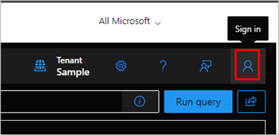
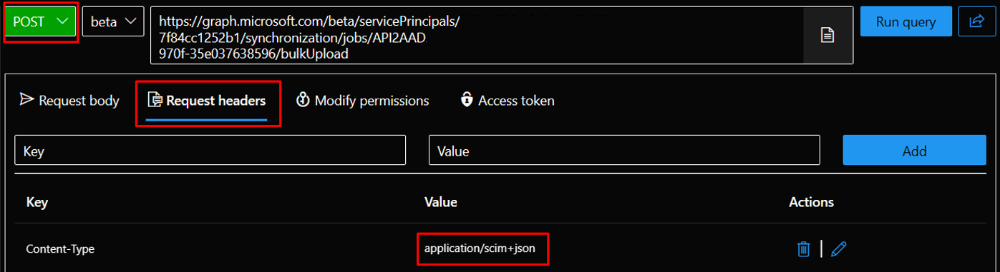

# Quickstart API-driven inbound provisioning with Graph Explorer (Public preview)

This tutorial describes how you can quickly test [API-driven inbound provisioning](inbound-provisioning-api-concepts.md) with Microsoft Graph Explorer.

## Pre-requisites

* You have configured [API-driven inbound provisioning app](inbound-provisioning-api-configure-app.md). 

> [!NOTE]
> This provisioning API is primarily meant for use within an application or service. Tenant admins can either configure a service principal or managed identity to grant permission to perform the upload. There is no separate user-assignable Microsoft Entra built-in directory role for this API. Outside of applications that have acquired `SynchronizationData-User.Upload` permission with admin consent, only admin users with Global Administrator role can invoke the API. This tutorial shows how you can test the API with a global administrator role in your test setup. 

## Upload user data to the inbound provisioning API 

1. Open a new browser tab or browser window.
1. Launch the URL https://aka.ms/ge to access Microsoft Graph Explorer.
1. Click on the user profile icon to sign in. 

     [](media/inbound-provisioning-api-graph-explorer/provisioning-user-profile-icon.png#lightbox)
1. Complete the login process with a user account that has *Global Administrator* role.
1. Upon successful login, the Tenant information shows your tenant name.

     [](media/inbound-provisioning-api-graph-explorer/provisioning-tenant-name.png#lightbox)

   You're now ready to invoke the API. 
1. In the API request panel, set the HTTP request type to **POST**. 
1. Copy and paste the provisioning API endpoint retrieved from the provisioning app overview page.
1. Under the Request headers panel, add a new key value pair of **Content-Type = application/scim+json**.
     [](media/inbound-provisioning-api-graph-explorer/provisioning-request-header-panel.png#lightbox)
1. Under the **Request body** panel, copy-paste the [bulk request with SCIM Enterprise User Schema](#bulk-request-with-scim-enterprise-user-schema)
1. Click on the **Run query** button to send the request to the provisioning API endpoint.
1. If the request is sent successfully, you'll get an `Accepted 202` response from the API endpoint.
1. Open the **Response headers** panel and copy the URL value of the location attribute. This points to the provisioning logs API endpoint that you can query to check the provisioning status of users present in the bulk request.

## Verify processing of bulk request payload

You can verify the processing either from the Microsoft Entra admin center or using Graph Explorer.

### Verify processing from Microsoft Entra admin center 
1. Log in to [Microsoft Entra admin center](https://entra.microsoft.com) with at least [Application Administrator](https://go.microsoft.com/fwlink/?linkid=2247823) login credentials.
1. Browse to **Microsoft Entra ID -> Applications -> Enterprise applications**.
1. Under all applications, use the search filter text box to find and open your API-driven provisioning application.
1. Open the Provisioning blade. The landing page displays the status of the last run.
1. Click on **View provisioning logs** to open the provisioning logs blade. Alternatively, you can click on the menu option **Monitor -> Provisioning logs**.

      [](media/inbound-provisioning-api-curl-tutorial/access-provisioning-logs.png#lightbox)
1. Click on any record in the provisioning logs to view additional processing details.
1. The provisioning log details screen displays all the steps executed for a specific user. 
      [](media/inbound-provisioning-api-curl-tutorial/provisioning-log-details.png#lightbox)
      * Under the **Import from API** step, see details of user data extracted from the bulk request.
      * The **Match user** step shows details of any user match based on the matching identifier. If a user match happens, then the provisioning service performs an update operation. If there is no user match, then the provisioning service performs a create operation.
      * The **Determine if User is in scope** step shows details of scoping filter evaluation. By default, all users are processed. If you have set a scoping filter (example, process only users belonging to the Sales department), the evaluation details of the scoping filter displays in this step.
      * The **Provision User** step calls out the final processing step and changes applied to the user account.
      * Use the **Modified properties** tab to view attribute updates.

### Verify processing using provisioning logs API in Graph Explorer

You can inspect the processing using the provisioning logs API URL returned as part of the location response header in the provisioning API call.

1. In the Graph Explorer, **Request URL** text box copy-paste the location URL returned by the provisioning API endpoint or you can construct it using the format: `https://graph.microsoft.com/beta/auditLogs/provisioning/?$filter=jobid eq '<jobId>'` where you can retrieve the ```jobId``` from the provisioning app overview page.
1. Use the method **GET** and click **Run query** to retrieve the provisioning logs. By default, the response returned contains all log records.
1. You can set more filters to only retrieve data after a certain time frame or with a specific status value. 
     `https://graph.microsoft.com/beta/auditLogs/provisioning/?$filter=jobid eq '<jobId> and statusInfo/status eq 'failure' and activityDateTime ge 2022-10-10T09:47:34Z`
     You can also check the status of the user by the ```externalId``` value used in your source system that is used as the source anchor / joining property. 
     `https://graph.microsoft.com/beta/auditLogs/provisioning/?$filter=jobid eq '<jobId>' and sourceIdentity/id eq '701984'`

## Appendix

### Bulk request with SCIM Enterprise User Schema
The bulk request shown below uses the SCIM standard Core User and Enterprise User schema. 

**Request body**

```http
{
    "schemas": ["urn:ietf:params:scim:api:messages:2.0:BulkRequest"],
    "Operations": [
    {
        "method": "POST",
        "bulkId": "897401c2-2de4-4b87-a97f-c02de3bcfc61",
        "path": "/Users",
        "data": {
            "schemas": ["urn:ietf:params:scim:schemas:core:2.0:User",
            "urn:ietf:params:scim:schemas:extension:enterprise:2.0:User"],
            "externalId": "701984",
            "userName": "bjensen@example.com",
            "name": {
                "formatted": "Ms. Barbara J Jensen, III",
                "familyName": "Jensen",
                "givenName": "Barbara",
                "middleName": "Jane",
                "honorificPrefix": "Ms.",
                "honorificSuffix": "III"
            },
            "displayName": "Babs Jensen",
            "nickName": "Babs",
            "emails": [
            {
              "value": "bjensen@example.com",
              "type": "work",
              "primary": true
            }
            ],
            "addresses": [
            {
              "type": "work",
              "streetAddress": "100 Universal City Plaza",
              "locality": "Hollywood",
              "region": "CA",
              "postalCode": "91608",
              "country": "USA",
              "formatted": "100 Universal City Plaza\nHollywood, CA 91608 USA",
              "primary": true
            }
            ],
            "phoneNumbers": [
            {
              "value": "555-555-5555",
              "type": "work"
            }
            ],
            "userType": "Employee",
            "title": "Tour Guide",
            "preferredLanguage": "en-US",
            "locale": "en-US",
            "timezone": "America/Los_Angeles",
            "active":true,
            "urn:ietf:params:scim:schemas:extension:enterprise:2.0:User": {
                 "employeeNumber": "701984",
                 "costCenter": "4130",
                 "organization": "Universal Studios",
                 "division": "Theme Park",
                 "department": "Tour Operations",
                 "manager": {
                     "value": "89607",
                     "displayName": "John Smith"
                 }
            }
        }
    },
    {
        "method": "POST",
        "bulkId": "897401c2-2de4-4b87-a97f-c02de3bcfc61",
        "path": "/Users",
        "data": {
            "schemas": ["urn:ietf:params:scim:schemas:core:2.0:User",
            "urn:ietf:params:scim:schemas:extension:enterprise:2.0:User"],
            "externalId": "701985",
            "userName": "Kjensen@example.com",
            "name": {
                "formatted": "Ms. Kathy J Jensen, III",
                "familyName": "Jensen",
                "givenName": "Kathy",
                "middleName": "Jane",
                "honorificPrefix": "Ms.",
                "honorificSuffix": "III"
            },
            "displayName": "Kathy Jensen",
            "nickName": "Kathy",
            "emails": [
            {
              "value": "kjensen@example.com",
              "type": "work",
              "primary": true
            }
            ],
            "addresses": [
            {
              "type": "work",
              "streetAddress": "100 Oracle City Plaza",
              "locality": "Hollywood",
              "region": "CA",
              "postalCode": "91618",
              "country": "USA",
              "formatted": "100 Oracle City Plaza\nHollywood, CA 91618 USA",
              "primary": true
            }
            ],
            "phoneNumbers": [
            {
              "value": "555-555-5545",
              "type": "work"
            }
            ],
            "userType": "Employee",
            "title": "Tour Lead",
            "preferredLanguage": "en-US",
            "locale": "en-US",
            "timezone": "America/Los_Angeles",
            "active":true,
            "urn:ietf:params:scim:schemas:extension:enterprise:2.0:User": {
                 "employeeNumber": "701985",
                 "costCenter": "4130",
                 "organization": "Universal Studios",
                 "division": "Theme Park",
                 "department": "Tour Operations",
                 "manager": {
                     "value": "701984",
                     "displayName": "Barbara Jensen"
                 }
            }
        }
    }
],
    "failOnErrors": null
}
```
## Next steps
- [Troubleshoot issues with the inbound provisioning API](inbound-provisioning-api-issues.md)
- [Frequently asked questions about API-driven inbound provisioning](inbound-provisioning-api-faqs.md)
- [Quick start using PowerShell](inbound-provisioning-api-powershell.md)
- [Quick start using Azure Logic Apps](inbound-provisioning-api-logic-apps.md)
