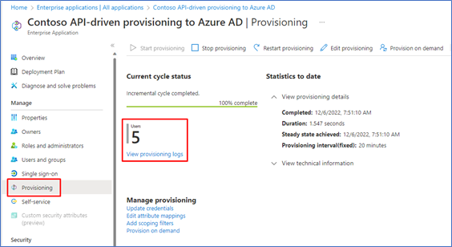
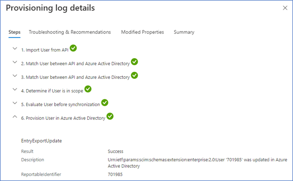

# Quickstart API-driven inbound provisioning with Postman (Public preview)

This tutorial describes how you can quickly test [API-driven inbound provisioning](inbound-provisioning-api-concepts.md) with Postman.

## Pre-requisites

* You have configured [API-driven inbound provisioning app](inbound-provisioning-api-configure-app.md). 
* You have [configured a service principal and it has access](inbound-provisioning-api-grant-access.md) to the inbound provisioning API. Make note of the `TenantId`, `ClientId` and `ClientSecret` of your service principal app for use in this tutorial. 


### Upload user data to the inbound provisioning API
In this step, you'll configure the Postman app and invoke the API using the configured service account. 

1. Download and install the [Postman app](https://www.postman.com/downloads/). 
1. Open the Postman desktop app. 
1. From the **Workspaces** menu, select **Create Workspace** to create a new Workspace called **Microsoft Entra provisioning API**. 
1. Download the following Postman collections and save it in your local directory.
    - [Microsoft Entra Inbound Provisioning.postman_collection.json](https://github.com/AzureAD/entra-id-inbound-provisioning/blob/main/Postman/Entra%20ID%20Inbound%20Provisioning.postman_collection.json) (Request collection)
    - [Test-API2AAD.postman_environment.json](https://github.com/AzureAD/entra-id-inbound-provisioning/blob/main/Postman/Test-API2AAD.postman_environment.json) (Environment collection for API-driven provisioning to Microsoft Entra ID)- 
    - [Test-API2AD.postman_environment.json](https://github.com/AzureAD/entra-id-inbound-provisioning/blob/main/Postman/Test-API2AD.postman_environment.json) (Environment collection for API-driven provisioning to on-premises AD) 
1. Use the **Import** option in Postman to import both of these files into your Workspace.  
     :::image type="content" source="media/inbound-provisioning-api-postman/postman-import-elements.png" alt-text="Screenshot of Postman Import elements." lightbox="media/inbound-provisioning-api-postman/postman-import-elements.png":::
1. Click the **Environments** menu and open the **Test-API2AAD** environment. 
1. Retrieve the values of **client_id**, **client_secret**, and **token_endpoint** from your registered app.
     :::image type="content" source="media/inbound-provisioning-api-postman/retrieve-authentication-details.png" alt-text="Screenshot of registered app." lightbox="media/inbound-provisioning-api-postman/retrieve-authentication-details.png":::
1. Paste the values in the table for each variable under the column **Initial value** and **Current value**. 
     :::image type="content" source="media/inbound-provisioning-api-postman/postman-authentication-variables.png" alt-text="Screenshot of authentication variables" lightbox="media/inbound-provisioning-api-postman/postman-authentication-variables.png":::     
1. Open your provisioning app landing page and copy-paste the value of **Job ID** for the `jobId` variable and the value of **Provisioning API endpoint** for the `bulk_upload_endpoint` variable
      :::image type="content" source="media/inbound-provisioning-api-configure-app/provisioning-api-endpoint.png" alt-text="Screenshot of Provisioning API endpoint." lightbox="media/inbound-provisioning-api-configure-app/provisioning-api-endpoint.png":::
1. Leave the value of **ms_graph_resource_id** unchanged and save the environment collection. Make sure that both **Initial value** and **Current value** columns are populated. 
1. Next, open the collection **Microsoft Entra Inbound Provisioning**.
1. From the **Environment** dropdown, select **Test-API2AAD**.
1. Select the **Authorization** tab associated with the collection. 
1. Make sure that authorization is configured to use OAuth settings. 
     :::image type="content" source="media/inbound-provisioning-api-postman/provisioning-oauth-configuration.png" alt-text="Screenshot of Provisioning OAuth configuration." lightbox="media/inbound-provisioning-api-postman/provisioning-oauth-configuration.png":::
1. The **Advanced options** section should show the following configuration:
     :::image type="content" source="media/inbound-provisioning-api-postman/provisioning-advanced-options.png" alt-text="Screenshot of Provisioning Advanced options." lightbox="media/inbound-provisioning-api-postman/provisioning-advanced-options.png":::
1. Click on **Get New Access Token** to initiate the process to procure an access token. 
1. Select the option **Use Token** to use the access token with all requests in this collection. 
     >[!NOTE]
     >The OAuth access token generated using `client_credentials` grant type is valid for one hour. You can decode the token using [https://jwt.ms](https://jwt.ms) and check when it expires. Requests fail after the token expires. If your access token has expired, click **Get New Access Token** in Postman to get a new access token. 
   The token is automatically copied into the **Current token** section of the Authorization tab. You can now use the token to make API calls. Let's start with the first call in this collection. 
1. Open the request **SCIM bulk request upload**.
1. Under the **Authorization tab**, make sure that type is set to **Inherit auth from parent**.
1. Change to the **Request body** tab, to view and edit the sample SCIM bulk request. When you're done editing, click **Send**.

If the API invocation is successful, you see the message `202 Accepted.` Under Headers, the **Location** attribute points to the provisioning logs API endpoint. 

## Verify processing of bulk request payload
You can verify the processing either from the Microsoft Entra admin center or using Postman.

### Verify processing from Microsoft Entra admin center 
1. Log in to [Microsoft Entra admin center](https://entra.microsoft.com) with at least [Application Administrator](https://go.microsoft.com/fwlink/?linkid=2247823) level credentials.
1. Browse to **Microsoft Entra ID -> Applications -> Enterprise applications**.
1. Under all applications, use the search filter text box to find and open your API-driven provisioning application.
1. Open the Provisioning blade. The landing page displays the status of the last run.
1. Click on **View provisioning logs** to open the provisioning logs blade. Alternatively, you can click on the menu option **Monitor -> Provisioning logs**.

      [](media/inbound-provisioning-api-curl-tutorial/access-provisioning-logs.png#lightbox)

1. Click on any record in the provisioning logs to view additional processing details.
1. The provisioning log details screen displays all the steps executed for a specific user. 
      [](media/inbound-provisioning-api-curl-tutorial/provisioning-log-details.png#lightbox)
      * Under the **Import from API** step, see details of user data extracted from the bulk request.
      * The **Match user** step shows details of any user match based on the matching identifier. If a user match happens, then the provisioning service performs an update operation. If there is no user match, then the provisioning service performs a create operation.
      * The **Determine if User is in scope** step shows details of scoping filter evaluation. By default, all users are processed. If you have set a scoping filter (example, process only users belonging to the Sales department), the evaluation details of the scoping filter displays in this step.
      * The **Provision User** step calls out the final processing step and changes applied to the user account.
      * Use the **Modified properties** tab to view attribute updates.

### Verify processing using provisioning logs API in Postman
This section shows how you can query provisioning logs in Postman using the same service account (service principal) that you configured.

1. Open the workspace **Microsoft Entra provisioning API** in your Postman desktop app. 
2. The collection **Microsoft Entra Inbound Provisioning** contains three sample requests that enable you to query the provisioning logs. 
3. You can open any of these predefined requests. 
4. If you don't have a valid access token or you're not sure if the access token is still valid, go to the collection object's root Authorization tab and use the option **Get New Access Token** to get a fresh token. 
5. Click **Send** to get provisioning log records. 
Upon successful execution, you'll get a `200 HTTP` response from the server along with the provisioning log records. 

## Appendix

### Bulk request with SCIM Enterprise User Schema
The bulk request shown below uses the SCIM standard Core User and Enterprise User schema. 

**Request body**

```http
{
    "schemas": ["urn:ietf:params:scim:api:messages:2.0:BulkRequest"],
    "Operations": [
    {
        "method": "POST",
        "bulkId": "897401c2-2de4-4b87-a97f-c02de3bcfc61",
        "path": "/Users",
        "data": {
            "schemas": ["urn:ietf:params:scim:schemas:core:2.0:User",
            "urn:ietf:params:scim:schemas:extension:enterprise:2.0:User"],
            "externalId": "701984",
            "userName": "bjensen@example.com",
            "name": {
                "formatted": "Ms. Barbara J Jensen, III",
                "familyName": "Jensen",
                "givenName": "Barbara",
                "middleName": "Jane",
                "honorificPrefix": "Ms.",
                "honorificSuffix": "III"
            },
            "displayName": "Babs Jensen",
            "nickName": "Babs",
            "emails": [
            {
              "value": "bjensen@example.com",
              "type": "work",
              "primary": true
            }
            ],
            "addresses": [
            {
              "type": "work",
              "streetAddress": "100 Universal City Plaza",
              "locality": "Hollywood",
              "region": "CA",
              "postalCode": "91608",
              "country": "USA",
              "formatted": "100 Universal City Plaza\nHollywood, CA 91608 USA",
              "primary": true
            }
            ],
            "phoneNumbers": [
            {
              "value": "555-555-5555",
              "type": "work"
            }
            ],
            "userType": "Employee",
            "title": "Tour Guide",
            "preferredLanguage": "en-US",
            "locale": "en-US",
            "timezone": "America/Los_Angeles",
            "active":true,
            "urn:ietf:params:scim:schemas:extension:enterprise:2.0:User": {
                 "employeeNumber": "701984",
                 "costCenter": "4130",
                 "organization": "Universal Studios",
                 "division": "Theme Park",
                 "department": "Tour Operations",
                 "manager": {
                     "value": "89607",
                     "displayName": "John Smith"
                 }
            }
        }
    },
    {
        "method": "POST",
        "bulkId": "897401c2-2de4-4b87-a97f-c02de3bcfc61",
        "path": "/Users",
        "data": {
            "schemas": ["urn:ietf:params:scim:schemas:core:2.0:User",
            "urn:ietf:params:scim:schemas:extension:enterprise:2.0:User"],
            "externalId": "701985",
            "userName": "Kjensen@example.com",
            "name": {
                "formatted": "Ms. Kathy J Jensen, III",
                "familyName": "Jensen",
                "givenName": "Kathy",
                "middleName": "Jane",
                "honorificPrefix": "Ms.",
                "honorificSuffix": "III"
            },
            "displayName": "Kathy Jensen",
            "nickName": "Kathy",
            "emails": [
            {
              "value": "kjensen@example.com",
              "type": "work",
              "primary": true
            }
            ],
            "addresses": [
            {
              "type": "work",
              "streetAddress": "100 Oracle City Plaza",
              "locality": "Hollywood",
              "region": "CA",
              "postalCode": "91618",
              "country": "USA",
              "formatted": "100 Oracle City Plaza\nHollywood, CA 91618 USA",
              "primary": true
            }
            ],
            "phoneNumbers": [
            {
              "value": "555-555-5545",
              "type": "work"
            }
            ],
            "userType": "Employee",
            "title": "Tour Lead",
            "preferredLanguage": "en-US",
            "locale": "en-US",
            "timezone": "America/Los_Angeles",
            "active":true,
            "urn:ietf:params:scim:schemas:extension:enterprise:2.0:User": {
                 "employeeNumber": "701985",
                 "costCenter": "4130",
                 "organization": "Universal Studios",
                 "division": "Theme Park",
                 "department": "Tour Operations",
                 "manager": {
                     "value": "701984",
                     "displayName": "Barbara Jensen"
                 }
            }
        }
    }
],
    "failOnErrors": null
}
```

## Next steps
- [Troubleshoot issues with the inbound provisioning API](inbound-provisioning-api-issues.md)
- [Frequently asked questions about API-driven inbound provisioning](inbound-provisioning-api-faqs.md)
- [Quick start using PowerShell](inbound-provisioning-api-powershell.md)
- [Quick start using Azure Logic Apps](inbound-provisioning-api-logic-apps.md)
