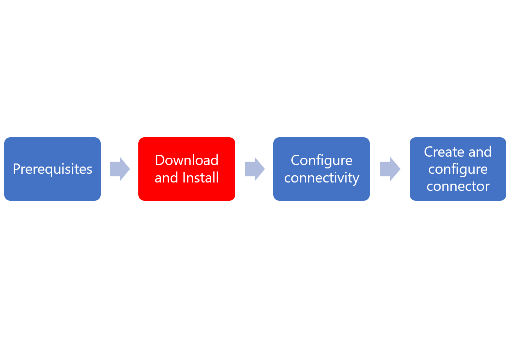

# Installation of the Azure AD ECMA Connector Host
The Azure AD ECMA Connector Host is included and part of the Azure AD Connect Provisioning Agent Package.  The provisioning agent and Azure AD ECMA Connector Host are two separate windows services that are installed using one installer, deployed on the same machine. 

Installing and configuring the Azure AD ECMA Connector Host is a process.  Use the flow below to guide you through the process.

   

For more installation and configuration information see:
   - [Prerequisites for the Azure AD ECMA Connector Host](on-prem-ecma-prerequisites.md)
   - [Configure the Azure AD ECMA Connector Host and the provisioning agent](on-prem-ecma-configure.md)
    - [Azure AD ECMA Connector Host generic SQL connector configuration](on-prem-sql-connector-configure.md)

## Download and install the Azure AD Connect Provisioning Agent Package

 1. Sign into the Azure portal
 2. Navigate to enterprise applications > Add a new application
 3. Search for the "On-premises provisioning" application and add it to your tenant image
 4. Navigate to the provisioning blade
 5. Click on on-premises connectivity
 6.  Download the agent installer
 7. Run the Azure AD Connect provisioning installer AADConnectProvisioningAgentSetup.msi.
 8. On the **Microsoft Azure AD Connect Provisioning Agent Package** screen, accept the licensing terms and select **Install**.
    
 9. After this operation finishes, the configuration wizard starts. Click **Next**.
    
 10. On the **Select Extension** screen, select **On-premises application provisioning (Azure AD to application)** and click **Next**. 
    
 12. Use your global administrator account and sign in to Azure AD.
      
 13.  On the **Agent Configuration** screen, click **Confirm**.
      
 14.  Once the installation is complete, you should see a message at the bottom of the wizard.  Click **Finish**.
      
 15. Click **Close**.

Now that the agent package has been successfully installed, you will need to configure the Azure AD ECMA Connector Host and create or import connectors.  
## Next Steps

- [App provisioning](user-provisioning.md)
- [Azure AD ECMA Connector Host prerequisites](on-prem-ecma-prerequisites.md)
- [Azure AD ECMA Connector Host configuration](on-prem-ecma-configure.md)
- [Generic SQL Connector](on-prem-sql-connector-configure.md)
