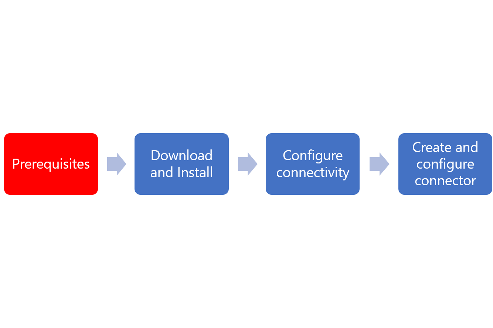

# Prerequisites for the Azure AD ECMA Connector Host
This article provides guidance on the prerequisites that are needed for using the Azure AD ECMA Connector Host.  

Installing and configuring the Azure AD ECMA Connector Host is a process. Use the flow below to guide you through the process.

   

## On-premises pre-requisites
 - A target system, such as a SQL database, or LDAP directory (excluding AD DS), in which users can be created, updated, and deleted.
 - An ECMA 2.0 or later connector for that target system, which supports export, schema retrieval, and optionally full import or delta import operations. If you do not have an ECMA Connector ready during configuration, then you can still validate the end-to-end flow if you have a SQL Server in your environment and use the Generic SQL Connector.
 - A Windows Server 2016 or later computer with an Internet-accessible TCP/IP address, connectivity to the target system, and with outbound connectivity to login.microsoftonline.com (for example, a Windows Server 2016 virtual machine hosted in Azure IaaS or behind a proxy). The server should have at least 3 GB of RAM.
 - A computer with .NET Framework 4.7.1

## Cloud requirements

 - An Azure AD tenant with Azure AD Premium P1 or Premium P2 (or EMS E3 or E5). 
    [!INCLUDE [active-directory-p1-license.md](../../../includes/active-directory-p1-license.md)]

 - An Azure AD tenant with Azure AD Premium P1 or Premium P2 (or EMS E3 or E5). You can get a free developer test tenant here. The tenant where the preview is being configured cannot be located in one of the European Union , European Economic Area , candidate for inclusion in the European Union, China , or **Switzerland ** country/regions. Tenants that are deployed in Azure Government, China, or other specialized cloud are not currently available for use in this preview. A list of country/regions that are not currently available for use in this preview as well as instructions to check the country or region that your tenant is in, is included in Appendix C. (This restriction will be removed at a later date.) The ECMA connector host preview is not intended for use with production target systems, this tenant should hold only simulated/test data.

## Next Steps

- [App provisioning](user-provisioning.md)
- [Azure AD ECMA Connector Host installation](on-prem-ecma-install.md)
- [Azure AD ECMA Connector Host configuration](on-prem-ecma-configure.md)
- [Generic SQL Connector](on-prem-sql-connector-configure.md)