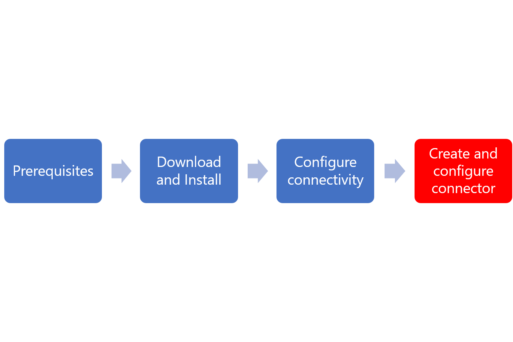

# Azure AD ECMA Connector Host generic SQL configuration

This document describes how to create a new SQL connector with the Azure AD ECMA Connector Host and how to configure it.  You will need to do this once you have successfully installed Azure AD ECMA Connector Host.  

Installing and configuring the Azure AD ECMA Connector Host is a process. Use the flow below to guide you through the process.

   

Depending on the options you select, some of the wizard screens may or may not be available and the information may be slightly different.  For purposes of this configuration, the user object type is used. Use the information below to guide you in your configuration.

## Create a generic SQL connector

To create a generic SQL connector use the following steps:

 1.  Click on the ECMA Connector Host shortcut on the desktop.
 2.  Select **New Connector**.
     

 3. On the **Properties** page, fill in the boxes and click next.  Use the table below the image for guidance on the individual boxes.
     

     |Property|Description|
     |-----|-----|
     |Name|The name for this connector|
     |Autosync timer (minutes)|Minimum allowed is 120 minutes.|
     |Secret Token|123456 [This must be a string of 10-20 ASCII letters and/or digits.]|
     |Description|The description of the connector|
     |Extension DLL|For a generic sql connector, select Microsoft.IAM.Connector.GenericSql.dll.|
 4. On the **Connectivity** page, fill in the boxes and click next.  Use the table below the image for guidance on the individual boxes.
     

     |Property|Description|
     |-----|-----|
     |DSN File|The Data Source Name file used to connect to the SQL server|
     |User Name|The username of an individual with rights to the SQL server.  This must be in the form of hostname\sqladminaccount for standalone servers, or domain\sqladminaccount for domain member servers.|
     |Password|The password of the username provided above.|
     |DN is Anchor|Unless the your environment is known to require these settings, leave DN is Anchor and Export Type:Object Replace deselected.|
     |Export TypeObjectReplace||
 5. On the **Schema 1** page, fill in the boxes and click next.  Use the table below the image for guidance on the individual boxes.
     

     |Property|Description|
     |-----|-----|
     |Object type detection method|The method used to detect the object type the connector will be provisioning.|
     |Fixed value list/Table/View/SP|This should contain User.|
     |Column Name for Table/View/SP||
     |Stored Procedure Parameters||
     |Provide SQL query for detecting object types||
 6. On the **Schema 2** page, fill in the boxes and click next.  Use the table below the image for guidance on the individual boxes.  This schema screen maybe slightly different or have additional information depending on the object types that were selected in the previous step.
     

     |Property|Description|
     |-----|-----|
     |User:Attribute Detection|This should be set to Table.|
     |User:Table/View/SP|his should contain Employees.|
     |User:Name of Multi-Values Table/Views||
     |User:Stored Procedure Parameters||
     |User:Provide SQL query for detecting object types||
 7. On the **Schema 3** page, fill in the boxes and click next.  Use the table below the image for guidance on the individual boxes.  The attributes that you see will depend on the information provided in the previous step.
     

     |Property|Description|
     |-----|-----|
     |Select DN attribute for User||
 8. On the **Schema 4** page, review the attributes DataType and the Direction of flow for the connector.  You can adjust them if needed and click Next.
       
 9. On the **Global** page, fill in the boxes and click next.  Use the table below the image for guidance on the individual boxes.
     

     |Property|Description|
     |-----|-----|
     |Water Mark Query||
     |Data Source Time Zone|Select the time zone that the data source is located in.|
     |Data Source Date Time Format|Specify the format for the data source.|
     |Use named parameters to execute a stored procedure||
     |Operation Methods||
     |Extension Name||
     |Set Password SP Name||
     |Set Password SP Parameters||
 10. On the **Select partition** page, ensure that the correct partitions are selected and click Next.
       

 11. On the **Run Profiles** page, select the run profiles that you wish to use and click Next.
     

     |Property|Description|
     |-----|-----|
     |Export|Run profile that will export data to SQL.  This run profile is required.|
     |Full import|Run profile that will import all data from SQL sources specified earlier.|
     |Delta import|Run profile that will import only changes from SQL since the last full or delta import.|
 
 12. On the **Run Profiles** page, fill in the boxes and click next.  Use the table below the image for guidance on the individual boxes. 
     

     |Property|Description|
     |-----|-----|
     |Operation Method||
     |Table/View/SP||
     |Start Index Parameter Name||
     |End Index Parameter Name||
     |Stored Procedure Parameters||
 
 13. On the **Object Types** page, fill in the boxes and click next.  Use the table below the image for guidance on the individual boxes. 
     

     |Property|Description|
     |-----|-----|
     |Target Object|The object that you are configuring.|
     |Anchor|The attribute that will be used as the objects anchor.  This attribute should be uniqie in the target system. The Azure AD provisioning service will query the ECMA host using this attribute after the initial cycle. This anchor value should be the same as the anchor value in schema 3.|
     |Query attribute|Used by the ECMA host to query the in-memory cache. This attribute should be unique.|
     |DN|The attribute that is used for the target objects distinguished name.  The autogenerate option should be selected in most cases. If deselected, ensure that the DN attribute is mapped to an attribute in Azure AD that stores the DN in this format: CN = anchorValue, Object = objectType|
 
 14. The ECMA host discovers the attributes supported by the target system. You can choose which of those attributes you would like to expose to Azure AD. These attributes can then be configured in the Azure Portal for provisioning.  On the **Select Attributes** page, select attributes from the drop-down to add. 
     

15. On the **Deprovisioning** page, review the deprovisionig information and make adjustments as necessary. Click Finish.
     

## Next Steps

- [App provisioning](user-provisioning.md)
