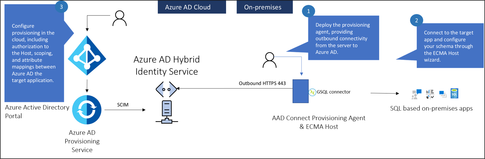
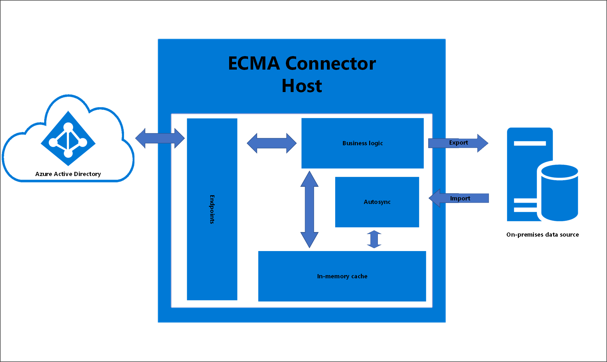
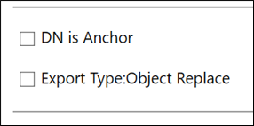
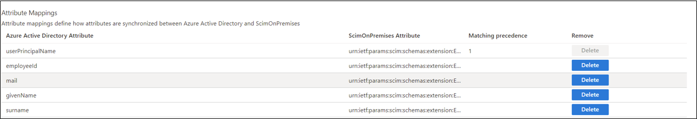

# Microsoft Entra on-premises application identity provisioning architecture 

## Overview

The following diagram shows an overview of how on-premises application provisioning works.



There are three primary components to provisioning users into an on-premises application:

- The provisioning agent provides connectivity between Microsoft Entra ID and your on-premises environment.
- The ECMA host converts provisioning requests from Microsoft Entra ID to requests made to your target application. It serves as a gateway between Microsoft Entra ID and your application. You can use it to import existing ECMA2 connectors used with Microsoft Identity Manager. The ECMA host isn't required if you've built a SCIM application or SCIM gateway.
- The Microsoft Entra provisioning service serves as the synchronization engine.

>[!NOTE]
> Microsoft Identity Manager Synchronization isn't required. But you can use it to build and test your ECMA connector before you import it into the ECMA host.


> [!VIDEO https://www.youtube.com/embed/QdfdpaFolys]

### Firewall requirements

You don't need to open inbound connections to the corporate network. The provisioning agents only use outbound connections to the provisioning service, which means there's no need to open firewall ports for incoming connections. You also don't need a perimeter (DMZ) network because all connections are outbound and take place over a secure channel.

The required outbound endpoints for the provisioning agents are detailed [here](../hybrid/cloud-sync/how-to-prerequisites.md#firewall-and-proxy-requirements).

## ECMA Connector Host architecture
The ECMA Connector Host has several areas it uses to achieve on-premises provisioning.  The diagram below is a conceptual drawing that presents these individual areas.  The table below describes the areas in more detail.

[](./media/on-premises-application-provisioning-architecture/ecma-2.png#lightbox)


|Area|Description|
|-----|-----|
|Endpoints|Responsible for communication and data-transfer with the Microsoft Entra provisioning service|
|In-memory cache|Used to store the data imported from the on-premises data source|
|Autosync|Provides asynchronous data synchronization between the ECMA Connector Host and the on-premises data source|
|Business logic|Used to coordinate all of the ECMA Connector Host activities.  The Autosync time is configurable in the ECMA host. This is in the properties page.|

### About anchor attributes and distinguished names
The following information is provided to better explain the anchor attributes and the distinguished names, particularly used by the genericSQL connector.

The anchor attribute is a unique attribute of an object type that does not change and represents that object in the ECMA Connector Host in-memory cache.

The distinguished name (DN) is a name that uniquely identifies an object by indicating its current location in the directory hierarchy.  Or in the case of SQL, in the partition. The name is formed by concatenating the anchor attribute at the root of the directory partition. 

When we think of traditional DNs in a traditional format, for say, Active Directory or LDAP, we think of something similar to:

  `CN=Lola Jacobson,CN=Users,DC=contoso,DC=com`

However, for a data source such as SQL, which is flat, not hierarchical, the DN needs to be either already present in one of the tables or created from the information we provide to the ECMA Connector Host.  

This can be achieved by checking **Autogenerated** in the checkbox when configuring the genericSQL connector. When you choose DN to be autogenerated, the ECMA host will generate a DN in an LDAP format: CN=&lt;anchorvalue&gt;,OBJECT=&lt;type&gt;. This also assumes that the DN is Anchor **unchecked** in the Connectivity page. 
 
 [](./media/on-premises-application-provisioning-architecture/user-2.png#lightbox)

The genericSQL connector expects the DN to be populated using an LDAP format.  The Generic SQL connector is using the LDAP style with the component name "OBJECT=". This allows it to use partitions (each object type is a partition).

Since ECMA Connector Host currently only supports the USER object type, the OBJECT=&lt;type&gt; will be OBJECT=USER.  So the DN for a user with an anchorvalue of ljacobson would be:

  CN=ljacobson,OBJECT=USER


### User creation workflow

1.  The Microsoft Entra provisioning service queries the ECMA Connector Host to see if the user exists.  It uses the **matching attribute** as the filter.  This attribute is defined in the Azure portal under Enterprise applications -> On-premises provisioning -> provisioning -> attribute matching.  It is denoted by the 1 for matching precedence.
You can define one or more matching attribute(s) and prioritize them based on the precedence.  Should you want to change the matching attribute you can also do so.
 [](./media/on-premises-application-provisioning-architecture/match-1.png#lightbox)

2.  ECMA Connector Host receives the GET request and queries its internal cache to see if the user exists and has based imported.  This is done using the matching attribute(s) above. If you define multiple matching attributes, the Microsoft Entra provisioning service will send a GET request for each attribute and the ECMA host will check its cache for a match until it finds one.   

3. If the user does not exist, Microsoft Entra ID will make a POST request to create the user.  The ECMA Connector Host will respond back to Microsoft Entra ID with the HTTP 201 and provide an ID for the user. This ID is derived from the anchor value defined in the object types page. This anchor will be used by Microsoft Entra ID to query the ECMA Connector Host for future and subsequent requests. 
4. If a change happens to the user in Microsoft Entra ID, then Microsoft Entra ID will make a GET request to retrieve the user using the anchor from the previous step, rather than the matching attribute in step 1. This allows, for example, the UPN to change without breaking the link between the user in Microsoft Entra ID and in the app.  


## Agent best practices
- Using the same agent for the on-premises provisioning feature along with Workday / SuccessFactors / Microsoft Entra Connect Cloud Sync is currently unsupported. We are actively working to support on-premises provisioning on the same agent as the other provisioning scenarios.
- - Avoid all forms of inline inspection on outbound TLS communications between agents and Azure. This type of inline inspection causes degradation to the communication flow.
- The agent must communicate with both Azure and your application, so the placement of the agent affects the latency of those two connections. You can minimize the latency of the end-to-end traffic by optimizing each network connection. Each connection can be optimized by:
  - Reducing the distance between the two ends of the hop.
  - Choosing the right network to traverse. For example, traversing a private network rather than the public internet might be faster because of dedicated links.
- The agent and ECMA Host rely on a certificate for communication. The self-signed certificate generated by the ECMA host should only be used for testing purposes. The self-signed certificate expires in two years by default and cannot be revoked. Microsoft recommends using a certificate from a trusted CA for production use cases.  


## Provisioning agent questions
Some common questions are answered here.

### How do I know the version of my provisioning agent?

 1. Sign in to the Windows server where the provisioning agent is installed.
 2. Go to **Control Panel** > **Uninstall or Change a Program**.
 3. Look for the version that corresponds to the entry for **Microsoft Entra Connect Provisioning Agent**.

<a name='can-i-install-the-provisioning-agent-on-the-same-server-running-azure-ad-connect-or-microsoft-identity-manager'></a>

### Can I install the provisioning agent on the same server running Microsoft Entra Connect or Microsoft Identity Manager?

Yes. You can install the provisioning agent on the same server that runs Microsoft Entra Connect or Microsoft Identity Manager, but they aren't required.

### How do I configure the provisioning agent to use a proxy server for outbound HTTP communication?

The provisioning agent supports use of outbound proxy. You can configure it by editing the agent config file **C:\Program Files\Microsoft Azure AD Connect Provisioning Agent\AADConnectProvisioningAgent.exe.config**. Add the following lines into it toward the end of the file just before the closing `</configuration>` tag. Replace the variables `[proxy-server]` and `[proxy-port]` with your proxy server name and port values.

```
    <system.net>
        <defaultProxy enabled="true" useDefaultCredentials="true">
            <proxy
                usesystemdefault="true"
                proxyaddress="http://[proxy-server]:[proxy-port]"
                bypassonlocal="true"
            />
        </defaultProxy>
    </system.net>
```
<a name='how-do-i-ensure-the-provisioning-agent-can-communicate-with-the-azure-ad-tenant-and-no-firewalls-are-blocking-ports-required-by-the-agent'></a>

### How do I ensure the provisioning agent can communicate with the Microsoft Entra tenant and no firewalls are blocking ports required by the agent?

You can also check whether all the required ports are open.

### How do I uninstall the provisioning agent?
 1. Sign in to the Windows server where the provisioning agent is installed.
 2. Go to **Control Panel** > **Uninstall or Change a Program**.
 3. Uninstall the following programs:
     - Microsoft Entra Connect Provisioning Agent
     - Microsoft Entra Connect Agent Updater
     - Microsoft Entra Connect Provisioning Agent Package

## Provisioning agent history
This article lists the versions and features of Microsoft Entra Connect Provisioning Agent that have been released. The Microsoft Entra ID team regularly updates the Provisioning Agent with new features and functionality. Please ensure that you do not use the same agent for on-premises provisioning and Cloud Sync / HR-driven provisioning.

Microsoft provides direct support for the latest agent version and one version before.

### Download link
On-premises app provisioning has been rolled into the provisioning agent and is available from the portal.  See [installing the provisioning agent](../hybrid/cloud-sync/how-to-install.md).

### 1.1.892.0 

May 20th, 2022 - released for download

#### Fixed issues

- We added support for exporting changes to integer attributes, which benefits customers using the generic LDAP connector.

### 1.1.846.0

April 11th, 2022 - released for download

#### Fixed issues

- We added support for ObjectGUID as an anchor for the generic LDAP connector when provisioning users into AD LDS. 


## Next steps

- [App provisioning](user-provisioning.md)
