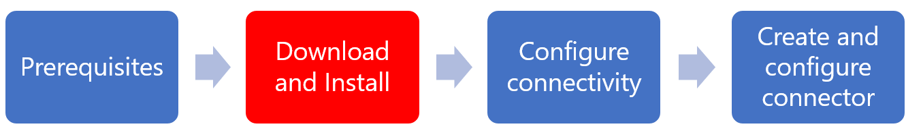
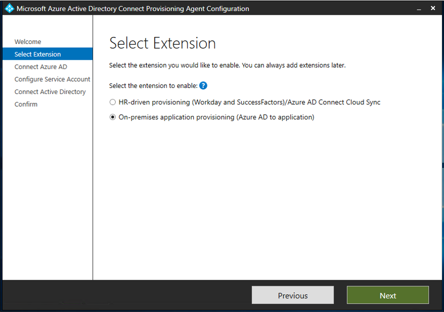

# Installation of the Azure AD ECMA Connector Host

>[!IMPORTANT]
> The on-premises provisioning preview is currently in an invitation-only preview. To request access to the capability, use the [access request form](https://aka.ms/onpremprovisioningpublicpreviewaccess). We'll open the preview to more customers and connectors over the next few months as we prepare for general availability.

The Azure Active Directory (Azure AD) ECMA Connector Host is included as part of the Azure AD Connect Provisioning Agent Package. The provisioning agent and Azure AD ECMA Connector Host are two separate Windows services. They're installed by using one installer, which is deployed on the same machine.

This flow guides you through the process of installing and configuring the Azure AD ECMA Connector Host.

 

For more installation and configuration information, see:

   - [Prerequisites for the Azure AD ECMA Connector Host](on-premises-ecma-prerequisites.md)
   - [Configure the Azure AD ECMA Connector Host and the provisioning agent](on-premises-ecma-configure.md)
   - [Azure AD ECMA Connector Host generic SQL connector configuration](on-premises-sql-connector-configure.md)

## Download and install the Azure AD Connect Provisioning Agent Package

 1. Sign in to the Azure portal.
 1. Go to **Enterprise applications** > **Add a new application**.
 1. Search for the **On-premises provisioning** application, and add it to your tenant image.
 1. Go to the **Provisioning** pane.
 1. Select **On-premises connectivity**.
 1. Download the agent installer.
 1. Run the Azure AD Connect provisioning installer **AADConnectProvisioningAgentSetup.msi**.
 1. On the **Microsoft Azure AD Connect Provisioning Agent Package** screen, accept the licensing terms, and select **Install**.
 
     
 1. After this operation finishes, the configuration wizard starts. Select **Next**.
 
     

 1. On the **Select Extension** screen, select **On-premises application provisioning (Azure AD to application)**. Select **Next**. 
 
     
 1. Use your global administrator account to sign in to Azure AD.
 
      
 1. On the **Agent configuration** screen, select **Confirm**.
 
      
 1. After the installation is complete, you should see a message at the bottom of the wizard. Select **Exit**.
 
      
 

Now that the agent package has been successfully installed, you need to configure the Azure AD ECMA Connector Host and create or import connectors.
 
## Next steps

- [Azure AD ECMA Connector Host prerequisites](on-premises-ecma-prerequisites.md)
- [Azure AD ECMA Connector Host configuration](on-premises-ecma-configure.md)
- [Generic SQL connector](on-premises-sql-connector-configure.md)
