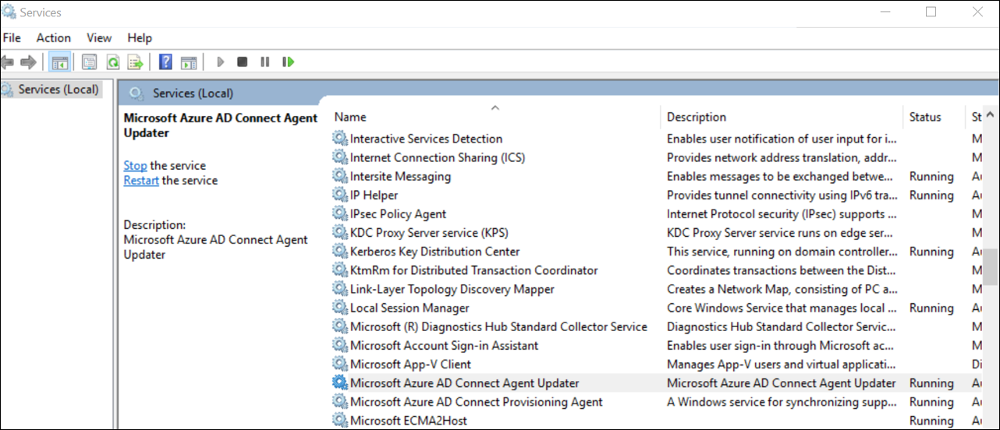
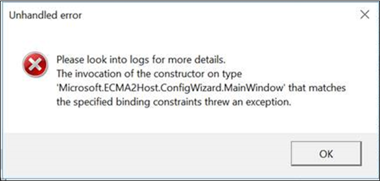
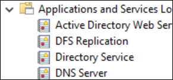
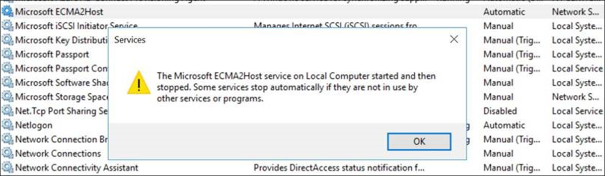
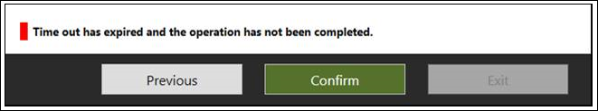

# Troubleshoot on-premises application provisioning

## Troubleshoot test connection issues
After you configure the provisioning agent and ECMA host, it's time to test connectivity from the Azure Active Directory (Azure AD) provisioning service to the provisioning agent, the ECMA host, and the application. To perform this end-to-end test, select **Test connection** in the application in the Azure portal. When the test connection fails, try the following troubleshooting steps:

 1. Check that the agent and ECMA host are running:
     1. On the server with the agent installed, open **Services** by going to **Start** > **Run** > **Services.msc**.
     2. Under **Services**, make sure the **Microsoft Azure AD Connect Provisioning Agent**, and **Microsoft ECMA2Host** services are present and their status is *Running*.
    
        

 2. Go to the folder where the ECMA host was installed by selecting **Troubleshooting** > **Scripts** > **TestECMA2HostConnection**. Run the script. This script sends a SCIM GET or POST request to validate that the ECMA Connector Host is operating and responding to requests. It should be run on the same computer as the ECMA Connector Host service itself.
 3. Ensure that the agent is active by going to your application in the Azure portal, selecting **admin connectivity**, selecting the agent dropdown list, and ensuring your agent is active.
 4. Check if the secret token provided is the same as the secret token on-premises. Go to on-premises, provide the secret token again, and then copy it into the Azure portal.
 5. Ensure that you've assigned one or more agents to the application in the Azure portal.
 6. After you assign an agent, you need to wait 10 to 20 minutes for the registration to complete. The connectivity test won't work until the registration completes.
 7. Ensure that you're using a valid certificate. Go to the **Settings** tab of the ECMA host to generate a new certificate.
 8. Restart the provisioning agent by going to the taskbar on your VM by searching for the Microsoft Azure AD Connect provisioning agent. Right-click **Stop**, and then select **Start**.
 9. When you provide the tenant URL in the Azure portal, ensure that it follows the following pattern. You can replace `localhost` with your host name, but it isn't required. Replace `connectorName` with the name of the connector you specified in the ECMA host. The error message 'invalid resource' generally indicates that the URL does not follow the expected format.
 
    ```
    https://localhost:8585/ecma2host_connectorName/scim
    ```

## Unable to configure the ECMA host, view logs in Event Viewer, or start the ECMA host service

To resolve the following issues, run the ECMA host as an admin:

* I get an error when I open the ECMA host wizard.

   

* I can configure the ECMA host wizard, but I can't see the ECMA host logs. In this case, you need to open the host as an admin and set up a connector end to end. This step can be simplified by exporting an existing connector and importing it again. 

   

* I can configure the ECMA host wizard, but I can't start the ECMA host service.

   


## Turn on verbose logging 

By default, `switchValue` for the ECMA Connector Host is set to `Verbose`. This will emit detailed logging that will help you troubleshoot issues. You can change the verbosity to `Error` if you would like to limit the number of logs emitted to only errors. Wen using the SQL connector without Windows Integrated Auth, we recommend setting the `switchValue` to `Error` as it will ensure that the connection string is not emitted in the logs. In order to change the verbosity to error, please update the `switchValue` to "Error" in both places as shown below.

The file location for verbose service logging is C:\Program Files\Microsoft ECMA2Host\Service\Microsoft.ECMA2Host.Service.exe.config.
  ```
  <?xml version="1.0" encoding="utf-8"?> 
  <configuration> 
      <startup>  
          <supportedRuntime version="v4.0" sku=".NETFramework,Version=v4.6" /> 
      </startup> 
      <appSettings> 
        <add key="Debug" value="true" /> 
      </appSettings> 
      <system.diagnostics> 
        <sources> 
      <source name="ConnectorsLog" switchValue="Error"> 
            <listeners> 
              <add initializeData="ConnectorsLog" type="System.Diagnostics.EventLogTraceListener, System, Version=2.0.0.0, Culture=neutral, PublicKeyToken=b77a5c561934e089" name="ConnectorsLog" traceOutputOptions="LogicalOperationStack, DateTime, Timestamp, Callstack"> 
                <filter type=""/> 
              </add> 
            </listeners> 
          </source> 
          <!-- Choose one of the following switchTrace:  Off, Error, Warning, Information, Verbose --> 
          <source name="ECMA2Host" switchValue="Error"> 
            <listeners>  
              <add initializeData="ECMA2Host" type="System.Diagnos
  ```

The file location for wizard logging is C:\Program Files\Microsoft ECMA2Host\Wizard\Microsoft.ECMA2Host.ConfigWizard.exe.config.
  ```
        <source name="ConnectorsLog" switchValue="Error"> 
          <listeners> 
            <add initializeData="ConnectorsLog" type="System.Diagnostics.EventLogTraceListener, System, Version=2.0.0.0, Culture=neutral, PublicKeyToken=b77a5c561934e089" name="ConnectorsLog" traceOutputOptions="LogicalOperationStack, DateTime, Timestamp, Callstack"> 
              <filter type=""/> 
            </add> 
          </listeners> 
        </source> 
        <!-- Choose one of the following switchTrace:  Off, Error, Warning, Information, Verbose --> 
        <source name="ECMA2Host" switchValue="Error"> 
          <listeners> 
            <add initializeData="ECMA2Host" type="System.Diagnostics.EventLogTraceListener, System, Version=4.0.0.0, Culture=neutral, PublicKeyToken=b77a5c561934e089" name="ECMA2HostListener" traceOutputOptions="LogicalOperationStack, DateTime, Timestamp, Callstack" /> 
  ```
## Query the ECMA Host Cache

The ECMA Host has a cache of users in your application that is updated according to the schedule you specify in the properties page of the ECMA Host wizard. In order to query the cache, perform the steps below:
1. Set the Debug flag to `true`.
2. Restart the ECMA Host service.
3. Query this endpoint from the server the ECMA Host is installed on, replacing  `{connector name}` with the name of your connector, specified in the properties page of the ECMA Host.  `https://localhost:8585/ecma2host_{connectorName}/scim/cache`

Please be aware that setting the debug flag to  `true` disables authentication on the ECMA Host. You will want to set it back to `false` and restart the ECMA Host service once you are done querying the cache. 

The file location for verbose service logging is C:\Program Files\Microsoft ECMA2Host\Service\Microsoft.ECMA2Host.Service.exe.config.
  ```
  <?xml version="1.0" encoding="utf-8"?> 
  <configuration> 
      <startup>  
          <supportedRuntime version="v4.0" sku=".NETFramework,Version=v4.6" /> 
      </startup> 
      <appSettings> 
        <add key="Debug" value="true" /> 
      </appSettings> 

  ```
## Target attribute is missing 
The provisioning service automatically discovers attributes in your target application. If you see that a target attribute is missing in the target attribute list in the Azure portal, perform the following troubleshooting step:

 1. Review the **Select Attributes** page of your ECMA host configuration to check that the attribute has been selected to be exposed to the Azure portal.
 1. Ensure that the ECMA host service is turned on. 
 1. Review the ECMA host logs to check that a /schemas request was made, and review the attributes in the response. This information will be valuable for support to troubleshoot the issue.

## Collect logs from Event Viewer as a zip file

Go to the folder where the ECMA host was installed by selecting **Troubleshooting** > **Scripts**. Run the `CollectTroubleshootingInfo` script as an admin. You can use it to capture the logs in a zip file and export them.

## Review events in Event Viewer

After the ECMA Connector Host schema mapping has been configured, start the service so it will listen for incoming connections. Then, monitor for incoming requests.

  1. Select the **Start** menu, enter **event viewer**, and select **Event Viewer**. 
  1. In **Event Viewer**, expand **Applications and Services** logs, and select **Microsoft ECMA2Host Logs**. 
  1. As changes are received by the connector host, events will be written to the application log. 

### Common errors

| Error      | Resolution |
| ----------- | ----------- |
| Could not load file or assembly 'file:///C:\Program Files\Microsoft ECMA2Host\Service\ECMA\Cache\8b514472-c18a-4641-9a44-732c296534e8\Microsoft.IAM.Connector.GenericSql.dll' or one of its dependencies. Access is denied.      | Ensure that the network service account has 'full control' permissions over the cache folder. |
| Invalid LDAP style of object's DN. DN: username@domain.com"   | Ensure the 'DN is Anchor' checkbox is not checked in the 'connectivity' page of the ECMA host. Ensure the 'autogenerated' checkbox is selected in the 'object types' page of the ECMA host.  See [About anchor attributes and distinguished names](on-premises-application-provisioning-architecture.md#about-anchor-attributes-and-distinguished-names) for more information.|

## Understand incoming SCIM requests

Requests made by Azure AD to the provisioning agent and connector host use the SCIM protocol. Requests made from the host to apps use the protocol the app supports. The requests from the host to the agent to Azure AD rely on SCIM. You can learn more about the SCIM implementation in [Tutorial: Develop and plan provisioning for a SCIM endpoint in Azure Active Directory](use-scim-to-provision-users-and-groups.md).

At the beginning of each provisioning cycle, before performing on-demand provisioning and when doing the test connection, the Azure AD provisioning service generally makes a get-user call for a [dummy user](use-scim-to-provision-users-and-groups.md#request-3) to ensure the target endpoint is available and returning SCIM-compliant responses. 


## How do I troubleshoot the provisioning agent?
You might experience the following error scenarios.

### Agent failed to start

You might receive an error message that states:

"Service 'Microsoft Azure AD Connect Provisioning Agent' failed to start. Check that you have sufficient privileges to start the system services." 

This problem is typically caused by a group policy that prevented permissions from being applied to the local NT Service sign-in account created by the installer (NT SERVICE\AADConnectProvisioningAgent). These permissions are required to start the service.

To resolve this problem:

 1. Sign in to the server with an administrator account.
 2. Open **Services** by either navigating to it or by going to **Start** > **Run** > **Services.msc**.
 3. Under **Services**, double-click **Microsoft Azure AD Connect Provisioning Agent**.
 4. On the **Log On** tab, change **This account** to a domain admin. Then restart the service. 

This test verifies that your agents can communicate with Azure over port 443. Open a browser, and go to the previous URL from the server where the agent is installed.

### Agent times out or certificate is invalid

You might get the following error message when you attempt to register the agent.



This problem is usually caused by the agent being unable to connect to the Hybrid Identity Service and requires you to configure an HTTP proxy. To resolve this problem, configure an outbound proxy. 

The provisioning agent supports use of an outbound proxy. You can configure it by editing the agent config file *C:\Program Files\Microsoft Azure AD Connect Provisioning Agent\AADConnectProvisioningAgent.exe.config*.
Add the following lines into it, toward the end of the file just before the closing `</configuration>` tag.
Replace the variables `[proxy-server]` and `[proxy-port]` with your proxy server name and port values.

```xml
    <system.net>
        <defaultProxy enabled="true" useDefaultCredentials="true">
            <proxy
                usesystemdefault="true"
                proxyaddress="http://[proxy-server]:[proxy-port]"
                bypassonlocal="true"
            />
        </defaultProxy>
    </system.net>
```
### Agent registration fails with security error

You might get an error message when you install the cloud provisioning agent.

This problem is typically caused by the agent being unable to execute the PowerShell registration scripts because of local PowerShell execution policies.

To resolve this problem, change the PowerShell execution policies on the server. You need to have Machine and User policies set as *Undefined* or *RemoteSigned*. If they're set as *Unrestricted*, you'll see this error. For more information, see [PowerShell execution policies](/powershell/module/microsoft.powershell.core/about/about_execution_policies). 

### Log files

By default, the agent emits minimal error messages and stack trace information. You can find trace logs in the folder C:\ProgramData\Microsoft\Azure AD Connect Provisioning Agent\Trace.

To gather more information for troubleshooting agent-related problems:

 1. Install the AADCloudSyncTools PowerShell module as described in [AADCloudSyncTools PowerShell Module for Azure AD Connect cloud sync](../../active-directory/cloud-sync/reference-powershell.md#install-the-aadcloudsynctools-powershell-module).
 2. Use the `Export-AADCloudSyncToolsLogs` PowerShell cmdlet to capture the information. Use the following switches to fine-tune your data collection. Use:

      - **SkipVerboseTrace** to only export current logs without capturing verbose logs (default = false).
      - **TracingDurationMins** to specify a different capture duration (default = 3 mins).
      - **OutputPath** to specify a different output path (default = user's documents).

---------------------

By using Azure AD, you can monitor the provisioning service in the cloud and collect logs on-premises. The provisioning service emits logs for each user that was evaluated as part of the synchronization process. Those logs can be consumed through the [Azure portal UI, APIs, and log analytics](../reports-monitoring/concept-provisioning-logs.md). The ECMA host also generates logs on-premises. It shows each provisioning request that was received and the response that was sent to Azure AD.

### Agent installation fails
* The error `System.ComponentModel.Win32Exception: The specified service already exists` indicates that the previous ECMA host was unsuccessfully uninstalled. Uninstall the host application. Go to program files, and remove the ECMA host folder. You might want to store the configuration file for backup. 
* The following error indicates a prerequisite wasn't fulfilled. Ensure that you have .NET 4.7.1 installed.

  ```
    Method Name : <>c__DisplayClass0_1 : 
    RegisterNotLoadedAssemblies Error during load assembly: System.Management.Automation.resources.dll
    --------- Outer Exception Data ---------
    Message: Could not load file or assembly 'file:///C:\Program Files\Microsoft ECMA2Host\Service\ECMA\System.Management.Automation.resources.dll' or one of its dependencies. The system cannot find the file specified.

  ```

### I am getting an Invalid LDAP style DN error when trying to configure the ECMA Connector Host with SQL
By default, the genericSQL connector expects the DN to be populated using the LDAP style (when the 'DN is anchor' attribute is left unchecked in the first connectivity page). In the error message above, you can see that the DN is a UPN, rather than an LDAP style DN that the connector expects. 

To resolve this, ensure that **Autogenerated** is selected on the object types page when you configure the connector.

See [About anchor attributes and distinguished names](on-premises-application-provisioning-architecture.md#about-anchor-attributes-and-distinguished-names) for more information.

## Next steps

- [Tutorial: ECMA Connector Host generic SQL connector](tutorial-ecma-sql-connector.md)
