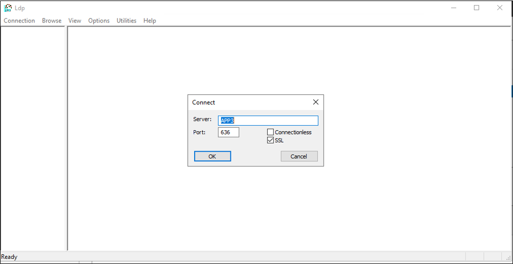

# Prepare Active Directory Lightweight Directory Services for provisioning from Microsoft Entra ID

The following documentation provides tutorial information demonstrating how to prepare an Active Directory Lightweight Directory Services (AD LDS) installation.  This can be used as an example LDAP directory for troubleshooting or to demonstrate [how to provision users from Microsoft Entra ID into an LDAP directory](on-premises-ldap-connector-configure.md).  

## Prepare the LDAP directory

If you do not already have a directory server, the following information is provided to help create a test AD LDS environment.  This setup uses PowerShell and the ADAMInstall.exe with an answers file.  This document does not cover in-depth information on AD LDS.  For more information, see [Active Directory Lightweight Directory Services](/previous-versions/windows/it-pro/windows-server-2012-r2-and-2012/hh831593(v=ws.11)).

If you already have AD LDS or another directory server, you can skip this content, and continue at the [Tutorial: ECMA Connector Host generic LDAP connector](on-premises-ldap-connector-configure.md) for installing and configuring the ECMA connector host.

### Create an SSL certificate, a test directory and install AD LDS.
Use the PowerShell script from [Appendix A](#appendix-a---install-ad-lds-powershell-script).  The script performs the following actions:
  1. Creates a self-signed certificate that will be used by the LDAP connector.
  2. Creates a directory for the feature install log.
  3. Exports the certificate in the personal store to the directory.
  4. Imports the certificate to the trusted root of the local machine.
  5. Installs the AD LDS role on our virtual machine.

On the Windows Server virtual machine where you are using to test the LDAP connector, edit the script to match your computer name, and then run the script using Windows PowerShell with administrative privileges.

### Create an instance of AD LDS
Now that the role has been installed, you need to create an instance of AD LDS.  To create an instance, you can use the answer file provided below.  This file will install the instance quietly without using the UI.

Copy the contents of [Appendix B](#appendix-b---answer-file) in to notepad and save it as **answer.txt** in **"C:\Windows\ADAM"**.

Now open a cmd prompt with administrative privileges and run the following executable:

```
C:\Windows\ADAM> ADAMInstall.exe /answer:answer.txt
```

### Create containers and a service account for AD LDS
The use the PowerShell script from [Appendix C](#appendix-c---populate-ad-lds-powershell-script).  The script performs the following actions:
  1. Creates a container for the service account that will be used with the LDAP connector.
  1. Creates a container for the cloud users, where users will be provisioned to.
  1. Creates the service account in AD LDS.
  1. Enables the service account.
  1. Adds the service account to the AD LDS Administrators role.

On the Windows Server virtual machine, you are using to test the LDAP connector run the script using Windows PowerShell with administrative privileges.  

### Grant the NETWORK SERVICE read permissions to the SSL certificate
In order to enable SSL to work, you need to grant the NETWORK SERVICE read permissions to our newly created certificate.  To grant permissions, use the following steps.

 1. Navigate to **C:\Program Data\Microsoft\Crypto\Keys**.
 2. Right-click on the system file located here.  It will be a guid.  This container is storing our certificate.
    1. Select properties.
    1. At the top, select the **Security** tab.
    1. Select **Edit**.
    1. Click **Add**.
    1. In the box, enter **Network Service** and select **Check Names**.
    1. Select **NETWORK SERVICE** from the list and click **OK**.
    1. Click **Ok**.
    1. Ensure the Network service account has read and read & execute permissions and click **Apply** and **OK**.

### Verify SSL connectivity with AD LDS
Now that we have configured the certificate and granted the network service account permissions, test the connectivity to verify that it is working.
 1. Open Server Manager and select AD LDS on the left
 2. Right-click your instance of AD LDS and select ldp.exe from the pop-up.
   [](../../../includes/media/app-provisioning-ldap/ldp-1.png#lightbox)</br>
 3. At the top of ldp.exe, select **Connection** and **Connect**.
 4. Enter the following information and click **OK**.
    - Server:  APP3
    - Port: 636
    - Place a check in the SSL box
   [](../../../includes/media/app-provisioning-ldap/ldp-2.png#lightbox)</br>
 5.  You should see a response similar to the screenshot below.
   [](../../../includes/media/app-provisioning-ldap/ldp-3.png#lightbox)</br>
 6.  At the top, under **Connection** select **Bind**.
 7. Leave the defaults and click **OK**.
   [](../../../includes/media/app-provisioning-ldap/ldp-4.png#lightbox)</br>
 8. You should now, successfully bind to the instance.
   [](../../../includes/media/app-provisioning-ldap/ldp-5.png#lightbox)</br>

### Disable the local password policy
Currently, the LDAP connector provisions users with a blank password.  This provisioning will not satisfy the local password policy on our server so we are going to disable it for testing purposes.  To disable password complexity, on a non-domain-joined server, use the following steps.

>[!IMPORTANT]
>Because on-going password sync is not a feature of on-premises LDAP provisioning, Microsoft recommends that AD LDS is used specifically with federated applications, when used in conjunction with AD DS, or when updating existing users in an instance of AD LDS.

 1. On the server, click **Start**, **Run**, and then **gpedit.msc**
 2. On the **Local Group Policy editor**, navigate to Computer Configuration > Windows Settings > Security Settings > Account Policies > Password Policy
 3. On the right, double-click **Password must meet complexity requirements** and select **Disabled**.
  [](../../../includes/media/app-provisioning-ldap/local-1.png#lightbox)</br>
 5. Click **Apply** and **Ok**
 6. Close the Local Group Policy editor
 

Next, continue in the guidance to [provision users from Microsoft Entra ID into an LDAP directory](on-premises-ldap-connector-configure.md) to download and configure the provisioning agent.  

## Appendix A - Install AD LDS PowerShell script
The following PowerShell script can be used to automate the installation of Active Directory Lightweight Directory Services. You'll need to edit the script to match your environment; in particular, change `APP3` to the hostname of your computer.


```powershell
# Filename:    1_SetupADLDS.ps1
# Description: Creates a certificate that will be used for SSL and installs Active Directory Lighetweight Directory Services.
#
# DISCLAIMER:
# Copyright (c) Microsoft Corporation. All rights reserved. This 
# script is made available to you without any express, implied or 
# statutory warranty, not even the implied warranty of 
# merchantability or fitness for a particular purpose, or the 
# warranty of title or non-infringement. The entire risk of the 
# use or the results from the use of this script remains with you.
#
#
#
#
#Declare variables
$DNSName = 'APP3'
$CertLocation = 'cert:\LocalMachine\MY'
$logpath = "c:\" 
$dirname = "test"
$dirtype = "directory"
$featureLogPath = "c:\test\featurelog.txt" 

#Create a new self-signed certificate
New-SelfSignedCertificate -DnsName $DNSName -CertStoreLocation $CertLocation

#Create directory
New-Item -Path $logpath -Name $dirname -ItemType $dirtype

#Export the certificate from the local machine personal store
Get-ChildItem -Path cert:\LocalMachine\my | Export-Certificate -FilePath c:\test\allcerts.sst -Type SST

#Import the certificate in to the trusted root
Import-Certificate -FilePath "C:\test\allcerts.sst" -CertStoreLocation cert:\LocalMachine\Root


#Install AD LDS
start-job -Name addFeature -ScriptBlock { 
Add-WindowsFeature -Name "ADLDS" -IncludeAllSubFeature -IncludeManagementTools 
 } 
Wait-Job -Name addFeature 
Get-WindowsFeature | Where installed >>$featureLogPath


 ```

## Appendix B - Answer file
This file is used to automate and create an instance of AD LDS.  You will edit this file to match your environment; in particular, change `APP3` to the hostname of your server.

>[!IMPORTANT]
> This script uses the local administrator for the AD LDS service account and has its password hard-coded in the answers.  This action is for **testing only** and should never be used in a production environment.
>
> If you are installing AD LDS on a domain controller and not a member or standalone server, you will need to change the LocalLDAPPortToListenOn and LocalSSLPortToListonOn to something other than the well-known ports for LDAP and LDAP over SSL.  For example, LocalLDAPPortToListenOn=51300 and LocalSSLPortToListenOn=51301.

```
 [ADAMInstall]
 InstallType=Unique
 InstanceName=AD-APP-LDAP
 LocalLDAPPortToListenOn=389
 LocalSSLPortToListenOn=636
 NewApplicationPartitionToCreate=CN=App,DC=contoso,DC=lab
 DataFilesPath=C:\Program Files\Microsoft ADAM\AD-APP-LDAP\data
 LogFilesPath=C:\Program Files\Microsoft ADAM\AD-APP-LDAP\data
 ServiceAccount=APP3\Administrator
 ServicePassword=Pa$$Word1
 AddPermissionsToServiceAccount=Yes
 Administrator=APP3\Administrator
 ImportLDIFFiles="MS-User.LDF"
 SourceUserName=APP3\Administrator
 SourcePassword=Pa$$Word1
 ```
## Appendix C - Populate AD LDS PowerShell script
PowerShell script to populate AD LDS with containers and a service account.


```powershell
# Filename:    2_PopulateADLDS.ps1
# Description: Populates our AD LDS environment with 2 containers and a service account

# DISCLAIMER:
# Copyright (c) Microsoft Corporation. All rights reserved. This 
# script is made available to you without any express, implied or 
# statutory warranty, not even the implied warranty of 
# merchantability or fitness for a particular purpose, or the 
# warranty of title or non-infringement. The entire risk of the 
# use or the results from the use of this script remains with you.
#
#
#
#
# Create service accounts container
New-ADObject -Name "ServiceAccounts" -Type "container" -Path "CN=App,DC=contoso,DC=lab" -Server "APP3:389"
Write-Output "Creating ServiceAccounts container"

# Create cloud users container
New-ADObject -Name "CloudUsers" -Type "container" -Path "CN=App,DC=contoso,DC=lab" -Server "APP3:389"
Write-Output "Creating CloudUsers container"

# Create a new service account
New-ADUser -name "svcAccountLDAP" -accountpassword  (ConvertTo-SecureString -AsPlainText 'Pa$$1Word' -Force) -Displayname "LDAP Service Account" -server 'APP3:389' -path "CN=ServiceAccounts,CN=App,DC=contoso,DC=lab"
Write-Output "Creating service account"

# Enable the new service account
Enable-ADAccount -Identity "CN=svcAccountLDAP,CN=ServiceAccounts,CN=App,DC=contoso,DC=lab" -Server "APP3:389"
Write-Output "Enabling service account"

# Add the service account to the Administrators role
Get-ADGroup -Server "APP3:389" -SearchBase "CN=Administrators,CN=Roles,CN=App,DC=contoso,DC=lab" -Filter "name -like 'Administrators'" | Add-ADGroupMember -Members "CN=svcAccountLDAP,CN=ServiceAccounts,CN=App,DC=contoso,DC=lab"
Write-Output "Adding service accounnt to Administrators role"


 ```

## Next steps

- [Tutorial: ECMA Connector Host generic LDAP connector](on-premises-ldap-connector-configure.md)
