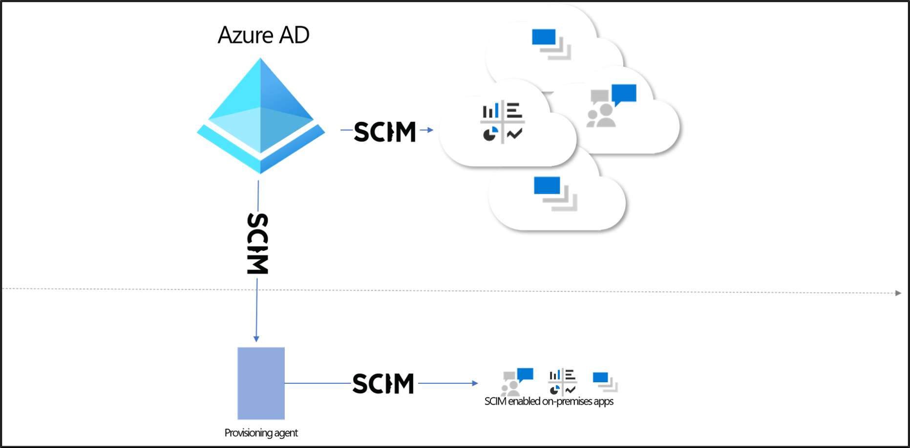
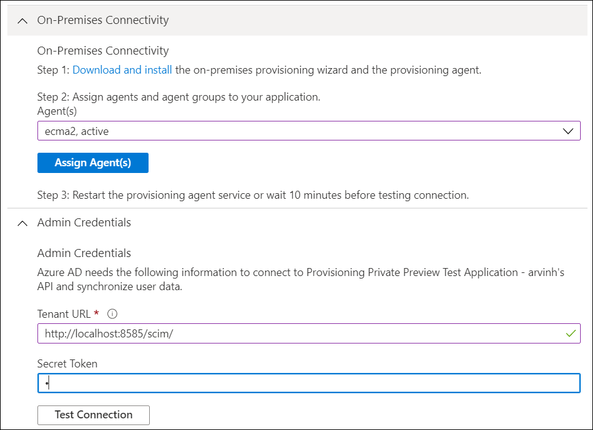

# Microsoft Entra on-premises application provisioning to SCIM-enabled apps

The Microsoft Entra provisioning service supports a [SCIM 2.0](https://techcommunity.microsoft.com/t5/security-compliance-and-identity/provisioning-with-scim-getting-started/ba-p/880010) client that can be used to automatically provision users into cloud or on-premises applications. This article outlines how you can use the Microsoft Entra provisioning service to provision users into an on-premises application that's SCIM enabled. If you want to provision users into non-SCIM on-premises applications that use SQL as a data store, see the [Microsoft Entra ECMA Connector Host Generic SQL Connector tutorial](tutorial-ecma-sql-connector.md). If you want to provision users into cloud apps such as DropBox and Atlassian, review the app-specific [tutorials](../../active-directory/saas-apps/tutorial-list.md).

## Prerequisites
- A Microsoft Entra tenant with Microsoft Entra ID P1 or Premium P2 (or EMS E3 or E5). [!INCLUDE [active-directory-p1-license.md](../../../includes/active-directory-p1-license.md)]
- Administrator role for installing the agent. This task is a one-time effort and should be an Azure account that's either a Hybrid Identity Administrator or a global administrator. 
- Administrator role for configuring the application in the cloud (application administrator, cloud application administrator, global administrator, or a custom role with permissions).
- A computer with at least 3 GB of RAM, to host a provisioning agent. The computer should have Windows Server 2016 or a later version of Windows Server, with connectivity to the target application, and with outbound connectivity to login.microsoftonline.com, other Microsoft Online Services and Azure domains. An example is a Windows Server 2016 virtual machine hosted in Azure IaaS or behind a proxy.

## Download, install, and configure the Microsoft Entra Connect Provisioning Agent Package

If you have already downloaded the provisioning agent and configured it for another on-premises application, then continue reading in the next section.

1. Sign in to the [Microsoft Entra admin center](https://entra.microsoft.com) as at least a [Hybrid Identity Administrator](../roles/permissions-reference.md#hybrid-identity-administrator).
1. Browse to **Identity** > **Hybrid management** > **Microsoft Entra Connect** > **Cloud Sync** > **Agents**.

   :::image type="content" source="../../../includes/media/active-directory-cloud-sync-how-to-install/new-ux-1.png" alt-text="Screenshot of new UX screen." lightbox="../../../includes/media/active-directory-cloud-sync-how-to-install/new-ux-1.png":::

1. Select **Download on-premises agent**, and select **Accept terms & download**.

     >[!NOTE]
     >Please use different provisioning agents for on-premises application provisioning and Microsoft Entra Connect Cloud Sync / HR-driven provisioning. All three scenarios should not be managed on the same agent. 

 1. Open the provisioning agent installer, agree to the terms of service, and select **next**.
 1. When the provisioning agent wizard opens, continue to the **Select Extension** tab and select **On-premises application provisioning** when prompted for the extension you want to enable.
 1. The provisioning agent will use the operating system's web browser to display a popup window for you to authenticate to Microsoft Entra ID, and potentially also your organization's identity provider.  If you are using Internet Explorer as the browser on Windows Server, then you may need to add Microsoft web sites to your browser's trusted site list to allow JavaScript to run correctly.
 1. Provide credentials for a Microsoft Entra administrator when you're prompted to authorize. The user is required to have the Hybrid Identity Administrator or Global Administrator role.
 1. Select **Confirm** to confirm the setting. Once installation is successful, you can select **Exit**, and also close the Provisioning Agent Package installer.
 
## Provisioning to SCIM-enabled application
Once the agent is installed, no further configuration is necessary on-premises, and all provisioning configurations are then managed from the portal. Repeat the below steps for every on-premises application being provisioned via SCIM.
 
1. Sign in to the [Microsoft Entra admin center](https://entra.microsoft.com) as at least a [Application Administrator](../roles/permissions-reference.md#application-administrator).
1. Browse to **Identity** > **Applications** > **Enterprise applications**.
1. Add the **On-premises SCIM app** from the [gallery](../../active-directory/manage-apps/add-application-portal.md).
1. From the left hand menu navigate to the **Provisioning** option and select **Get started**.
1. Select **Automatic** from the dropdown list and expand the **On-Premises Connectivity** option.
1. Select the agent that you installed from the dropdown list and select **Assign Agent(s)**.
1. Now either wait 10 minutes or restart the **Microsoft Entra Connect Provisioning Agent** before proceeding to the next step & testing the connection.
1. In the **Tenant URL** field, provide the SCIM endpoint URL for your application. The URL is typically unique to each target application and must be resolvable by DNS. An example for a scenario where the agent is installed on the same host as the application is https://localhost:8585/scim 

    

1. Select **Test Connection**, and save the credentials. The application SCIM endpoint must be actively listening for inbound provisioning requests, otherwise the test will fail. Use the steps [here](on-premises-ecma-troubleshoot.md#troubleshoot-test-connection-issues) if you run into connectivity issues. 

   > [!NOTE]
   > If the test connection fails, you will see the request made. Please note that while the URL in the test connection error message is truncated, the actual request sent to the application contains the entire URL provided above. 

1. Configure any [attribute mappings](customize-application-attributes.md) or [scoping](define-conditional-rules-for-provisioning-user-accounts.md) rules required for your application.
1. Add users to scope by [assigning users and groups](../../active-directory/manage-apps/add-application-portal-assign-users.md) to the application.
1. Test provisioning a few users [on demand](provision-on-demand.md).
1. Add more users into scope by assigning them to your application.
1. Go to the **Provisioning** pane, and select **Start provisioning**.
1. Monitor using the [provisioning logs](../../active-directory/reports-monitoring/concept-provisioning-logs.md).

The following video provides an overview of on-premises provisioning.

> [!VIDEO https://www.youtube.com/embed/QdfdpaFolys]

## Additional requirements
* Ensure your [SCIM](https://techcommunity.microsoft.com/t5/security-compliance-and-identity/provisioning-with-scim-getting-started/ba-p/880010) implementation meets the [Microsoft Entra SCIM requirements](use-scim-to-provision-users-and-groups.md).
  
  Microsoft Entra ID offers open-source [reference code](https://github.com/AzureAD/SCIMReferenceCode/wiki) that developers can use to bootstrap their SCIM implementation. The code is as is.
* Support the /schemas endpoint to reduce configuration required in the Azure portal. 

## Next steps

- [App provisioning](user-provisioning.md)
- [Generic SQL connector](on-premises-sql-connector-configure.md)
- [Tutorial: ECMA Connector Host generic SQL connector](tutorial-ecma-sql-connector.md)
- [Known issues](known-issues.md)
