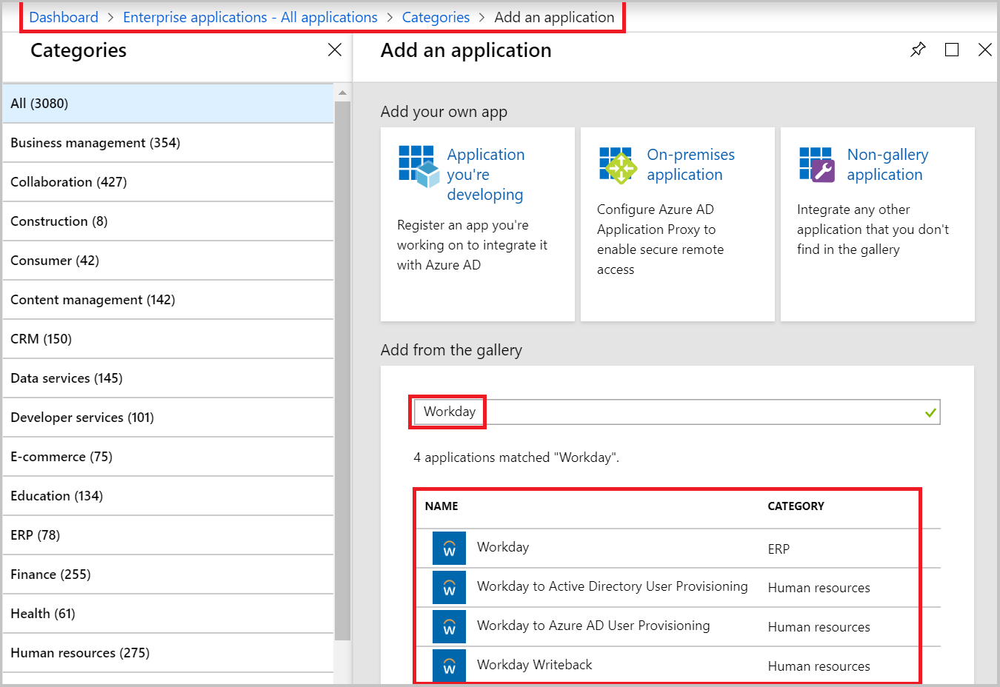
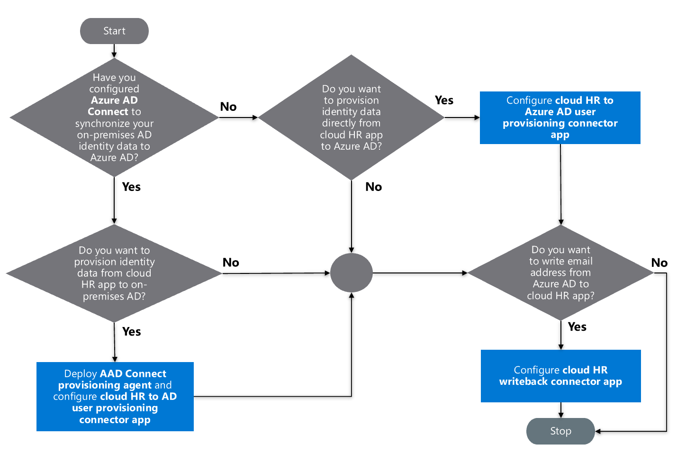
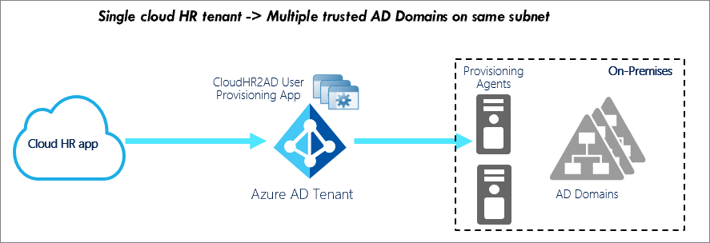
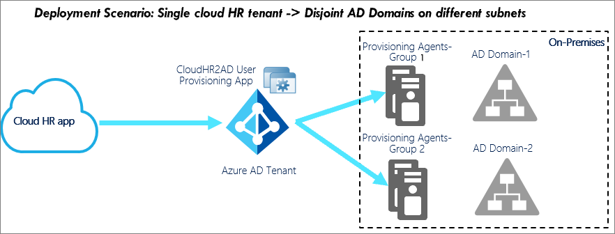

# Plan cloud HR application to Azure Active Directory user provisioning

Historically, IT staff have relied on manual methods to create, update, and delete employees. They've used methods such as uploading CSV files or custom scripts to sync employee data. These provisioning processes are error prone, insecure, and hard to manage.

To manage the identity lifecycles of employees, vendors, or contingent workers, [Azure Active Directory (Azure AD) user provisioning service](../app-provisioning/user-provisioning.md) offers integration with cloud-based human resources (HR) applications. Examples of applications include Workday or SuccessFactors.

Azure AD uses this integration to enable the following cloud HR application (app) workflows:

- **Provision users to Active Directory:** Provision selected sets of users from a cloud HR app into one or more Active Directory domains.
- **Provision cloud-only users to Azure AD:** In scenarios where Active Directory isn't used, provision users directly from the cloud HR app to Azure AD.
- **Write back to the cloud HR app:** Write the email addresses and username attributes from Azure AD back to the cloud HR app.

> [!NOTE]
> This deployment plan shows you how to deploy your cloud HR app workflows with Azure AD user provisioning. For information on how to deploy automatic user provisioning to software as a service (SaaS) apps, see [Plan an automatic user provisioning deployment](https://aka.ms/deploymentplans/provisioning).

## Enabled HR scenarios

The Azure AD user provisioning service enables automation of the following HR-based identity lifecycle management scenarios:

- **New employee hiring:** When a new employee is added to the cloud HR app, a user account is automatically created in Active Directory and Azure AD with the option to write back the email address and username attributes to the cloud HR app.
- **Employee attribute and profile updates:** When an employee record such as name, title, or manager is updated in the cloud HR app, their user account is automatically updated in Active Directory and Azure AD.
- **Employee terminations:** When an employee is terminated in the cloud HR app, their user account is automatically disabled in Active Directory and Azure AD.
- **Employee rehires:** When an employee is rehired in the cloud HR app, their old account can be automatically reactivated or reprovisioned to Active Directory and Azure AD.

## Who is this integration best suited for?

The cloud HR app integration with Azure AD user provisioning is ideally suited for organizations that:

- Want a prebuilt, cloud-based solution for cloud HR user provisioning.
- Require direct user provisioning from the cloud HR app to Active Directory or Azure AD.
- Require users to be provisioned by using data obtained from the cloud HR app.
- Require joining, moving, and leaving users to be synced to one or more Active Directory forests, domains, and OUs based only on change information detected in the cloud HR app.
- Use Office 365 for email.

## Learn

User provisioning creates a foundation for ongoing identity governance. It enhances the quality of business processes that rely on authoritative identity data.

### Terms

This article uses the following terms:

- **Source system**: The repository of users that Azure AD provisions from. An example is a cloud HR app such as Workday or SuccessFactors.
- **Target system**: The repository of users that the Azure AD provisions to. Examples are Active Directory, Azure AD, Office 365, or other SaaS apps.
- **Joiners-Movers-Leavers process**: A term used for new hires, transfers, and termination by using a cloud HR app as a system of records. The process completes when the service successfully provisions the necessary attributes to the target system.

### Key benefits

This capability of HR-driven IT provisioning offers the following significant business benefits:

- **Increase productivity:** You can now automate the assignment of user accounts and Office 365 licenses and provide access to key groups. Automating assignments gives new hires immediate access to their job tools and increases productivity.
- **Manage risk:** You can increase security by automating changes based on employee status or group memberships with data flowing in from the cloud HR app. Automating changes ensures that user identities and access to key apps update automatically when users transition or leave the organization.
- **Address compliance and governance:** Azure AD supports native audit logs for user provisioning requests performed by apps of both source and target systems. With auditing, you can track who has access to the apps from a single screen.
- **Manage cost:** Automatic provisioning reduces costs by avoiding inefficiencies and human error associated with manual provisioning. It reduces the need for custom-developed user provisioning solutions built over time by using legacy and outdated platforms.

### Licensing

To configure the cloud HR app to Azure AD user provisioning integration, you require a valid [Azure AD Premium license](https://azure.microsoft.com/pricing/details/active-directory/) and a license for the cloud HR app, such as Workday or SuccessFactors.

You also need a valid Azure AD Premium P1 or higher subscription license for every user that will be sourced from the cloud HR app and provisioned to either Active Directory or Azure AD. Any improper number of licenses owned in the cloud HR app might lead to errors during user provisioning.

### Prerequisites

- Azure AD [hybrid identity administrator](../users-groups-roles/directory-assign-admin-roles.md#hybrid-identity-administrator)  to configure the Azure AD Connect provisioning agent.
- Azure AD [application administrator](../users-groups-roles/directory-assign-admin-roles.md#application-administrator) role to configure the provisioning app in the Azure portal
- A test and production instance of the cloud HR app.
- Administrator permissions in the cloud HR app to create a system integration user and make changes to test employee data for testing purposes.
- For user provisioning to Active Directory, a server running Windows Server 2012 or greater with .NET 4.7.1+ runtime is required to host the Azure AD Connect provisioning agent
- [Azure AD Connect](../hybrid/whatis-azure-ad-connect.md) for synchronizing users between Active Directory and Azure AD.

### Training resources

| **Resources** | **Link and description** |
|:-|:-|
| Videos | [What is user provisioning in Active Azure Directory?](https://youtu.be/_ZjARPpI6NI) |
| | [How to deploy user provisioning in Active Azure Directory](https://youtu.be/pKzyts6kfrw) |
| Tutorials | [List of tutorials on how to integrate SaaS apps with Azure AD](../saas-apps/tutorial-list.md) |
| | [Tutorial: Configure Workday for automatic user provisioning](../saas-apps/workday-inbound-tutorial.md#frequently-asked-questions-faq) |
| FAQ | [Automated user provisioning](../app-provisioning/user-provisioning.md#what-applications-and-systems-can-i-use-with-azure-ad-automatic-user-provisioning) |
| | [Provisioning from Workday to Azure AD](../saas-apps/workday-inbound-tutorial.md#frequently-asked-questions-faq) |

### Solution architecture

The following example describes the end-to-end user provisioning solution architecture for common hybrid environments and includes:

- **Authoritative HR data flow from cloud HR app to Active Directory.** In this flow, the HR event (Joiners-Movers-Leavers process) is initiated in the cloud HR app tenant. The Azure AD provisioning service and Azure AD Connect provisioning agent provision the user data from the cloud HR app tenant into Active Directory. Depending on the event, it might lead to create, update, enable, and disable operations in Active Directory.
- **Sync with Azure AD and write back email and username from on-premises Active Directory to cloud HR app.** After the accounts are updated in Active Directory, it's synced with Azure AD through Azure AD Connect. The email addresses and username attributes can be written back to the cloud HR app tenant.

#### Description of workflow

The following key steps are indicated in the diagram:  

1. **HR team** performs the transactions in the cloud HR app tenant.
2. **Azure AD provisioning service** runs the scheduled cycles from the cloud HR app tenant and identifies changes that need to be processed for sync with Active Directory.
3. **Azure AD provisioning service** invokes the Azure AD Connect provisioning agent with a request payload that contains Active Directory account create, update, enable, and disable operations.
4. **Azure AD Connect provisioning agent** uses a service account to manage Active Directory account data.
5. **Azure AD Connect** runs delta [sync](../hybrid/how-to-connect-sync-whatis.md) to pull updates in Active Directory.
6. **Active Directory** updates are synced with Azure AD.
7. **Azure AD provisioning service** write backs email attribute and username from Azure AD to the cloud HR app tenant.

## Plan the deployment project

Consider your organizational needs while you determine the strategy for this deployment in your environment.

### Engage the right stakeholders

When technology projects fail, they typically do so owing to mismatched expectations on impact, outcomes, and responsibilities. To avoid these pitfalls, [ensure that you're engaging the right stakeholders](https://aka.ms/deploymentplans). Also make sure that stakeholder roles in the project are well understood. Document the stakeholders and their project input and accountabilities.

Include a representative from the HR organization who can provide inputs on existing HR business processes and worker identity plus job data-processing requirements.

### Plan communications

Communication is critical to the success of any new service. Proactively communicate with your users about when and how their experience will change. Let them know how to gain support if they experience issues.

### Plan a pilot

Integrating HR business processes and identity workflows from the cloud HR app to target systems requires a considerable amount of data validation, data transformation, data cleansing, and end-to-end testing before you can deploy the solution into production.

Run the initial configuration in a [pilot environment](../fundamentals/active-directory-deployment-plans.md#best-practices-for-a-pilot) before you scale it to all users in production.

## Select cloud HR provisioning connector apps

To facilitate Azure AD provisioning workflows between the cloud HR app and Active Directory, you can add multiple provisioning connector apps from the Azure AD app gallery:

- **Cloud HR app to Active Directory user provisioning**: This provisioning connector app facilitates user account provisioning from the cloud HR app to a single Active Directory domain. If you have multiple domains, you can add one instance of this app from the Azure AD app gallery for each Active Directory domain you need to provision to.
- **Cloud HR app to Azure AD user provisioning**: While Azure AD Connect is the tool that should be used to synchronize Active Directory users to Azure AD, this provisioning connector app can be used to facilitate the provisioning of cloud-only users from the cloud HR app to a single Azure AD tenant.
- **Cloud HR app write-back**: This provisioning connector app facilitates the write-back of the user's email addresses from Azure AD to the cloud HR app.

For example, the following image lists the Workday connector apps that are available in the Azure AD app gallery.

### Decision flow chart

Use the following decision flow chart to identify which cloud HR provisioning apps are relevant to your scenario.

## Design the Azure AD Connect provisioning agent deployment topology

The provisioning integration between the cloud HR app and Active Directory requires four components:

- Cloud HR app tenant
- Provisioning connector app
- Azure AD Connect provisioning agent
- Active Directory domain

The Azure AD Connect provisioning agent deployment topology depends on the number of cloud HR app tenants and Active Directory child domains that you plan to integrate. If you have multiple Active Directory domains, it depends on whether the Active Directory domains are contiguous or [disjoint](https://docs.microsoft.com/windows-server/identity/ad-ds/plan/disjoint-namespace).

Based on your decision, choose one of the deployment scenarios:

- Single cloud HR app tenant -> target single or multiple Active Directory child domains in a trusted forest
- Single cloud HR app tenant -> target multiple child domains in a disjoint Active Directory forest

### Single cloud HR app tenant -> target single or multiple Active Directory child domains in a trusted forest

We recommend the following production configuration:

|Requirement|Recommendation|
|:-|:-|
|Number of Azure AD Connect provisioning agents to deploy|Two (for high availability and failover)
|Number of provisioning connector apps to configure|One app per child domain|
|Server host for Azure AD Connect provisioning agent|Windows 2012 R2+ with line of sight to geolocated Active Directory domain controllers Can coexist with Azure AD Connect service|

### Single cloud HR app tenant -> target multiple child domains in a disjoint Active Directory forest

This scenario involves provisioning users from the cloud HR app to domains in disjoint Active Directory forests.

We recommend the following production configuration:

|Requirement|Recommendation|
|:-|:-|
|Number of Azure AD Connect provisioning agents to deploy on-premises|Two per disjoint Active Directory forest|
|Number of provisioning connector apps to configure|One app per child domain|
|Server host for Azure AD Connect provisioning agent|Windows 2012 R2+ with line of sight to geolocated Active Directory domain controllers Can coexist with Azure AD Connect service|

### Azure AD Connect provisioning agent requirements

The cloud HR app to Active Directory user provisioning solution requires that you deploy one or more Azure AD Connect provisioning agents on servers that run Windows 2012 R2 or greater. The servers must have a minimum of 4-GB RAM and .NET 4.7.1+ runtime. Ensure that the host server has network access to the target Active Directory domain.

To prepare the on-premises environment, the Azure AD Connect provisioning agent configuration wizard registers the agent with your Azure AD tenant, [opens ports](../manage-apps/application-proxy-add-on-premises-application.md#open-ports), [allows access to URLs](../manage-apps/application-proxy-add-on-premises-application.md#allow-access-to-urls), and supports [outbound HTTPS proxy configuration](../saas-apps/workday-inbound-tutorial.md#how-do-i-configure-the-provisioning-agent-to-use-a-proxy-server-for-outbound-http-communication).

The provisioning agent uses a service account to communicate with the Active Directory domains. Before you install the agent, create a service account in Active Directory Users and Computers that meets the following requirements:

- A password that doesn't expire
- Delegated control permissions to read, create, delete, and manage user accounts

You can select domain controllers that should handle provisioning requests. If you have several geographically distributed domain controllers, install the provisioning agent in the same site as your preferred domain controllers. This positioning improves the reliability and performance of the end-to-end solution.

For high availability, you can deploy more than one Azure AD Connect provisioning agent. Register the agent to handle the same set of on-premises Active Directory domains.

## Plan scoping filters and attribute mapping

When you enable provisioning from the cloud HR app to Active Directory or Azure AD, the Azure portal controls the attribute values through attribute mapping.

### Define scoping filters

Use [scoping filters](../app-provisioning/define-conditional-rules-for-provisioning-user-accounts.md) to define the attribute-based rules that determine which users should be provisioned from the cloud HR app to Active Directory or Azure AD.

When you initiate the Joiners process, gather the following requirements:

- Is the cloud HR app used to bring on board both employees and contingent workers?
- Do you plan to use the cloud HR app to Azure AD user provisioning to manage both employees and contingent workers?
- Do you plan to roll out the cloud HR app to Azure AD user provisioning only for a subset of the cloud HR app users? An example might be employees only.

Depending on your requirements, when you configure attribute mappings, you can set the **Source Object Scope** field to select which sets of users in the cloud HR app should be in scope for provisioning to Active Directory. For more information, see the cloud HR app tutorial for commonly used scoping filters.

### Determine matching attributes

With provisioning, you get the ability to match existing accounts between the source and target system. When you integrate the cloud HR app with the Azure AD provisioning service, you can [configure attribute mapping](../app-provisioning/configure-automatic-user-provisioning-portal.md#mappings) to determine what user data should flow from the cloud HR app to Active Directory or Azure AD.

When you initiate the Joiners process, gather the following requirements:

- What is the unique ID in this cloud HR app that's used to identify each user?
- From an identity lifecycle perspective, how do you handle rehires? Do rehires keep their old employee IDs?
- Do you process future-dated hires and create Active Directory accounts for them in advance?
- From an identity lifecycle perspective, how do you handle employee to contingent worker conversion, or otherwise?
- Do converted users keep their old Active Directory accounts or do they get new ones?

Depending on your requirements, Azure AD supports direct attribute-to-attribute mapping by providing constant values or [writing expressions for attribute mappings](../app-provisioning/functions-for-customizing-application-data.md). This flexibility gives you ultimate control of what's populated in the targeted app attribute. You can use the [Microsoft Graph API](../app-provisioning/export-import-provisioning-configuration.md) and Graph Explorer to export your user provisioning attribute mappings and schema to a JSON file and import it back into Azure AD.

By default, the attribute in the cloud HR app that represents the unique employee ID is used as the matching attribute *mapped to the unique attribute in Active Directory.* For example, in the Workday app scenario, the **Workday** **WorkerID** attribute is mapped to the Active Directory **employeeID** attribute.

You can set multiple matching attributes and assign matching precedence. They're evaluated on matching precedence. As soon as a match is found, no further matching attributes are evaluated.

You can also [customize the default attribute mappings](../app-provisioning/customize-application-attributes.md#understanding-attribute-mapping-types), such as changing or deleting existing attribute mappings. You can also create new attribute mappings according to your business needs. For more information, see the cloud HR app tutorial (such as [Workday](../saas-apps/workday-inbound-tutorial.md#managing-your-configuration)) for a list of custom attributes to map.

### Determine user account status

By default, the provisioning connector app maps the HR user profile status to the user account status in Active Directory or Azure AD to determine whether to enable or disable the user account.

When you initiate the Joiners-Leavers process, gather the following requirements.

| Process | Requirements |
| - | - |
| **Joiners** | From an identity lifecycle perspective, how do you handle rehires? Do rehires keep their old employee IDs? |
| | Do you process future-dated hires and create Active Directory accounts for them in advance? Are these accounts created in an enabled or disabled state? |
| | From an identity lifecycle perspective, how do you handle employee to contingent worker conversion, or otherwise? |
| | Do converted users keep their old Active Directory accounts, or do they get new ones? |
| **Leavers** | Are terminations handled differently for employees and contingent workers in Active Directory? |
| | What effective dates are considered for processing user termination? |
| | How do employee and contingent worker conversions affect existing Active Directory accounts? |
| | How do you process the Rescind operation in Active Directory? Rescind operations need to be handled if future dated hires are created in Active Directory as part of the Joiner process. |

Depending on your requirements, you might customize the mapping logic by using [Azure AD expressions](../app-provisioning/functions-for-customizing-application-data.md) so that the Active Directory account is enabled or disabled based on a combination of data points.

### Map cloud HR app to Active Directory user attributes

Each cloud HR app ships with default cloud HR app to Active Directory mappings.

When you initiate the Joiners-Movers-Leavers process, gather the following requirements.

| Process | Requirements |
| - | - |
| **Joiners** | Is the Active Directory account creation process manual, automated, or partially automated? |
| | Do you plan to propagate custom attributes from the cloud HR app to Active Directory? |
| **Movers** | What attributes would you like to process whenever a Movers operation takes place in the cloud HR app? |
| | Do you perform any specific attribute validations at the time of user updates? If yes, provide details. |
| **Leavers** | Are terminations handled differently for employees and contingent workers in Active Directory? |
| | What effective dates are considered for processing user termination? |
| | How do employee and contingent worker conversions impact existing Active Directory accounts? |

Depending on your requirements, you can modify the mappings to meet your integration goals. For more information, see the specific cloud HR app tutorial (such as [Workday](../saas-apps/workday-inbound-tutorial.md#part-4-configure-attribute-mappings)) for a list of custom attributes to map.

### Generate a unique attribute value

When you initiate the Joiners process, you might need to generate unique attribute values when you set attributes like CN, samAccountName, and the UPN, which has unique constraints.

The Azure AD function [SelectUniqueValues](../app-provisioning/functions-for-customizing-application-data.md#selectuniquevalue) evaluates each rule and then checks the value generated for uniqueness in the target system. For an example, see [Generate unique value for the userPrincipalName (UPN) attribute](../app-provisioning/functions-for-customizing-application-data.md#generate-unique-value-for-userprincipalname-upn-attribute).

> [!NOTE]
> This function is currently only supported for Workday to Active Directory user provisioning. It can't be used with other provisioning apps.

### Configure Active Directory OU container assignment

It's a common requirement to place Active Directory user accounts into containers based on business units, locations, and departments. When you initiate a Movers process, and if there's a supervisory organization change, you might need to move the user from one OU to another in Active Directory.

Use the [Switch()](../app-provisioning/functions-for-customizing-application-data.md#switch) function to configure the business logic for the OU assignment, and map it to the Active Directory attribute **parentDistinguishedName**.

For example, if you want to create users in OU based on the HR attribute **Municipality**, you can use the following expression:

`
Switch([Municipality], "OU=Default,OU=Users,DC=contoso,DC=com", "Dallas", "OU=Dallas,OU=Users,DC=contoso,DC=com", "Austin", "OU=Austin,OU=Users,DC=contoso,DC=com", "Seattle", "OU=Seattle,OU=Users,DC=contoso,DC=com", "London", "OU=London,OU=Users,DC=contoso,DC=com")
`

With this expression, if the Municipality value is Dallas, Austin, Seattle, or London, the user account will be created in the corresponding OU. If there's no match, then the account is created in the default OU.

## Plan for password delivery of new user accounts

When you initiate the Joiners process, you need to set and deliver a temporary password of new user accounts. With cloud HR to Azure AD user provisioning, you can roll out the Azure AD [self-service password reset](../authentication/quickstart-sspr.md) (SSPR) capability for the user on day one.

SSPR is a simple means for IT administrators to enable users to reset their passwords or unlock their accounts. You can provision the **Mobile Number** attribute from the cloud HR app to Active Directory and sync it with Azure AD. After the **Mobile Number** attribute is in Azure AD, you can enable SSPR for the user's account. Then on day one, the new user can use the registered and verified mobile number for authentication.

## Plan for initial cycle

When the Azure AD provisioning service runs for the first time, it performs an [initial cycle](../app-provisioning/how-provisioning-works.md#initial-cycle) against the cloud HR app to create a snapshot of all user objects in the cloud HR app. The time taken for initial cycles is directly dependent on how many users are present in the source system. The initial cycle for some cloud HR app tenants with over 100,000 users can take a long time.

**For large cloud HR app tenants (>30,000 users),** run the initial cycle in progressive stages. Start the incremental updates only after you validate that the correct attributes are set in Active Directory for different user provisioning scenarios. Follow the order here.

1. Run the initial cycle only for a limited set of users by setting the [scoping filter](#plan-scoping-filters-and-attribute-mapping).
2. Verify Active Directory account provisioning and the attribute values set for the users selected for the first run. If the result meets your expectations, expand the scoping filter to progressively include more users and verify the results for the second run.

After you're satisfied with the results of the initial cycle for test users, start the [incremental updates](../app-provisioning/how-provisioning-works.md#incremental-cycles).

## Plan testing and security

At each stage of your deployment from initial pilot through enabling user provisioning, ensure that you're testing that results are as expected and auditing the provisioning cycles.

### Plan testing

After you configure the cloud HR app to Azure AD user provisioning, run test cases to verify whether this solution meets your organization's requirements.

|Scenarios|Expected results|
|:-|:-|
|New employee is hired in the cloud HR app.| - The user account is provisioned in Active Directory. - The user can log into Active Directory-domain apps and perform the desired actions. - If Azure AD Connect sync is configured, the user account also gets created in Azure AD.
|User is terminated in the cloud HR app.|- The user account is disabled in Active Directory. - The user can't log into any enterprise apps protected by Active Directory.
|User supervisory organization is updated in the cloud HR app.|Based on the attribute mapping, the user account moves from one OU to another in Active Directory.|
|HR updates the user's manager in the cloud HR app.|The manager field in Active Directory is updated to reflect the new manager's name.|
|HR rehires an employee into a new role.|Behavior depends on how the cloud HR app is configured to generate employee IDs: - If the old employee ID is reused for a rehire, the connector enables the existing Active Directory account for the user. - If the rehire gets a new employee ID, the connector creates a new Active Directory account for the user.|
|HR converts the employee to a contract worker or vice versa.|A new Active Directory account is created for the new persona and the old account gets disabled on the conversion effective date.|

Use the previous results to determine how to transition your automatic user provisioning implementation into production based on your established timelines.

> [!TIP]
> Use techniques such as data reduction and data scrubbing when you refresh the test environment with production data to remove or mask sensitive personal data to comply with privacy and security standards. 

### Plan security

It's common for a security review to be required as part of the deployment of a new service. If a security review is required or hasn't been conducted, see the many Azure AD [white papers](https://www.microsoft.com/download/details.aspx?id=36391) that provide an overview of the identity as a service.

### Plan rollback

The cloud HR user provisioning implementation might fail to work as desired in the production environment. If so, the following rollback steps can assist you in reverting to a previous known good state.

1. Review the [provisioning summary report](../app-provisioning/check-status-user-account-provisioning.md#getting-provisioning-reports-from-the-azure-portal) and [provisioning logs](../app-provisioning/check-status-user-account-provisioning.md#provisioning-logs-preview) to determine what incorrect operations were performed on the affected users or groups. For more information on the provisioning summary report and logs, see [Manage cloud HR app user provisioning](#manage-your-configuration).
2. The last known good state of the users or groups affected can be determined through the provisioning audit logs or by reviewing the target systems (Azure AD or Active Directory).
3. Work with the app owner to update the users or groups affected directly in the app by using the last known good state values.

## Deploy the cloud HR app

Choose the cloud HR app that aligns to your solution requirements.

**Workday**: To import worker profiles from Workday into Active Directory and Azure AD, see [Tutorial: Configure Workday for automatic user provisioning](../saas-apps/workday-inbound-tutorial.md#planning-your-deployment). Optionally, you can write back the email address, username and phone number to Workday.

**SAP SuccessFactors**: To import worker profiles from SuccessFactors into Active Directory and Azure AD, see [Tutorial: Configure SAP SuccessFactors for automatic user provisioning](../saas-apps/sap-successfactors-inbound-provisioning-tutorial.md). Optionally, you can write back the email address and username to SuccessFactors.

## Manage your configuration

Azure AD can provide additional insights into your organization's user provisioning usage and operational health through audit logs and reports.

### Gain insights from reports and logs

After a successful [initial cycle](../app-provisioning/how-provisioning-works.md#initial-cycle), the Azure AD provisioning service continues to run back-to-back incremental updates indefinitely, at intervals defined in the tutorials specific to each app, until one of the following events occurs:

- The service is manually stopped. A new initial cycle is triggered by using the [Azure portal](https://portal.azure.com/) or the appropriate [Microsoft Graph API](https://developer.microsoft.com/graph/docs/api-reference/beta/resources/synchronization-overview) command.
- A new initial cycle is triggered owing to a change in attribute mappings or scoping filters.
- The provisioning process goes into quarantine because of a high error rate. It stays in quarantine for more than four weeks, at which time it's automatically disabled.

To review these events and all other activities performed by the provisioning service, [learn how to review logs and get reports on provisioning activity](../app-provisioning/check-status-user-account-provisioning.md).

#### Azure Monitor logs

All activities performed by the provisioning service are recorded in the Azure AD audit logs. You can route Azure AD audit logs to Azure Monitor logs for further analysis. With Azure Monitor logs (also known as Log Analytics workspace), you can query data to find events, analyze trends, and perform correlation across various data sources. Watch this [video](https://youtu.be/MP5IaCTwkQg) to learn the benefits of using Azure Monitor logs for Azure AD logs in practical user scenarios.

Install the [log analytics views for Azure AD activity logs](../reports-monitoring/howto-install-use-log-analytics-views.md) to get access to [prebuilt reports](https://github.com/AzureAD/Deployment-Plans/tree/master/Log%20Analytics%20Views) around provisioning events in your environment.

For more information, see how to [analyze the Azure AD activity logs with your Azure Monitor logs](../reports-monitoring/howto-analyze-activity-logs-log-analytics.md).

### Manage personal data

The Azure AD Connect provisioning agent installed on the Windows server creates logs in the Windows event log that might contain personal data depending on your cloud HR app to Active Directory attribute mappings. To comply with user privacy obligations, set up a Windows scheduled task to clear the event log and ensure that no data is kept beyond 48 hours.

Azure AD provisioning service doesn't generate reports, perform analytics, or provide insights beyond 30 days because the service doesn't store, process, or keep any data beyond 30 days.

### Troubleshoot

To troubleshoot any issues that might turn up during provisioning, see the following articles:

- [Problem configuring user provisioning to an Azure AD Gallery application](application-provisioning-config-problem.md)
- [Sync an attribute from your on-premises Active Directory to Azure AD for provisioning to an application](user-provisioning-sync-attributes-for-mapping.md)
- [User provisioning to an Azure AD Gallery application is taking hours or more](application-provisioning-when-will-provisioning-finish.md)
- [Problem saving administrator credentials while configuring user provisioning to an Azure Active Directory Gallery application](application-provisioning-config-problem-storage-limit.md)
- [No users are being provisioned to an Azure AD Gallery application](application-provisioning-config-problem-no-users-provisioned.md)
- [Wrong set of users are being provisioned to an Azure AD Gallery application](application-provisioning-config-problem-wrong-users-provisioned.md)
- [Setting up Windows Event Viewer for agent troubleshooting](../saas-apps/workday-inbound-tutorial.md#setting-up-windows-event-viewer-for-agent-troubleshooting)
- [Setting up Azure portal Audit Logs for service troubleshooting](../saas-apps/workday-inbound-tutorial.md#setting-up-azure-portal-audit-logs-for-service-troubleshooting)
- [Understanding logs for AD User Account create operations](../saas-apps/workday-inbound-tutorial.md#understanding-logs-for-ad-user-account-create-operations)
- [Understanding logs for Manager update operations](../saas-apps/workday-inbound-tutorial.md#understanding-logs-for-manager-update-operations)
- [Resolving commonly encountered errors](../saas-apps/workday-inbound-tutorial.md#resolving-commonly-encountered-errors)

### Next steps

- [Writing expressions for attribute mappings](functions-for-customizing-application-data.md)
- [Azure AD synchronization API overview](https://developer.microsoft.com/graph/docs/api-reference/beta/resources/synchronization-overview)
- [Skip deletion of user accounts that go out of scope](skip-out-of-scope-deletions.md)
- [Azure AD Connect Provisioning Agent: Version release history](provisioning-agent-release-version-history.md)
