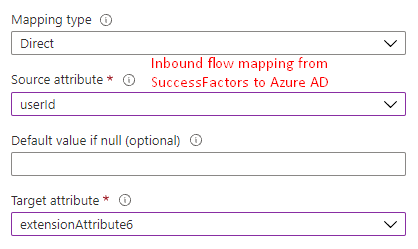
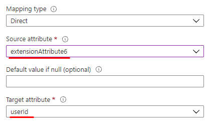

# How Azure Active Directory provisioning integrates with SAP SuccessFactors 

[Azure Active Directory user provisioning service](../app-provisioning/user-provisioning.md) integrates with [SAP SuccessFactors Employee Central](https://www.successfactors.com/products-services/core-hr-payroll/employee-central.html) to manage the identity life cycle of users. Azure Active Directory offers three pre-built integrations: 

* [SuccessFactors to on-premises Active Directory user provisioning](../saas-apps/sap-successfactors-inbound-provisioning-tutorial.md)
* [SuccessFactors to Azure Active Directory user provisioning](../saas-apps/sap-successfactors-inbound-provisioning-cloud-only-tutorial.md)
* [SuccessFactors Writeback](../saas-apps/sap-successfactors-writeback-tutorial.md)

This article explains how the integration works and how you can customize the provisioning behavior for different HR scenarios. 

## Establishing connectivity 
Azure AD provisioning service uses basic authentication to connect to Employee Central OData API endpoints. When setting up the SuccessFactors provisioning app, use the *Tenant URL* parameter in the *Admin Credentials* section to configure the [API data center URL](https://apps.support.sap.com/sap/support/knowledge/en/2215682). 

To further secure the connectivity between Azure AD provisioning service and SuccessFactors, you can add the Azure AD IP ranges in the SuccessFactors IP allowlist using the steps described below:

1. Download the [latest IP Ranges](https://www.microsoft.com/download/details.aspx?id=56519) for the Azure Public Cloud 
1. Open the file and search for tag **AzureActiveDirectory** 

   >[!div class="mx-imgBorder"] 
   >

1. Copy all IP address ranges listed within the element *addressPrefixes* and use the range to build your IP address restriction list.
1. Translate the CIDR values to IP ranges.  
1. Log in to SuccessFactors admin portal to add IP ranges to the allowlist. Refer to SAP [support note 2253200](https://apps.support.sap.com/sap/support/knowledge/en/2253200). You can now [enter IP ranges](https://answers.sap.com/questions/12882263/whitelisting-sap-cloud-platform-ip-address-range-i.html) in this tool. 

## Supported entities
For every user in SuccessFactors, Azure AD provisioning service retrieves the following entities. Each entity is expanded using the OData API *$expand* query parameter. Refer to the *Retrieval rule* column below. Some entities are expanded by default, while some entities are expanded only if a specific attribute is present in the mapping. 

| \# | SuccessFactors Entity                  | OData Node     | Retrieval rule |
|----|----------------------------------------|------------------------------|------------------|
| 1  | PerPerson                              | *root node*                  | Always           |
| 2  | PerPersonal                            | personalInfoNav              | Always           |
| 3  | PerPhone                               | phoneNav                     | Always           |
| 4  | PerEmail                               | emailNav                     | Always           |
| 5  | EmpEmployment                          | employmentNav                | Always           |
| 6  | User                                   | employmentNav/userNav        | Always           |
| 7  | EmpJob                                 | employmentNav/jobInfoNav     | Always           |
| 8  | EmpEmploymentTermination               | activeEmploymentsCount       | Always           |
| 9  | User's manager                         | employmentNav/userNav/manager/empInfo | Always  |
| 10 | FOCompany                              | employmentNav/jobInfoNav/companyNav | Only if `company` or `companyId` attribute is mapped |
| 11 | FODepartment                           | employmentNav/jobInfoNav/departmentNav | Only if `department` or `departmentId` attribute is mapped |
| 12 | FOBusinessUnit                         | employmentNav/jobInfoNav/businessUnitNav | Only if `businessUnit` or `businessUnitId` attribute is mapped |
| 13 | FOCostCenter                           | employmentNav/jobInfoNav/costCenterNav | Only if `costCenter` or `costCenterId` attribute is mapped |
| 14 | FODivision                             | employmentNav/jobInfoNav/divisionNav  | Only if `division` or `divisionId` attribute is mapped |
| 15 | FOJobCode                              | employmentNav/jobInfoNav/jobCodeNav  | Only if `jobCode` or `jobCodeId` attribute is mapped |
| 16 | FOPayGrade                             | employmentNav/jobInfoNav/payGradeNav  | Only if `payGrade` attribute is mapped |
| 17 | FOLocation                             | employmentNav/jobInfoNav/locationNav  | Only if `location` attribute is mapped |
| 18 | FOCorporateAddressDEFLT                | employmentNav/jobInfoNav/addressNavDEFLT  | If mapping contains one of the following attributes: `officeLocationAddress,  officeLocationCity, officeLocationZipCode` |
| 19 | FOEventReason                          | employmentNav/jobInfoNav/eventReasonNav  | Only if `eventReason` attribute is mapped |
| 20 | EmpGlobalAssignment                    | employmentNav/empGlobalAssignmentNav | Only if `assignmentType` is mapped |
| 21 | EmploymentType Picklist                | employmentNav/jobInfoNav/employmentTypeNav | Only if `employmentType` is mapped |
| 22 | EmployeeClass Picklist                 | employmentNav/jobInfoNav/employeeClassNav | Only if `employeeClass` is mapped |
| 23 | EmplStatus Picklist                    | employmentNav/jobInfoNav/emplStatusNav | Only if `emplStatus` is mapped |
| 24 | AssignmentType Picklist                | employmentNav/empGlobalAssignmentNav/assignmentTypeNav | Only if `assignmentType` is mapped |
| 25 | Position                               | employmentNav/jobInfoNav/positionNav | Only if `positioNav` is mapped |
| 26 | Manager User                           | employmentNav/jobInfoNav/managerUserNav | Only if `managerUserNav` is mapped |

## How full sync works
Based on the attribute-mapping, during full sync Azure AD provisioning service sends the following "GET" OData API query to fetch effective data of all active users. 

> [!div class="mx-tdCol2BreakAll"]
>| Parameter | Description |
>| ----------|-------------|
>| OData API Host | Appends https to the *Tenant URL*. Example: `https://api4.successfactors.com` |
>| OData API Endpoint | `/odata/v2/PerPerson` |
>| OData $format query parameter | `json` |
>| OData $filter query parameter | `(personEmpTerminationInfoNav/activeEmploymentsCount ne null) and (lastModifiedDateTime le <CurrentExecutionTime>)` |
>| OData $expand query parameter | This parameter value depends on the attributes mapped. Example: `employmentNav/userNav,employmentNav/jobInfoNav,personalInfoNav,personEmpTerminationInfoNav,phoneNav,emailNav,employmentNav/jobInfoNav/companyNav/countryOfRegistrationNav,employmentNav/jobInfoNav/divisionNav,employmentNav/jobInfoNav/departmentNav` |
>| OData customPageSize query parameter | `100` |

> [!NOTE]
> During the full initial sync, both active and terminated workers from SAP SuccessFactors will be fetched.

For each SuccessFactors user, the provisioning service looks for an account in the target (Azure AD/on-premises Active Directory) using the matching attribute defined in the mapping. For example: if *personIdExternal* maps to *employeeId* and is set as the matching attribute, then the provisioning service uses the *personIdExternal* value to search for the user with *employeeId* filter. If a user match is found, then it updates the target attributes. If no match is found, then it creates a new entry in the target. 

To validate the data returned by your OData API endpoint for a specific `personIdExternal`, update the `SuccessFactorsAPIEndpoint` in the API query below with your API data center server URL and use a tool like [Postman](https://www.postman.com/downloads/) to invoke the query. If the "in" filter does not work, you can try the "eq" filter. 

```
https://[SuccessFactorsAPIEndpoint]/odata/v2/PerPerson?$format=json&
$filter=(personIdExternal in '[personIdExternalValue]')&
$expand=employmentNav/userNav,employmentNav/jobInfoNav,personalInfoNav,personEmpTerminationInfoNav,
phoneNav,phoneNav/phoneTypeNav,emailNav,employmentNav/jobInfoNav/businessUnitNav,employmentNav/jobInfoNav/companyNav,
employmentNav/jobInfoNav/companyNav/countryOfRegistrationNav,employmentNav/jobInfoNav/costCenterNav,
employmentNav/jobInfoNav/divisionNav,employmentNav/jobInfoNav/departmentNav,employmentNav/jobInfoNav/jobCodeNav,
employmentNav/jobInfoNav/locationNav,employmentNav/jobInfoNav/locationNav/addressNavDEFLT,employmentNav/jobInfoNav/payGradeNav,
employmentNav/empGlobalAssignmentNav,employmentNav/empGlobalAssignmentNav/assignmentTypeNav,employmentNav/jobInfoNav/emplStatusNav,
employmentNav/jobInfoNav/employmentTypeNav,employmentNav/jobInfoNav/employeeClassNav,employmentNav/jobInfoNav/eventReasonNav
```

## How incremental sync works

After full sync, Azure AD provisioning service maintains `LastExecutionTimestamp` and uses it to create delta queries for retrieving incremental changes. The timestamp attributes present in each SuccessFactors entity, such as `lastModifiedDateTime`, `startDate`, `endDate`, and `latestTerminationDate`, are evaluated to see if the change falls between the `LastExecutionTimestamp` and `CurrentExecutionTime`. If yes, then the entry change is considered to be effective and processed for sync. 

Here is the OData API request template that Azure AD uses to query SuccessFactors for incremental changes. You can update the variables `SuccessFactorsAPIEndpoint`, `LastExecutionTimestamp` and `CurrentExecutionTime` in the request template below use a tool like [Postman](https://www.postman.com/downloads/) to check what data is returned. Alternatively, you can also retrieve the actual request payload from SuccessFactors by [enabling OData API Audit logs](#enabling-odata-api-audit-logs-in-successfactors). 

```
https://[SuccessFactorsAPIEndpoint]/odata/v2/PerPerson/$count?$format=json&$filter=(personEmpTerminationInfoNav/activeEmploymentsCount ne null) and
((lastModifiedDateTime ge datetimeoffset'<LastExecutionTimestamp>' and lastModifiedDateTime le datetimeoffset'<CurrentExecutionTime>') or
(personalInfoNav/startDate ge datetimeoffset'<LastExecutionTimestamp>' and personalInfoNav/startDate le datetimeoffset'<CurrentExecutionTime>') or
((personalInfoNav/lastModifiedDateTime ge datetimeoffset'<LastExecutionTimestamp>' and personalInfoNav/lastModifiedDateTime le datetimeoffset'<CurrentExecutionTime>') and (personalInfoNav/startDate le datetimeoffset'<CurrentExecutionTime>' and (personalInfoNav/endDate ge datetimeoffset'<CurrentExecutionTime>' or  personalInfoNav/endDate eq null))) or
(employmentNav/startDate ge datetimeoffset'<LastExecutionTimestamp>' and employmentNav/startDate le datetimeoffset'<CurrentExecutionTime>') or
((employmentNav/lastModifiedDateTime ge datetimeoffset'<LastExecutionTimestamp>' and employmentNav/lastModifiedDateTime le datetimeoffset'<CurrentExecutionTime>') and (employmentNav/startDate le datetimeoffset'<CurrentExecutionTime>' and (employmentNav/endDate ge datetimeoffset'<CurrentExecutionTime>' or employmentNav/endDate eq null))) 
(employmentNav/jobInfoNav/startDate ge datetimeoffset'<LastExecutionTimestamp>' and employmentNav/jobInfoNav/startDate le datetimeoffset'<CurrentExecutionTime>') or
((employmentNav/jobInfoNav/lastModifiedDateTime ge datetimeoffset'<LastExecutionTimestamp>' and employmentNav/jobInfoNav/lastModifiedDateTime le datetimeoffset'<CurrentExecutionTime>') and (employmentNav/jobInfoNav/startDate le datetimeoffset'<CurrentExecutionTime>' and (employmentNav/jobInfoNav/endDate ge datetimeoffset'<CurrentExecutionTime>' or employmentNav/jobInfoNav/endDate eq null))) or
(phoneNav/lastModifiedDateTime ge datetimeoffset'<LastExecutionTimestamp>' and phoneNav/lastModifiedDateTime le datetimeoffset'<CurrentExecutionTime>') or
(emailNav/lastModifiedDateTime ge datetimeoffset'<LastExecutionTimestamp>' and emailNav/lastModifiedDateTime le datetimeoffset'<CurrentExecutionTime>') or
(personEmpTerminationInfoNav/latestTerminationDate ge datetimeoffset'<previousDayDateStartTime24hrs>' and personEmpTerminationInfoNav/latestTerminationDate le datetimeoffset'<previousDayDateTime24hrs>') or
(employmentNav/userNav/lastModifiedDateTime ge datetimeoffset'<LastExecutionTimestamp>' and employmentNav/userNav/lastModifiedDateTime le datetimeoffset'<CurrentExecutionTime>'))
&$expand=employmentNav/userNav,employmentNav/jobInfoNav,personalInfoNav,personEmpTerminationInfoNav,phoneNav,emailNav,employmentNav/userNav/manager/empInfo,employmentNav/jobInfoNav/companyNav,employmentNav/jobInfoNav/departmentNav,employmentNav/jobInfoNav/locationNav,employmentNav/jobInfoNav/locationNav/addressNavDEFLT,employmentNav/jobInfoNav/locationNav/addressNavDEFLT/stateNav&customPageSize=100
```

## Reading attribute data

When Azure AD provisioning service queries SuccessFactors, it retrieves a JSON result set. The JSON result set includes a number of attributes stored in Employee Central. By default, the provisioning schema is configured to retrieve only a subset of those attributes. 

To retrieve additional attributes, follow the steps listed below:
    
1. Browse to **Enterprise Applications** -> **SuccessFactors App** -> **Provisioning** -> **Edit Provisioning** -> **attribute-mapping page**.
1. Scroll down and click **Show advanced options**.
1. Click on **Edit attribute list for SuccessFactors**. 

   > [!NOTE] 
   > If the **Edit attribute list for SuccessFactors** option does not show in the Azure portal, use the URL *https://portal.azure.com/?Microsoft_AAD_IAM_forceSchemaEditorEnabled=true* to access the page. 

1. The **API expression** column in this view displays the JSONPath expressions used by the connector.

   >[!div class="mx-imgBorder"] 
   >  

1. You can either edit an existing JSONPath value or add a new attribute with a valid JSONPath expression to the schema. 

The next section provides a list of common scenarios for editing the JSONPath values. 

## Handling different HR scenarios

JSONPath is a query language for JSON that is similar to XPath for XML. Like XPath, JSONPath allows for the extraction and filtration of data out of a JSON payload.

By using JSONPath transformation, you can customize the behavior of the Azure AD provisioning app to retrieve custom attributes and handle scenarios such as rehire, worker conversion and global assignment. 

This section covers how you can customize the provisioning app for the following HR scenarios: 
* [Retrieving additional attributes](#retrieving-additional-attributes)
* [Retrieving custom attributes](#retrieving-custom-attributes)
* [Mapping employment status to account status](#mapping-employment-status-to-account-status)
* [Handling worker conversion and rehire scenario](#handling-worker-conversion-and-rehire-scenario)
* [Retrieving current active employment record](#retrieving-current-active-employment-record)
* [Handling global assignment scenario](#handling-global-assignment-scenario)
* [Handling concurrent jobs scenario](#handling-concurrent-jobs-scenario)
* [Retrieving position details](#retrieving-position-details)
* [Provisioning users in the Onboarding module](#provisioning-users-in-the-onboarding-module)
* [Enabling OData API Audit logs in SuccessFactors](#enabling-odata-api-audit-logs-in-successfactors)

### Retrieving additional attributes

The default Azure AD SuccessFactors provisioning app schema ships with [90+ pre-defined attributes](sap-successfactors-attribute-reference.md). 
To add more SuccessFactors attributes to the provisioning schema, use the steps listed below: 

1. Use the OData query below to retrieve data for a valid test user from Employee Central. 

   ```
    https://[SuccessFactorsAPIEndpoint]/odata/v2/PerPerson?$format=json&
    $filter=(personIdExternal in '[personIdExternalValue]')&
    $expand=employmentNav/userNav,employmentNav/jobInfoNav,personalInfoNav,personEmpTerminationInfoNav,
    phoneNav,phoneNav/phoneTypeNav,emailNav,employmentNav/jobInfoNav/businessUnitNav,employmentNav/jobInfoNav/companyNav,
    employmentNav/jobInfoNav/companyNav/countryOfRegistrationNav,employmentNav/jobInfoNav/costCenterNav,
    employmentNav/jobInfoNav/divisionNav,employmentNav/jobInfoNav/departmentNav,employmentNav/jobInfoNav/jobCodeNav,
    employmentNav/jobInfoNav/locationNav,employmentNav/jobInfoNav/locationNav/addressNavDEFLT,employmentNav/jobInfoNav/payGradeNav,
    employmentNav/empGlobalAssignmentNav,employmentNav/empGlobalAssignmentNav/assignmentTypeNav,employmentNav/jobInfoNav/emplStatusNav,
    employmentNav/jobInfoNav/employmentTypeNav,employmentNav/jobInfoNav/employeeClassNav,employmentNav/jobInfoNav/eventReasonNav
   ```

1. Determine the Employee Central entity associated with the attribute
   * If the attribute is part of *EmpEmployment* entity, then look for the attribute under *employmentNav* node. 
   * If the attribute is part of *User* entity, then look for the attribute under *employmentNav/userNav* node.
   * If the attribute is part of *EmpJob* entity, then look for the attribute under *employmentNav/jobInfoNav* node. 
1. Construct the JSON Path associated with the attribute and add this new attribute to the list of SuccessFactors attributes. 
   * Example 1: Let's say you want to add the attribute *okToRehire*, which is part of *employmentNav* entity, then use the JSONPath  `$.employmentNav.results[0].okToRehire`
   * Example 2: Let's say you want to add the attribute *timeZone*, which is part of *userNav* entity, then use the JSONPath `$.employmentNav.results[0].userNav.timeZone`
   * Example 3: Let's say you want to add the attribute *flsaStatus*, which is part of *jobInfoNav* entity, then use the JSONPath `$.employmentNav.results[0].jobInfoNav.results[0].flsaStatus`
1. Save the schema. 
1. Restart provisioning.

### Retrieving custom attributes

By default, the following custom attributes are pre-defined in the Azure AD SuccessFactors provisioning app: 
* *custom01-custom15* from the User (userNav) entity
* *customString1-customString15* from the EmpEmployment (employmentNav) entity called *empNavCustomString1-empNavCustomString15*
* *customString1-customString15* from the EmpJobInfo (jobInfoNav) entity called *empJobNavCustomString1-empNavJobCustomString15*

Let's say, in your Employee Central instance, *customString35* attribute in *EmpJobInfo* stores the location description. You want to flow this value to Active Directory *physicalDeliveryOfficeName* attribute. To configure attribute-mapping for this scenario, use the steps given below: 

1. Edit the SuccessFactors attribute list to add a new attribute called *empJobNavCustomString35*.
1. Set the JSONPath API expression for this attribute as: 
   `$.employmentNav.results[0].jobInfoNav.results[0].customString35`
1. Save and reload the mapping change in the Azure portal.  
1. In the attribute-mapping blade, map *empJobNavCustomString35* to *physicalDeliveryOfficeName*.
1. Save the mapping.

Extending this scenario: 
* If you want to map *custom35* attribute from the *User* entity, then use the JSONPath `$.employmentNav.results[0].userNav.custom35`
* If you want to map *customString35* attribute from the *EmpEmployment* entity, then use the JSONPath `$.employmentNav.results[0].customString35`

### Mapping employment status to account status

By default, the Azure AD SuccessFactors connector uses the `activeEmploymentsCount` field of the `PersonEmpTerminationInfo` object to set account status. There is a known SAP SuccessFactors issue documented in [knowledge base article 3047486](https://launchpad.support.sap.com/#/notes/3047486) that at times this may disable the account of a terminated worker one day prior to the termination on the last day of work. 

If you are running into this issue or prefer mapping employment status to  account status, you can update the mapping to expand the `emplStatus` field and use the employment status code present in the field `emplStatus.externalCode`. Based on [SAP support note 2505526](https://launchpad.support.sap.com/#/notes/2505526), here is a list of employment status codes that you can retrieve in the provisioning app. 
* A = Active 
* D = Dormant
* U = Unpaid Leave
* P = Paid Leave
* S = Suspended
* F = Furlough
* O = Discarded
* R = Retired
* T = Terminated

Use the steps below to update your mapping to retrieve these codes. 

1. Open the attribute-mapping blade of your SuccessFactors provisioning app. 
1. Under **Show advanced options**, click on **Edit SuccessFactors attribute list**. 
1. Find the attribute `emplStatus` and update the JSONPath to `$.employmentNav.results[0].jobInfoNav.results[0].emplStatusNav.externalCode`. This will enable the connector to retrieve the employment status codes in the table. 
1. Save the changes. 
1. In the attribute mapping blade, update the expression mapping for the account status flag. 

    | Provisioning Job                                     | Account status attribute | Mapping expression       |
    | ---------------------------------------------------- | ------------------------ | ------------------------------------------------------------------------ |
    | SuccessFactors to Active Directory User Provisioning | accountDisabled          | Switch(\[emplStatus\], "True", "A", "False", "U", "False", "P", "False") |
    | SuccessFactors to Azure AD User Provisioning         | accountEnabled           | Switch(\[emplStatus\], "False", "A", "True", "U", "True", "P", "True")   |

1. Save the changes.
1. Test the configuration using [provision on demand](provision-on-demand.md). 
1. After confirming that sync works as expected, restart the provisioning job. 


### Handling worker conversion and rehire scenario

**About worker conversion scenario:** Worker conversion is the process of converting an existing full-time employee to a contractor or a contractor to full-time. In this scenario, Employee Central adds a new *EmpEmployment* entity along with a new *User* entity for the same *Person* entity. The *User* entity nested under the previous *EmpEmployment* entity is set to null. 

**About rehire scenario:** In SuccessFactors, there are two options to process rehires: 
* Option 1: Create a new person profile in Employee Central
* Option 2: Reuse existing person profile in Employee Central

If your HR process uses Option 1, then no changes are required to the provisioning schema. 
If your HR process uses Option 2, then Employee Central adds a new *EmpEmployment* entity along with a new *User* entity for the same *Person* entity. 

To handle both these scenarios so that the new employment data shows up when a conversion or rehire occurs, you can bulk update the provisioning app schema using the steps listed below:  

1. Open the attribute-mapping blade of your SuccessFactors provisioning app. 
1. Scroll down and click **Show advanced options**.
1. Click on the link **Review your schema here** to open the schema editor. 

   >

1. Click on the **Download** link to save a copy of the schema before editing. 

   >
1. In the schema editor, press Ctrl-H key to open the find-replace control.
1. In the find text box, copy, and paste the value `$.employmentNav.results[0]`
1. In the replace text box, copy, and paste the value `$.employmentNav.results[-1:]`. This JSONPath expression returns the latest *EmpEmployment* record.   
   >
1. Click on the "replace all" option to update the schema. 
1. Save the schema. 
1. The above process updates all JSONPath expressions as follows: 
   * Old JSONPath: `$.employmentNav.results[0].jobInfoNav.results[0].departmentNav.name_localized`
   * New JSONPath: `$.employmentNav.results[-1:].jobInfoNav.results[0].departmentNav.name_localized`
1. Test the configuration using [provision on demand](provision-on-demand.md). 
1. After confirming that sync works as expected, restart the provisioning job. 

> [!NOTE]
> The approach described above only works if SAP SuccessFactors returns the employment objects in ascending order, where the latest employment record is always the last record in the *employmentNav* results array. The order in which multiple employment records are returned is not guaranteed by SuccessFactors. If your SuccessFactors instance has multiple employment records corresponding to a worker and you always want to retrieve attributes associated with the active employment record, use steps described in the next section.  

### Retrieving current active employment record

Using the JSONPath root of `$.employmentNav.results[0]` or `$.employmentNav.results[-1:]` to fetch employment records works in most scenarios and keeps the configuration simple. However, depending on how your SuccessFactors instance is configured, there may be a need to update this configuration to ensure that the connector always fetches the latest active employment record.

This section describes how you can update the JSONPath settings to definitely retrieve the current active employment record of the user. It also handles worker conversion and rehire scenarios. 

1. Open the attribute-mapping blade of your SuccessFactors provisioning app. 
1. Scroll down and click **Show advanced options**.
1. Click on the link **Review your schema here** to open the schema editor. 
1. Click on the **Download** link to save a copy of the schema before editing. 
1. In the schema editor, press Ctrl-H key to open the find-replace control.
1. Perform the following find replace operations. Ensure there is no leading or trailing space when performing the find-replace operations. If you are using `[-1:]` index instead of `[0]`, then update the *string-to-find* field accordingly. 

    | **String to find** | **String to use for replace** | **Purpose**  |
    | ------------------ | ----------------------------- | ------------ |
    | $.employmentNav.results\[0\].<br>jobInfoNav.results\[0\].emplStatus | $.employmentNav..jobInfoNav..results\[?(@.emplStatusNav.externalCode == 'A' \|\| @.emplStatusNav.externalCode == 'U' \|\| @.emplStatusNav.externalCode == 'P' )\].emplStatusNav.externalCode | With this find-replace, we are adding the ability to expand emplStatusNav OData object.    |
    | $.employmentNav.results\[0\].<br>jobInfoNav.results\[0\]            | $.employmentNav..jobInfoNav..results\[?(@.emplStatusNav.externalCode == 'A' \|\| @.emplStatusNav.externalCode == 'U' \|\| @.emplStatusNav.externalCode == 'P')\]                             | With this find-replace, we instruct the connector to always retrieve attributes associated with the active SuccessFactors EmpJobInfo record. Attributes associated with terminated/inactive records in SuccessFactors will be ignored. |
    | $.employmentNav.results\[0\]                                    | $.employmentNav..results\[?(@.jobInfoNav..results\[?(@.emplStatusNav.externalCode == 'A' \|\| @.emplStatusNav.externalCode == 'U' \|\| @.emplStatusNav.externalCode == 'P')\])\]             | With this find-replace, we instruct the connector to always retrieve attributes associated with the active SuccessFactors Employment record. Attributes associated with terminated/inactive records in SuccessFactors will be ignored. |

1. Save the schema.
1. The above process updates all JSONPath expressions. 
1. For pre-hire processing to work, the JSONPath associated with `startDate` attribute must use either `[0]` or `[-1:]` index. Under **Show advanced options**, click on **Edit SuccessFactors attribute list**. Find the attribute `startDate` and set it to the value `$.employmentNav.results[-1:].startDate`
1. Save the schema.
1. To ensure that terminations are processed as expected, you can use one of the following settings in the attribute mapping section.
 
    | Provisioning Job | Account status attribute | Expression to use if account status is based on "activeEmploymentsCount" | Expression to use if account status is based on "emplStatus" value |
    | ----------------- | ------------------------ | ----------------------------- | ------------------------------------- |
    | SuccessFactors to Active Directory User Provisioning | accountDisabled          | Switch(\[activeEmploymentsCount\], "False", "0", "True")                 | Switch(\[emplStatus\], "True", "A", "False", "U", "False", "P", "False") |
    | SuccessFactors to Azure AD User Provisioning         | accountEnabled           | Switch(\[activeEmploymentsCount\], "True", "0", "False")                 | Switch(\[emplStatus\], "False", "A", "True", "U", "True", "P", "True")   |

1. Save your changes. 1. 
1. Test the configuration using [provision on demand](provision-on-demand.md). 
1. After confirming that sync works as expected, restart the provisioning job. 


### Handling global assignment scenario

When a user in Employee Central is processed for global assignment, SuccessFactors adds a new *EmpEmployment* entity and sets the *assignmentClass* to "GA". It also creates new *User* entity. Thus, the user now has:
* One *EmpEmployment* + *User* entity that corresponds to home assignment with *assignmentClass* set to "ST" and 
* Another *EmpEmployment* + *User* entity that corresponds to the global assignment with *assignmentClass* set to "GA"

To fetch attributes belonging to the standard assignment and global assignment user profile, use the steps listed below: 

1. Open the attribute-mapping blade of your SuccessFactors provisioning app. 
1. Scroll down and click **Show advanced options**.
1. Click on the link **Review your schema here** to open the schema editor.   
1. Click on the **Download** link to save a copy of the schema before editing.   
1. In the schema editor, press Ctrl-H key to open the find-replace control.
1. In the find text box, copy, and paste the value `$.employmentNav.results[0]`
1. In the replace text box, copy, and paste the value `$.employmentNav.results[?(@.assignmentClass == 'ST')]`. Note the whitespace surrounding the == operator, which is important for successful processing of the JSONPath expression.
1. Click on the "replace all" option to update the schema. 
1. Save the schema. 
1. The above process updates all JSONPath expressions as follows: 
   * Old JSONPath: `$.employmentNav.results[0].jobInfoNav.results[0].departmentNav.name_localized`
   * New JSONPath: `$.employmentNav.results[?(@.assignmentClass == 'ST')].jobInfoNav.results[0].departmentNav.name_localized`
1. Reload the attribute-mapping blade of the app. 
1. Scroll down and click **Show advanced options**.
1. Click on **Edit attribute list for SuccessFactors**.
1. Add new attributes to fetch global assignment data. For example: if you want to fetch the department name associated with a global assignment profile, you can add the attribute *globalAssignmentDepartment* with the JSONPath expression set to `$.employmentNav.results[?(@.assignmentClass == 'GA')].jobInfoNav.results[0].departmentNav.name_localized`. 
1. You can now either flow both department values to Active Directory attributes or selectively flow a value using expression mapping. Example: the below expression sets the value of AD *department* attribute to *globalAssignmentDepartment* if present, else it sets the value to *department* associated with standard assignment. 
   * `IIF(IsPresent([globalAssignmentDepartment]),[globalAssignmentDepartment],[department])`

1. Save the mapping. 
1. Test the configuration using [provision on demand](provision-on-demand.md). 
1. After confirming that sync works as expected, restart the provisioning job. 


### Handling concurrent jobs scenario

When a user in Employee Central has concurrent/multiple jobs, there are two *EmpEmployment* and *User* entities with *assignmentClass* set to "ST". 
To fetch attributes belonging to both jobs, use the steps listed below: 

1. Open the attribute-mapping blade of your SuccessFactors provisioning app. 
1. Scroll down and click **Show advanced options**.
1. Click on **Edit attribute list for SuccessFactors**.
1. Let's say you want to pull the department associated with job 1 and job 2. The pre-defined attribute *department* already fetches the value of department for the first job. You can define a new attribute called *secondJobDepartment* and set the JSONPath expression to `$.employmentNav.results[1].jobInfoNav.results[0].departmentNav.name_localized`
1. You can now either flow both department values to Active Directory attributes or selectively flow a value using expression mapping. 
1. Save the mapping. 
1. Test the configuration using [provision on demand](provision-on-demand.md). 
1. After confirming that sync works as expected, restart the provisioning job. 
 

### Retrieving position details

The SuccessFactors connector supports expansion of the position object. To expand and retrieve position object attributes such as job level or position names in a specific language, you can use JSONPath expressions as shown below. 

| Attribute Name | JSONPath expression |
| -------------- | ------------------- |
| positionJobLevel | $.employmentNav.results[0].jobInfoNav.results[0].positionNav.jobLevel |
| positionNameFR | $.employmentNav.results[0].jobInfoNav.results[0].positionNav.externalName_fr_FR |
| positionNameDE | $.employmentNav.results[0].jobInfoNav.results[0].positionNav.externalName_de_DE |

### Provisioning users in the Onboarding module
Inbound user provisioning from SAP SuccessFactors to on-premises Active Directory and Azure AD now supports advance provisioning of pre-hires present in the SAP SuccessFactors Onboarding 2.0 module. Upon encountering a new hire profile with future start date, the Azure AD provisioning service queries SAP SuccessFactors to get new hires with one of the following status codes: `active`, `inactive`, `active_external`. The status code `active_external` corresponds to pre-hires present in the SAP SuccessFactors Onboarding 2.0 module. For a description of these status codes, refer to [SAP support note 2736579](https://launchpad.support.sap.com/#/notes/0002736579).

The default behavior of the provisioning service is to process pre-hires in the Onboarding module. 

If you want to exclude processing of pre-hires in the Onboarding module, update your provisioning job configuration as follows: 
1. Open the attribute-mapping blade of your SuccessFactors provisioning app.
1. Under show advanced options, edit the SuccessFactors attribute list to add a new attribute called `userStatus`.
1. Set the JSONPath API expression for this attribute as: `$.employmentNav.results[0].userNav.status`
1. Save the schema to return back to the attribute mapping blade. 
1. Edit the Source Object scope to apply a scoping filter `userStatus NOT EQUALS active_external`
1. Save the mapping and validate that the scoping filter works using provisioning on demand. 

### Enabling OData API Audit logs in SuccessFactors

The Azure AD SuccessFactors connector uses SuccessFactors OData API to retrieve changes and provision users. If you observe issues with the provisioning service and want to confirm what data was retrieved from SuccessFactors, you can enable OData API Audit logs in SuccessFactors by following steps documented in  [SAP support note 2680837](https://userapps.support.sap.com/sap/support/knowledge/en/2680837). From these audit logs you can retrieve the request payload sent by Azure AD. To troubleshoot, you can copy this request payload in a tool like "Postman", set it up to use the same API user that is used by the connector and see if it returns the desired changes from SuccessFactors. 


## Writeback scenarios

This section covers different write-back scenarios. It recommends configuration approaches based on how email and phone number is set up in SuccessFactors.

### Supported scenarios for phone and email write-back 

| \# | Scenario requirement | Email primary <br> flag value | Business phone <br> primary flag value | Cell phone <br> primary flag value | Business phone <br> mapping | Cell phone <br> mapping |
|--|--|--|--|--|--|--|
| 1 | * Only set business email as primary. <br> * Don't set phone numbers. | true | true | false | \[Not Set\] | \[Not Set\] | 
| 2 | * In SuccessFactors, business email and business phone is primary <br> * Always flow Azure AD telephone number to business phone and mobile to cell phone. | true | true | false | telephoneNumber | mobile | 
| 3 | * In SuccessFactors, business email and cell phone is primary <br> * Always flow Azure AD telephone number to business phone and mobile to cell phone | true | false | true |  telephoneNumber | mobile | 
| 4 | * In SuccessFactors business email is primary <br> * In Azure AD, check if work telephone number is present, if present, then check if mobile number is also present, mark  work telephone number as primary only if mobile number is not present. | true | Use expression mapping: `IIF(IsPresent([telephoneNumber]), IIF(IsPresent([mobile]),"false", "true"), "false")` | Use expression mapping: `IIF(IsPresent([mobile]),"false", "true")` | telephoneNumber | mobile | 
| 5 | * In SuccessFactors business email and business phone is primary. <br> * In Azure AD, if mobile is available, then set it as the business phone, else use telephoneNumber. | true | true | false | `IIF(IsPresent([mobile]), [mobile], [telephoneNumber])` | \[Not Set\] | 

* If there is no mapping for phone number in the write-back attribute-mapping, then only email is included in the write-back.
* During new hire onboarding in Employee Central, business email and phone number may not be available. If setting business email and business phone as primary is mandatory during onboarding, you can set a dummy value  for business phone and email during new hire creation, which will eventually be updated by the write-back app.
 
### Enabling writeback with UserID

The SuccessFactors Writeback app uses the following logic to update the User object attributes: 
* As a first step, it looks for *userId* attribute in the change set. If it is present, then it uses "UserId" for making the SuccessFactors API call. 
* If *userId* is not found, then it defaults to using the *personIdExternal* attribute value. 

Usually the *personIdExternal* attribute value in SuccessFactors matches the *userId* attribute value. However, in scenarios such as rehire and worker conversion, an employee in SuccessFactors may have two employment records, one active and one inactive. In such scenarios, to ensure that write-back updates the active user profile, please update the configuration of the SuccessFactors provisioning apps as described below. This configuration ensures that *userId* is always present in the change set visible to the connector and is used in the SuccessFactors API call.

1. Open the SuccessFactors to Azure AD user provisioning app or SuccessFactors to on-premises AD user provisioning app. 
1. Ensure that an extensionAttribute *(extensionAttribute1-15)* in Azure AD always stores the *userId* of every worker's active employment record. This can be achieved by mapping SuccessFactors *userId* attribute to an extensionAttribute in Azure AD. 
    > [!div class="mx-imgBorder"]
    > 
1. For guidance regarding JSONPath settings, refer to the section [Handling worker conversion and rehire scenario](#handling-worker-conversion-and-rehire-scenario) to ensure the *userId* value of the active employment record flows into Azure AD. 
1. Save the mapping. 
1. Run the provisioning job to ensure that the *userId* values flow into Azure AD. 
    > [!NOTE]
    > If you are using SuccessFactors to on-premises Active Directory user provisioning, configure AAD Connect to sync the *userId* attribute value from on-premises Active Directory to Azure AD.   
1. Open the SuccessFactors Writeback app in the Azure portal. 
1. Map the desired *extensionAttribute* that contains the userId value to the SuccessFactors *userId* attribute.
    > [!div class="mx-imgBorder"]
    > 
1. Save the mapping. 
1. Go to *Attribute mapping -> Advanced -> Review Schema* to open the JSON schema editor.
1. Download a copy of the schema as backup. 
1. In the schema editor, hit Ctrl-F and search for the JSON node containing the userId mapping, where it is mapped to a source Azure AD attribute. 
1. Update the flowBehavior attribute from "FlowWhenChanged" to "FlowAlways" as shown below. 
    > [!div class="mx-imgBorder"]
    > 
1. Save the mapping and test the write-back scenario with provisioning-on-demand. 

### Unsupported scenarios for phone and email write-back

* In Employee Central, during onboarding personal email and personal phone is set as primary. The write-back app cannot switch this setting and set business email and business phone as primary.
* In Employee Central, business phone is set as primary. The write-back app cannot change this and set cell phone as primary.
* The write-back app cannot read the current primary flag settings and use the same values for the write operation. The flag values configured in the attribute-mapping will always be used. 

## Next steps

* [Learn how to configure SuccessFactors to Active Directory provisioning](../saas-apps/sap-successfactors-inbound-provisioning-tutorial.md)
* [Learn how to configure writeback to SuccessFactors](../saas-apps/sap-successfactors-writeback-tutorial.md)
* [Learn more about supported SuccessFactors Attributes for inbound provisioning](sap-successfactors-attribute-reference.md)


