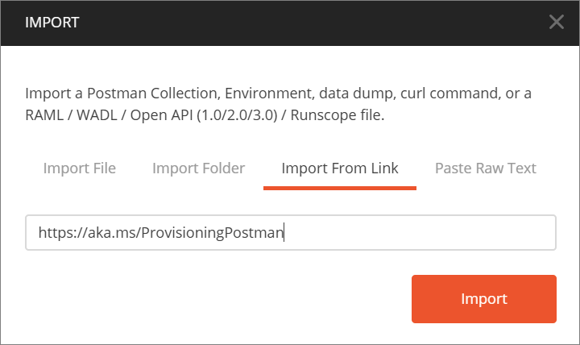
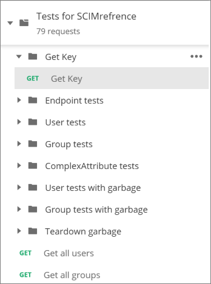

# Tutorial: Validate a SCIM endpoint

This tutorial describes how to use the Microsoft Entra SCIM Validator to validate that your provisioning server is compatible with the Azure SCIM client. The tutorial is intended for developers who want to build a SCIM compatible server to manage their identities with the Microsoft Entra provisioning service.

In this tutorial, you learn how to:

> [!div class="checklist"]
> * Select a testing method
> * Configure the testing method
> * Validate your SCIM endpoint

## Prerequisites

- A Microsoft Entra account with an active subscription. [Create an account for free](https://azure.microsoft.com/free/?WT.mc_id=A261C142F).
- A SCIM endpoint that conforms to the SCIM 2.0 standard and meets the provision service requirements. To learn more, see [Tutorial: Develop and plan provisioning for a SCIM endpoint in Microsoft Entra ID](use-scim-to-provision-users-and-groups.md).

## Select a testing method
The first step is to select a testing method to validate your SCIM endpoint.

1. Open your web browser and navigate to the SCIM Validator: [https://scimvalidator.microsoft.com/](https://scimvalidator.microsoft.com/).
1. Select one of the three test options. You can use default attributes, automatically discover the schema, or upload a schema.

    :::image type="content" source="./media/scim-validator-tutorial/scim-validator.png" alt-text="Screenshot of SCIM Validator main page." lightbox="./media/scim-validator-tutorial/scim-validator.png":::

**Use default attributes** - The system provides the default attributes, and you modify them to meet your need.

**Discover schema** - If your end point supports /Schema, this option lets the tool discover the supported attributes. We recommend this option as it reduces the overhead of updating your app as you build it out.

**Upload Microsoft Entra Schema** - Upload the schema you've downloaded from your sample app on Microsoft Entra ID.

## Configure the testing method
Now that you've selected a testing method, the next step is to configure it.

:::image type="content" source="./media/scim-validator-tutorial/scim-validator-attributes.png" alt-text="Screenshot of SCIM Validator attributes page." lightbox="./media/scim-validator-tutorial/scim-validator-attributes.png":::

1. If you're using the default attributes option, then fill in all of the indicated fields.
2. If you're using the discover schema option, then enter the SCIM endpoint URL and token.
3. If you're uploading a schema, then select your .json file to upload. The option accepts a .json file exported from your sample app on the Microsoft Entra admin center. To learn how to export a schema, see [How-to: Export provisioning configuration and roll back to a known good state](export-import-provisioning-configuration.md#export-your-provisioning-configuration). 
> [!NOTE]
> To test *group attributes*, make sure to select **Enable Group Tests**.

4. Edit the list attributes as desired for both the user and group types using the ‘Add Attribute’ option at the end of the attribute list and minus (-) sign on the right side of the page. 
5. Select the joining property from both the user and group attributes list. 
> [!NOTE]
> The joining property, also known as matching attribute, is an attribute that user and group resources can be uniquely queried on at the source and matched in the target system.

## Validate your SCIM endpoint
Finally, you need to test and validate your endpoint.

1. Select **Test Schema** to begin the test.
1. Review the results with a summary of passed and failed tests.
1. Select the **show details** tab and review and fix issues.
1. Continue to test your schema until all tests pass.

    :::image type="content" source="./media/scim-validator-tutorial/scim-validator-results.png" alt-text="Screenshot of SCIM Validator results page." lightbox="./media/scim-validator-tutorial/scim-validator-results.png":::

### Use Postman to test endpoints (optional)

In addition to using the SCIM Validator tool, you can also use Postman to validate an endpoint. This example provides a set of tests in Postman. The example validates create, read, update, and delete (CRUD) operations. The operations are validated on users and groups, filtering, updates to group membership, and disabling users.

The endpoints are in the `{host}/scim/` directory, and you can use standard HTTP requests to interact with them. To modify the `/scim/` route, see *ControllerConstant.cs* in **AzureADProvisioningSCIMreference** > **ScimReferenceApi** > **Controllers**.

> [!NOTE]
> You can only use HTTP endpoints for local tests. The Microsoft Entra provisioning service requires that your endpoint support HTTPS.

1. Download [Postman](https://www.postman.com/downloads/) and start the application.
1. Copy and paste this link into Postman to import the test collection: `https://aka.ms/ProvisioningPostman`.

    

1. Create a test environment that has these variables:

   |Environment|Variable|Value|
   |-|-|-|
   |Run the project locally by using IIS Express|||
   ||**Server**|`localhost`|
   ||**Port**|`:44359` *(don't forget the **`:`**)*|
   ||**Api**|`scim`|
   |Run the project locally by using Kestrel|||
   ||**Server**|`localhost`|
   ||**Port**|`:5001` *(don't forget the **`:`**)*|
   ||**Api**|`scim`|
   |Host the endpoint in Azure|||
   ||**Server**|*(input your SCIM URL)*|
   ||**Port**|*(leave blank)*|
   ||**Api**|`scim`|

1. Use **Get Key** from the Postman collection to send a **GET** request to the token endpoint and retrieve a security token to be stored in the **token** variable for subsequent requests.

   

   > [!NOTE]
   > To make a SCIM endpoint secure, you need a security token before you connect. The tutorial uses the `{host}/scim/token` endpoint to generate a self-signed token.

That's it! You can now run the **Postman** collection to test the SCIM endpoint functionality.

## Clean up resources

If you created any Azure resources in your testing that are no longer needed, don't forget to delete them.

## Known Issues with Microsoft Entra SCIM Validator

- Soft deletes (disables) aren’t yet supported.
- The time zone format is randomly generated and fails for systems that try to validate it.
- The preferred language format is randomly generated and fails for systems that try to validate it.
- The patch user remove attributes may attempt to remove mandatory/required attributes for certain systems. Such failures should be ignored.

## Next steps
- [Learn how to add an app that's not in the Microsoft Entra app gallery](../manage-apps/overview-application-gallery.md)
