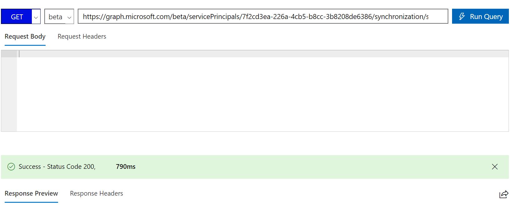
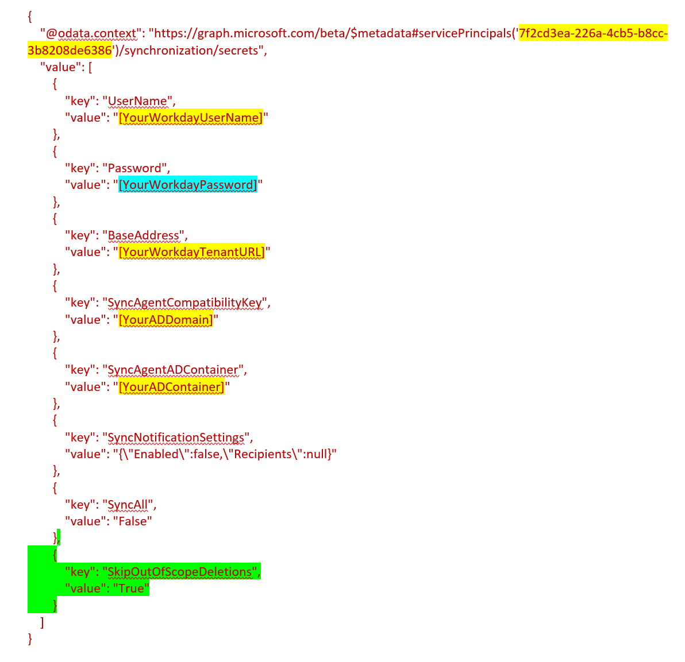
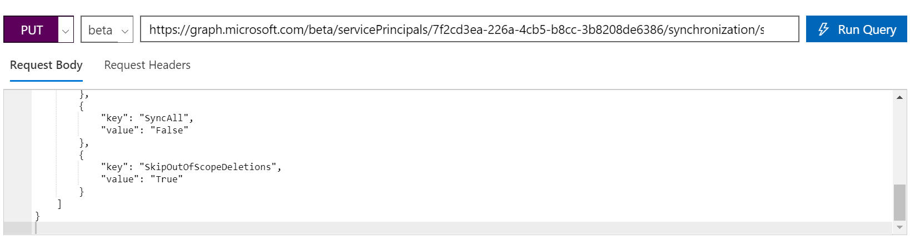
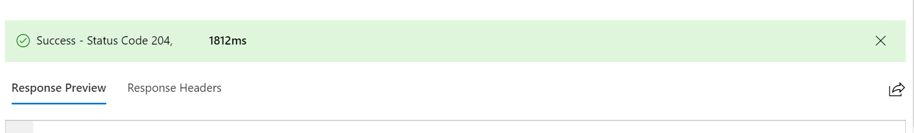
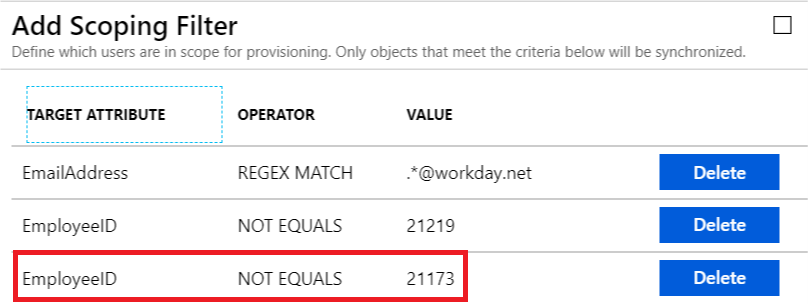

# Skip deletion of user accounts that go out of scope

By default, the Azure AD provisioning engine soft deletes or disables users that go out of scope. However, for certain scenarios like Workday to AD User Inbound Provisioning, this behavior may not be the expected and you may want to override this default behavior.  

This article describes how to use the Microsoft Graph API and the Microsoft Graph API explorer to set the flag ***SkipOutOfScopeDeletions*** that controls the processing of accounts that go out of scope. 
* If ***SkipOutOfScopeDeletions*** is set to 0 (false), accounts that go out of scope will be disabled in the target.
* If ***SkipOutOfScopeDeletions*** is set to 1 (true), accounts that go out of scope will not be disabled in the target. This flag is set at the *Provisioning App* level and can be configured using the Graph API. 

Because this configuration is widely used with the *Workday to Active Directory user provisioning* app, the following steps include screenshots of the Workday application. However, the configuration can also be used with *all other apps*, such as ServiceNow, Salesforce, and Dropbox.

## Step 1: Retrieve your Provisioning App Service Principal ID (Object ID)

1. Launch the [Azure portal](https://portal.azure.com), and navigate to the Properties section of your  provisioning application. For e.g. if you want to export your *Workday to AD User Provisioning application* mapping navigate to the Properties section of that app. 
1. In the Properties section of your provisioning app, copy the GUID value associated with the *Object ID* field. This value is also called the **ServicePrincipalId** of your App and it will be used in Graph Explorer operations.

   

## Step 2: Sign into Microsoft Graph Explorer

1. Launch [Microsoft Graph Explorer](https://developer.microsoft.com/graph/graph-explorer)
1. Click on the "Sign-In with Microsoft" button and sign-in using Azure AD Global Admin or App Admin credentials.

    

1. Upon successful sign-in, you will see the user account details in the left-hand pane.

## Step 3: Get existing app credentials and connectivity details

In the Microsoft Graph Explorer, run the following GET query replacing [servicePrincipalId]  with the **ServicePrincipalId** extracted from the [Step 1](#step-1-retrieve-your-provisioning-app-service-principal-id-object-id).

```http
   GET https://graph.microsoft.com/beta/servicePrincipals/[servicePrincipalId]/synchronization/secrets
```

   

Copy the Response into a text file. It will look like the JSON text shown below, with values highlighted in yellow specific to your deployment. Add the lines highlighted in green to the end and update the Workday connection password highlighted in blue. 

   

Here is the JSON block to add to the mapping. 

```json
        {
            "key": "SkipOutOfScopeDeletions",
            "value": "True"
        }
```

## Step 4: Update the secrets endpoint with the SkipOutOfScopeDeletions flag

In the Graph Explorer, run the command below to update the secrets endpoint with the ***SkipOutOfScopeDeletions*** flag. 

In the URL below replace [servicePrincipalId]  with the **ServicePrincipalId** extracted from the [Step 1](#step-1-retrieve-your-provisioning-app-service-principal-id-object-id). 

```http
   PUT https://graph.microsoft.com/beta/servicePrincipals/[servicePrincipalId]/synchronization/secrets
```
Copy the updated text from Step 3 into the "Request Body" and set the header "Content-Type" to "application/json" in "Request Headers". 

   

Click on “Run Query”. 

You should get the output as "Success – Status Code 204". 

   

## Step 5: Verify that out of scope users don’t get disabled

You can test this flag results in expected behavior by updating your scoping rules to skip a specific user. In the example below, we are excluding the employee with ID 21173 (who was earlier in scope) by adding a new scoping rule: 

   

In the next provisioning cycle, the Azure AD provisioning service will identify that the user 21173 has gone out of scope and if the SkipOutOfScopeDeletions property is enabled, then the synchronization rule for that user will display a message as shown below: 

   


