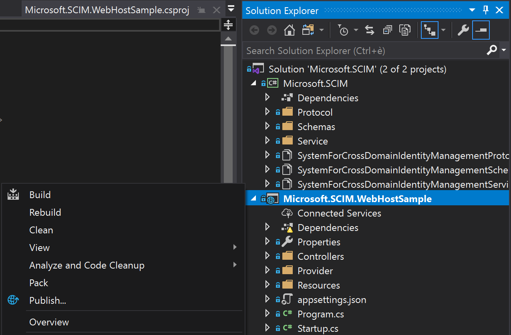
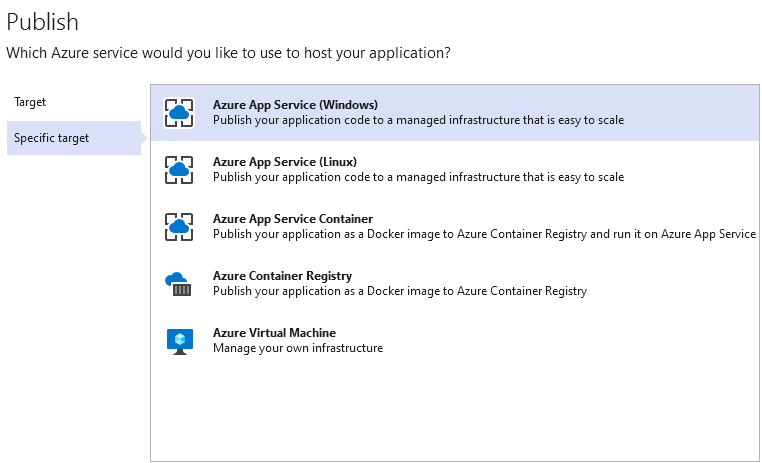
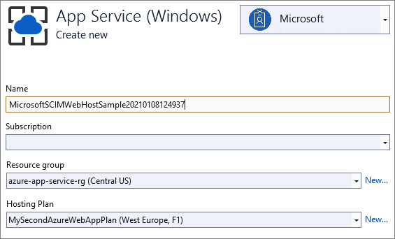
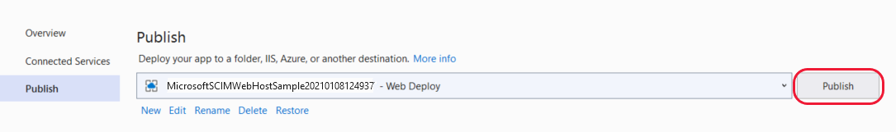
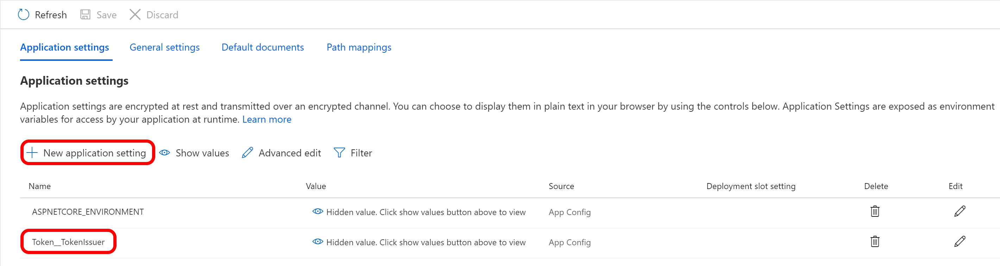

# Tutorial: Develop a sample SCIM endpoint in Microsoft Entra ID

This tutorial describes how to deploy the SCIM [reference code](https://aka.ms/scimreferencecode) with  [Azure App Service](/azure/app-service/). Then, test the code by using Postman or by integrating with the Microsoft Entra provisioning service. The tutorial is intended for developers who want to get started with SCIM, or anyone interested in testing a [SCIM endpoint](./use-scim-to-provision-users-and-groups.md). 

In this tutorial, you learn how to:

> [!div class="checklist"]
>
> * Deploy your SCIM endpoint in Azure.
> * Test your SCIM endpoint.

## Deploy your SCIM endpoint in Azure


The steps here deploy the SCIM endpoint to a service by using [Visual Studio 2019](https://visualstudio.microsoft.com/downloads/) and [Visual Studio Code](https://code.visualstudio.com/) with [Azure App Service](/azure/app-service/). The SCIM reference code can run locally, hosted by an on-premises server, or deployed to another external service.

### Get and deploy the sample app

Go to the [reference code](https://github.com/AzureAD/SCIMReferenceCode) from GitHub and select **Clone or download**. Select **Open in Desktop**, or copy the link, open Visual Studio, and select **Clone or check out code** to enter the copied link and make a local copy. Save the files into a folder where the total length of the path is 260 or fewer characters.

# [Visual Studio](#tab/visual-studio)

1. In Visual Studio, make sure to sign in to the account that has access to your hosting resources.

1. In Solution Explorer, open *Microsoft.SCIM.sln* and right-click the *Microsoft.SCIM.WebHostSample* file. Select **Publish**.

    

    > [!NOTE]
    > To run this solution locally, double-click the project and select **IIS Express** to launch the project as a webpage with a local host URL.

1. Select **Create profile** and make sure that **App Service** and **Create new** are selected.

    

1. Step through the dialog options and rename the app to a name of your choice. This name is used in both the app and the SCIM endpoint URL.

    

1. Select the resource group to use and select **Publish**.

    


# [Visual Studio Code](#tab/visual-studio-code)

1. In Visual Studio Code, make sure to sign in to the account that has access to your hosting resources.

1. In Visual Studio Code, open the folder that contains the *Microsoft.SCIM.sln* file.

1. Open the Visual Studio Code integrated [terminal](https://code.visualstudio.com/docs/terminal/basics) and run the [dotnet restore](/nuget/consume-packages/install-use-packages-dotnet-cli#restore-packages) command. This command  restores the packages listed in the project files. 

1. In the terminal, change the directory using the `cd Microsoft.SCIM.WebHostSample` command

1. To run your app locally, in the terminal, run the .NET CLI command. The [dotnet run](/dotnet/core/tools/dotnet-run) runs the Microsoft.SCIM.WebHostSample project using the [development environment](/aspnet/core/fundamentals/environments#set-environment-on-the-command-line).

    ```dotnetcli
    dotnet run --environment Development
    ```

1. If not installed, add [Azure App Service for Visual Studio Code](https://marketplace.visualstudio.com/items?itemName=ms-azuretools.vscode-azureappservice) extension.

1. To deploy the Microsoft.SCIM.WebHostSample app to Azure App Services, [create a new App Services](/azure/app-service/quickstart-dotnetcore?tabs=net60&pivots=development-environment-vscode#2-publish-your-web-app).

1. In the Visual Studio Code terminal, run the .NET CLI command. This command generates a deployable publish folder for the app in the bin/debug/publish directory.

    ```dotnetcli
    dotnet publish -c Debug
    ```

1. In the Visual Studio Code explorer, right-click on the generated **publish** folder, and select Deploy to Web App.
1. A new workflow opens in the command palette at the top of the screen. Select the **Subscription** you would like to publish your app to.
1. Select the **App Service** web app you created earlier.
1. If Visual Studio Code prompts you to confirm, select **Deploy**. The deployment process may take a few moments. When the process completes, a notification should appear in the bottom right corner prompting you to browse to the deployed app.

---

### Configure the App Service

Go to the application in **Azure App Service** > **Configuration** and select **New application setting** to add the *Token__TokenIssuer* setting with the value `https://sts.windows.net/<tenant_id>/`. Replace `<tenant_id>` with your Microsoft Entra tenant ID. If you want to test the SCIM endpoint by using [Postman](https://github.com/AzureAD/SCIMReferenceCode/wiki/Test-Your-SCIM-Endpoint), add an *ASPNETCORE_ENVIRONMENT* setting with the value `Development`.



When you test your endpoint with an enterprise application in the [Microsoft Entra admin center](use-scim-to-provision-users-and-groups.md#integrate-your-scim-endpoint-with-the-azure-ad-provisioning-service), you have two options. You can keep the environment in `Development` and provide the testing token from the `/scim/token` endpoint, or you can change the environment to `Production` and leave the token field empty.

That's it! Your SCIM endpoint is now published, and you can use the Azure App Service URL to test the SCIM endpoint.

## Test your SCIM endpoint

Requests to a SCIM endpoint require authorization. The SCIM standard has multiple options available.  Requests can use cookies, basic authentication, TLS client authentication, or any of the methods listed in [RFC 7644](https://tools.ietf.org/html/rfc7644#section-2).

Be sure to avoid methods that aren't secure, such as username and password, in favor of a more secure method such as OAuth. Microsoft Entra ID supports long-lived bearer tokens (for gallery and non-gallery applications) and the OAuth authorization grant (for gallery applications).

> [!NOTE]
> The authorization methods provided in the repo are for testing only. When you integrate with Microsoft Entra ID, you can review the authorization guidance. See [Plan provisioning for a SCIM endpoint](use-scim-to-provision-users-and-groups.md).

The development environment enables features that are unsafe for production, such as reference code to control the behavior of the security token validation. The token validation code uses a self-signed security token, and the signing key is stored in the configuration file. See the **Token:IssuerSigningKey** parameter in the *appsettings.Development.json* file.

```json
"Token": {
    "TokenAudience": "Microsoft.Security.Bearer",
    "TokenIssuer": "Microsoft.Security.Bearer",
    "IssuerSigningKey": "A1B2C3D4E5F6A1B2C3D4E5F6",
    "TokenLifetimeInMins": "120"
}
```

> [!NOTE]
> When you send a **GET** request to the `/scim/token` endpoint, a token is issued using the configured key. That token can be used as a bearer token for subsequent authorization.

The default token validation code is configured to use a Microsoft Entra token and requires the issuing tenant be configured by using the **Token:TokenIssuer** parameter in the *appsettings.json* file.

``` json
"Token": {
    "TokenAudience": "8adf8e6e-67b2-4cf2-a259-e3dc5476c621",
    "TokenIssuer": "https://sts.windows.net/<tenant_id>/"
}
```

## Next steps

- [Tutorial: Validate a SCIM endpoint](scim-validator-tutorial.md)
- [Tutorial: Develop and plan provisioning for a SCIM endpoint](use-scim-to-provision-users-and-groups.md)
- [Tutorial: Configure provisioning for a gallery app](configure-automatic-user-provisioning-portal.md)
