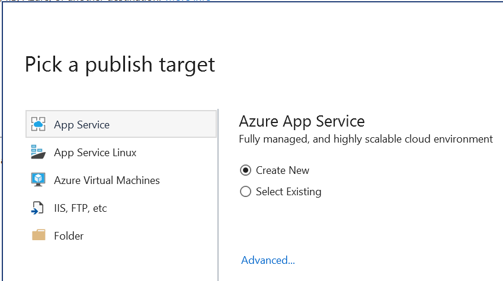
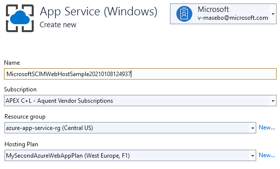

# Tutorial: Develop a sample SCIM endpoint

[SCIM](https://aka.ms/scimoverview) is a standard definition of two endpoints, `/Users` and `/Groups`, with common REST verbs to create, update, and delete objects, and a pre-defined schema for common attributes like group name, username, first name, last name and email. Use SCIM 2.0 REST API in apps to reduce the overhead of working with a proprietary user management API, for example, a SCIM-compliant client can make an HTTP POST with a JSON object to the `/Users` endpoint to create a new user entry without the need of proprietary code.

> [!div class="checklist"]
> * View the reference code
> * Develop and deploy your SCIM endpoint
> * Test your deployment
> * Integrate your SCIM endpoint with a SCIM client

The [reference code](https://github.com/AzureAD/SCIMReferenceCode) is provided to build a [SCIM](https://docs.microsoft.com/azure/active-directory/manage-apps/use-scim-to-provision-users-and-groups) endpoint. It contains guidance on how to implement basic requirements for CRUD operations on a user and group object (also known as resources in SCIM) and optional features of the standard such as filtering and pagination.

The `Microsoft.SystemForCrossDomainIdentityManagement` project contains the code base for building a SCIM API. The `Microsoft.SCIM.WebHostSample` project is there as a sample for using the project. A step by step guide for starting up with the project can be found [here](https://github.com/AzureAD/SCIMReferenceCode/wiki).

The following capabilities are included in this endpoint:

|Endpoint|Description|
|---|---|
|/User|**Perform CRUD operations on a user resource:** <br/> 1. Create <br/> 2. Update <br/> 3. Delete <br/> 4. Get <br/> 5. List <br/> 6. Filter|
|/Group|**Perform CRUD operations on a group resource:** <br/> 1. Create <br/> 2. Update <br/> 3. Delete <br/> 4. Get <br/> 5. List <br/> 6. Filter |
|/Schemas|**Retrieve one or more supported schemas.**<br/>The set of attributes of a resource supported by each service provider can vary. (e.g. Service Provider A supports “name”, “title”, and “emails” while Service Provider B supports “name”, “title”, and “phoneNumbers” for users).|
|/ResourceTypes|**Retrieve supported resource types.**<br/>The number and types of resources supported by each service provider can vary. (e.g. Service Provider A supports users while Service Provider B supports users and groups).|
|/ServiceProviderConfig|**Retrieve service provider's SCIM configuration**<br/>The SCIM features supported by each service provider can vary. (e.g. Service Provider A supports Patch operations while Service Provider B supports Patch Operations and Schema Discovery).|

## View the reference code

This reference code was developed as a .Net core MVC web API for SCIM provisioning. The three main folders are Schemas, Controllers, and Protocol.

1. The **Schemas** folder includes:
    * The models for the User and Group resources along with some abstract classes like Schematized for shared functionality.
    * An Attributes folder which contains the class definitions for complex attributes of Users and Groups such as addresses.
2. The **Service** folder contains logic for actions relating to the way resources are queried and updated.
    * The reference code has services to return users and groups.
    * The **controllers** folder contains the various SCIM endpoints. Resource controllers include HTTP verbs to perform CRUD operations on the resource (GET, POST, PUT, PATCH, DELETE). Controllers rely on services to perform the actions.
3. The **Protocol** folder contains logic for actions relating to the way resources are returned according to the SCIM RFC such as:
    * Returning multiple resources as a list.
    * Returning only specific resources based on a filter.
    * Turning a query into a list of linked lists of single filters.
    * Turning a PATCH request into an operation with attributes pertaining to the value path. 
    * Defining the type of operation that can be used to apply changes to resource objects.

The project includes the following contents:

| File/folder       | Description                                |
|-------------------|--------------------------------------------|
| `Microsoft.SystemForCrossDomainIdentityManagement`| Sample source code.|
| `Microsoft.SCIM.WebHostSample`| Sample implementation of the SCIM library.|
| `.gitignore`      | Define what to ignore at commit time.      |
| `CHANGELOG.md`    | List of changes to the sample.             |
| `CONTRIBUTING.md` | Guidelines for contributing to the sample. |
| `README.md`       | This README file.                          |
| `LICENSE`         | The license for the sample.                |

> [!NOTE]
> This code is intended to help you get started building your SCIM endpoint and is provided "AS IS." It is intended as a reference and there is no guarantee of it being actively maintained or supported. [Contributions](https://github.com/AzureAD/SCIMReferenceCode/wiki/Contributing-Overview) from the community are welcome to help build and maintain the repo.
>
> This project welcomes contributions and suggestions! Like other open source contributions, you will need to agree to a Contributor License Agreement (CLA) declaring that you have the right to, and actually do, grant us the rights to use your contribution. For details, visit https://cla.opensource.microsoft.com.
>
> When submitting a pull request, a CLA bot will automatically determine whether you need to provide a CLA and decorate the PR appropriately (e.g. status check, comment). Simply follow the instructions provided by the bot. You will only need to do this once across all repos using our CLA.
>
> This project has adopted the [Microsoft Open Source Code of Conduct](https://opensource.microsoft.com/codeofconduct/). For more information see the [Code of Conduct FAQ](https://opensource.microsoft.com/codeofconduct/faq/) or contact [opencode@microsoft.com](mailto:opencode@microsoft.com) with any additional questions or comments.
>
> The reference code is intended to help you get started building your SCIM endpoint and is provided "AS IS." Contributions from the community are welcome to help build and maintain the code. 

### Understanding SCIM Reference Authorization

The SCIM standard leaves authentication and authorization relatively open. You could use cookies, basic authentication, TLS client authentication, or any of the other methods listed [here](https://tools.ietf.org/html/rfc7644#section-2). You should take into consideration security and industry best practices when choosing an authentication/authorization method. Avoid insecure methods such as username and password in favor of more secure methods such as OAuth. Azure AD supports long-lived bearer tokens (for gallery and non-gallery applications) as well as the OAuth authorization grant (for applications published in the app gallery). Review the [wiki](https://github.com/AzureAD/SCIMReferenceCode/wiki/Authorization) for more details about the current authorization support that this reference code provides.   

> [!NOTE]
> These authorization methods provided by this repo are solely for testing. When integrating with Azure AD, review the authorization guidance provided [here](https://docs.microsoft.com/azure/active-directory/app-provisioning/use-scim-to-provision-users-and-groups#authorization-for-provisioning-connectors-in-the-application-gallery). 

All requests to the SCIM endpoints require authorization.

The SCIM reference code uses ASP.NET Core environments to control the way authorization is performed while in development or after deployment.

[Use multiple environments in ASP.NET Core](https://docs.microsoft.com/aspnet/core/fundamentals/environments?view=aspnetcore-3.1)

```csharp
private readonly IWebHostEnvironment _env;
...

public void ConfigureServices(IServiceCollection services)
{
    if (_env.IsDevelopment())
    {
        ...
    }
    else
    {
        ...
    }
```

## Develop and deploy your SCIM endpoint

You can deploy your SCIM endpoint locally, host it in Azure, or any cloud provider that you choose. We've outlined some [simple steps](https://github.com/AzureAD/SCIMReferenceCode/wiki/Deploy-on-Azure-App-Service) to deploy your SCIM endpoint using Azure App Service.

The SCIM reference code can be deployed locally, hosted on a server on premises, or in a service such as Azure App Services. The instructions below show you how to host the SCIM endpoint in the cloud using [Visual Studio 2019](https://visualstudio.microsoft.com/downloads/) and [Azure App Services](https://docs.microsoft.com/azure/app-service/).

To deploy to Azure App Service:

1. Open Visual Studio and sign into the account that has access to your hosting resources.
1. While in the *Microsoft.SCIM.sln* view, right-click the *Microsoft.SCIM.WebHostSample* file in the Solution Explorer and select **Publish**.

    

1. Select create profile. Make sure **App Service** and **Create new** are selected.

	

1. Walk through the options in the dialog.
1. Rename the app to a desired name of your choice. The name is used for both the app name and the SCIM Endpoint URL.

	

1. Select the resource group and plan you would like to use and click **Publish**.
1. Navigate to the application in **Azure App Services** > **Configuration**, click on **New application setting** to add the ***Token__TokenIssuer*** setting with the value "https://sts.windows.net/***tenant_id***/" (replace ***tenant_id*** by your Azure AD tenant id). If you are looking to test the SCIM endpoint with [Postman](https://github.com/AzureAD/SCIMReferenceCode/wiki/Test-Your-SCIM-Endpoint) you should also add a setting named ASPNETCORE_ENVIRONMENT with the value of "Development". When testing your endpoint with an Enterprise Application in the Azure Portal, you can either keep the environment as Development and provide the token generated from the /scim/token endpoint for testing as described on the [testing](https://github.com/AzureAD/SCIMReferenceCode/wiki/Test-Your-SCIM-Endpoint) page or you can change the environment to Production and leave the token field empty in the enterprise application in the [Azure Portal](https://docs.microsoft.com/azure/active-directory/app-provisioning/use-scim-to-provision-users-and-groups#step-4-integrate-your-scim-endpoint-with-the-azure-ad-scim-client). 

	

That's it! Your SCIM endpoint is now published and you can use the Azure App Service URL to [Test Your SCIM Endpoint](Test-Your-SCIM-Endpoint) your SCIM endpoint.

All the endpoints are are at the **{host}/scim/** directory and can be interacted with standard HTTP requests. The **/scim/** route can be modified in the *ControllerConstant.cs* file located in **AzureADProvisioningSCIMreference > ScimReferenceApi > Controllers**.

## Test your deployment

Once you’ve built your SCIM endpoint, you’ll want to test it to ensure that your endpoint is compliant with the SCIM RFC. We've provided a set of [Postman](https://github.com/AzureAD/SCIMReferenceCode/wiki/Test-Your-SCIM-Endpoint) tests that you can run to verify CRUD operations on users / groups, filtering on users / groups, updating group memberships, and disabling / soft deleting users.

Provided below are test cases that you can use to ensure that your SCIM endpoint is compliant with the SCIM RFC.

All the endpoints are are at the **{host}/scim/** directory and can be interacted with standard HTTP requests. The **/scim/** route can be modified in the *ControllerConstant.cs* file located in **AzureADProvisioningSCIMreference > ScimReferenceApi > Controllers**. You can use http endpoints for testing locally, but the Azure AD provisioning service requires that your endpoint supports HTTPS.

### Run the Solution Locally

1. Click **Clone or download** and click **Open in Desktop** OR copy the link.
2. If you chose to copy the link, open Visual Studio and choose **Clone or check out code**.
3. Use the copied link from Github to make a local copy of all files.
4. The Solution Explorer should open. Navigate to *Microsoft.SCIM.sln* view by double-clicking on it.
5. Click **IIS Express** to execute. The project will launch as a web page with the local host URL.

### Configure Postman

1. Download the [Postman client](https://www.getpostman.com/downloads/).
2. Import the Postman collection by copying the link [https://aka.ms/ProvisioningPostman](https://aka.ms/ProvisioningPostman) and pasting it into Postman as shown below:

	

3. Create a Postman environment for testing by specifying the following variables below:
    * **If running the project locally using IIS Express**:
        |Variable|Value|
        |---|---|
        |Server|localhost|
        |Port|:44359 (* Don't forget the ':')|
        |Api|scim|
    * **If running the project locally using Kestrel**:
        |Variable|Value|
        |---|---|
        |Server|localhost|
        |Port|:5001 (* Don't forget the ':')|
        |Api|scim|
    * **If hosting the endpoint in Azure**:
        |Variable|Value|
        |---|---|
        |Server|(Input your SCIM URL)|
        |Port|(* leave it blank)|
        |Api|scim|

### Run the Postman Tests

The SCIM endpoints are secured, before you connecting you need to get a security token. In the sample code, you can use the **{host}/scim/token** endpoint to generate a self-signed token.
Use "Get Key" from the Postman Collection to send a GET request to the token endpoint and retrieve the security token (the resulting token will be stored in the "token" variable and used in the subsequent requests).


## Integrate your SCIM endpoint with a SCIM client

Developing a SCIM compliant user and group endpoint ensures interoperability with any [SCIM client](http://www.simplecloud.info/#Implementations2). You can use the documentation here to integrate your endpoint with the the [Azure AD SCIM client](https://docs.microsoft.com/azure/active-directory/app-provisioning/use-scim-to-provision-users-and-groups).  


### Development Environment

The development environment enables features that shouldn't be exposed in production, in the reference code it controls the behavior of the security token validation.

The token validation code is configured to use a self signed security token, the signing key is stored in the configuration file, look for the "Token:IssuerSigningKey" parameter in the *appsettings.Development.json* file.

```json
"Token": {
    "TokenAudience": "Microsoft.Security.Bearer",
    "TokenIssuer": "Microsoft.Security.Bearer",
    "IssuerSigningKey": "A1B2C3D4E5F6A1B2C3D4E5F6",
    "TokenLifetimeInMins": "120"
}
```

> [!NOTE]
> By sending a GET request to the **/scim/token** endpoint, a token is issued using the configured key. This token can be used as bearer token for subsequent authorization.

### Default Environment

The default token validation code is configured to use a token issued by Azure Active Directory, the issuing tenant needs to be configured using the "Token:TokenIssuer" parameter in the *appsettings.json* file.

``` json
"Token": {
    "TokenAudience": "8adf8e6e-67b2-4cf2-a259-e3dc5476c621",
    "TokenIssuer": "https://sts.windows.net/<tenant_id>/"
}
```

> [!NOTE]
> To deploy to Azure App Service use the "Application settings" under "Settings->Configuration" to configure the ***TokenIssuer***. No modification to the code is needed.


Next Steps
> [!div class="nextstepaction"]
> [Tutorial: Develop and plan provisioning for a SCIM endpoint](use-scim-to-provision-users-and-groups.md)
> [Tutorial: Configure provisioning for a gallery app](configure-automatic-user-provisioning-portal.md)