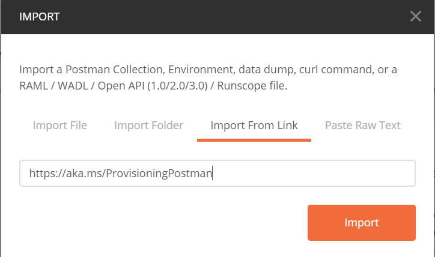
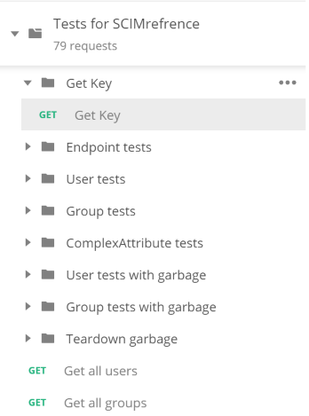

# Tutorial: Develop a sample SCIM endpoint in Azure Active Directory

No one wants to build a new endpoint from scratch, so we created some [reference code](https://aka.ms/scimreferencecode) for you to get started with [System for Cross-domain Identity Management (SCIM)](https://aka.ms/scimoverview). You can get your SCIM endpoint up and running with no code in just five minutes.

This tutorial describes how to deploy the SCIM reference code in Azure and test it by using Postman or by integrating with the Azure Active Directory (Azure AD) SCIM client. This tutorial is intended for developers who want to get started with SCIM, or anyone interested in testing a SCIM endpoint.

In this tutorial, you learn how to:

> [!div class="checklist"]
>
> * Deploy your SCIM endpoint in Azure.
> * Test your SCIM endpoint.

## Deploy your SCIM endpoint in Azure

The steps here deploy the SCIM endpoint to a service by using [Visual Studio 2019](https://visualstudio.microsoft.com/downloads/) and [Azure App Service](../../app-service/index.yml). The SCIM reference code can also be run locally, hosted by an on-premises server, or deployed to another external service.

1. Go to the [reference code](https://github.com/AzureAD/SCIMReferenceCode) from GitHub and select **Clone or download**.

1. Select **Open in Desktop**, or copy the link, open Visual Studio, and select **Clone or check out code** to enter the copied link and make a local copy.

1. In Visual Studio, make sure to sign in to the account that has access to your hosting resources.

1. In Solution Explorer, open *Microsoft.SCIM.sln* and right-click the *Microsoft.SCIM.WebHostSample* file. Select **Publish**.

    

    > [!NOTE]
    > To run this solution locally, double-click the project and select **IIS Express** to launch the project as a webpage with a local host URL.

1. Select **Create profile** and make sure that **App Service** and **Create new** are selected.

    

1. Step through the dialog options and rename the app to a name of your choice. This name is used in both the app and the SCIM endpoint URL.

    

1. Select the resource group to use and select **Publish**.

    

1. Go to the application in **Azure App Service** > **Configuration** and select **New application setting** to add the *Token__TokenIssuer* setting with the value `https://sts.windows.net/<tenant_id>/`. Replace `<tenant_id>` with your Azure AD tenant ID. If you want to test the SCIM endpoint by using [Postman](https://github.com/AzureAD/SCIMReferenceCode/wiki/Test-Your-SCIM-Endpoint), add an *ASPNETCORE_ENVIRONMENT* setting with the value `Development`.

   

   When you test your endpoint with an enterprise application in the [Azure portal](use-scim-to-provision-users-and-groups.md#integrate-your-scim-endpoint-with-the-aad-scim-client), you have two options. You can keep the environment in `Development` and provide the testing token from the `/scim/token` endpoint, or you can change the environment to `Production` and leave the token field empty.

That's it! Your SCIM endpoint is now published, and you can use the Azure App Service URL to test the SCIM endpoint.

## Test your SCIM endpoint

Requests to a SCIM endpoint require authorization. The SCIM standard has multiple options for authentication and authorization, including cookies, basic authentication, TLS client authentication, or any of the methods listed in [RFC 7644](https://tools.ietf.org/html/rfc7644#section-2).

Be sure to avoid methods that aren't secure, such as username and password, in favor of a more secure method such as OAuth. Azure AD supports long-lived bearer tokens (for gallery and non-gallery applications) and the OAuth authorization grant (for gallery applications).

> [!NOTE]
> The authorization methods provided in the repo are for testing only. When you integrate with Azure AD, you can review the authorization guidance. See [Plan provisioning for a SCIM endpoint](use-scim-to-provision-users-and-groups.md).

The development environment enables features that are unsafe for production, such as reference code to control the behavior of the security token validation. The token validation code uses a self-signed security token, and the signing key is stored in the configuration file. See the **Token:IssuerSigningKey** parameter in the *appsettings.Development.json* file.

```json
"Token": {
    "TokenAudience": "Microsoft.Security.Bearer",
    "TokenIssuer": "Microsoft.Security.Bearer",
    "IssuerSigningKey": "A1B2C3D4E5F6A1B2C3D4E5F6",
    "TokenLifetimeInMins": "120"
}
```

> [!NOTE]
> When you send a **GET** request to the `/scim/token` endpoint, a token is issued using the configured key. That token can be used as a bearer token for subsequent authorization.

The default token validation code is configured to use an Azure AD token and requires the issuing tenant be configured by using the **Token:TokenIssuer** parameter in the *appsettings.json* file.

``` json
"Token": {
    "TokenAudience": "8adf8e6e-67b2-4cf2-a259-e3dc5476c621",
    "TokenIssuer": "https://sts.windows.net/<tenant_id>/"
}
```

### Use Postman to test endpoints

After you deploy the SCIM endpoint, you can test to ensure that it's compliant with SCIM RFC. This example provides a set of tests in Postman that validate CRUD (create, read, update, and delete) operations on users and groups, filtering, updates to group membership, and disabling users.

The endpoints are in the `{host}/scim/` directory, and you can use standard HTTP requests to interact with them. To modify the `/scim/` route, see *ControllerConstant.cs* in **AzureADProvisioningSCIMreference** > **ScimReferenceApi** > **Controllers**.

> [!NOTE]
> You can only use HTTP endpoints for local tests. The Azure AD provisioning service requires that your endpoint support HTTPS.

1. Download [Postman](https://www.getpostman.com/downloads/) and start the application.
1. Copy and paste this link into Postman to import the test collection: `https://aka.ms/ProvisioningPostman`.

    

1. Create a test environment that has these variables:

   |Environment|Variable|Value|
   |-|-|-|
   |Run the project locally by using IIS Express|||
   ||**Server**|`localhost`|
   ||**Port**|`:44359` *(don't forget the **`:`**)*|
   ||**Api**|`scim`|
   |Run the project locally by using Kestrel|||
   ||**Server**|`localhost`|
   ||**Port**|`:5001` *(don't forget the **`:`**)*|
   ||**Api**|`scim`|
   |Host the endpoint in Azure|||
   ||**Server**|*(input your SCIM URL)*|
   ||**Port**|*(leave blank)*|
   ||**Api**|`scim`|

1. Use **Get Key** from the Postman collection to send a **GET** request to the token endpoint and retrieve a security token to be stored in the **token** variable for subsequent requests.

   

   > [!NOTE]
   > To make a SCIM endpoint secure, you need a security token before you connect. The tutorial uses the `{host}/scim/token` endpoint to generate a self-signed token.

That's it! You can now run the **Postman** collection to test the SCIM endpoint functionality.

## Next steps

To develop a SCIM-compliant user and group endpoint with interoperability for a client, see [SCIM client implementation](http://www.simplecloud.info/#Implementations2).

> [!div class="nextstepaction"]
> [Tutorial: Develop and plan provisioning for a SCIM endpoint](use-scim-to-provision-users-and-groups.md)
> [Tutorial: Configure provisioning for a gallery app](configure-automatic-user-provisioning-portal.md)