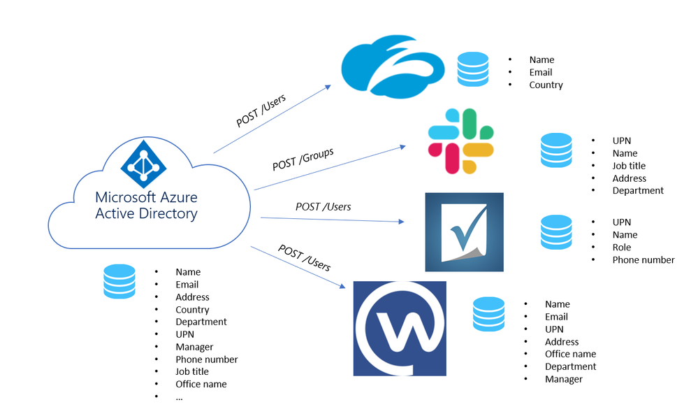
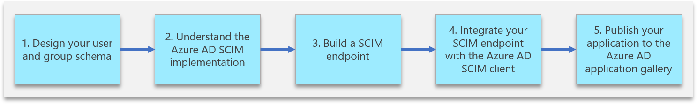
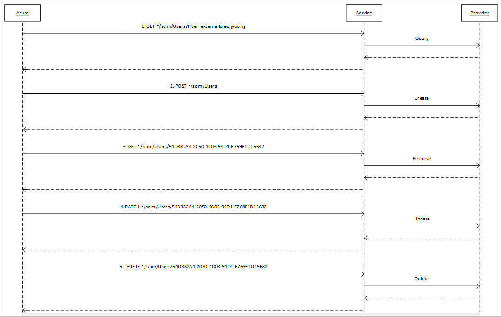
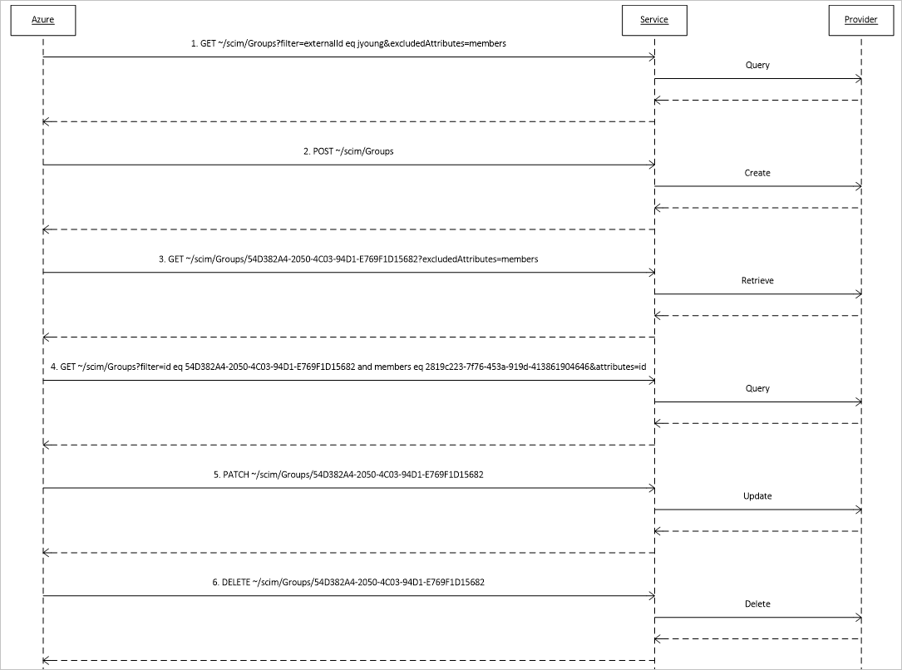
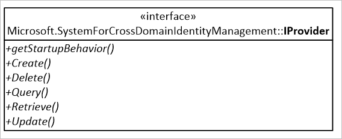

# Build a SCIM endpoint and configure user provisioning with Azure AD

As an application developer, you can use the System for Cross-Domain Identity Management (SCIM) user management API to enable automatic provisioning of users and groups between your application and Azure AD. This article describes how to build a SCIM endpoint and integrate with the Azure AD provisioning service. The SCIM specification provides a common user schema for provisioning. When used in conjunction with federation standards like SAML or OpenID Connect, SCIM gives administrators an end-to-end, standards-based solution for access management.

SCIM is a standardized definition of two endpoints: a /Users endpoint and a /Groups endpoint. It uses common REST verbs to create, update, and delete objects, and a pre-defined schema for common attributes like group name, username, first name, last name and email. Apps that offer a SCIM 2.0 REST API can reduce or eliminate the pain of working with a proprietary user management API. For example, any compliant SCIM client knows how to make an HTTP POST of a JSON object to the /Users endpoint to create a new user entry. Instead of needing a slightly different API for the same basic actions, apps that conform to the SCIM standard can instantly take advantage of pre-existing clients, tools, and code. 



The standard user object schema and rest APIs for management defined in SCIM 2.0 (RFC [7642](https://tools.ietf.org/html/rfc7642), [7643](https://tools.ietf.org/html/rfc7643), [7644](https://tools.ietf.org/html/rfc7644)) allow identity providers and apps to more easily integrate with each other. Application developers that build a SCIM endpoint can integrate with any SCIM-compliant client without having to do custom work.

Automating provisioning to an application requires building and integrating a SCIM endpoint with the Azure AD SCIM client. Perform the following steps to start provisioning users and groups into your application. 
    
  * **[Step 1: Design your user and group schema.](#step-1-design-your-user-and-group-schema)** Identify the objects and attributes your application needs, and determine how they map to the user and group schema supported by the Azure AD SCIM implementation.

  * **[Step 2: Understand the Azure AD SCIM implementation.](#step-2-understand-the-azure-ad-scim-implementation)** Understand how the Azure AD SCIM client is implemented, and model your SCIM protocol request handling and responses.

  * **[Step 3: Build a SCIM endpoint.](#step-3-build-a-scim-endpoint)** An endpoint must be SCIM 2.0-compatible to integrate with the Azure AD provisioning service. As an option, you can use Microsoft Common Language Infrastructure (CLI) libraries and code samples to build your endpoint. These samples are for reference and testing only; we recommend against coding your production app to take a dependency on them.

  * **[Step 4: Integrate your SCIM endpoint with the Azure AD SCIM client.](#step-4-integrate-your-scim-endpoint-with-the-azure-ad-scim-client)** If your organization is using a third-party application that implements the profile of SCIM 2.0 that Azure AD supports, you can start automating both provisioning and deprovisioning of users and groups right away.

  * **[Step 5: Publish your application to the Azure AD application gallery.](#step-5-publish-your-application-to-the-azure-ad-application-gallery)** Make it easy for customers to discover your application and easily configure provisioning. 



## Step 1: Design your user and group schema

Every application requires different attributes to create a user or group. Start your integration by identifying the objects (users, groups) and attributes (name, manager, job title, etc.) that your application requires. The SCIM standard defines a schema for managing users and groups. The core user schema only requires three attributes: **id** (service provider defined identifier), **externalId** (client defined identifier), and **meta** (read-only metadata maintained by the service provider). All other attributes are optional. In addition to the core user schema, the SCIM standard defines an enterprise user extension and a model for extending the user schema to meet your application’s needs. If, for example, your application requires a user’s manager, you can use the enterprise user schema to collect the user’s manager and the core schema to collect the user’s email. To design your schema, follow the steps below:
  1. List the attributes your application requires. It can be helpful to break down your requirements into the attributes needed for authentication (e.g. loginName and email), attributes needed to manage the lifecycle of the user (e.g. status / active), and other attributes needed for your particular application to work (e.g. manager, tag).
  2. Check whether those attributes are already defined in the core user schema or enterprise user schema. If any attributes that you need and aren’t covered in the core or enterprise user schemas, you will need to define an extension to the user schema that covers the attributes you need. In the example below, we’ve added an extension to the user to allow provisioning a “tag” on a user. It is best to start with just the core and enterprise user schemas and expand out to additional custom schemas later.  
  3. Map the SCIM attributes to the user attributes in Azure AD. If one of the attributes you have defined in your SCIM endpoint does not have a clear counterpart on the Azure AD user schema, there is a good chance the data isn’t stored on the user object at all on most tenants. Consider whether this attribute can be optional for creating a user. If the attribute is critical for your application to work, guide the tenant administrator to extend their schema or use an extension attribute as shown below for the “tags” property.

### Table 1: Outline the attributes that you need 
| Step 1: Determine attributes your app requires| Step 2: Map app requirements to SCIM standard| Step 3: Map SCIM attributes to the Azure AD attributes|
|--|--|--|
|loginName|userName|userPrincipalName|
|firstName|name.givenName|givenName|
|lastName|name.lastName|lastName|
|workMail|Emails[type eq “work”].value|Mail|
|manager|manager|manager|
|tag|urn:ietf:params:scim:schemas:extension:2.0:CustomExtension:tag|extensionAttribute1|
|status|active|isSoftDeleted (computed value not stored on user)|

The schema defined above would be represented using the Json payload below. Note that in addition to the attributes required for the application, the JSON representation includes the required “id,” “externalId,” and “meta” attributes.

```json
{
     "schemas": ["urn:ietf:params:scim:schemas:core:2.0:User",
      "urn:ietf:params:scim:schemas:extension:enterprise:2.0:User",
      "urn:ietf:params:scim:schemas:extension:CustomExtensionName:2.0:User"],
     "userName":"bjensen",
     "externalId":"bjensen",
     "name":{
       "familyName":"Jensen",
       "givenName":"Barbara"
     },
     "urn:ietf:params:scim:schemas:extension:enterprise:2.0:User": {
     "Manager": "123456"
   },
     "urn:ietf:params:scim:schemas:extension:CustomExtensionName:2.0:CustomAttribute:User": {
     "tag": "701984",
   },
   "meta": {
     "resourceType": "User",
     "created": "2010-01-23T04:56:22Z",
     "lastModified": "2011-05-13T04:42:34Z",
     "version": "W\/\"3694e05e9dff591\"",
     "location":
 "https://example.com/v2/Users/2819c223-7f76-453a-919d-413861904646"
   }
 ```

### Table 2: Default user attribute mapping
You can then use the table below to understand how the attributes your application requires could map to an attribute in Azure AD and the SCIM RFC. You can [customize](customize-application-attributes.md) how attributes are mapped between Azure AD and your SCIM endpoint. Note that you don't need to support both users and groups or all the attributes shown below. They are a reference for how attributes in Azure AD are often mapped to properties in the SCIM protocol. 

| Azure Active Directory user | "urn:ietf:params:scim:schemas:extension:enterprise:2.0:User" |
| --- | --- |
| IsSoftDeleted |active |
|department|urn:ietf:params:scim:schemas:extension:enterprise:2.0:User:department|
| displayName |displayName |
|employeeId|urn:ietf:params:scim:schemas:extension:enterprise:2.0:User:employeeNumber|
| Facsimile-TelephoneNumber |phoneNumbers[type eq "fax"].value |
| givenName |name.givenName |
| jobTitle |title |
| mail |emails[type eq "work"].value |
| mailNickname |externalId |
| manager |urn:ietf:params:scim:schemas:extension:enterprise:2.0:User:manager |
| mobile |phoneNumbers[type eq "mobile"].value |
| postalCode |addresses[type eq "work"].postalCode |
| proxy-Addresses |emails[type eq "other"].Value |
| physical-Delivery-OfficeName |addresses[type eq "other"].Formatted |
| streetAddress |addresses[type eq "work"].streetAddress |
| surname |name.familyName |
| telephone-Number |phoneNumbers[type eq "work"].value |
| user-PrincipalName |userName |


### Table 3: Default group attribute mapping

| Azure Active Directory group | urn:ietf:params:scim:schemas:core:2.0:Group |
| --- | --- |
| displayName |displayName |
| mail |emails[type eq "work"].value |
| mailNickname |displayName |
| members |members |
| objectId |externalId |
| proxyAddresses |emails[type eq "other"].Value |

There are several endpoints defined in the SCIM RFC. You can get started with the /User endpoint and then expand from there. The /Schemas endpoint is helpful when using custom attributes or if your schema changes frequently. It enables a client to retrieve the most up-to-date schema automatically. The /Bulk endpoint is especially helpful when supporting groups. The table below describes the various endpoints defined in the SCIM standard. 
 The /Schemas endpoint is helpful when using custom attributes or if your schema changes frequently. It enables a client to retrieve the most up to date schema automatically. The /Bulk endpoint is especially helpful when supporting groups. The table below describes the various endpoints defined in the SCIM standard. 
 
### Table 4: Determine the endpoints that you would like to develop
|ENDPOINT|DESCRIPTION|
|--|--|
|/User|Perform CRUD operations on a user object.|
|/Group|Perform CRUD operations on a group object.|
|/ServiceProviderConfig|Provides details about the features of the SCIM standard that are supported, for example the resources that are supported and the authentication method.|
|/ResourceTypes|Specifies metadata about each resource|
|/Schemas|The set of attributes supported by each client and service provider can vary. While one service provider might include “name,” “title,” and “emails,” while another service provider uses “name,” “title,” and “phoneNumbers.” The schemas endpoint allows for discovery of the attributes supported.|
|/Bulk|Bulk operations allow you to perform operations on a large collection of resource objects in a single operation (e.g. update memberships for a large group).|


## Step 2: Understand the Azure AD SCIM implementation
> [!IMPORTANT]
> The behavior of the Azure AD SCIM implementation was last updated on December 18, 2018. For information on what changed, see [SCIM 2.0 protocol compliance of the Azure AD User Provisioning service](application-provisioning-config-problem-scim-compatibility.md).

If you're building an application that supports a SCIM 2.0 user management API, this section describes in detail how the Azure AD SCIM client is implemented. It also shows how to model your SCIM protocol request handling and responses. Once you've implemented your SCIM endpoint, you can test it by following the procedure described in the previous section.

Within the [SCIM 2.0 protocol specification](http://www.simplecloud.info/#Specification), your application must meet these requirements:

* Supports creating users, and optionally also groups, as per section [3.3 of the SCIM protocol](https://tools.ietf.org/html/rfc7644#section-3.3).  
* Supports modifying users or groups with PATCH requests, as per [section 3.5.2 of the SCIM protocol](https://tools.ietf.org/html/rfc7644#section-3.5.2).  
* Supports retrieving a known resource for a user or group created earlier, as per [section 3.4.1 of the SCIM protocol](https://tools.ietf.org/html/rfc7644#section-3.4.1).  
* Supports querying users or groups, as per section [3.4.2 of the SCIM protocol](https://tools.ietf.org/html/rfc7644#section-3.4.2).  By default, users are retrieved by their `id` and queried by their `username` and `externalid`, and groups are queried by `displayName`.  
* Supports querying user by ID and by manager, as per section 3.4.2 of the SCIM protocol.  
* Supports querying groups by ID and by member, as per section 3.4.2 of the SCIM protocol.  
* Accepts a single bearer token for authentication and authorization of Azure AD to your application.

Follow these general guidelines when implementing a SCIM endpoint to ensure compatibility with Azure AD:

* `id` is a required property for all the resources. Every response that returns a resource should ensure each resource has this property, except for `ListResponse` with zero members.
* Response to a query/filter request should always be a `ListResponse`.
* Groups are optional, but only supported if the SCIM implementation supports PATCH requests.
* It isn't necessary to include the entire resource in the PATCH response.
* Microsoft Azure AD only uses the following operators:  
    - `eq`
    - `and`
* Don't require a case-sensitive match on structural elements in SCIM, in particular PATCH `op` operation values, as defined in https://tools.ietf.org/html/rfc7644#section-3.5.2. Azure AD emits the values of 'op' as `Add`, `Replace`, and `Remove`.
* Microsoft Azure AD makes requests to fetch a random user and group to ensure that the endpoint and the credentials are valid. It's also done as a part of **Test Connection** flow in the [Azure portal](https://portal.azure.com). 
* The attribute that the resources can be queried on should be set as a matching attribute on the application in the [Azure portal](https://portal.azure.com). For more information, see [Customizing User Provisioning Attribute Mappings](customize-application-attributes.md)

### User provisioning and deprovisioning

The following illustration shows the messages that Azure Active Directory sends to a SCIM service to manage the lifecycle of a user in your application's identity store.  

<br/>
*User provisioning and deprovisioning sequence*

### Group provisioning and deprovisioning

Group provisioning and deprovisioning are optional. When implemented and enabled, the following illustration shows the messages that Azure AD sends to a SCIM service to manage the lifecycle of a group in your application's identity store.  Those messages differ from the messages about users in two ways:

* Requests to retrieve groups specify that the members attribute is to be excluded from any resource provided in response to the request.  
* Requests to determine whether a reference attribute has a certain value are requests about the members attribute.  

<br/>
*Group provisioning and deprovisioning sequence*

### SCIM protocol requests and responses
This section provides example SCIM requests emitted by the Azure AD SCIM client and example expected responses. For best results, you should code your app to handle these requests in this format and emit the expected responses.

> [!IMPORTANT]
> To understand how and when the Azure AD user provisioning service emits the operations described below, see the section [Provisioning cycles: Initial and incremental](how-provisioning-works.md#provisioning-cycles-initial-and-incremental) in [How provisioning works](how-provisioning-works.md).

[User Operations](#user-operations)
  - [Create User](#create-user) ([Request](#request) / [Response](#response))
  - [Get User](#get-user) ([Request](#request-1) / [Response](#response-1))
  - [Get User by query](#get-user-by-query) ([Request](#request-2) / [Response](#response-2))
  - [Get User by query - Zero results](#get-user-by-query---zero-results) ([Request](#request-3)
/ [Response](#response-3))
  - [Update User [Multi-valued properties]](#update-user-multi-valued-properties) ([Request](#request-4) /  [Response](#response-4))
  - [Update User [Single-valued properties]](#update-user-single-valued-properties) ([Request](#request-5)
/ [Response](#response-5)) 
  - [Disable User](#disable-user) ([Request](#request-14) / 
[Response](#response-14))
  - [Delete User](#delete-user) ([Request](#request-6) / 
[Response](#response-6))


[Group Operations](#group-operations)
  - [Create Group](#create-group) (
[Request](#request-7) / [Response](#response-7))
  - [Get Group](#get-group) (
[Request](#request-8) / [Response](#response-8))
  - [Get Group by displayName](#get-group-by-displayname) ([Request](#request-9) / [Response](#response-9))
  - [Update Group [Non-member attributes]](#update-group-non-member-attributes) ([Request](#request-10) /
 [Response](#response-10))
  - [Update Group [Add Members]](#update-group-add-members) (
[Request](#request-11) /
[Response](#response-11))
  - [Update Group [Remove Members]](#update-group-remove-members) (
[Request](#request-12) /
[Response](#response-12))
  - [Delete Group](#delete-group) ([Request](#request-13) /
[Response](#response-13))

### User Operations

* Users can be queried by `userName` or `email[type eq "work"]` attributes.  

#### Create User

###### Request

*POST /Users*
```json
{
	"schemas": [
	    "urn:ietf:params:scim:schemas:core:2.0:User",
	    "urn:ietf:params:scim:schemas:extension:enterprise:2.0:User"],
	"externalId": "0a21f0f2-8d2a-4f8e-bf98-7363c4aed4ef",
	"userName": "Test_User_ab6490ee-1e48-479e-a20b-2d77186b5dd1",
	"active": true,
	"emails": [{
		"primary": true,
		"type": "work",
		"value": "Test_User_fd0ea19b-0777-472c-9f96-4f70d2226f2e@testuser.com"
	}],
	"meta": {
		"resourceType": "User"
	},
	"name": {
		"formatted": "givenName familyName",
		"familyName": "familyName",
		"givenName": "givenName"
	},
	"roles": []
}
```

##### Response

*HTTP/1.1 201 Created*
```json
{
	"schemas": ["urn:ietf:params:scim:schemas:core:2.0:User"],
	"id": "48af03ac28ad4fb88478",
	"externalId": "0a21f0f2-8d2a-4f8e-bf98-7363c4aed4ef",
	"meta": {
		"resourceType": "User",
		"created": "2018-03-27T19:59:26.000Z",
		"lastModified": "2018-03-27T19:59:26.000Z"
	},
	"userName": "Test_User_ab6490ee-1e48-479e-a20b-2d77186b5dd1",
	"name": {
		"formatted": "givenName familyName",
		"familyName": "familyName",
		"givenName": "givenName",
	},
	"active": true,
	"emails": [{
		"value": "Test_User_fd0ea19b-0777-472c-9f96-4f70d2226f2e@testuser.com",
		"type": "work",
		"primary": true
	}]
}
```

#### Get User

###### <a name="request-1"></a>Request
*GET /Users/5d48a0a8e9f04aa38008* 

###### <a name="response-1"></a>Response (User found)
*HTTP/1.1 200 OK*
```json
{
	"schemas": ["urn:ietf:params:scim:schemas:core:2.0:User"],
	"id": "5d48a0a8e9f04aa38008",
	"externalId": "58342554-38d6-4ec8-948c-50044d0a33fd",
	"meta": {
		"resourceType": "User",
		"created": "2018-03-27T19:59:26.000Z",
		"lastModified": "2018-03-27T19:59:26.000Z"
	},
	"userName": "Test_User_feed3ace-693c-4e5a-82e2-694be1b39934",
	"name": {
		"formatted": "givenName familyName",
		"familyName": "familyName",
		"givenName": "givenName",
	},
	"active": true,
	"emails": [{
		"value": "Test_User_22370c1a-9012-42b2-bf64-86099c2a1c22@testuser.com",
		"type": "work",
		"primary": true
	}]
}
```

###### Request
*GET /Users/5171a35d82074e068ce2* 

###### Response (User not found. Note that the detail is not required, only status.)

```json
{
    "schemas": [
        "urn:ietf:params:scim:api:messages:2.0:Error"
    ],
    "status": "404",
    "detail": "Resource 23B51B0E5D7AE9110A49411D@7cca31655d49f3640a494224 not found"
}
```

#### Get User by query

##### <a name="request-2"></a>Request

*GET /Users?filter=userName eq "Test_User_dfeef4c5-5681-4387-b016-bdf221e82081"*

##### <a name="response-2"></a>Response

*HTTP/1.1 200 OK*
```json
{
	"schemas": ["urn:ietf:params:scim:api:messages:2.0:ListResponse"],
	"totalResults": 1,
	"Resources": [{
		"schemas": ["urn:ietf:params:scim:schemas:core:2.0:User"],
		"id": "2441309d85324e7793ae",
		"externalId": "7fce0092-d52e-4f76-b727-3955bd72c939",
		"meta": {
			"resourceType": "User",
			"created": "2018-03-27T19:59:26.000Z",
			"lastModified": "2018-03-27T19:59:26.000Z"
			
		},
		"userName": "Test_User_dfeef4c5-5681-4387-b016-bdf221e82081",
		"name": {
			"familyName": "familyName",
			"givenName": "givenName"
		},
		"active": true,
		"emails": [{
			"value": "Test_User_91b67701-697b-46de-b864-bd0bbe4f99c1@testuser.com",
			"type": "work",
			"primary": true
		}]
	}],
	"startIndex": 1,
	"itemsPerPage": 20
}

```

#### Get User by query - Zero results

##### <a name="request-3"></a>Request

*GET /Users?filter=userName eq "non-existent user"*

##### <a name="response-3"></a>Response

*HTTP/1.1 200 OK*
```json
{
	"schemas": ["urn:ietf:params:scim:api:messages:2.0:ListResponse"],
	"totalResults": 0,
	"Resources": [],
	"startIndex": 1,
	"itemsPerPage": 20
}

```

#### Update User [Multi-valued properties]

##### <a name="request-4"></a>Request

*PATCH /Users/6764549bef60420686bc HTTP/1.1*
```json
{
	"schemas": ["urn:ietf:params:scim:api:messages:2.0:PatchOp"],
	"Operations": [
            {
    		"op": "Replace",
    		"path": "emails[type eq \"work\"].value",
    		"value": "updatedEmail@microsoft.com"
    	    },
    	    {
    		"op": "Replace",
    		"path": "name.familyName",
    		"value": "updatedFamilyName"
    	    }
	]
}
```

##### <a name="response-4"></a>Response

*HTTP/1.1 200 OK*
```json
{
	"schemas": ["urn:ietf:params:scim:schemas:core:2.0:User"],
	"id": "6764549bef60420686bc",
	"externalId": "6c75de36-30fa-4d2d-a196-6bdcdb6b6539",
	"meta": {
		"resourceType": "User",
		"created": "2018-03-27T19:59:26.000Z",
		"lastModified": "2018-03-27T19:59:26.000Z"
	},
	"userName": "Test_User_fbb9dda4-fcde-4f98-a68b-6c5599e17c27",
	"name": {
		"formatted": "givenName updatedFamilyName",
		"familyName": "updatedFamilyName",
		"givenName": "givenName"
	},
	"active": true,
	"emails": [{
		"value": "updatedEmail@microsoft.com",
		"type": "work",
		"primary": true
	}]
}
```

#### Update User [Single-valued properties]

##### <a name="request-5"></a>Request

*PATCH /Users/5171a35d82074e068ce2 HTTP/1.1*
```json
{
	"schemas": ["urn:ietf:params:scim:api:messages:2.0:PatchOp"],
	"Operations": [{
		"op": "Replace",
		"path": "userName",
		"value": "5b50642d-79fc-4410-9e90-4c077cdd1a59@testuser.com"
	}]
}
```

##### <a name="response-5"></a>Response

*HTTP/1.1 200 OK*
```json
{
	"schemas": ["urn:ietf:params:scim:schemas:core:2.0:User"],
	"id": "5171a35d82074e068ce2",
	"externalId": "aa1eca08-7179-4eeb-a0be-a519f7e5cd1a",
	"meta": {
		"resourceType": "User",
		"created": "2018-03-27T19:59:26.000Z",
		"lastModified": "2018-03-27T19:59:26.000Z"
		
	},
	"userName": "5b50642d-79fc-4410-9e90-4c077cdd1a59@testuser.com",
	"name": {
		"formatted": "givenName familyName",
		"familyName": "familyName",
		"givenName": "givenName",
	},
	"active": true,
	"emails": [{
		"value": "Test_User_49dc1090-aada-4657-8434-4995c25a00f7@testuser.com",
		"type": "work",
		"primary": true
	}]
}
```

### Disable User

##### <a name="request-14"></a>Request

*PATCH /Users/5171a35d82074e068ce2 HTTP/1.1*
```json
{
    "Operations": [
        {
            "op": "Replace",
            "path": "active",
            "value": false
        }
    ],
    "schemas": [
        "urn:ietf:params:scim:api:messages:2.0:PatchOp"
    ]
}
```

##### <a name="response-14"></a>Response

```json
{
    "schemas": [
        "urn:ietf:params:scim:schemas:core:2.0:User"
    ],
    "id": "CEC50F275D83C4530A495FCF@834d0e1e5d8235f90a495fda",
    "userName": "deanruiz@testuser.com",
    "name": {
        "familyName": "Harris",
        "givenName": "Larry"
    },
    "active": false,
    "emails": [
        {
            "value": "gloversuzanne@testuser.com",
            "type": "work",
            "primary": true
        }
    ],
    "addresses": [
        {
            "country": "ML",
            "type": "work",
            "primary": true
        }
    ],
    "meta": {
        "resourceType": "Users",
        "location": "/scim/5171a35d82074e068ce2/Users/CEC50F265D83B4530B495FCF@5171a35d82074e068ce2"
    }
}
```
#### Delete User

##### <a name="request-6"></a>Request

*DELETE /Users/5171a35d82074e068ce2 HTTP/1.1*

##### <a name="response-6"></a>Response

*HTTP/1.1 204 No Content*

### Group Operations

* Groups shall always be created with an empty members list.
* Groups can be queried by the `displayName` attribute.
* Update to the group PATCH request should yield an *HTTP 204 No Content* in the response. Returning a body with a list of all the members isn't advisable.
* It isn't necessary to support returning all the members of the group.

#### Create Group

##### <a name="request-7"></a>Request

*POST /Groups HTTP/1.1*
```json
{
	"schemas": ["urn:ietf:params:scim:schemas:core:2.0:Group", "http://schemas.microsoft.com/2006/11/ResourceManagement/ADSCIM/2.0/Group"],
	"externalId": "8aa1a0c0-c4c3-4bc0-b4a5-2ef676900159",
	"displayName": "displayName",
	"meta": {
		"resourceType": "Group"
	}
}
```

##### <a name="response-7"></a>Response

*HTTP/1.1 201 Created*
```json
{
	"schemas": ["urn:ietf:params:scim:schemas:core:2.0:Group"],
	"id": "927fa2c08dcb4a7fae9e",
	"externalId": "8aa1a0c0-c4c3-4bc0-b4a5-2ef676900159",
	"meta": {
		"resourceType": "Group",
		"created": "2018-03-27T19:59:26.000Z",
		"lastModified": "2018-03-27T19:59:26.000Z"
		
	},
	"displayName": "displayName",
	"members": []
}
```

#### Get Group

##### <a name="request-8"></a>Request

*GET /Groups/40734ae655284ad3abcc?excludedAttributes=members HTTP/1.1*

##### <a name="response-8"></a>Response
*HTTP/1.1 200 OK*
```json
{
	"schemas": ["urn:ietf:params:scim:schemas:core:2.0:Group"],
	"id": "40734ae655284ad3abcc",
	"externalId": "60f1bb27-2e1e-402d-bcc4-ec999564a194",
	"meta": {
		"resourceType": "Group",
		"created": "2018-03-27T19:59:26.000Z",
		"lastModified": "2018-03-27T19:59:26.000Z"
	},
	"displayName": "displayName",
}
```

#### Get Group by displayName

##### <a name="request-9"></a>Request
*GET /Groups?excludedAttributes=members&filter=displayName eq "displayName" HTTP/1.1*

##### <a name="response-9"></a>Response

*HTTP/1.1 200 OK*
```json
{
	"schemas": ["urn:ietf:params:scim:api:messages:2.0:ListResponse"],
	"totalResults": 1,
	"Resources": [{
		"schemas": ["urn:ietf:params:scim:schemas:core:2.0:Group"],
		"id": "8c601452cc934a9ebef9",
		"externalId": "0db508eb-91e2-46e4-809c-30dcbda0c685",
		"meta": {
			"resourceType": "Group",
			"created": "2018-03-27T22:02:32.000Z",
			"lastModified": "2018-03-27T22:02:32.000Z",
			
		},
		"displayName": "displayName",
	}],
	"startIndex": 1,
	"itemsPerPage": 20
}
```

#### Update Group [Non-member attributes]

##### <a name="request-10"></a>Request

*PATCH /Groups/fa2ce26709934589afc5 HTTP/1.1*
```json
{
	"schemas": ["urn:ietf:params:scim:api:messages:2.0:PatchOp"],
	"Operations": [{
		"op": "Replace",
		"path": "displayName",
		"value": "1879db59-3bdf-4490-ad68-ab880a269474updatedDisplayName"
	}]
}
```

##### <a name="response-10"></a>Response

*HTTP/1.1 204 No Content*

### Update Group [Add Members]

##### <a name="request-11"></a>Request

*PATCH /Groups/a99962b9f99d4c4fac67 HTTP/1.1*
```json
{
	"schemas": ["urn:ietf:params:scim:api:messages:2.0:PatchOp"],
	"Operations": [{
		"op": "Add",
		"path": "members",
		"value": [{
			"$ref": null,
			"value": "f648f8d5ea4e4cd38e9c"
		}]
	}]
}
```

##### <a name="response-11"></a>Response

*HTTP/1.1 204 No Content*

#### Update Group [Remove Members]

##### <a name="request-12"></a>Request

*PATCH /Groups/a99962b9f99d4c4fac67 HTTP/1.1*
```json
{
	"schemas": ["urn:ietf:params:scim:api:messages:2.0:PatchOp"],
	"Operations": [{
		"op": "Remove",
		"path": "members",
		"value": [{
			"$ref": null,
			"value": "f648f8d5ea4e4cd38e9c"
		}]
	}]
}
```

##### <a name="response-12"></a>Response

*HTTP/1.1 204 No Content*

#### Delete Group

##### <a name="request-13"></a>Request

*DELETE /Groups/cdb1ce18f65944079d37 HTTP/1.1*

##### <a name="response-13"></a>Response

*HTTP/1.1 204 No Content*

### Security requirements
**TLS Protocol Versions**

The only acceptable TLS protocol versions are TLS 1.2 and TLS 1.3. No other versions of TLS are permitted. No version of SSL is permitted. 
- RSA keys must be at least 2,048 bits.
- ECC keys must be at least 256 bits, generated using an approved elliptic curve


**Key Lengths**

All services must use X.509 certificates generated using cryptographic keys of sufficient length, meaning:

**Cipher Suites**

All services must be configured to use the following cipher suites, in the exact order specified below. Note that if you only have an RSA certificate, installed the ECDSA cipher suites do not have any effect. </br>

TLS 1.2 Cipher Suites minimum bar:

- TLS_ECDHE_ECDSA_WITH_AES_128_GCM_SHA256
- TLS_ECDHE_ECDSA_WITH_AES_256_GCM_SHA384
- TLS_ECDHE_RSA_WITH_AES_128_GCM_SHA256
- TLS_ECDHE_RSA_WITH_AES_256_GCM_SHA384
- TLS_ECDHE_ECDSA_WITH_AES_128_CBC_SHA256
- TLS_ECDHE_ECDSA_WITH_AES_256_CBC_SHA384
- TLS_ECDHE_RSA_WITH_AES_128_CBC_SHA256
- TLS_ECDHE_RSA_WITH_AES_256_CBC_SHA384

### IP Ranges
The Azure AD provisioning service can currently opperate under any Azure IP range. Work is in progress to consolidate the set of IP ranges that the service operates on. This document will be updated once the IP range list is consolidated. 

## Step 3: Build a SCIM endpoint

Now that you have designed your schema and understood the Azure AD SCIM implementation, you can get started developing your SCIM endpoint. Rather than starting from scratch and building the implementation completely on your own, you can rely on a number of open source SCIM libraries published by the SCIM community.

The open source .NET Core [reference code](https://aka.ms/SCIMReferenceCode) published by the Azure AD provisioning team is one such resource that can jump start your development. Once you have built your SCIM endpoint, you will want to test it out. You can use the collection of [postman tests](https://github.com/AzureAD/SCIMReferenceCode/wiki/Test-Your-SCIM-Endpoint) provided as part of the reference code or run through the sample requests / responses provided [above](https://docs.microsoft.com/azure/active-directory/app-provisioning/use-scim-to-provision-users-and-groups#user-operations).  

   > [!Note]
   > The reference code is intended to help you get started building your SCIM endpoint and is provided "AS IS." Contributions from the community are welcome to help build and maintain the code.

The solution is composed of two projects, _Microsoft.SCIM_ and _Microsoft.SCIM.WebHostSample_.

The _Microsoft.SCIM_ project is the library that defines the components of the web service that conforms to the SCIM specification. It declares the interface _Microsoft.SCIM.IProvider_, requests are translated into calls to the provider’s methods, which would be programmed to operate on an identity store.



The _Microsoft.SCIM.WebHostSample_ project is a Visual Studio ASP.NET Core Web Application, based on the _Empty_ template. This allows the sample code to be deployed as standalone, hosted in containers or within Internet Information Services. It also implements the _Microsoft.SCIM.IProvider_ interface keeping classes in memory as a sample identity store.

```csharp
    public class Startup
    {
        ...
        public IMonitor MonitoringBehavior { get; set; }
        public IProvider ProviderBehavior { get; set; }

        public Startup(IWebHostEnvironment env, IConfiguration configuration)
        {
            ...
            this.MonitoringBehavior = new ConsoleMonitor();
            this.ProviderBehavior = new InMemoryProvider();
        }
        ...
```

### Building a custom SCIM endpoint

The SCIM service must have an HTTP address and server authentication certificate of which the root certification authority is one of the following names:

* CNNIC
* Comodo
* CyberTrust
* DigiCert
* GeoTrust
* GlobalSign
* Go Daddy
* VeriSign
* WoSign

The .NET Core SDK includes an HTTPS development certificate that can be used during development, the certificate is installed as part of the first-run experience. Depending on how you run the ASP.NET Core Web Application it will listen to a different port:

* Microsoft.SCIM.WebHostSample: https://localhost:5001
* IIS Express: https://localhost:44359/

For more information on HTTPS in ASP.NET Core use the following link:
[Enforce HTTPS in ASP.NET Core](https://docs.microsoft.com/aspnet/core/security/enforcing-ssl)

### Handling endpoint authentication

Requests from Azure Active Directory include an OAuth 2.0 bearer token. Any service receiving the request should authenticate the issuer as being Azure Active Directory for the expected Azure Active Directory tenant.

In the token, the issuer is identified by an iss claim, like `"iss":"https://sts.windows.net/cbb1a5ac-f33b-45fa-9bf5-f37db0fed422/"`. In this example, the base address of the claim value, `https://sts.windows.net`, identifies Azure Active Directory as the issuer, while the relative address segment, _cbb1a5ac-f33b-45fa-9bf5-f37db0fed422_, is a unique identifier of the Azure Active Directory tenant for which the token was issued.

The audience for the token will be the application template ID for the application in the gallery, each of the applications registered in a single tenant may receive the same `iss` claim with SCIM requests. The application template ID for all custom apps is _8adf8e6e-67b2-4cf2-a259-e3dc5476c621_. The token generated by the Azure AD provisioning service should only be used for testing. It should not be used in production environments.

In the sample code, requests are authenticated using the Microsoft.AspNetCore.Authentication.JwtBearer package. The following code enforces that requests to any of the service’s endpoints are authenticated using the bearer token issued by Azure Active Directory for a specified tenant:

```csharp
        public void ConfigureServices(IServiceCollection services)
        {
            if (_env.IsDevelopment())
            {
                ...
            }
            else
            {
                services.AddAuthentication(options =>
                {
                    options.DefaultAuthenticateScheme = JwtBearerDefaults.AuthenticationScheme;
                    options.DefaultAuthenticateScheme = JwtBearerDefaults.AuthenticationScheme;
                    options.DefaultChallengeScheme = JwtBearerDefaults.AuthenticationScheme;
                })
                    .AddJwtBearer(options =>
                    {
                        options.Authority = " https://sts.windows.net/cbb1a5ac-f33b-45fa-9bf5-f37db0fed422/";
                        options.Audience = "8adf8e6e-67b2-4cf2-a259-e3dc5476c621";
                        ...
                    });
            }
            ...
        }

        public void Configure(IApplicationBuilder app)
        {
            ...
            app.UseAuthentication();
            app.UseAuthorization();
            ...
       }
```

A bearer token is also required to use of the provided [postman tests](https://github.com/AzureAD/SCIMReferenceCode/wiki/Test-Your-SCIM-Endpoint) and perform local debugging using localhost. The sample code uses ASP.NET Core environments to change the authentication options during development stage and enable the use a self-signed token.

For more information on multiple environments in ASP.NET Core use the following link:
[Use multiple environments in ASP.NET Core](
https://docs.microsoft.com/aspnet/core/fundamentals/environments)

The following code enforces that requests to any of the service’s endpoints are authenticated using a bearer token signed with a custom key:

```csharp
        public void ConfigureServices(IServiceCollection services)
        {
            if (_env.IsDevelopment())
            {
                services.AddAuthentication(options =>
                {
                    options.DefaultAuthenticateScheme = JwtBearerDefaults.AuthenticationScheme;
                    options.DefaultAuthenticateScheme = JwtBearerDefaults.AuthenticationScheme;
                    options.DefaultChallengeScheme = JwtBearerDefaults.AuthenticationScheme;
                })
                    .AddJwtBearer(options =>
                    {
                        options.TokenValidationParameters =
                            new TokenValidationParameters
                            {
                                ValidateIssuer = false,
                                ValidateAudience = false,
                                ValidateLifetime = false,
                                ValidateIssuerSigningKey = false,
                                ValidIssuer = "Microsoft.Security.Bearer",
                                ValidAudience = "Microsoft.Security.Bearer",
                                IssuerSigningKey = new SymmetricSecurityKey(Encoding.UTF8.GetBytes("A1B2C3D4E5F6A1B2C3D4E5F6"))
                            };
                    });
            }
	    ...
```

Send a GET request to the Token controller to get a valid bearer token, the method _GenerateJSONWebToken_ is responsible to create a token matching the parameters configured for development:

```csharp
        private string GenerateJSONWebToken()
        {
            // Create token key
            SymmetricSecurityKey securityKey =
                new SymmetricSecurityKey(Encoding.UTF8.GetBytes("A1B2C3D4E5F6A1B2C3D4E5F6"));
            SigningCredentials credentials =
                new SigningCredentials(securityKey, SecurityAlgorithms.HmacSha256);

            // Set token expiration
            DateTime startTime = DateTime.UtcNow;
            DateTime expiryTime = startTime.AddMinutes(120);

            // Generate the token
            JwtSecurityToken token =
                new JwtSecurityToken(
                    "Microsoft.Security.Bearer",
                    "Microsoft.Security.Bearer",
                    null,
                    notBefore: startTime,
                    expires: expiryTime,
                    signingCredentials: credentials);

            string result = new JwtSecurityTokenHandler().WriteToken(token);
            return result;
        }
```

### Handling provisioning and deprovisioning of users

***Example 1. Query the service for a matching user***

Azure Active Directory queries the service for a user with an externalId attribute value matching the mailNickname attribute value of a user in Azure AD. The query is expressed as a Hypertext Transfer Protocol (HTTP) request such as this example, wherein jyoung is a sample of a mailNickname of a user in Azure Active Directory.

>[!NOTE]
> This is an example only. Not all users will have a mailNickname attribute, and the value a user has may not be unique in the directory. Also, the attribute used for matching (which in this case is externalId) is configurable in the [Azure AD attribute mappings](customize-application-attributes.md).

```
GET https://.../scim/Users?filter=externalId eq jyoung HTTP/1.1
 Authorization: Bearer ...
```

In the sample code the request is translated into a call to the QueryAsync method of the service’s provider. Here is the signature of that method: 

```csharp
 // System.Threading.Tasks.Tasks is defined in mscorlib.dll.  
 // Microsoft.SCIM.IRequest is defined in 
 // Microsoft.SCIM.Service.  
 // Microsoft.SCIM.Resource is defined in 
 // Microsoft.SCIM.Schemas.  
 // Microsoft.SCIM.IQueryParameters is defined in 
 // Microsoft.SCIM.Protocol.  

 Task<Resource[]> QueryAsync(IRequest<IQueryParameters> request);
```

In the sample query, for a user with a given value for the externalId attribute, values of the arguments passed to the QueryAsync method are:

* parameters.AlternateFilters.Count: 1
* parameters.AlternateFilters.ElementAt(0).AttributePath: "externalId"
* parameters.AlternateFilters.ElementAt(0).ComparisonOperator: ComparisonOperator.Equals
* parameters.AlternateFilter.ElementAt(0).ComparisonValue: "jyoung"

***Example 2. Provision a user***

If the response to a query to the web service for a user with an externalId attribute value that matches the mailNickname attribute value of a user doesn't return any users, then Azure Active Directory requests that the service provision a user corresponding to the one in Azure Active Directory.  Here is an example of such a request: 

```
 POST https://.../scim/Users HTTP/1.1
 Authorization: Bearer ...
 Content-type: application/scim+json
 {
   "schemas":
   [
     "urn:ietf:params:scim:schemas:core:2.0:User",
     "urn:ietf:params:scim:schemas:extension:enterprise:2.0User"],
   "externalId":"jyoung",
   "userName":"jyoung",
   "active":true,
   "addresses":null,
   "displayName":"Joy Young",
   "emails": [
     {
       "type":"work",
       "value":"jyoung@Contoso.com",
       "primary":true}],
   "meta": {
     "resourceType":"User"},
    "name":{
     "familyName":"Young",
     "givenName":"Joy"},
   "phoneNumbers":null,
   "preferredLanguage":null,
   "title":null,
   "department":null,
   "manager":null}
```

In the sample code the request is translated into a call to the CreateAsync method of the service’s provider. Here is the signature of that method: 

```csharp
 // System.Threading.Tasks.Tasks is defined in mscorlib.dll.  
 // Microsoft.SCIM.IRequest is defined in 
 // Microsoft.SCIM.Service.  
 // Microsoft.SCIM.Resource is defined in 
 // Microsoft.SCIM.Schemas.  

 Task<Resource> CreateAsync(IRequest<Resource> request);
```

In a request to provision a user, the value of the resource argument is an instance of the Microsoft.SCIM.Core2EnterpriseUser class, defined in the Microsoft.SCIM.Schemas library.  If the request to provision the user succeeds, then the implementation of the method is expected to return an instance of the Microsoft.SCIM.Core2EnterpriseUser class, with the value of the Identifier property set to the unique identifier of the newly provisioned user.  

***Example 3. Query the current state of a user*** 

To update a user known to exist in an identity store fronted by an SCIM, Azure Active Directory proceeds by requesting the current state of that user from the service with a request such as: 

```
 GET ~/scim/Users/54D382A4-2050-4C03-94D1-E769F1D15682 HTTP/1.1
 Authorization: Bearer ...
```

In the sample code the request is translated into a call to the RetrieveAsync method of the service’s provider. Here is the signature of that method: 

```csharp
 // System.Threading.Tasks.Tasks is defined in mscorlib.dll.  
 // Microsoft.SCIM.IRequest is defined in 
 // Microsoft.SCIM.Service.  
 // Microsoft.SCIM.Resource and 
 // Microsoft.SCIM.IResourceRetrievalParameters 
 // are defined in Microsoft.SCIM.Schemas 

 Task<Resource> RetrieveAsync(IRequest<IResourceRetrievalParameters> request);
```

In the example of a request to retrieve the current state of a user, the values of the properties of the object provided as the value of the parameters argument are as follows: 
  
* Identifier: "54D382A4-2050-4C03-94D1-E769F1D15682"
* SchemaIdentifier: "urn:ietf:params:scim:schemas:extension:enterprise:2.0:User"

***Example 4. Query the value of a reference attribute to be updated*** 

If a reference attribute is to be updated, then Azure Active Directory queries the service to determine whether the current value of the reference attribute in the identity store fronted by the service already matches the value of that attribute in Azure Active Directory. For users, the only attribute of which the current value is queried in this way is the manager attribute. Here is an example of a request to determine whether the manager attribute of a user object currently has a certain value: 
In the sample code the request is translated into a call to the QueryAsync method of the service’s provider. The value of the properties of the object provided as the value of the parameters argument are as follows: 
  
* parameters.AlternateFilters.Count: 2
* parameters.AlternateFilters.ElementAt(x).AttributePath: "ID"
* parameters.AlternateFilters.ElementAt(x).ComparisonOperator: ComparisonOperator.Equals
* parameters.AlternateFilter.ElementAt(x).ComparisonValue: "54D382A4-2050-4C03-94D1-E769F1D15682"
* parameters.AlternateFilters.ElementAt(y).AttributePath: "manager"
* parameters.AlternateFilters.ElementAt(y).ComparisonOperator: ComparisonOperator.Equals
* parameters.AlternateFilter.ElementAt(y).ComparisonValue: "2819c223-7f76-453a-919d-413861904646"
* parameters.RequestedAttributePaths.ElementAt(0): "ID"
* parameters.SchemaIdentifier: "urn:ietf:params:scim:schemas:extension:enterprise:2.0:User"

Here, the value of the index x can be 0 and the value of the index y can be 1, or the value of x can be 1 and the value of y can be 0, depending on the order of the expressions of the filter query parameter.   

***Example 5. Request from Azure AD to an SCIM service to update a user*** 

Here is an example of a request from Azure Active Directory to an SCIM service to update a user: 

```
  PATCH ~/scim/Users/54D382A4-2050-4C03-94D1-E769F1D15682 HTTP/1.1
  Authorization: Bearer ...
  Content-type: application/scim+json
  {
    "schemas": 
    [
      "urn:ietf:params:scim:api:messages:2.0:PatchOp"],
    "Operations":
    [
      {
        "op":"Add",
        "path":"manager",
        "value":
          [
            {
              "$ref":"http://.../scim/Users/2819c223-7f76-453a-919d-413861904646",
              "value":"2819c223-7f76-453a-919d-413861904646"}]}]}
```

In the sample code the request is translated into a call to the UpdateAsync method of the service’s provider. Here is the signature of that method: 

```csharp
 // System.Threading.Tasks.Tasks and 
 // System.Collections.Generic.IReadOnlyCollection<T>  // are defined in mscorlib.dll.  
 // Microsoft.SCIM.IRequest is defined in
 // Microsoft.SCIM.Service.
 // Microsoft.SCIM.IPatch, 
 // is defined in Microsoft.SCIM.Protocol. 

 Task UpdateAsync(IRequest<IPatch> request);
```

In the example of a request to update a user, the object provided as the value of the patch argument has these property values: 
  
* ResourceIdentifier.Identifier: "54D382A4-2050-4C03-94D1-E769F1D15682"
* ResourceIdentifier.SchemaIdentifier:  "urn:ietf:params:scim:schemas:extension:enterprise:2.0:User"
* (PatchRequest as PatchRequest2).Operations.Count: 1
* (PatchRequest as PatchRequest2).Operations.ElementAt(0).OperationName: OperationName.Add
* (PatchRequest as PatchRequest2).Operations.ElementAt(0).Path.AttributePath: "manager"
* (PatchRequest as PatchRequest2).Operations.ElementAt(0).Value.Count: 1
* (PatchRequest as PatchRequest2).Operations.ElementAt(0).Value.ElementAt(0).Reference: http://.../scim/Users/2819c223-7f76-453a-919d-413861904646
* (PatchRequest as PatchRequest2).Operations.ElementAt(0).Value.ElementAt(0).Value: 2819c223-7f76-453a-919d-413861904646

***Example 6. Deprovision a user***

To deprovision a user from an identity store fronted by an SCIM service, Azure AD sends a request such as:

```
  DELETE ~/scim/Users/54D382A4-2050-4C03-94D1-E769F1D15682 HTTP/1.1
  Authorization: Bearer ...
```

In the sample code the request is translated into a call to the DeleteAsync method of the service’s provider. Here is the signature of that method: 

```csharp
 // System.Threading.Tasks.Tasks is defined in mscorlib.dll.  
 // Microsoft.SCIM.IRequest is defined in 
 // Microsoft.SCIM.Service.  
 // Microsoft.SCIM.IResourceIdentifier, 
 // is defined in Microsoft.SCIM.Protocol. 

 Task DeleteAsync(IRequest<IResourceIdentifier> request);
```

The object provided as the value of the resourceIdentifier argument has these property values in the example of a request to deprovision a user: 

* ResourceIdentifier.Identifier: "54D382A4-2050-4C03-94D1-E769F1D15682"
* ResourceIdentifier.SchemaIdentifier: "urn:ietf:params:scim:schemas:extension:enterprise:2.0:User"

## Step 4: Integrate your SCIM endpoint with the Azure AD SCIM client

Azure AD can be configured to automatically provision assigned users and groups to applications that implement a specific profile of the [SCIM 2.0 protocol](https://tools.ietf.org/html/rfc7644). The specifics of the profile are documented in [Step 2: Understand the Azure AD SCIM implementation](#step-2-understand-the-azure-ad-scim-implementation).

Check with your application provider, or your application provider's documentation for statements of compatibility with these requirements.

> [!IMPORTANT]
> The Azure AD SCIM implementation is built on top of the Azure AD user provisioning service, which is designed to constantly keep users in sync between Azure AD and the target application, and implements a very specific set of standard operations. It's important to understand these behaviors to understand the behavior of the Azure AD SCIM client. For more information, see the section [Provisioning cycles: Initial and incremental](how-provisioning-works.md#provisioning-cycles-initial-and-incremental) in [How provisioning works](how-provisioning-works.md).

### Getting started

Applications that support the SCIM profile described in this article can be connected to Azure Active Directory using the "non-gallery application" feature in the Azure AD application gallery. Once connected, Azure AD runs a synchronization process every 40 minutes where it queries the application's SCIM endpoint for assigned users and groups, and creates or modifies them according to the assignment details.

**To connect an application that supports SCIM:**

1. Sign in to the [Azure Active Directory portal](https://aad.portal.azure.com). Note that you can get access a free trial for Azure Active Directory with P2 licenses by signing up for the [developer program](https://developer.microsoft.com/office/dev-program)
2. Select **Enterprise applications** from the left pane. A list of all configured apps is shown, including apps that were added from the gallery.
3. Select **+ New application** > **All** > **Non-gallery application**.
4. Enter a name for your application, and select **Add** to create an app object. The new app is added to the list of enterprise applications and opens to its app management screen.

   <br/>
   *Azure AD application gallery*

5. In the app management screen, select **Provisioning** in the left panel.
6. In the **Provisioning Mode** menu, select **Automatic**.

   <br/>
   *Configuring provisioning in the Azure portal*

7. In the **Tenant URL** field, enter the URL of the application's SCIM endpoint. Example: `https://api.contoso.com/scim/`
8. If the SCIM endpoint requires an OAuth bearer token from an issuer other than Azure AD, then copy the required OAuth bearer token into the optional **Secret Token** field. If this field is left blank, Azure AD includes an OAuth bearer token issued from Azure AD with each request. Apps that use Azure AD as an identity provider can validate this Azure AD-issued token. 
   > [!NOTE]
   > It's ***not*** recommended to leave this field blank and rely on a token generated by Azure AD. This option is primarily available for testing purposes.
9. Select **Test Connection** to have Azure Active Directory attempt to connect to the SCIM endpoint. If the attempt fails, error information is displayed.  

    > [!NOTE]
    > **Test Connection** queries the SCIM endpoint for a user that doesn't exist, using a random GUID as the matching property selected in the Azure AD configuration. The expected correct response is HTTP 200 OK with an empty SCIM ListResponse message.

10. If the attempts to connect to the application succeed, then select **Save** to save the admin credentials.
11. In the **Mappings** section, there are two selectable sets of [attribute mappings](customize-application-attributes.md): one for user objects and one for group objects. Select each one to review the attributes that are synchronized from Azure Active Directory to your app. The attributes selected as **Matching** properties are used to match the users and groups in your app for update operations. Select **Save** to commit any changes.

    > [!NOTE]
    > You can optionally disable syncing of group objects by disabling the "groups" mapping.

12. Under **Settings**, the **Scope** field defines which users and groups are synchronized. Select **Sync only assigned users and groups** (recommended) to only sync users and groups assigned in the **Users and groups** tab.
13. Once your configuration is complete, set the **Provisioning Status** to **On**.
14. Select **Save** to start the Azure AD provisioning service.
15. If syncing only assigned users and groups (recommended), be sure to select the **Users and groups** tab and assign the users or groups you want to sync.

Once the initial cycle has started, you can select **Provisioning logs** in the left panel to monitor progress, which shows all actions done by the provisioning service on your app. For more information on how to read the Azure AD provisioning logs, see [Reporting on automatic user account provisioning](check-status-user-account-provisioning.md).

> [!NOTE]
> The initial cycle takes longer to perform than later syncs, which occur approximately every 40 minutes as long as the service is running.

## Step 5: Publish your application to the Azure AD application gallery

If you're building an application that will be used by more than one tenant, you can make it available in the Azure AD application gallery. This will make it easy for organizations to discover the application and configure provisioning. Publishing your app in the Azure AD gallery and making provisioning available to others is easy. Check out the steps [here](../develop/howto-app-gallery-listing.md). Microsoft will work with you to integrate your application into our gallery, test your endpoint, and release onboarding [documentation](../saas-apps/tutorial-list.md) for customers to use. 

### Gallery onboarding checklist
Follow the checklist below to ensure that your application is onboarded quicky and customers have a smooth deployment experience. The information will be gathered from you when onboarding to the gallery. 
> [!div class="checklist"]
> * Support a [SCIM 2.0 ](https://docs.microsoft.com/azure/active-directory/app-provisioning/use-scim-to-provision-users-and-groups#step-2-understand-the-azure-ad-scim-implementation) user and group endpoint (Only one is required but both are recommended)
> * Support at least 25 requests per second per tenant (Required)
> * Establish engineering and support contacts to guide customers post gallery onboarding (Required)
> * 3 Non-expiring test credentials for your application (Required)
> * Support the OAuth authorization code grant or a long lived token as described below (Required)
> * Establish an engineering and support point of contact to support customers post gallery onboarding (Required)
> * Support updating multiple group memberships with a single PATCH (Recommended) 
> * Document your SCIM endpoint publicly (Recommended) 
> * [Support schema discovery](https://tools.ietf.org/html/rfc7643#section-6) (Recommended)


### Authorization for provisioning connectors in the application gallery
The SCIM spec does not define a SCIM-specific scheme for authentication and authorization. It relies on the use of existing industry standards. The Azure AD provisioning client supports two authorization methods for applications in the gallery. 

|Authorization method|Pros|Cons|Support|
|--|--|--|--|
|Username and password (not recommended or supported by Azure AD)|Easy to implement|Insecure - [Your Pa$$word doesn't matter](https://techcommunity.microsoft.com/t5/azure-active-directory-identity/your-pa-word-doesn-t-matter/ba-p/731984)|Supported on a case-by-case basis for gallery apps. Not supported for non-gallery apps.|
|Long-lived bearer token|Long-lived tokens do not require a user to be present. They are easy for admins to use when setting up provisioning.|Long-lived tokens can be hard to share with an admin without using insecure methods such as email. |Supported for gallery and non-gallery apps. |
|OAuth authorization code grant|Access tokens are much shorter-lived than passwords, and have an automated refresh mechanism that long-lived bearer tokens do not have.  A real user must be present during initial authorization, adding a level of accountability. |Requires a user to be present. If the user leaves the organization, the token is invalid and authorization will need to be completed again.|Supported for gallery apps. Support for non-gallery apps is underway.|
|OAuth client credentials grant|Access tokens are much shorter-lived than passwords, and have an automated refresh mechanism that long-lived bearer tokens do not have. Both the authorization code grant and the client credentials grant create the same type of access token, so moving between these methods is transparent to the API.  Provisioning can be completely automated, and new tokens can be silently requested without user interaction. ||Not supported for gallery and non-gallery apps. Support is in our backlog.|

[!NOTE] It's not recommended to leave the token field blank in the Azure AD provisioning configuration custom app UI. The token generated is primarily available for testing purposes.

**OAuth authorization code grant flow:** The provisioning service supports the [authorization code grant](https://tools.ietf.org/html/rfc6749#page-24). After submitting your request for publishing your app in the gallery, our team will work with you to collect the following information:
*  Authorization URL: A URL by the client to obtain authorization from the resource owner via user-agent redirection. The user is redirected to this URL to authorize access. Note that this URL is currently not configurable per tenant.
*  Token exchange URL: A URL by the client to exchange an authorization grant for an access token, typically with client authentication. Note that this URL is currently not configurable per tenant.
*  Client ID: The authorization server issues the registered client a client identifier, which is a unique string representing the registration information provided by the client.  The client identifier is not a secret; it is exposed to the resource owner and **must not** be used alone for client authentication.  
*  Client secret: The client secret is a secret generated by the authorization server. It should be a unique value known only to the authorization server. 

Note that OAuth v1 is not supported due to exposure of the client secret. OAuth v2 is supported.  

Best practices (recommended but not required):
* Support multiple redirect URLs. Administrators can configure provisioning from both "portal.azure.com" and "aad.portal.azure.com". Supporting multiple redirect URLs will ensure that users can authorize access from either portal.
* Support multiple secrets to ensure smooth secret renewal, without downtime. 

**Long lived OAuth bearer tokens:** If your application does not support the OAuth authorization code grant flow, you can also generate a long lived OAuth bearer token than that an administrator can use to setup the provisioning integration. The token should be perpetual, or else the provisioning job will be [quarantined](application-provisioning-quarantine-status.md) when the token expires. This token must be below 1KB in size.  

For additional authentication and authorization methods, let us know on [UserVoice](https://aka.ms/appprovisioningfeaturerequest).

### Gallery go-to-market launch check list
To help drive awareness and demand of our joint integration, we recommend you update your existing documentation and amplify the integration in your marketing channels.  The below is a set of checklist activities we recommend you complete to support the launch

* **Sales and customer support readiness.** Ensure your sales and support teams are aware and can speak to the integration capabilities. Brief your sales and support team, provide them with FAQs and include the integration into your sales materials. 
* **Blog post and/or press release.** Craft a blog post or press release that describes the joint integration, the benefits and how to get started. [Example: Imprivata and Azure Active Directory Press Release](https://www.imprivata.com/company/press/imprivata-introduces-iam-cloud-platform-healthcare-supported-microsoft) 
* **Social media.** Leverage your social media like Twitter, Facebook or LinkedIn to promote the integration to your customers. Be sure to include @AzureAD so we can retweet your post. [Example: Imprivata Twitter Post](https://twitter.com/azuread/status/1123964502909779968)
* **Marketing website.** Create or update your marketing pages (e.g. integration page, partner page, pricing page, etc.) to include the availability of the joint integration. [Example: Pingboard integration Page](https://pingboard.com/org-chart-for), [Smartsheet integration page](https://www.smartsheet.com/marketplace/apps/microsoft-azure-ad), [Monday.com pricing page](https://monday.com/pricing/) 
* **Technical documentation.** Create a help center article or technical documentation on how customers can get started. [Example: Envoy + Microsoft Azure Active Directory integration.](https://envoy.help/en/articles/3453335-microsoft-azure-active-directory-integration/
) 
* **Customer communication.** Alert customers of the new integration through your customer communication (monthly newsletters, email campaigns, product release notes). 

## Related articles

* [Automate user provisioning and deprovisioning to SaaS apps](user-provisioning.md)
* [Customize attribute mappings for user provisioning](customize-application-attributes.md)
* [Writing expressions for attribute mappings](functions-for-customizing-application-data.md)
* [Scoping filters for user provisioning](define-conditional-rules-for-provisioning-user-accounts.md)
* [Account provisioning notifications](user-provisioning.md)
* [List of tutorials on how to integrate SaaS apps](../saas-apps/tutorial-list.md)
