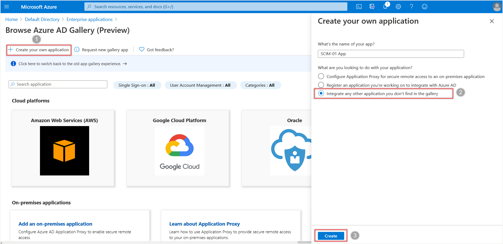

# Tutorial: Develop and plan provisioning for a SCIM endpoint in Microsoft Entra ID

As an application developer, you can use the System for Cross-Domain Identity Management (SCIM) user management API to enable automatic provisioning of users and groups between your application and Microsoft Entra ID. This article describes how to build a SCIM endpoint and integrate with the Microsoft Entra provisioning service. The SCIM specification provides a common user schema for provisioning. When used with federation standards like SAML or OpenID Connect, SCIM gives administrators an end-to-end, standards-based solution for access management.


SCIM 2.0 is a standardized definition of two endpoints: a `/Users` endpoint and a `/Groups` endpoint. It uses common REST API endpoints to create, update, and delete objects. The SCIM consists of a predefined schema for common attributes like group name, username, first name, last name and email. 

Apps that offer a SCIM 2.0 REST API can reduce or eliminate the pain of working with a proprietary user management API. For example, any compliant SCIM client knows how to make an HTTP POST of a JSON object to the `/Users` endpoint to create a new user entry. Instead of needing a slightly different API for the same basic actions, apps that conform to the SCIM standard can instantly take advantage of pre-existing clients, tools, and code. 

The standard user object schema and rest APIs for management defined in SCIM 2.0 (RFC [7642](https://tools.ietf.org/html/rfc7642), [7643](https://tools.ietf.org/html/rfc7643), [7644](https://tools.ietf.org/html/rfc7644)) allow identity providers and apps to more easily integrate with each other. Application developers that build a SCIM endpoint can integrate with any SCIM-compliant client without having to do custom work.

To automate provisioning to an application, it requires building and integrating a SCIM endpoint that is access by the Microsoft Entra provisioning service. Use the following steps to start provisioning users and groups into your application.


1. [Design your user and group schema](#design-your-user-and-group-schema) - Identify the application's objects and attributes to determine how they map to the user and group schema supported by the Microsoft Entra SCIM implementation.

1. [Understand the Microsoft Entra SCIM implementation](#understand-the-azure-ad-scim-implementation) - Understand how the Microsoft Entra provisioning service is implemented to model your SCIM protocol request handling and responses.

1. [Build a SCIM endpoint](#build-a-scim-endpoint) - An endpoint must be SCIM 2.0-compatible to integrate with the Microsoft Entra provisioning service. As an option, use Microsoft Common Language Infrastructure (CLI) libraries and code samples to build your endpoint. These samples are for reference and testing only; we recommend against using them as dependencies in your production app.


1. [Integrate your SCIM endpoint](#integrate-your-scim-endpoint-with-the-azure-ad-provisioning-service) with the Microsoft Entra provisioning service. Microsoft Entra ID supports several third-party applications that implement SCIM 2.0. If you use one of these apps, then you can quickly automate both provisioning and deprovisioning of users and groups.


1. [Optional] [Publish your application to the Microsoft Entra application gallery](#publish-your-application-to-the-azure-ad-application-gallery) - Make it easy for customers to discover your application and easily configure provisioning. 


## Design your user and group schema

Each application requires different attributes to create a user or group. Start your integration by identifying the required objects (users, groups) and attributes (name, manager, job title, etc.) that your application needs. 

The SCIM standard defines a schema for managing users and groups. 

The **core** user schema only requires three attributes (all other attributes are optional):

- `id`, service provider defined identifier
- `userName`, a unique identifier for the user (generally maps to the Microsoft Entra user principal name)
- `meta`, *read-only* metadata maintained by the service provider

In addition to the **core** user schema, the SCIM standard defines an **enterprise** user extension with a model for extending the user schema to meet your application's needs. 

For example, if your application requires both a user's email and user's manager, use the **core** schema to collect the user's email and the **enterprise** user schema to collect the user's manager.

To design your schema, follow these steps:

1. List the attributes your application requires, then categorize as attributes needed for authentication (for example, loginName and email). Attributes are needed to manage the user lifecycle (for example, status / active), and all other attributes needed for the application to work (for example, manager, tag).

1. Check if the attributes are already defined in the **core** user schema or **enterprise** user schema. If not, you must define an extension to the user schema that covers the missing attributes. See example for an extension to the user to allow provisioning a user `tag`.

1. Map SCIM attributes to the user attributes in Microsoft Entra ID. If one of the attributes you've defined in your SCIM endpoint doesn't have a clear counterpart on the Microsoft Entra user schema, guide the tenant administrator to extend their schema, or use an extension attribute as shown in the example for the `tags` property.

The following table lists an example of required attributes:

|Required app attribute|Mapped SCIM attribute|Mapped Microsoft Entra attribute|
|--|--|--|
|loginName|userName|userPrincipalName|
|firstName|name.givenName|givenName|
|lastName|name.familyName|surName|
|workMail|emails[type eq "work"].value|Mail|
|manager|manager|manager|
|tag|`urn:ietf:params:scim:schemas:extension:CustomExtensionName:2.0:User:tag`|extensionAttribute1|
|status|active|isSoftDeleted (computed value not stored on user)|

The following JSON payload shows an example SCIM schema:

```json
{
     "schemas": ["urn:ietf:params:scim:schemas:core:2.0:User",
      "urn:ietf:params:scim:schemas:extension:enterprise:2.0:User",
      "urn:ietf:params:scim:schemas:extension:CustomExtensionName:2.0:User"],
     "userName":"bjensen@testuser.com",
     "id": "48af03ac28ad4fb88478",
     "externalId":"bjensen",
     "name":{
       "familyName":"Jensen",
       "givenName":"Barbara"
     },
     "urn:ietf:params:scim:schemas:extension:enterprise:2.0:User": {
     "Manager": "123456"
   },
     "urn:ietf:params:scim:schemas:extension:CustomExtensionName:2.0:User": {
     "tag": "701984",
   },
   "meta": {
     "resourceType": "User",
     "created": "2010-01-23T04:56:22Z",
     "lastModified": "2011-05-13T04:42:34Z",
     "version": "W\/\"3694e05e9dff591\"",
     "location":
 "https://example.com/v2/Users/2819c223-7f76-453a-919d-413861904646"
   }
}   
```


> [!NOTE]
> In addition to the attributes required for the application, the JSON representation also includes the required `id`, `externalId`, and `meta` attributes.

It helps to categorize between `/User` and `/Group` to map any default user attributes in Microsoft Entra ID to the SCIM RFC, see [how customize attributes are mapped between Microsoft Entra ID and your SCIM endpoint](customize-application-attributes.md).


The following table lists an example of user attributes:

| Microsoft Entra user | `urn:ietf:params:scim:schemas:extension:enterprise:2.0:User` |
| --- | --- |
| IsSoftDeleted |active |
|department| `urn:ietf:params:scim:schemas:extension:enterprise:2.0:User:department`|
| displayName |displayName |
|employeeId|`urn:ietf:params:scim:schemas:extension:enterprise:2.0:User:employeeNumber`|
| Facsimile-TelephoneNumber |phoneNumbers[type eq "fax"].value |
| givenName |name.givenName |
| jobTitle |title |
| mail |emails[type eq "work"].value |
| mailNickname |externalId |
| manager |`urn:ietf:params:scim:schemas:extension:enterprise:2.0:User:manager` |
| mobile |phoneNumbers[type eq "mobile"].value |
| postalCode |addresses[type eq "work"].postalCode |
| proxy-Addresses |emails[type eq "other"].Value |
| physical-Delivery-OfficeName |addresses[type eq "other"].Formatted |
| streetAddress |addresses[type eq "work"].streetAddress |
| surname |name.familyName |
| telephone-Number |phoneNumbers[type eq "work"].value |
| user-PrincipalName |userName |

The following table lists an example of group attributes:

| Microsoft Entra group | `urn:ietf:params:scim:schemas:core:2.0:Group` |
| --- | --- |
| displayName |displayName |
| members |members |
| objectId |externalId |


> [!NOTE]
> You are not required to support both users and groups, or all the attributes shown here, it's only a reference on how attributes in Microsoft Entra ID are often mapped to properties in the SCIM protocol. 

There are several endpoints defined in the SCIM RFC. You can start with the `/User` endpoint and then expand from there. The following table lists some of the SCIM endpoints: 

|Endpoint|Description|
|--|--|
|/User|Perform CRUD operations on a user object.|
|/Group|Perform CRUD operations on a group object.|
|/Schemas|The set of attributes supported by each client and service provider can vary. One service provider might include `name`, `title`, and `emails`, while another service provider uses `name`, `title`, and `phoneNumbers`. The schemas endpoint allows for discovery of the attributes supported.|
|/Bulk|Bulk operations allow you to perform operations on a large collection of resource objects in a single operation (for example, update memberships for a large group).|
|/ServiceProviderConfig|Provides details about the features of the SCIM standard that are supported, for example, the resources that are supported and the authentication method.|
|/ResourceTypes|Specifies metadata about each resource.|

> [!NOTE]
> Use the `/Schemas` endpoint to support custom attributes or if your schema changes frequently as it enables a client to retrieve the most up-to-date schema automatically. Use the `/Bulk` endpoint to support groups.

<a name='understand-the-azure-ad-scim-implementation'></a>

## Understand the Microsoft Entra SCIM implementation

The Microsoft Entra provisioning service is designed to support a SCIM 2.0 user management API.

> [!IMPORTANT]
> The behavior of the Microsoft Entra SCIM implementation was last updated on December 18, 2018. For information on what changed, see [SCIM 2.0 protocol compliance of the Microsoft Entra user provisioning service](application-provisioning-config-problem-scim-compatibility.md).

Within the SCIM 2.0 protocol specification, your application must support these requirements:

|Requirement|Reference notes (SCIM protocol)|
|---|---|
|Create users, and optionally also groups|[Section 3.3](https://tools.ietf.org/html/rfc7644#section-3.3)|
|Modify users or groups with PATCH requests|[Section 3.5.2](https://tools.ietf.org/html/rfc7644#section-3.5.2). Supporting ensures that groups and users are provisioned in a performant manner.|
|Retrieve a known resource for a user or group created earlier|[Section 3.4.1](https://tools.ietf.org/html/rfc7644#section-3.4.1)|
|Query users or groups|[Section 3.4.2](https://tools.ietf.org/html/rfc7644#section-3.4.2).  By default, users are retrieved with their `id` and queried with their `username` and `externalId`, and groups are queried with `displayName`.|
|The filter [excludedAttributes=members](#get-group) when querying the group resource|Section [3.4.2.2](https://www.rfc-editor.org/rfc/rfc7644#section-3.4.2.2)|
|Support listing users and paginating|[Section 3.4.2.4](https://datatracker.ietf.org/doc/html/rfc7644#section-3.4.2.4).|
|Soft-deleting a user `active=false` and restoring the user `active=true`|The user object should be returned in a request whether or not the user is active. The only time the user shouldn't be returned is when it's hard deleted from the application.|
|Support the /Schemas endpoint|[Section 7](https://tools.ietf.org/html/rfc7643#page-30) The schema discovery endpoint is used to discover more attributes.|
|Accept a single bearer token for authentication and authorization of Microsoft Entra ID to your application.||

Use the general guidelines when implementing a SCIM endpoint to ensure compatibility with Microsoft Entra ID:

### General:

* `id` is a required property for all resources. Every response that returns a resource should ensure each resource has this property, except for `ListResponse` with zero elements.
* Values sent should be stored in the same format they were sent. Invalid values should be rejected with a descriptive, actionable error message. Transformations of data shouldn't happen between data from Microsoft Entra ID and data stored in the SCIM application. (for example. A phone number sent as 55555555555 shouldn't be saved/returned as +5 (555) 555-5555)
* It isn't necessary to include the entire resource in the **PATCH** response.
* Don't require a case-sensitive match on structural elements in SCIM, in particular **PATCH** `op` operation values, as defined in [section 3.5.2](https://tools.ietf.org/html/rfc7644#section-3.5.2). Microsoft Entra ID emits the values of `op` as **Add**, **Replace**, and **Remove**.
* Microsoft Entra ID makes requests to fetch a random user and group to ensure that the endpoint and the credentials are valid. It's also done as a part of the **Test Connection** flow. 
* Support HTTPS on your SCIM endpoint.
* Custom complex and multivalued attributes are supported but Microsoft Entra ID doesn't have many complex data structures to pull data from in these cases. Name/value attributes can be mapped to easily, but flowing data to complex attributes with three or more subattributes isn't supported.
* The "type" subattribute values of multivalued complex attributes must be unique. For example, there can't be two different email addresses with the "work" subtype.
* The header for all the responses should be of content-Type: application/scim+json 

### Retrieving Resources:

* Response to a query/filter request should always be a `ListResponse`.
* Microsoft Entra-only uses the following operators: `eq`, `and`
* The attribute that the resources can be queried on should be set as a matching attribute on the application, see [Customizing User Provisioning Attribute Mappings](customize-application-attributes.md).

### /Users:

* The entitlements attribute isn't supported.
* Any attributes that are considered for user uniqueness must be usable as part of a filtered query. (for example, if user uniqueness is evaluated for both userName and emails[type eq "work"], a GET to /Users with a filter must allow for both _userName eq "user@contoso.com"_ and _emails[type eq "work"].value eq "user@contoso.com"_ queries.

### /Groups:

* Groups are optional, but only supported if the SCIM implementation supports **PATCH** requests.
* Groups must have uniqueness on the 'displayName' value to match with Microsoft Entra ID and the SCIM application. The uniqueness isn't a requirement of the SCIM protocol, but is a requirement for integrating a SCIM endpoint with Microsoft Entra ID.

### /Schemas (Schema discovery):

* [Sample request/response](#schema-discovery)
* Schema discovery is being used on certain gallery applications. Schema discovery is the sole method to add more attributes to the schema of an existing gallery SCIM application. Schema discovery isn't currently supported on custom non-gallery SCIM application.
* If a value isn't present, don't send null values.
* Property values should be camel cased (for example, readWrite).
* Must return a list response.
* The Microsoft Entra provisioning service makes the /schemas request when you save the provisioning configuration. The request is also made when you open the edit provisioning page. Other attributes discovered are surfaced to customers in the attribute mappings under the target attribute list. Schema discovery only leads to more target attributes being added. Attributes aren't removed. 

### User provisioning and deprovisioning

The following diagram shows the messages that Microsoft Entra ID sends to a SCIM endpoint to manage the lifecycle of a user in your application's identity store.  

[](media/use-scim-to-provision-users-and-groups/scim-figure-4.png#lightbox)

### Group provisioning and deprovisioning

Group provisioning and deprovisioning are optional. When implemented and enabled, the following illustration shows the messages that Microsoft Entra ID sends to a SCIM endpoint to manage the lifecycle of a group in your application's identity store. Those messages differ from the messages about users in two ways:

* Requests to retrieve groups specify that the members attribute is to be excluded from any resource provided in response to the request.  
* Requests to determine whether a reference attribute has a certain value are requests about the members attribute.  

The following diagram shows the group deprovisioning sequence:

[](media/use-scim-to-provision-users-and-groups/scim-figure-5.png#lightbox)

### SCIM protocol requests and responses

This article provides example SCIM requests emitted by the Microsoft Entra provisioning service and example expected responses. For best results, you should code your app to handle these requests in this format and emit the expected responses.

> [!IMPORTANT]
> To understand how and when the Microsoft Entra user provisioning service emits the operations described in the example, see the section [Provisioning cycles: Initial and incremental](how-provisioning-works.md#provisioning-cycles-initial-and-incremental) in [How provisioning works](how-provisioning-works.md).

[User Operations](#user-operations)

- [Create User](#create-user) ([Request](#request) / [Response](#response))
- [Get User](#get-user) ([Request](#request-1) / [Response](#response-1))
- [Get User by query](#get-user-by-query) ([Request](#request-2) / [Response](#response-2))
- [Get User by query - Zero results](#get-user-by-query---zero-results) ([Request](#request-3) / [Response](#response-3))
- [Update User [Multi-valued properties]](#update-user-multi-valued-properties) ([Request](#request-4) / [Response](#response-4))
- [Update User [Single-valued properties]](#update-user-single-valued-properties) ([Request](#request-5) / [Response](#response-5)) 
- [Disable User](#disable-user) ([Request](#request-14) / [Response](#response-14))
- [Delete User](#delete-user) ([Request](#request-6) / [Response](#response-6))

[Group Operations](#group-operations)

- [Create Group](#create-group) ([Request](#request-7) / [Response](#response-7))
- [Get Group](#get-group) ([Request](#request-8) / [Response](#response-8))
- [Get Group by displayName](#get-group-by-displayname) ([Request](#request-9) / [Response](#response-9))
- [Update Group [Non-member attributes]](#update-group-non-member-attributes) ([Request](#request-10) / [Response](#response-10))
- [Update Group [Add Members]](#update-group-add-members) ([Request](#request-11) / [Response](#response-11))
- [Update Group [Remove Members]](#update-group-remove-members) ([Request](#request-12) / [Response](#response-12))
- [Delete Group](#delete-group) ([Request](#request-13) / [Response](#response-13))

[Schema discovery](#schema-discovery)

- [Discover schema](#discover-schema) ([Request](#request-15) / [Response](#response-15))

### User Operations

* Use `userName` or `emails[type eq "work"]` attributes to query users.  

#### Create User

##### Request

*POST /Users*
```json
{
    "schemas": [
        "urn:ietf:params:scim:schemas:core:2.0:User",
        "urn:ietf:params:scim:schemas:extension:enterprise:2.0:User"],
    "externalId": "0a21f0f2-8d2a-4f8e-bf98-7363c4aed4ef",
    "userName": "Test_User_ab6490ee-1e48-479e-a20b-2d77186b5dd1",
    "active": true,
    "emails": [{
        "primary": true,
        "type": "work",
        "value": "Test_User_fd0ea19b-0777-472c-9f96-4f70d2226f2e@testuser.com"
    }],
    "meta": {
        "resourceType": "User"
    },
    "name": {
        "formatted": "givenName familyName",
        "familyName": "familyName",
        "givenName": "givenName"
    },
    "roles": []
}
```

##### Response

*HTTP/1.1 201 Created*
```json
{
    "schemas": ["urn:ietf:params:scim:schemas:core:2.0:User"],
    "id": "48af03ac28ad4fb88478",
    "externalId": "0a21f0f2-8d2a-4f8e-bf98-7363c4aed4ef",
    "meta": {
        "resourceType": "User",
        "created": "2018-03-27T19:59:26.000Z",
        "lastModified": "2018-03-27T19:59:26.000Z"
    },
    "userName": "Test_User_ab6490ee-1e48-479e-a20b-2d77186b5dd1",
    "name": {
        "formatted": "givenName familyName",
        "familyName": "familyName",
        "givenName": "givenName",
    },
    "active": true,
    "emails": [{
        "value": "Test_User_fd0ea19b-0777-472c-9f96-4f70d2226f2e@testuser.com",
        "type": "work",
        "primary": true
    }]
}
```

#### Get User

###### <a name="request-1"></a>Request
*GET /Users/5d48a0a8e9f04aa38008* 

###### <a name="response-1"></a>Response (User found)
*HTTP/1.1 200 OK*
```json
{
    "schemas": ["urn:ietf:params:scim:schemas:core:2.0:User"],
    "id": "5d48a0a8e9f04aa38008",
    "externalId": "58342554-38d6-4ec8-948c-50044d0a33fd",
    "meta": {
        "resourceType": "User",
        "created": "2018-03-27T19:59:26.000Z",
        "lastModified": "2018-03-27T19:59:26.000Z"
    },
    "userName": "Test_User_feed3ace-693c-4e5a-82e2-694be1b39934",
    "name": {
        "formatted": "givenName familyName",
        "familyName": "familyName",
        "givenName": "givenName",
    },
    "active": true,
    "emails": [{
        "value": "Test_User_22370c1a-9012-42b2-bf64-86099c2a1c22@testuser.com",
        "type": "work",
        "primary": true
    }]
}
```

###### Request

*GET /Users/5171a35d82074e068ce2* 

###### Response (User not found. The detail isn't required, only status.)

*HTTP/1.1 404 Not Found*

```json
{
    "schemas": [
        "urn:ietf:params:scim:api:messages:2.0:Error"
    ],
    "status": "404",
    "detail": "Resource 23B51B0E5D7AE9110A49411D@7cca31655d49f3640a494224 not found"
}
```

#### Get User by query

##### <a name="request-2"></a>Request

*GET /Users?filter=userName eq "Test_User_dfeef4c5-5681-4387-b016-bdf221e82081"*

##### <a name="response-2"></a>Response

*HTTP/1.1 200 OK*
```json
{
    "schemas": ["urn:ietf:params:scim:api:messages:2.0:ListResponse"],
    "totalResults": 1,
    "Resources": [{
        "schemas": ["urn:ietf:params:scim:schemas:core:2.0:User"],
        "id": "2441309d85324e7793ae",
        "externalId": "7fce0092-d52e-4f76-b727-3955bd72c939",
        "meta": {
            "resourceType": "User",
            "created": "2018-03-27T19:59:26.000Z",
            "lastModified": "2018-03-27T19:59:26.000Z"
            
        },
        "userName": "Test_User_dfeef4c5-5681-4387-b016-bdf221e82081",
        "name": {
            "familyName": "familyName",
            "givenName": "givenName"
        },
        "active": true,
        "emails": [{
            "value": "Test_User_91b67701-697b-46de-b864-bd0bbe4f99c1@testuser.com",
            "type": "work",
            "primary": true
        }]
    }],
    "startIndex": 1,
    "itemsPerPage": 20
}
```

#### Get User by query - Zero results

##### <a name="request-3"></a>Request

*GET /Users?filter=userName eq "non-existent user"*

##### <a name="response-3"></a>Response

*HTTP/1.1 200 OK*
```json
{
    "schemas": ["urn:ietf:params:scim:api:messages:2.0:ListResponse"],
    "totalResults": 0,
    "Resources": [],
    "startIndex": 1,
    "itemsPerPage": 20
}
```

#### Update User [Multi-valued properties]

##### <a name="request-4"></a>Request

*PATCH /Users/6764549bef60420686bc HTTP/1.1*
```json
{
    "schemas": ["urn:ietf:params:scim:api:messages:2.0:PatchOp"],
    "Operations": [
            {
            "op": "Replace",
            "path": "emails[type eq \"work\"].value",
            "value": "updatedEmail@microsoft.com"
            },
            {
            "op": "Replace",
            "path": "name.familyName",
            "value": "updatedFamilyName"
            }
    ]
}
```

##### <a name="response-4"></a>Response

*HTTP/1.1 200 OK*
```json
{
    "schemas": ["urn:ietf:params:scim:schemas:core:2.0:User"],
    "id": "6764549bef60420686bc",
    "externalId": "6c75de36-30fa-4d2d-a196-6bdcdb6b6539",
    "meta": {
        "resourceType": "User",
        "created": "2018-03-27T19:59:26.000Z",
        "lastModified": "2018-03-27T19:59:26.000Z"
    },
    "userName": "Test_User_fbb9dda4-fcde-4f98-a68b-6c5599e17c27",
    "name": {
        "formatted": "givenName updatedFamilyName",
        "familyName": "updatedFamilyName",
        "givenName": "givenName"
    },
    "active": true,
    "emails": [{
        "value": "updatedEmail@microsoft.com",
        "type": "work",
        "primary": true
    }]
}
```

#### Update User [Single-valued properties]

##### <a name="request-5"></a>Request

*PATCH /Users/5171a35d82074e068ce2 HTTP/1.1*
```json
{
    "schemas": ["urn:ietf:params:scim:api:messages:2.0:PatchOp"],
    "Operations": [{
        "op": "Replace",
        "path": "userName",
        "value": "5b50642d-79fc-4410-9e90-4c077cdd1a59@testuser.com"
    }]
}
```

##### <a name="response-5"></a>Response

*HTTP/1.1 200 OK*
```json
{
    "schemas": ["urn:ietf:params:scim:schemas:core:2.0:User"],
    "id": "5171a35d82074e068ce2",
    "externalId": "aa1eca08-7179-4eeb-a0be-a519f7e5cd1a",
    "meta": {
        "resourceType": "User",
        "created": "2018-03-27T19:59:26.000Z",
        "lastModified": "2018-03-27T19:59:26.000Z"
        
    },
    "userName": "5b50642d-79fc-4410-9e90-4c077cdd1a59@testuser.com",
    "name": {
        "formatted": "givenName familyName",
        "familyName": "familyName",
        "givenName": "givenName",
    },
    "active": true,
    "emails": [{
        "value": "Test_User_49dc1090-aada-4657-8434-4995c25a00f7@testuser.com",
        "type": "work",
        "primary": true
    }]
}
```

### Disable User

##### <a name="request-14"></a>Request

*PATCH /Users/5171a35d82074e068ce2 HTTP/1.1*

```json
{
    "Operations": [
        {
            "op": "Replace",
            "path": "active",
            "value": false
        }
    ],
    "schemas": [
        "urn:ietf:params:scim:api:messages:2.0:PatchOp"
    ]
}
```

##### <a name="response-14"></a>Response

```json
{
    "schemas": [
        "urn:ietf:params:scim:schemas:core:2.0:User"
    ],
    "id": "CEC50F275D83C4530A495FCF@834d0e1e5d8235f90a495fda",
    "userName": "deanruiz@testuser.com",
    "name": {
        "familyName": "Harris",
        "givenName": "Larry"
    },
    "active": false,
    "emails": [
        {
            "value": "gloversuzanne@testuser.com",
            "type": "work",
            "primary": true
        }
    ],
    "addresses": [
        {
            "country": "ML",
            "type": "work",
            "primary": true
        }
    ],
    "meta": {
        "resourceType": "Users",
        "location": "/scim/5171a35d82074e068ce2/Users/CEC50F265D83B4530B495FCF@5171a35d82074e068ce2"
    }
}
```

#### Delete User

##### <a name="request-6"></a>Request

*DELETE /Users/5171a35d82074e068ce2 HTTP/1.1*

##### <a name="response-6"></a>Response

*HTTP/1.1 204 No Content*

### Group Operations

* Groups are created with an empty members list.
* Use the `displayName` attribute to query groups.
* Update to the group PATCH request should yield an *HTTP 204 No Content* in the response. Returning a body with a list of all the members isn't advisable.
* It isn't necessary to support returning all the members of the group.

#### Create Group

##### <a name="request-7"></a>Request

*POST /Groups HTTP/1.1*
```json
{
    "schemas": ["urn:ietf:params:scim:schemas:core:2.0:Group", "http://schemas.microsoft.com/2006/11/ResourceManagement/ADSCIM/2.0/Group"],
    "externalId": "8aa1a0c0-c4c3-4bc0-b4a5-2ef676900159",
    "displayName": "displayName",
    "meta": {
        "resourceType": "Group"
    }
}
```

##### <a name="response-7"></a>Response

*HTTP/1.1 201 Created*
```json
{
    "schemas": ["urn:ietf:params:scim:schemas:core:2.0:Group"],
    "id": "927fa2c08dcb4a7fae9e",
    "externalId": "8aa1a0c0-c4c3-4bc0-b4a5-2ef676900159",
    "meta": {
        "resourceType": "Group",
        "created": "2018-03-27T19:59:26.000Z",
        "lastModified": "2018-03-27T19:59:26.000Z"
        
    },
    "displayName": "displayName",
    "members": []
}
```

#### Get Group

##### <a name="request-8"></a>Request

*GET /Groups/40734ae655284ad3abcc?excludedAttributes=members HTTP/1.1*

##### <a name="response-8"></a>Response

*HTTP/1.1 200 OK*

```json
{
    "schemas": ["urn:ietf:params:scim:schemas:core:2.0:Group"],
    "id": "40734ae655284ad3abcc",
    "externalId": "60f1bb27-2e1e-402d-bcc4-ec999564a194",
    "meta": {
        "resourceType": "Group",
        "created": "2018-03-27T19:59:26.000Z",
        "lastModified": "2018-03-27T19:59:26.000Z"
    },
    "displayName": "displayName",
}
```

#### Get Group by displayName

##### <a name="request-9"></a>Request

*GET /Groups?excludedAttributes=members&filter=displayName eq "displayName" HTTP/1.1*

##### <a name="response-9"></a>Response

*HTTP/1.1 200 OK*

```json
{
    "schemas": ["urn:ietf:params:scim:api:messages:2.0:ListResponse"],
    "totalResults": 1,
    "Resources": [{
        "schemas": ["urn:ietf:params:scim:schemas:core:2.0:Group"],
        "id": "8c601452cc934a9ebef9",
        "externalId": "0db508eb-91e2-46e4-809c-30dcbda0c685",
        "meta": {
            "resourceType": "Group",
            "created": "2018-03-27T22:02:32.000Z",
            "lastModified": "2018-03-27T22:02:32.000Z",
            
        },
        "displayName": "displayName",
    }],
    "startIndex": 1,
    "itemsPerPage": 20
}
```

#### Update Group [Non-member attributes]

##### <a name="request-10"></a>Request

*PATCH /Groups/fa2ce26709934589afc5 HTTP/1.1*

```json
{
    "schemas": ["urn:ietf:params:scim:api:messages:2.0:PatchOp"],
    "Operations": [{
        "op": "Replace",
        "path": "displayName",
        "value": "1879db59-3bdf-4490-ad68-ab880a269474updatedDisplayName"
    }]
}
```

##### <a name="response-10"></a>Response

*HTTP/1.1 204 No Content*

### Update Group [Add Members]

##### <a name="request-11"></a>Request

*PATCH /Groups/a99962b9f99d4c4fac67 HTTP/1.1*

```json
{
    "schemas": ["urn:ietf:params:scim:api:messages:2.0:PatchOp"],
    "Operations": [{
        "op": "Add",
        "path": "members",
        "value": [{
            "$ref": null,
            "value": "f648f8d5ea4e4cd38e9c"
        }]
    }]
}
```

##### <a name="response-11"></a>Response

*HTTP/1.1 204 No Content*

#### Update Group [Remove Members]

##### <a name="request-12"></a>Request

*PATCH /Groups/a99962b9f99d4c4fac67 HTTP/1.1*
```json
{
    "schemas": ["urn:ietf:params:scim:api:messages:2.0:PatchOp"],
    "Operations": [{
        "op": "Remove",
        "path": "members",
        "value": [{
            "$ref": null,
            "value": "f648f8d5ea4e4cd38e9c"
        }]
    }]
}
```

##### <a name="response-12"></a>Response

*HTTP/1.1 204 No Content*

#### Delete Group

##### <a name="request-13"></a>Request

*DELETE /Groups/cdb1ce18f65944079d37 HTTP/1.1*

##### <a name="response-13"></a>Response

*HTTP/1.1 204 No Content*

### Schema discovery

#### Discover schema

##### <a name="request-15"></a>Request

*GET /Schemas* 

##### <a name="response-15"></a>Response

*HTTP/1.1 200 OK*

```json
{
    "schemas": [
        "urn:ietf:params:scim:api:messages:2.0:ListResponse"
    ],
    "itemsPerPage": 50,
    "startIndex": 1,
    "totalResults": 3,
    "Resources": [
  {
    "schemas": ["urn:ietf:params:scim:schemas:core:2.0:Schema"],
    "id" : "urn:ietf:params:scim:schemas:core:2.0:User",
    "name" : "User",
    "description" : "User Account",
    "attributes" : [
      {
        "name" : "userName",
        "type" : "string",
        "multiValued" : false,
        "description" : "Unique identifier for the User, typically
used by the user to directly authenticate to the service provider.
Each User MUST include a non-empty userName value.  This identifier
MUST be unique across the service provider's entire set of Users.
REQUIRED.",
        "required" : true,
        "caseExact" : false,
        "mutability" : "readWrite",
        "returned" : "default",
        "uniqueness" : "server"
      },                
    ],
    "meta" : {
      "resourceType" : "Schema",
      "location" :
        "/v2/Schemas/urn:ietf:params:scim:schemas:core:2.0:User"
    }
  },
  {
    "schemas": ["urn:ietf:params:scim:schemas:core:2.0:Schema"],
    "id" : "urn:ietf:params:scim:schemas:core:2.0:Group",
    "name" : "Group",
    "description" : "Group",
    "attributes" : [
      {
        "name" : "displayName",
        "type" : "string",
        "multiValued" : false,
        "description" : "A human-readable name for the Group.
REQUIRED.",
        "required" : false,
        "caseExact" : false,
        "mutability" : "readWrite",
        "returned" : "default",
        "uniqueness" : "none"
      },
    ],
    "meta" : {
      "resourceType" : "Schema",
      "location" :
        "/v2/Schemas/urn:ietf:params:scim:schemas:core:2.0:Group"
    }
  },
  {
    "schemas": ["urn:ietf:params:scim:schemas:core:2.0:Schema"],
    "id" : "urn:ietf:params:scim:schemas:extension:enterprise:2.0:User",
    "name" : "EnterpriseUser",
    "description" : "Enterprise User",
    "attributes" : [
      {
        "name" : "employeeNumber",
        "type" : "string",
        "multiValued" : false,
        "description" : "Numeric or alphanumeric identifier assigned
to a person, typically based on order of hire or association with an
organization.",
        "required" : false,
        "caseExact" : false,
        "mutability" : "readWrite",
        "returned" : "default",
        "uniqueness" : "none"
      },
    ],
    "meta" : {
      "resourceType" : "Schema",
      "location" :
"/v2/Schemas/urn:ietf:params:scim:schemas:extension:enterprise:2.0:User"
    }
  }
]
}
```


### Security requirements

**TLS Protocol Versions**

The only acceptable protocol version is TLS 1.2. No other SSL/TLS version is permitted.

- RSA keys must be at least 2,048 bits.
- ECC keys must be at least 256 bits, generated using an approved elliptic curve

**Key Lengths**

All services must use X.509 certificates generated using cryptographic keys of sufficient length, meaning:

**Cipher Suites**

All services must be configured to use the following cipher suites, in the exact order specified in the example. If you only have an RSA certificate, installed the ECDSA cipher suites don't have any effect. </br>

TLS 1.2 Cipher Suites minimum bar:

- TLS_ECDHE_ECDSA_WITH_AES_128_GCM_SHA256
- TLS_ECDHE_ECDSA_WITH_AES_256_GCM_SHA384
- TLS_ECDHE_RSA_WITH_AES_128_GCM_SHA256
- TLS_ECDHE_RSA_WITH_AES_256_GCM_SHA384
- TLS_ECDHE_ECDSA_WITH_AES_128_CBC_SHA256
- TLS_ECDHE_ECDSA_WITH_AES_256_CBC_SHA384
- TLS_ECDHE_RSA_WITH_AES_128_CBC_SHA256
- TLS_ECDHE_RSA_WITH_AES_256_CBC_SHA384

### IP Ranges

The Microsoft Entra provisioning service currently operates under the IP Ranges for Microsoft Entra ID as listed [here](https://www.microsoft.com/download/details.aspx?id=56519&WT.mc_id=rss_alldownloads_all). You can add the IP ranges listed under the Microsoft Entra ID tag to allow traffic from the Microsoft Entra provisioning service into your application. You need to review the IP range list carefully for computed addresses. An address such as '40.126.25.32' could be represented in the IP range list as  '40.126.0.0/18'. You can also programmatically retrieve the IP range list using the following [API](/rest/api/virtualnetwork/servicetags/list).

Microsoft Entra ID also supports an agent based solution to provide connectivity to applications in private networks (on-premises, hosted in Azure, hosted in AWS, etc.). Customers can deploy a lightweight agent, which provides connectivity to Microsoft Entra ID without opening any inbound ports, on a server in their private network. Learn more [here](./on-premises-scim-provisioning.md).

## Build a SCIM endpoint

Now that you've designed your schema and understood the Microsoft Entra SCIM implementation, you can get started developing your SCIM endpoint. Rather than starting from scratch and building the implementation completely on your own, you can rely on many open source SCIM libraries published by the SCIM community.

For guidance on how to build a SCIM endpoint including examples, see [Develop a sample SCIM endpoint](use-scim-to-build-users-and-groups-endpoints.md).

The open source .NET Core [reference code example](https://aka.ms/SCIMReferenceCode) published by the Microsoft Entra provisioning team is one such resource that can jump start your development. Build a SCIM endpoint, then test it out. Use the collection of [Postman tests](https://github.com/AzureAD/SCIMReferenceCode/wiki/Test-Your-SCIM-Endpoint) provided as part of the reference code or run through the sample requests / responses [provided](#user-operations).  

   > [!Note]
   > The reference code is intended to help you get started building your SCIM endpoint and is provided "AS IS." Contributions from the community are welcome to help build and maintain the code.

The solution is composed of two projects, _Microsoft.SCIM_ and _Microsoft.SCIM.WebHostSample_.

The _Microsoft.SCIM_ project is the library that defines the components of the web service that conforms to the SCIM specification. It declares the interface _Microsoft.SCIM.IProvider_, requests are translated into calls to the provider's methods, which would be programmed to operate on an identity store.


The _Microsoft.SCIM.WebHostSample_ project is an ASP.NET Core Web Application, based on the _Empty_ template. It allows the sample code to be deployed as standalone, hosted in containers or within Internet Information Services. It also implements the _Microsoft.SCIM.IProvider_ interface keeping classes in memory as a sample identity store.

```csharp
public class Startup
{
    ...
    public IMonitor MonitoringBehavior { get; set; }
    public IProvider ProviderBehavior { get; set; }

    public Startup(IWebHostEnvironment env, IConfiguration configuration)
    {
        ...
        this.MonitoringBehavior = new ConsoleMonitor();
        this.ProviderBehavior = new InMemoryProvider();
    }
    ...
```

### Building a custom SCIM endpoint

The SCIM endpoint must have an HTTP address and server authentication certificate of which the root certification authority is one of the following names:

* CNNIC
* Comodo
* CyberTrust
* DigiCert
* GeoTrust
* GlobalSign
* Go Daddy
* VeriSign
* WoSign
* DST Root CA X3

The .NET Core SDK includes an HTTPS development certificate that is used during development. The certificate is installed as part of the first-run experience. Depending on how you run the ASP.NET Core Web Application it listens to a different port:

* Microsoft.SCIM.WebHostSample: `https://localhost:5001`
* IIS Express: `https://localhost:44359`

For more information on HTTPS in ASP.NET Core, use the following link:
[Enforce HTTPS in ASP.NET Core](/aspnet/core/security/enforcing-ssl)

### Handling endpoint authentication

Requests from Microsoft Entra provisioning service include an OAuth 2.0 bearer token. An authorization server issues the bearer token. Microsoft Entra ID is an example of a trusted  authorization server. Configure the Microsoft Entra provisioning service to use one of the following tokens:

- A long-lived bearer token. If the SCIM endpoint requires an OAuth bearer token from an issuer other than Microsoft Entra ID, then copy the required OAuth bearer token into the optional **Secret Token** field. In a development environment, you can use the testing token from the `/scim/token` endpoint. Test tokens shouldn't be used in production environments.

- Microsoft Entra bearer token. If **Secret Token** field is left blank, Microsoft Entra ID includes an OAuth bearer token issued from Microsoft Entra ID with each request. Apps that use Microsoft Entra ID as an identity provider can validate this Microsoft Entra ID-issued token.

  - The application that receives requests should validate the token issuer as being Microsoft Entra ID for an expected Microsoft Entra tenant.
  - An `iss` claim identifies the issuer of the token. For example, `"iss":"https://sts.windows.net/12345678-0000-0000-0000-000000000000/"`. In this example, the base address of the claim value, `https://sts.windows.net` identifies Microsoft Entra ID as the issuer, while the relative address segment, _12345678-0000-0000-0000-000000000000_, is a unique identifier of the Microsoft Entra tenant for which the token was issued.
  - The audience for a token is the **Application ID** for the application in the gallery. Applications registered in a single tenant receive the same `iss` claim with SCIM requests. The application ID for all custom apps is _8adf8e6e-67b2-4cf2-a259-e3dc5476c621_. The token generated by the Microsoft Entra provisioning service should only be used for testing. It shouldn't be used in production environments.


In the sample code, requests are authenticated using the Microsoft.AspNetCore.Authentication.JwtBearer package. The following code enforces that requests to any of the service's endpoints are authenticated using the bearer token issued by Microsoft Entra ID for a specified tenant:

```csharp
public void ConfigureServices(IServiceCollection services)
{
    if (_env.IsDevelopment())
    {
        ...
    }
    else
    {
        services.AddAuthentication(options =>
        {
            options.DefaultAuthenticateScheme = JwtBearerDefaults.AuthenticationScheme;
            options.DefaultChallengeScheme = JwtBearerDefaults.AuthenticationScheme;
        })
            .AddJwtBearer(options =>
            {
                options.Authority = " https://sts.windows.net/12345678-0000-0000-0000-000000000000/";
                options.Audience = "8adf8e6e-67b2-4cf2-a259-e3dc5476c621";
                ...
            });
    }
    ...
}

public void Configure(IApplicationBuilder app)
{
    ...
    app.UseAuthentication();
    app.UseAuthorization();
    ...
}
```

A bearer token is also required to use of the provided [Postman tests](https://github.com/AzureAD/SCIMReferenceCode/wiki/Test-Your-SCIM-Endpoint) and perform local debugging using localhost. The sample code uses ASP.NET Core environments to change the authentication options during development stage and enable the use a self-signed token.

For more information on multiple environments in ASP.NET Core, see [Use multiple environments in ASP.NET Core](/aspnet/core/fundamentals/environments).

The following code enforces that requests to any of the service's endpoints are authenticated using a bearer token signed with a custom key:

```csharp
public void ConfigureServices(IServiceCollection services)
{
    if (_env.IsDevelopment())
    {
        services.AddAuthentication(options =>
        {
            options.DefaultAuthenticateScheme = JwtBearerDefaults.AuthenticationScheme;
            options.DefaultChallengeScheme = JwtBearerDefaults.AuthenticationScheme;
        })
        .AddJwtBearer(options =>
        {
            options.TokenValidationParameters =
                new TokenValidationParameters
                {
                    ValidateIssuer = false,
                    ValidateAudience = false,
                    ValidateLifetime = false,
                    ValidateIssuerSigningKey = false,
                    ValidIssuer = "Microsoft.Security.Bearer",
                    ValidAudience = "Microsoft.Security.Bearer",
                    IssuerSigningKey = new SymmetricSecurityKey(Encoding.UTF8.GetBytes("A1B2C3D4E5F6A1B2C3D4E5F6"))
                };
        });
    }
...
```

Send a GET request to the Token controller to get a valid bearer token, the method _GenerateJSONWebToken_ is responsible to create a token matching the parameters configured for development:

```csharp
private string GenerateJSONWebToken()
{
    // Create token key
    SymmetricSecurityKey securityKey =
        new SymmetricSecurityKey(Encoding.UTF8.GetBytes("A1B2C3D4E5F6A1B2C3D4E5F6"));
    SigningCredentials credentials =
        new SigningCredentials(securityKey, SecurityAlgorithms.HmacSha256);

    // Set token expiration
    DateTime startTime = DateTime.UtcNow;
    DateTime expiryTime = startTime.AddMinutes(120);

    // Generate the token
    JwtSecurityToken token =
        new JwtSecurityToken(
            "Microsoft.Security.Bearer",
            "Microsoft.Security.Bearer",
            null,
            notBefore: startTime,
            expires: expiryTime,
            signingCredentials: credentials);

    string result = new JwtSecurityTokenHandler().WriteToken(token);
    return result;
}
```

### Handling provisioning and deprovisioning of users

***Example 1. Query the service for a matching user***

Microsoft Entra ID queries the service for a user with an `externalId` attribute value matching the mailNickname attribute value of a user in Microsoft Entra ID. The query is expressed as a Hypertext Transfer Protocol (HTTP) request such as this example, wherein jyoung is a sample of a mailNickname of a user in Microsoft Entra ID.

>[!NOTE]
> This is an example only. Not all users will have a mailNickname attribute, and the value a user has may not be unique in the directory. Also, the attribute used for matching (which in this case is `externalId`) is configurable in the [Microsoft Entra attribute mappings](customize-application-attributes.md).

```
GET https://.../scim/Users?filter=externalId eq jyoung HTTP/1.1
 Authorization: Bearer ...
```

In the sample code, the request is translated into a call to the QueryAsync method of the service's provider. Here's the signature of that method: 

```csharp
// System.Threading.Tasks.Tasks is defined in mscorlib.dll.  
// Microsoft.SCIM.IRequest is defined in 
// Microsoft.SCIM.Service.  
// Microsoft.SCIM.Resource is defined in 
// Microsoft.SCIM.Schemas.  
// Microsoft.SCIM.IQueryParameters is defined in 
// Microsoft.SCIM.Protocol.  

Task<Resource[]> QueryAsync(IRequest<IQueryParameters> request);
```

In the sample query, for a user with a given value for the `externalId` attribute, values of the arguments passed to the QueryAsync method are:

* parameters.AlternateFilters.Count: 1
* parameters.AlternateFilters.ElementAt(0).AttributePath: "externalId"
* parameters.AlternateFilters.ElementAt(0).ComparisonOperator: ComparisonOperator.Equals
* parameters.AlternateFilter.ElementAt(0).ComparisonValue: "jyoung"

***Example 2. Provision a user***

If the response to a query to the SCIM endpoint for a user with an `externalId` attribute value that matches the mailNickname attribute value of a user doesn't return any users, then Microsoft Entra ID requests that the service provision a user corresponding to the one in Microsoft Entra ID.  Here's an example of such a request: 

```http
POST https://.../scim/Users HTTP/1.1
Authorization: Bearer ...
Content-type: application/scim+json
{
   "schemas":
   [
     "urn:ietf:params:scim:schemas:core:2.0:User",
     "urn:ietf:params:scim:schemas:extension:enterprise:2.0User"],
   "externalId":"jyoung",
   "userName":"jyoung@testuser.com",
   "active":true,
   "addresses":null,
   "displayName":"Joy Young",
   "emails": [
     {
       "type":"work",
       "value":"jyoung@Contoso.com",
       "primary":true}],
   "meta": {
     "resourceType":"User"},
    "name":{
     "familyName":"Young",
     "givenName":"Joy"},
   "phoneNumbers":null,
   "preferredLanguage":null,
   "title":null,
   "department":null,
   "manager":null}
```

In the sample code, the request is translated into a call to the CreateAsync method of the service's provider. Here's the signature of that method: 

```csharp
// System.Threading.Tasks.Tasks is defined in mscorlib.dll.  
// Microsoft.SCIM.IRequest is defined in 
// Microsoft.SCIM.Service.  
// Microsoft.SCIM.Resource is defined in 
// Microsoft.SCIM.Schemas.  

Task<Resource> CreateAsync(IRequest<Resource> request);
```

In a request for user provisioning, the value of the resource argument is an instance of the Microsoft.SCIM.Core2EnterpriseUser class. This class is defined in the Microsoft.SCIM.Schemas library.  If the request to provision the user succeeds, then the implementation of the method is expected to return an instance of the Microsoft.SCIM.Core2EnterpriseUser class. The value of the `Identifier` property is set to the unique identifier of the newly provisioned user.  

***Example 3. Query the current state of a user*** 

Microsoft Entra ID requests the current state of the specified user from the service with a request such as: 

```
GET ~/scim/Users/54D382A4-2050-4C03-94D1-E769F1D15682 HTTP/1.1
Authorization: Bearer ...
```

In the sample code, the request is translated into a call to the RetrieveAsync method of the service's provider. Here's the signature of that method: 

```csharp
// System.Threading.Tasks.Tasks is defined in mscorlib.dll.  
// Microsoft.SCIM.IRequest is defined in 
// Microsoft.SCIM.Service.  
// Microsoft.SCIM.Resource and 
// Microsoft.SCIM.IResourceRetrievalParameters 
// are defined in Microsoft.SCIM.Schemas 

Task<Resource> RetrieveAsync(IRequest<IResourceRetrievalParameters> request);
```

In the example of a request, to retrieve the current state of a user, the values of the properties of the object provided as the value of the parameters argument are as follows: 
  
* Identifier: "54D382A4-2050-4C03-94D1-E769F1D15682"
* SchemaIdentifier: `urn:ietf:params:scim:schemas:extension:enterprise:2.0:User`

***Example 4. Query the value of a reference attribute to be updated*** 

Microsoft Entra ID checks the current attribute value in the identity store before updating it. However, only the manager attribute is the checked first for users. Here's an example of a request to determine whether the manager attribute of a user object currently has a certain value: 
In the sample code, the request is translated into a call to the QueryAsync method of the service's provider. The value of the properties of the object provided as the value of the parameters argument are as follows: 
  
* parameters.AlternateFilters.Count: 2
* parameters.AlternateFilters.ElementAt(x).AttributePath: "ID"
* parameters.AlternateFilters.ElementAt(x).ComparisonOperator: ComparisonOperator.Equals
* parameters.AlternateFilter.ElementAt(x).ComparisonValue: "54D382A4-2050-4C03-94D1-E769F1D15682"
* parameters.AlternateFilters.ElementAt(y).AttributePath: "manager"
* parameters.AlternateFilters.ElementAt(y).ComparisonOperator: ComparisonOperator.Equals
* parameters.AlternateFilter.ElementAt(y).ComparisonValue: "2819c223-7f76-453a-919d-413861904646"
* parameters.RequestedAttributePaths.ElementAt(0): "ID"
* parameters.SchemaIdentifier: `urn:ietf:params:scim:schemas:extension:enterprise:2.0:User`

The value of the index x can be `0` and the value of the index y can be `1`. Or the value of x can be `1` and the value of y can be `0`. It depends on the order of the expressions of the filter query parameter.

***Example 5. Request from Microsoft Entra ID to an SCIM endpoint to update a user*** 

Here's an example of a request from Microsoft Entra ID to an SCIM endpoint to update a user: 

```http
PATCH ~/scim/Users/54D382A4-2050-4C03-94D1-E769F1D15682 HTTP/1.1
Authorization: Bearer ...
Content-type: application/scim+json
{
    "schemas": 
    [
      "urn:ietf:params:scim:api:messages:2.0:PatchOp"],
    "Operations":
    [
      {
        "op":"Add",
        "path":"manager",
        "value":
          [
            {
              "$ref":"http://.../scim/Users/2819c223-7f76-453a-919d-413861904646",
              "value":"2819c223-7f76-453a-919d-413861904646"}]}]}
```

In the sample code, the request is translated into a call to the UpdateAsync method of the service's provider. Here's the signature of that method: 

```csharp
// System.Threading.Tasks.Tasks and 
// System.Collections.Generic.IReadOnlyCollection<T>  // are defined in mscorlib.dll.  
// Microsoft.SCIM.IRequest is defined in
// Microsoft.SCIM.Service.
// Microsoft.SCIM.IPatch, 
// is defined in Microsoft.SCIM.Protocol. 

Task UpdateAsync(IRequest<IPatch> request);
```

In the example of a request, to update a user, the object provided as the value of the patch argument has these property values: 

|Argument|Value|
|-|-|
|`ResourceIdentifier.Identifier`|"54D382A4-2050-4C03-94D1-E769F1D15682"|
|`ResourceIdentifier.SchemaIdentifier`| `urn:ietf:params:scim:schemas:extension:enterprise:2.0:User`|
|`(PatchRequest as PatchRequest2).Operations.Count`|1|
|`(PatchRequest as PatchRequest2).Operations.ElementAt(0).OperationName`| `OperationName.Add`|
|`(PatchRequest as PatchRequest2).Operations.ElementAt(0).Path.AttributePath`| Manager|
|`(PatchRequest as PatchRequest2).Operations.ElementAt(0).Value.Count`|1|
|`(PatchRequest as PatchRequest2).Operations.ElementAt(0).Value.ElementAt(0).Reference`|`http://.../scim/Users/2819c223-7f76-453a-919d-413861904646`|
|`(PatchRequest as PatchRequest2).Operations.ElementAt(0).Value.ElementAt(0).Value`| 2819c223-7f76-453a-919d-413861904646|

***Example 6. Deprovision a user***

To deprovision a user from an identity store fronted by an SCIM endpoint, Microsoft Entra ID sends a request such as:

```http
DELETE ~/scim/Users/54D382A4-2050-4C03-94D1-E769F1D15682 HTTP/1.1
Authorization: Bearer ...
```

In the sample code, the request is translated into a call to the DeleteAsync method of the service's provider. Here's the signature of that method: 

```csharp
// System.Threading.Tasks.Tasks is defined in mscorlib.dll.  
// Microsoft.SCIM.IRequest is defined in 
// Microsoft.SCIM.Service.  
// Microsoft.SCIM.IResourceIdentifier, 
// is defined in Microsoft.SCIM.Protocol. 

Task DeleteAsync(IRequest<IResourceIdentifier> request);
```

The object provided as the value of the resourceIdentifier argument has these property values in the example of a request to deprovision a user: 

* ResourceIdentifier.Identifier: "54D382A4-2050-4C03-94D1-E769F1D15682"
* ResourceIdentifier.SchemaIdentifier: `urn:ietf:params:scim:schemas:extension:enterprise:2.0:User`

<a name='integrate-your-scim-endpoint-with-the-azure-ad-provisioning-service'></a>

## Integrate your SCIM endpoint with the Microsoft Entra provisioning service

Microsoft Entra ID can be configured to automatically provision assigned users and groups to applications that implement a specific profile of the [SCIM 2.0 protocol](https://tools.ietf.org/html/rfc7644). The specifics of the profile are documented in [Understand the Microsoft Entra SCIM implementation](#understand-the-azure-ad-scim-implementation).

Check with your application provider, or your application provider's documentation for statements of compatibility with these requirements.

> [!IMPORTANT]
> The Microsoft Entra SCIM implementation is built on top of the Microsoft Entra user provisioning service, which is designed to constantly keep users in sync between Microsoft Entra ID and the target application, and implements a very specific set of standard operations. It's important to understand these behaviors to understand the behavior of the Microsoft Entra provisioning service. For more information, see the section [Provisioning cycles: Initial and incremental](how-provisioning-works.md#provisioning-cycles-initial-and-incremental) in [How provisioning works](how-provisioning-works.md).

### Getting started

[!INCLUDE [portal updates](~/articles/active-directory/includes/portal-update.md)]

Applications that support the SCIM profile described in this article can be connected to Microsoft Entra ID using the "non-gallery application" feature in the Microsoft Entra application gallery. Once connected, Microsoft Entra ID runs a synchronization process. The process runs every 40 minutes. The process queries the application's SCIM endpoint for assigned users and groups, and creates or modifies them according to the assignment details.

**To connect an application that supports SCIM:**

1. Sign in to the [Microsoft Entra admin center](https://entra.microsoft.com) as at least a [Application Administrator](../roles/permissions-reference.md#application-administrator).
1. Browse to **Identity** > **Applications** > **Enterprise applications**.
1. A list of all configured apps is shown, including apps that were added from the gallery.
1. Select **+ New application** > **+ Create your own application**.
1. Enter a name for your application, choose the option "*integrate any other application you don't find in the gallery*" and select **Add** to create an app object. The new app is added to the list of enterprise applications and opens to its app management screen.
    
    The following screenshot shows the Microsoft Entra application gallery:

    

1. In the app management screen, select **Provisioning** in the left panel.
1. In the **Provisioning Mode** menu, select **Automatic**.
    
    The following screenshot shows the configuring provisioning settings in the Microsoft Entra admin center:

   

1. In the **Tenant URL** field, enter the URL of the application's SCIM endpoint. Example: `https://api.contoso.com/scim/`
1. If the SCIM endpoint requires an OAuth bearer token from an issuer other than Microsoft Entra ID, then copy the required OAuth bearer token into the optional **Secret Token** field. If this field is left blank, Microsoft Entra ID includes an OAuth bearer token issued from Microsoft Entra ID with each request. Apps that use Microsoft Entra ID as an identity provider can validate this Microsoft Entra ID-issued token. 
   > [!NOTE]
   > It's ***not*** recommended to leave this field blank and rely on a token generated by Microsoft Entra ID. This option is primarily available for testing purposes.
1. Select **Test Connection** to have Microsoft Entra ID attempt to connect to the SCIM endpoint. If the attempt fails, error information is displayed.  

    > [!NOTE]
    > **Test Connection** queries the SCIM endpoint for a user that doesn't exist, using a random GUID as the matching property selected in the Microsoft Entra configuration. The expected correct response is HTTP 200 OK with an empty SCIM ListResponse message.

1. If the attempts to connect to the application succeed, then select **Save** to save the admin credentials.
1. In the **Mappings** section, there are two selectable sets of [attribute mappings](customize-application-attributes.md): one for user objects and one for group objects. Select each one to review the attributes that are synchronized from Microsoft Entra ID to your app. The attributes selected as **Matching** properties are used to match the users and groups in your app for update operations. Select **Save** to commit any changes.

    > [!NOTE]
    > You can optionally disable syncing of group objects by disabling the "groups" mapping.

1. Under **Settings**, the **Scope** field defines which users and groups are synchronized. Select **Sync only assigned users and groups** (recommended) to only sync users and groups assigned in the **Users and groups** tab.
1. Once your configuration is complete, set the **Provisioning Status** to **On**.
1. Select **Save** to start the Microsoft Entra provisioning service.
1. If syncing only assigned users and groups (recommended), select the **Users and groups** tab. Then, assign the users or groups you want to sync.

Once the initial cycle has started, you can select **Provisioning logs** in the left panel to monitor progress, which shows all actions done by the provisioning service on your app. For more information on how to read the Microsoft Entra provisioning logs, see [Reporting on automatic user account provisioning](check-status-user-account-provisioning.md).

> [!NOTE]
> The initial cycle takes longer to perform than later syncs, which occur approximately every 40 minutes as long as the service is running.

<a name='publish-your-application-to-the-azure-ad-application-gallery'></a>

## Publish your application to the Microsoft Entra application gallery

If you're building an application used by more than one tenant, make it available in the Microsoft Entra application gallery. It's easy for organizations to discover the application and configure provisioning. Publishing your app in the Microsoft Entra gallery and making provisioning available to others is easy. Check out the steps [here](../manage-apps/v2-howto-app-gallery-listing.md). Microsoft works with you to integrate your application into the gallery, test your endpoint, and release onboarding [documentation](../saas-apps/tutorial-list.md) for customers.

### Gallery onboarding checklist
Use the checklist to onboard your application quickly and customers have a smooth deployment experience. The information is gathered from you when onboarding to the gallery. 
> [!div class="checklist"]
> * Support a [SCIM 2.0](#understand-the-azure-ad-scim-implementation) user and group endpoint (Only one is required but both are recommended)
> * Support at least 25 requests per second per tenant to ensure that users and groups are provisioned and deprovisioned without delay (Required)
> * Establish engineering and support contacts to guide customers post gallery onboarding (Required)
> * 3 Non-expiring test credentials for your application (Required)
> * Support the OAuth authorization code grant or a long lived token as described in the example (Required)
> * OIDC apps must have at least 1 role (custom or default) defined
> * Establish an engineering and support point of contact to support customers post gallery onboarding (Required)
> * [Support schema discovery (required)](https://tools.ietf.org/html/rfc7643#section-6)
> * Support updating multiple group memberships with a single PATCH
> * Document your SCIM endpoint publicly

### Authorization to provisioning connectors in the application gallery
The SCIM spec doesn't define a SCIM-specific scheme for authentication and authorization and relies on the use of existing industry standards.

|Authorization method|Pros|Cons|Support|
|--|--|--|--|
|Username and password (not recommended or supported by Microsoft Entra ID)|Easy to implement|Insecure - [Your Pa$$word doesn't matter](https://techcommunity.microsoft.com/t5/microsoft-entra-azure-ad-blog/your-pa-word-doesn-t-matter/ba-p/731984)|Not supported for new gallery or non-gallery apps.|
|Long-lived bearer token|Long-lived tokens don't require a user to be present. They're easy for admins to use when setting up provisioning.|Long-lived tokens can be hard to share with an admin without using insecure methods such as email. |Supported for gallery and non-gallery apps. |
|OAuth authorization code grant|Access tokens have a shorter life than passwords, and have an automated refresh mechanism that long-lived bearer tokens don't have.  A real user must be present during initial authorization, adding a level of accountability. |Requires a user to be present. If the user leaves the organization, the token is invalid, and authorization needs to be completed again.|Supported for gallery apps, but not non-gallery apps. However, you can provide an access token in the UI as the secret token for short term testing purposes. Support for OAuth code grant on non-gallery is in our backlog, in addition to support for configurable auth / token URLs on the gallery app.|
|OAuth client credentials grant|Access tokens have a shorter life than passwords, and have an automated refresh mechanism that long-lived bearer tokens don't have. Both the authorization code grant and the client credentials grant create the same type of access token, so moving between these methods is transparent to the API.  Provisioning can be automated, and new tokens can be silently requested without user interaction. ||Supported for gallery apps, but not non-gallery apps. However, you can provide an access token in the UI as the secret token for short term testing purposes. Support for OAuth client credentials grant on non-gallery is in our backlog.|

> [!NOTE]
> It's not recommended to leave the token field blank in the Microsoft Entra provisioning configuration custom app UI. The token generated is primarily available for testing purposes.

### OAuth code grant flow

The provisioning service supports the [authorization code grant](https://tools.ietf.org/html/rfc6749#page-24) and after submitting your request for publishing your app in the gallery, our team will work with you to collect the following information:

- **Authorization URL**, a URL by the client to obtain authorization from the resource owner via user-agent redirection. The user is redirected to this URL to authorize access. 

- **Token exchange URL**, a URL by the client to exchange an authorization grant for an access token, typically with client authentication.

- **Client ID**, the authorization server issues the registered client a client identifier, which is a unique string representing the registration information provided by the client.  The client identifier isn't a secret; it's exposed to the resource owner and **must not** be used alone for client authentication.  

- **Client secret**, a secret generated by the authorization server that should be a unique value known only to the authorization server. 

> [!NOTE]
> The **Authorization URL** and **Token exchange URL** are currently not configurable per tenant.

> [!NOTE]
> OAuth v1 is not supported due to exposure of the client secret. OAuth v2 is supported.  

It's recommended, but not required, that you support multiple secrets for easy renewal without downtime.

#### How to set up OAuth code grant flow
1. Sign in to the [Microsoft Entra admin center](https://entra.microsoft.com) as at least a [Application Administrator](../roles/permissions-reference.md#application-administrator).
1. Browse to **Identity** > **Applications** > **Enterprise applications** > **Application** > **Provisioning** and select **Authorize**.

1. Sign in to the [Microsoft Entra admin center](https://entra.microsoft.com) as at least a [Application Administrator](../roles/permissions-reference.md#application-administrator).
1. Browse to **Identity** > **Applications** > **Enterprise applications**.
1. Select your application and go to **Provisioning**.
1. Select **Authorize**.

   1. Users are redirected to the Authorization URL (sign in page for the third party app).

   1. Admin provides credentials to the third party application. 

   1. The third party app redirects user back and provides the grant code 

   1. The Provisioning Service calls the token URL and provides the grant code. The third party application responds with the access token, refresh token, and expiry date

1. When the provisioning cycle begins, the service checks if the current access token is valid and exchanges it for a new token if needed. The access token is provided in each request made to the app and the validity of the request is checked before each request.

> [!NOTE]
> While it's not possible to setup OAuth on the non-gallery applications, you can manually generate an access token from your authorization server and input it as the secret token to a non-gallery application. This allows you to verify compatibility of your SCIM server with the Microsoft Entra provisioning service before onboarding to the app gallery, which does support the OAuth code grant.  

**Long-lived OAuth bearer tokens:** If your application doesn't support the OAuth authorization code grant flow, instead generate a long lived OAuth bearer token that an administrator can use to set up the provisioning integration. The token should be perpetual, or else the provisioning job is [quarantined](application-provisioning-quarantine-status.md) when the token expires.

For more authentication and authorization methods, let us know on [UserVoice](https://aka.ms/appprovisioningfeaturerequest).

### Gallery go-to-market launch check list
To help drive awareness and demand of our joint integration, we recommend you update your existing documentation and amplify the integration in your marketing channels. We recommend you to complete the following checklist to support the launch:

> [!div class="checklist"]
> * Ensure your sales and customer support teams are aware, ready, and can speak to the integration capabilities. Brief your teams, provide them with FAQs and include the integration into your sales materials. 
> * Craft a blog post or press release that describes the joint integration, the benefits and how to get started. [Example: Imprivata and Microsoft Entra Press Release](https://www.imprivata.com/company/press/imprivata-introduces-iam-cloud-platform-healthcare-supported-microsoft) 
> * Leverage your social media like Twitter, Facebook or LinkedIn to promote the integration to your customers. Be sure to include @Microsoft Entra ID so we can retweet your post. [Example: Imprivata Twitter Post](https://twitter.com/azuread/status/1123964502909779968)
> * Create or update your marketing pages/website (e.g. integration page, partner page, pricing page, etc.) to include the availability of the joint integration. [Example: Pingboard integration Page](https://pingboard.com/org-chart-for), [Smartsheet integration page](https://www.smartsheet.com/marketplace/apps/directory-integrations), [Monday.com pricing page](https://monday.com/pricing/) 
> * Create a help center article or technical documentation on how customers can get started. [Example: Envoy + Microsoft Entra integration.](https://envoy.help/en/articles/3453335-microsoft-azure-active-directory-integration) 
> * Alert customers of the new integration through your customer communication (monthly newsletters, email campaigns, product release notes). 

## Next steps

> [!div class="nextstepaction"]
> [Develop a sample SCIM endpoint](use-scim-to-build-users-and-groups-endpoints.md)
> [Automate user provisioning and deprovisioning to SaaS apps](user-provisioning.md)
> [Customize attribute mappings for user provisioning](customize-application-attributes.md)
> [Writing expressions for attribute mappings](functions-for-customizing-application-data.md)
> [Scoping filters for user provisioning](define-conditional-rules-for-provisioning-user-accounts.md)
> [Account provisioning notifications](user-provisioning.md)
> [List of tutorials on how to integrate SaaS apps](../saas-apps/tutorial-list.md)
