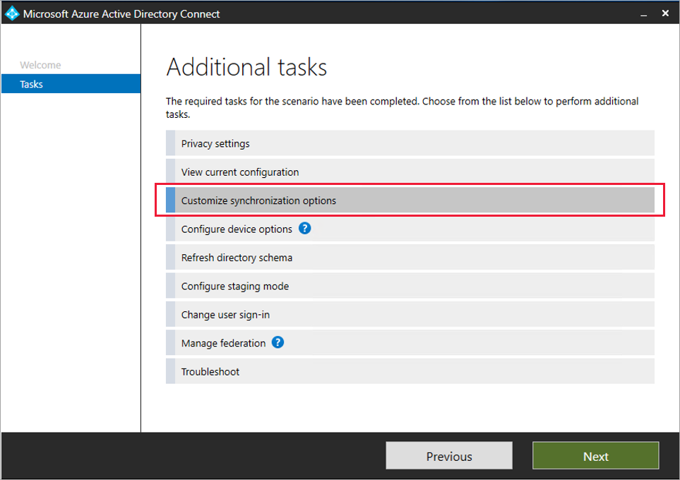
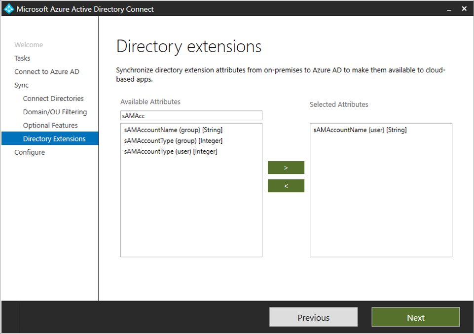
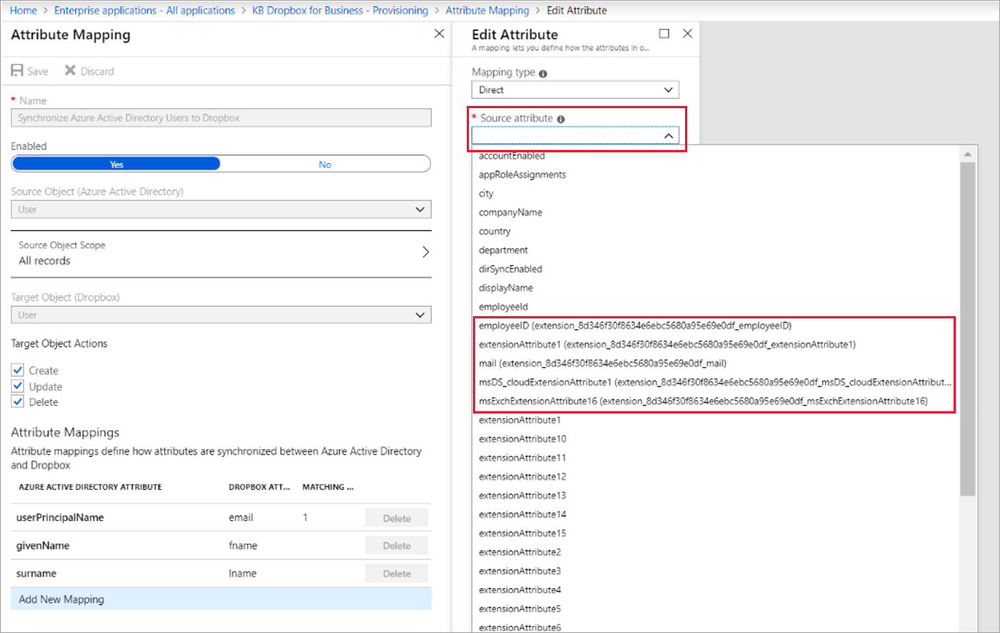

# Syncing extension attributes for Microsoft Entra Application Provisioning

Microsoft Entra ID must contain all the data (attributes) required to create a user profile when provisioning user accounts from Microsoft Entra ID to a [SaaS app](../saas-apps/tutorial-list.md) or on-premises application. When customizing attribute mappings for user provisioning, you might find the attribute you want to map doesn't appear in the **Source attribute** list. This article shows you how to add the missing attribute.

## Determine where the extensions need to be added

Adding missing attributes needed for an application will start in either on-premises Active Directory or in Microsoft Entra ID, depending on where the user accounts reside.

First, identify which users in your Microsoft Entra tenant will need access to the application and therefore are going to be in scope of being provisioned into the application.

>[!NOTE]
> For users in on-premises Active Directory, you must sync the users to Microsoft Entra ID. You can sync users and attributes using [Microsoft Entra Connect](../hybrid/connect/whatis-azure-ad-connect.md) or [Microsoft Entra Connect cloud sync](../hybrid/cloud-sync/what-is-cloud-sync.md). Both of these solutions automatically synchronizes certain attributes to Microsoft Entra ID, but not all attributes. Furthermore, some attributes (such as SAMAccountName) that are synchronized by default might not be exposed using the Graph API. In these cases, you can [use the Microsoft Entra Connect directory extension feature to synchronize the attribute to Microsoft Entra ID](#create-an-extension-attribute-using-azure-ad-connect) or [use Microsoft Entra Connect cloud sync](#create-an-extension-attribute-using-cloud-sync). That way, the attribute will be visible to the Graph API and the Microsoft Entra provisioning service.

  1. Check with the on-premises Active Directory domain admins whether the required attributes are part of the AD DS schema, and if they are not, extend the AD DS schema in the domains where those users have accounts.
  1. Configure [Microsoft Entra Connect](../hybrid/connect/whatis-azure-ad-connect.md) or Microsoft Entra Connect cloud sync to synchronize the users with their extension attribute from Active Directory to Microsoft Entra ID.   Microsoft Entra Connect automatically synchronizes certain attributes to Microsoft Entra ID, but not all attributes. Furthermore, some attributes (such as `sAMAccountName`) that are synchronized by default might not be exposed using the Graph API. In these cases, you can [use the Microsoft Entra Connect directory extension feature to synchronize the attribute to Microsoft Entra ID](#create-an-extension-attribute-using-azure-ad-connect). That way, the attribute will be visible to the Graph API and the Microsoft Entra provisioning service.
  1. If the users in on-premises Active Directory do not already have the required attributes, you will need to update the users in Active Directory.  This can be done either by reading the properties from [Workday](../saas-apps/workday-inbound-tutorial.md), from [SAP SuccessFactors](../saas-apps/sap-successfactors-inbound-provisioning-tutorial.md), or if you are using a different HR system, using Microsoft Identity Manager (MIM).
  1. Wait for Microsoft Entra Connect to synchronize those updates you made in the Active Directory schema and the Active Directory users into Microsoft Entra ID.

Alternatively, if none of the users that will need access to the application originate in on-premises Active Directory, then you will need to [create schema extensions using PowerShell or Microsoft Graph](#create-an-extension-attribute-in-a-tenant-with-cloud-only-users) in Microsoft Entra ID, before configuring provisioning to your application.

Next, if one or more of the users that will need access to the application do not originate in on-premises Active Directory, then you will need to populate those cloud users in Microsoft Entra ID with the required attribute, before enabling provisioning to your application.  There are four ways to populate the users in bulk:
  - If the properties originate in a cloud HR system, you can configure Microsoft Entra ID to read the properties from [Workday](../saas-apps/workday-inbound-cloud-only-tutorial.md) or [SAP SuccessFactors](../saas-apps/sap-successfactors-inbound-provisioning-cloud-only-tutorial.md).
  - If the properties originate in an on-premises system, you can configure the [MIM Connector for Microsoft Graph](/microsoft-identity-manager/microsoft-identity-manager-2016-connector-graph) to create or update Microsoft Entra users.
  - If the properties originate from the users themselves, then you can ask the users to supply the values of the attribute when they request access to the application, by including the attribute requirements in [entitlement management catalog](../governance/entitlement-management-catalog-create.md#add-resource-attributes-in-the-catalog).
  - For all other situations, a custom application can update the users via the [Microsoft Graph](/graph/extensibility-overview?tabs=http#update-or-delete-directory-extension-properties) API.

The following sections outline how to create extension attributes for a tenant with cloud only users, and for a tenant with Active Directory users.

## Create an extension attribute in a tenant with cloud only users
You can use Microsoft Graph and PowerShell to extend the user schema for users in Microsoft Entra ID.  This is necessary if you have any users who need that attribute and do not originate in on-premises Active Directory. (If you do have Active Directory, then continue reading below in the section on how to [use the Microsoft Entra Connect directory extension feature to synchronize the attribute to Microsoft Entra ID](#create-an-extension-attribute-using-azure-ad-connect).)

Once schema extensions are created, these extension attributes are automatically discovered when you next visit the provisioning page in the Microsoft Entra admin center, in most cases.

When you have more than 1000 service principals, you may find extensions missing in the source attribute list. If an attribute you've created doesn't automatically appear, then verify the attribute was created and add it manually to your schema. To verify it was created, use Microsoft Graph and [Graph Explorer](/graph/graph-explorer/graph-explorer-overview). To add it manually to your schema, see [Editing the list of supported attributes](customize-application-attributes.md#editing-the-list-of-supported-attributes).

### Create an extension attribute for cloud only users using Microsoft Graph
You can extend the schema of Microsoft Entra users using [Microsoft Graph](/graph/overview).

First, list the apps in your tenant to get the ID of the app you're working on. To learn more, see [List extensionProperties](/graph/api/application-list-extensionproperty).

```json
GET https://graph.microsoft.com/v1.0/applications
```

Next, create the extension attribute. Replace the **ID** property below with the **ID** retrieved in the previous step. You need to use the **"ID"** attribute and not the "appId". To learn more, see [Create extensionProperty]/graph/api/application-post-extensionproperty).

```json
POST https://graph.microsoft.com/v1.0/applications/{id}/extensionProperties
Content-type: application/json

{
    "name": "extensionName",
    "dataType": "string",
    "targetObjects": [
      "User"
    ]
}
```

The previous request created an extension attribute with the format `extension_appID_extensionName`. You can now update a user with this extension attribute. To learn more, see [Update user](/graph/api/user-update).
```json
PATCH https://graph.microsoft.com/v1.0/users/{id}
Content-type: application/json

{
  "extension_inputAppId_extensionName": "extensionValue"
}
```
Finally, verify the attribute for the user. To learn more, see [Get a user](/graph/api/user-get). Graph v1.0 doesn't by default return any of a user's directory extension attributes, unless the attributes are specified in the request as one of the properties to return.

```json
GET https://graph.microsoft.com/v1.0/users/{id}?$select=displayName,extension_inputAppId_extensionName
```


### Create an extension attribute on a cloud only user using PowerShell
Create a custom extension using PowerShell and assign a value to a user.

```PowerShell
#Connect to your Azure AD tenant
Connect-AzureAD

#Create an application (you can instead use an existing application if you would like)
$App = New-AzureADApplication -DisplayName “test app name” -IdentifierUris https://testapp

#Create a service principal
New-AzureADServicePrincipal -AppId $App.AppId

#Create an extension property
New-AzureADApplicationExtensionProperty -ObjectId $App.ObjectId -Name “TestAttributeName” -DataType “String” -TargetObjects “User”

#List users in your tenant to determine the objectid for your user
Get-AzureADUser

#Set a value for the extension property on the user. Replace the objectid with the ID of the user and the extension name with the value from the previous step
Set-AzureADUserExtension -objectid 0ccf8df6-62f1-4175-9e55-73da9e742690 -ExtensionName “extension_6552753978624005a48638a778921fan3_TestAttributeName”

#Verify that the attribute was added correctly.
Get-AzureADUser -ObjectId 0ccf8df6-62f1-4175-9e55-73da9e742690 | Select -ExpandProperty ExtensionProperty

```
## Create an extension attribute using cloud sync
Cloud sync will automatically discover your extensions in on-premises Active Directory when you go to add a new mapping.  Use the steps below to autodiscover these attributes and set up a corresponding mapping to Microsoft Entra ID.

1. Sign in to the [Microsoft Entra admin center](https://entra.microsoft.com) as at least a [Hybrid Identity Administrator](../roles/permissions-reference.md#hybrid-identity-administrator).
1. Browse to **Identity** > **Hybrid management** > **Microsoft Entra Connect** > **Cloud sync**.
1. Select the configuration you wish to add the extension attribute and mapping.
1. Under **Manage attributes** select **click to edit mappings**.
1. Select **Add attribute mapping**.  The attributes will automatically be discovered.
1. The new attributes are available in the drop-down under **source attribute**.
1. Fill in the type of mapping you want and select **Apply**.

   [](media/user-provisioning-sync-attributes-for-mapping/schema-1.png#lightbox)

For more information, see [Custom attribute mapping in Microsoft Entra Connect cloud sync](../hybrid/cloud-sync/custom-attribute-mapping.md)

<a name='create-an-extension-attribute-using-azure-ad-connect'></a>

## Create an extension attribute using Microsoft Entra Connect

If users who will access the applications originate in on-premises Active Directory, then you must sync the attributes with the users from Active Directory to Microsoft Entra ID. You will need to perform the following tasks before configuring provisioning to your application.

1. Check with the on-premises Active Directory domain admins whether the required attributes are part of the AD DS schema, and if they aren't, extend the AD DS schema in the domains where those users have accounts.

1. Open the Microsoft Entra Connect wizard, choose Tasks, and then choose **Customize synchronization options**.

   

2. Sign in as a [Global Administrator](../roles/permissions-reference.md#global-administrator).

3. On the **Optional Features** page, select **Directory extension attribute sync**.

   

4. Select the attribute(s) you want to extend to Microsoft Entra ID.
   > [!NOTE]
   > The search under **Available Attributes** is case sensitive.

   

5. Finish the Microsoft Entra Connect wizard and allow a full synchronization cycle to run. When the cycle is complete, the schema is extended and the new values are synchronized between your on-premises AD and Microsoft Entra ID.

6. In the Microsoft Entra admin center, while you’re [editing user attribute mappings](customize-application-attributes.md), the **Source attribute** list will now contain the added attribute in the format `<attributename> (extension_<appID>_<attributename>)`, where appID is the identifier of a placeholder application in your tenant. Select the attribute and map it to the target application for provisioning.

   

> [!NOTE]
> The ability to provision reference attributes from on-premises AD, such as **managedby** or **DN/DistinguishedName**, is not supported today. You can request this feature on [User Voice](https://feedback.azure.com/d365community/forum/22920db1-ad25-ec11-b6e6-000d3a4f0789).


## Next steps

* [Define who is in scope for provisioning](../app-provisioning/define-conditional-rules-for-provisioning-user-accounts.md)
