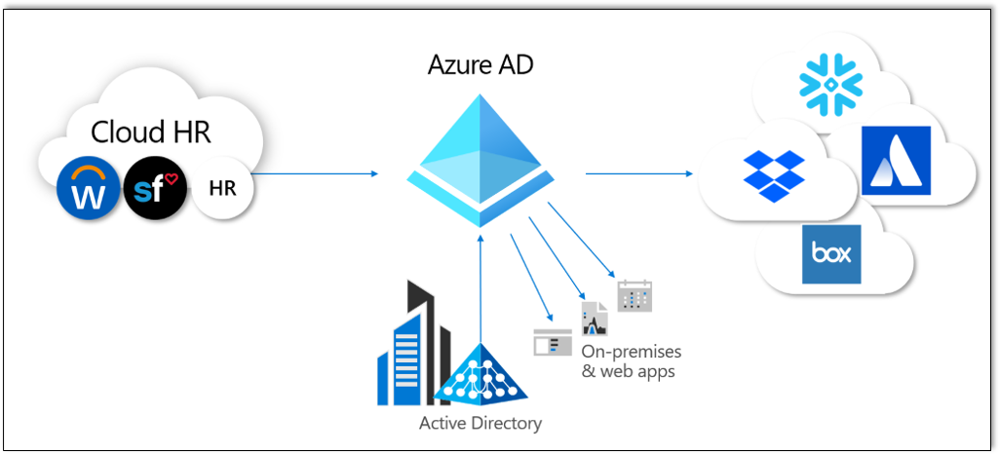

# What is app provisioning in Microsoft Entra ID?

In Microsoft Entra ID, the term *app provisioning* refers to automatically creating user identities and roles for applications.

Microsoft Entra application provisioning refers to automatically creating user identities and roles in the applications that users need access to. In addition to creating user identities, automatic provisioning includes the maintenance and removal of user identities as status or roles change. Common scenarios include provisioning a Microsoft Entra user into SaaS applications like [Dropbox](../../active-directory/saas-apps/dropboxforbusiness-provisioning-tutorial.md), [Salesforce](../../active-directory/saas-apps/salesforce-provisioning-tutorial.md), [ServiceNow](../../active-directory/saas-apps/servicenow-provisioning-tutorial.md), and many more.

Microsoft Entra ID also supports provisioning users into applications hosted on-premises or in a virtual machine, without having to open up any firewalls. The table below provides a mapping of protocols to connectors supported. 

|Protocol |Connector|
|-----|-----|
| SCIM | [SCIM - SaaS](use-scim-to-provision-users-and-groups.md)  [SCIM - On-prem / Private network](./on-premises-scim-provisioning.md) |
| LDAP | [LDAP](./on-premises-ldap-connector-configure.md)|
| SQL  | [SQL](./tutorial-ecma-sql-connector.md) |
| REST | [Web Services](./on-premises-web-services-connector.md)|
| SOAP | [Web Services](./on-premises-web-services-connector.md)|
| Flat-file| [PowerShell](./on-premises-powershell-connector.md) |
| Custom | [Custom ECMA connectors](./on-premises-custom-connector.md)   [Connectors and gateways built by partners](./partner-driven-integrations.md)|

- **Automate provisioning**: Automatically create new accounts in the right systems for new people when they join your team or organization.
- **Automate deprovisioning**: Automatically deactivate accounts in the right systems when people leave the team or organization.
- **Synchronize data between systems**: Keep the identities in apps and systems up to date based on changes in the directory or human resources system.
- **Provision groups**: Provision groups to applications that support them.
- **Govern access**: Monitor and audit users provisioned in applications.
- **Seamlessly deploy in brown field scenarios**: Match existing identities between systems and allow for easy integration, even when users already exist in the target system.
- **Use rich customization**: Take advantage of customizable attribute mappings that define what user data should flow from the source system to the target system.
- **Get alerts for critical events**: The provisioning service provides alerts for critical events and allows for Log Analytics integration where you can define custom alerts to suit your business needs.

## What is SCIM?

To help automate provisioning and deprovisioning, apps expose proprietary user and group APIs. User management in more than one app is a challenge because every app tries to perform the same actions. For example, creating or updating users, adding users to groups, or deprovisioning users. Often, developers implement these actions slightly different. For example, using different endpoint paths, different methods to specify user information, and different schema to represent each element of information.

To address these challenges, the System for Cross-domain Identity Management (SCIM) specification provides a common user schema to help users move into, out of, and around apps. SCIM is becoming the de facto standard for provisioning and, when used with federation standards like Security Assertions Markup Language (SAML) or OpenID Connect (OIDC), provides administrators an end-to-end standards-based solution for access management.

For detailed guidance on developing a SCIM endpoint to automate the provisioning and deprovisioning of users and groups to an application, see [Build a SCIM endpoint and configure user provisioning](use-scim-to-provision-users-and-groups.md). Many applications integrate directly with Microsoft Entra ID. Some examples include Slack, Azure Databricks, and Snowflake. For these apps, skip the developer documentation and use the tutorials provided in [Tutorials for integrating SaaS applications with Microsoft Entra ID](../../active-directory/saas-apps/tutorial-list.md).

## Manual vs. automatic provisioning

Applications in the Microsoft Entra gallery support one of two provisioning modes:

* **Manual** provisioning means there's no automatic Microsoft Entra provisioning connector for the app yet. You must create them manually. Examples are adding users directly into the app's administrative portal or uploading a spreadsheet with user account detail. Consult the documentation provided by the app, or contact the app developer to determine what mechanisms are available.
* **Automatic** means that a Microsoft Entra provisioning connector is available this application. Follow the setup tutorial specific to setting up provisioning for the application. Find the app tutorials at [Tutorials for integrating SaaS applications with Microsoft Entra ID](../../active-directory/saas-apps/tutorial-list.md).

The provisioning mode supported by an application is also visible on the **Provisioning** tab after you've added the application to your enterprise apps.

## Benefits of automatic provisioning

The number of applications used in modern organizations continues to grow. You, as an IT admin, must manage access management at scale. You use standards such as SAML or OIDC for single sign-on (SSO), but access also requires you provision users into an app. You might think provisioning means manually creating every user account or uploading CSV files each week. These processes are time-consuming, expensive, and error prone. To streamline the process, use SAML just-in-time (JIT) to automate provisioning. Use the same process to deprovision users when they leave the organization or no longer require access to certain apps based on role change.

Some common motivations for using automatic provisioning include:

- Maximizing the efficiency and accuracy of provisioning processes.
- Saving on costs associated with hosting and maintaining custom-developed provisioning solutions and scripts.
- Securing your organization by instantly removing users' identities from key SaaS apps when they leave the organization.
- Easily importing a large number of users into a particular SaaS application or system.
- A single set of policies to determine provisioned users that can sign in to an app.

Microsoft Entra user provisioning can help address these challenges. To learn more about how customers have been using Microsoft Entra user provisioning, read the [ASOS case study](https://techcommunity.microsoft.com/t5/microsoft-entra-azure-ad-blog/asos-better-protects-its-data-with-azure-ad-automated-user/ba-p/827846). The following video provides an overview of user provisioning in Microsoft Entra ID.

> [!VIDEO https://www.youtube.com/embed/_ZjARPpI6NI]

## What applications and systems can I use with Microsoft Entra automatic user provisioning?

Microsoft Entra features preintegrated support for many popular SaaS apps and human resources systems, and generic support for apps that implement specific parts of the [SCIM 2.0 standard](https://techcommunity.microsoft.com/t5/security-compliance-and-identity/provisioning-with-scim-getting-started/ba-p/880010).

* **Preintegrated applications (gallery SaaS apps)**: You can find all applications for which Microsoft Entra ID supports a preintegrated provisioning connector in [Tutorials for integrating SaaS applications with Microsoft Entra ID](../saas-apps/tutorial-list.md). The preintegrated applications listed in the gallery generally use SCIM 2.0-based user management APIs for provisioning. 

   

   To request a new application for provisioning, see [Submit a request to publish your application in Microsoft Entra application gallery](../manage-apps/v2-howto-app-gallery-listing.md). For a user provisioning request, we require the application to have a SCIM-compliant endpoint. Request that the application vendor follows the SCIM standard so we can onboard the app to our platform quickly.

* **Applications that support SCIM 2.0**: For information on how to generically connect applications that implement SCIM 2.0-based user management APIs, see [Build a SCIM endpoint and configure user provisioning](use-scim-to-provision-users-and-groups.md).

## How do I set up automatic provisioning to an application?

For preintegrated applications listed in the gallery, use existing step-by-step guidance to set up automatic provisioning, see [Tutorials for integrating SaaS applications with Microsoft Entra ID](../saas-apps/tutorial-list.md). The following video shows you how to set up automatic user provisioning for SalesForce.

> [!VIDEO https://www.youtube.com/embed/pKzyts6kfrw]

For other applications that support SCIM 2.0, follow the steps in [Build a SCIM endpoint and configure user provisioning](use-scim-to-provision-users-and-groups.md).

## Next steps

- [List of tutorials on how to integrate SaaS apps](../saas-apps/tutorial-list.md)
- [Customizing attribute mappings for user provisioning](customize-application-attributes.md)
- [Scoping filters for user provisioning](define-conditional-rules-for-provisioning-user-accounts.md)
