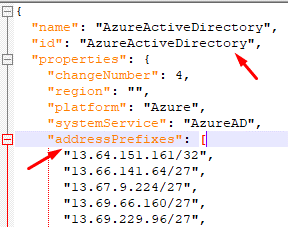

# How Microsoft Entra provisioning integrates with Workday

[Microsoft Entra user provisioning service](../app-provisioning/user-provisioning.md) integrates with [Workday HCM](https://www.workday.com) to manage the identity life cycle of users. Microsoft Entra ID offers three prebuilt integrations: 

* [Workday to on-premises Active Directory user provisioning](../saas-apps/workday-inbound-tutorial.md)
* [Workday to Microsoft Entra user provisioning](../saas-apps/workday-inbound-cloud-only-tutorial.md)
* [Workday Writeback](../saas-apps/workday-writeback-tutorial.md)

This article explains how the integration works and how you can customize the provisioning behavior for different HR scenarios. 

## Establishing connectivity 

<a name='restricting-workday-api-access-to-azure-ad-endpoints'></a>

### Restricting Workday API access to Microsoft Entra endpoints
Microsoft Entra provisioning service uses basic authentication to connect to Workday Web Services API endpoints.  

To further secure the connectivity between Microsoft Entra provisioning service and Workday, you can restrict access so that the designated integration system user only accesses the Workday APIs from allowed Microsoft Entra IP ranges. Engage your Workday administrator to complete the following configuration in your Workday tenant. 

1. Download the [latest IP Ranges](https://www.microsoft.com/download/details.aspx?id=56519) for the Azure Public Cloud. 
1. Open the file and search for tag **Microsoft Entra ID** 

   >[!div class="mx-imgBorder"] 
   >

1. Copy all IP address ranges listed within the element *addressPrefixes* and use the range to build your IP address list.
1. Sign in to Workday admin portal. 
1. Access the **Maintain IP Ranges** task to create a new IP range for Azure data centers. Specify the IP ranges (using CIDR notation) as a comma-separated list.  
1. Access the **Manage Authentication Policies** task to create a new authentication policy. In the authentication policy, use the authentication allowlist to specify the Microsoft Entra IP range and the security group that is allowed access from this IP range. Save the changes. 
1. Access the **Activate All Pending Authentication Policy Changes** task to confirm changes.

### Limiting access to worker data in Workday using constrained security groups

The default steps to [configure the Workday integration system user](../saas-apps/workday-inbound-tutorial.md#configure-integration-system-user-in-workday) grants access to retrieve all users in your Workday tenant. In certain integration scenarios, you may want to limit access. For example, only return users in certain supervisory organizations from the `Get_Workers` API call.

You can limit access by working with your Workday admin and configuring constrained integration system security groups. For more information about Workday, see [Workday community](https://community.workday.com/forums/customer-questions/620393) (*Workday Community access required for this article*).

This strategy of limiting access using constrained ISSG (Integration System Security Groups) is useful in the following scenarios: 
* **Phased rollout scenario**: You have a large Workday tenant and plan to perform a phased rollout of Workday to Microsoft Entra ID automated provisioning. In this scenario, rather than excluding users who aren't in scope of the current phase with Microsoft Entra ID scoping filters, we recommend configuring constrained ISSG so that only in-scope workers are visible to Microsoft Entra ID.
* **Multiple provisioning jobs scenario**: You have a large Workday tenant and multiple AD domains each supporting a different business unit/division/company. To support this topology, you would like to run multiple Workday to Microsoft Entra provisioning jobs with each job provisioning a specific set of workers. In this scenario, rather than using Microsoft Entra ID scoping filters to exclude worker data, we recommend configuring constrained ISSG so that only the relevant worker data is visible to Microsoft Entra ID. 

### Workday test connection query

To test connectivity to Workday, Microsoft Entra ID sends the following *Get_Workers* Workday Web Services request. 

```xml
<!-- Test connection query tries to retrieve one record from the first page -->
<!-- Replace version with Workday Web Services version present in your connection URL -->
<!-- Replace timestamps with the UTC time corresponding to the test connection event -->
<Get_Workers_Request p1:version="v21.1" xmlns:p1="urn:com.workday/bsvc" xmlns="urn:com.workday/bsvc">
  <p1:Request_Criteria>
    <p1:Transaction_Log_Criteria_Data>
      <p1:Transaction_Date_Range_Data>
        <p1:Updated_From>2021-01-19T02:28:50.1491022Z</p1:Updated_From>
        <p1:Updated_Through>2021-01-19T02:28:50.1491022Z</p1:Updated_Through>
      </p1:Transaction_Date_Range_Data>
    </p1:Transaction_Log_Criteria_Data>
    <p1:Exclude_Employees>true</p1:Exclude_Employees>
    <p1:Exclude_Contingent_Workers>true</p1:Exclude_Contingent_Workers>
    <p1:Exclude_Inactive_Workers>true</p1:Exclude_Inactive_Workers>
  </p1:Request_Criteria>
  <p1:Response_Filter>
    <p1:As_Of_Effective_Date>2021-01-19T02:28:50.1491022Z</p1:As_Of_Effective_Date>
    <p1:As_Of_Entry_DateTime>2021-01-19T02:28:50.1491022Z</p1:As_Of_Entry_DateTime>
    <p1:Page>1</p1:Page>
    <p1:Count>1</p1:Count>
  </p1:Response_Filter>
  <p1:Response_Group>
    <p1:Include_Reference>1</p1:Include_Reference>
    <p1:Include_Personal_Information>1</p1:Include_Personal_Information>
  </p1:Response_Group>
</Get_Workers_Request>
```

## How full sync works

**Full sync** in the context of Workday-driven provisioning refers to the process of fetching all identities from Workday and determining what provisioning rules to apply to each worker object. Full sync happens when you turn on provisioning for the first time and also when you *restart provisioning* either from the Microsoft Entra admin center or using Graph APIs. 

Microsoft Entra ID sends the following *Get_Workers* Workday Web Services request to retrieve worker data. The query looks up the Workday transaction log for all effective dated worker entries as of the time corresponding to the full sync run. 

```xml
<!-- Workday full sync query -->
<!-- Replace version with Workday Web Services version present in your connection URL -->
<!-- Replace timestamps with the UTC time corresponding to full sync run -->
<!-- Count specifies the number of records to return in each page -->
<!-- Response_Group flags derived from provisioning attribute mapping -->

<Get_Workers_Request p1:version="v21.1" xmlns:p1="urn:com.workday/bsvc" xmlns="urn:com.workday/bsvc">
  <p1:Request_Criteria>
    <p1:Transaction_Log_Criteria_Data>
      <p1:Transaction_Type_References>
        <p1:Transaction_Type_Reference>
          <p1:ID p1:type="Business_Process_Type">Hire Employee</p1:ID>
        </p1:Transaction_Type_Reference>
        <p1:Transaction_Type_Reference>
          <p1:ID p1:type="Business_Process_Type">Contract Contingent Worker</p1:ID>
        </p1:Transaction_Type_Reference>
      </p1:Transaction_Type_References>
    </p1:Transaction_Log_Criteria_Data>
  </p1:Request_Criteria>
  <p1:Response_Filter>
    <p1:As_Of_Effective_Date>2021-01-19T02:29:16.0094202Z</p1:As_Of_Effective_Date>
    <p1:As_Of_Entry_DateTime>2021-01-19T02:29:16.0094202Z</p1:As_Of_Entry_DateTime>
    <p1:Count>30</p1:Count>
  </p1:Response_Filter>
  <p1:Response_Group>
    <p1:Include_Reference>1</p1:Include_Reference>
    <p1:Include_Personal_Information>1</p1:Include_Personal_Information>
    <p1:Include_Employment_Information>1</p1:Include_Employment_Information>
    <p1:Include_Organizations>1</p1:Include_Organizations>
    <p1:Exclude_Organization_Support_Role_Data>1</p1:Exclude_Organization_Support_Role_Data>
    <p1:Exclude_Location_Hierarchies>1</p1:Exclude_Location_Hierarchies>
    <p1:Exclude_Cost_Center_Hierarchies>1</p1:Exclude_Cost_Center_Hierarchies>
    <p1:Exclude_Company_Hierarchies>1</p1:Exclude_Company_Hierarchies>
    <p1:Exclude_Matrix_Organizations>1</p1:Exclude_Matrix_Organizations>
    <p1:Exclude_Pay_Groups>1</p1:Exclude_Pay_Groups>
    <p1:Exclude_Regions>1</p1:Exclude_Regions>
    <p1:Exclude_Region_Hierarchies>1</p1:Exclude_Region_Hierarchies>
    <p1:Exclude_Funds>1</p1:Exclude_Funds>
    <p1:Exclude_Fund_Hierarchies>1</p1:Exclude_Fund_Hierarchies>
    <p1:Exclude_Grants>1</p1:Exclude_Grants>
    <p1:Exclude_Grant_Hierarchies>1</p1:Exclude_Grant_Hierarchies>
    <p1:Exclude_Business_Units>1</p1:Exclude_Business_Units>
    <p1:Exclude_Business_Unit_Hierarchies>1</p1:Exclude_Business_Unit_Hierarchies>
    <p1:Exclude_Programs>1</p1:Exclude_Programs>
    <p1:Exclude_Program_Hierarchies>1</p1:Exclude_Program_Hierarchies>
    <p1:Exclude_Gifts>1</p1:Exclude_Gifts>
    <p1:Exclude_Gift_Hierarchies>1</p1:Exclude_Gift_Hierarchies>
    <p1:Include_Management_Chain_Data>1</p1:Include_Management_Chain_Data>
    <p1:Include_Transaction_Log_Data>1</p1:Include_Transaction_Log_Data>
    <p1:Include_Additional_Jobs>1</p1:Include_Additional_Jobs>
  </p1:Response_Group>
</Get_Workers_Request>
```
The *Response_Group* node is used to specify which worker attributes to fetch from Workday. For a description of each flag in the *Response_Group* node, refer to the Workday [Get_Workers API documentation](https://community.workday.com/sites/default/files/file-hosting/productionapi/Human_Resources/v35.2/Get_Workers.html#Worker_Response_GroupType). 

Certain flag values specified in the *Response_Group* node are calculated based on the attributes configured in the Workday Microsoft Entra provisioning application. Refer to the section on *Supported entities* for the criteria used to set the flag values. 

The *Get_Workers* response from Workday for the above query includes the number of worker records and page count.

```xml
  <wd:Response_Results>
    <wd:Total_Results>509</wd:Total_Results>
    <wd:Total_Pages>17</wd:Total_Pages>
    <wd:Page_Results>30</wd:Page_Results>
    <wd:Page>1</wd:Page>
  </wd:Response_Results>
```
To retrieve the next page of the result set, the next *Get_Workers* query specifies the page number as a parameter in the *Response_Filter*.

```xml
  <p1:Response_Filter>
    <p1:As_Of_Effective_Date>2021-01-19T02:29:16.0094202Z</p1:As_Of_Effective_Date>
    <p1:As_Of_Entry_DateTime>2021-01-19T02:29:16.0094202Z</p1:As_Of_Entry_DateTime>
    <p1:Page>2</p1:Page>
    <p1:Count>30</p1:Count>
  </p1:Response_Filter>
```
Microsoft Entra provisioning service processes each page and iterates through the all effective workers during full sync. 
For each worker entry imported from Workday:
* The [XPATH expression](workday-attribute-reference.md) is applied to retrieve attribute values from Workday.
* The attribute mapping and matching rules are applied and 
* The service determines what operation to perform in the target (Microsoft Entra ID / Active Directory). 

Once the processing is complete, it saves the timestamp associated with the start of full sync as a watermark. This watermark serves as the starting point for the incremental sync cycle. 

## How incremental sync works

After full sync, Microsoft Entra provisioning service maintains `LastExecutionTimestamp` and uses it to create delta queries to retrieve incremental changes. During incremental sync, Microsoft Entra ID sends the following types of queries to Workday: 

* [Query for manual updates](#query-for-manual-updates)
* [Query for effective-dated updates and terminations](#query-for-effective-dated-updates-and-terminations)
* [Query for future-dated hires](#query-for-future-dated-hires)

### Query for manual updates

The following *Get_Workers* request queries for manual updates that happened between last execution and current execution time. 

```xml
<!-- Workday incremental sync query for manual updates -->
<!-- Replace version with Workday Web Services version present in your connection URL -->
<!-- Replace timestamps with the UTC time corresponding to last execution and current execution time -->
<!-- Count specifies the number of records to return in each page -->
<!-- Response_Group flags derived from provisioning attribute mapping -->

<Get_Workers_Request p1:version="v21.1" xmlns:p1="urn:com.workday/bsvc" xmlns="urn:com.workday/bsvc">
  <p1:Request_Criteria>
    <p1:Transaction_Log_Criteria_Data>
      <p1:Transaction_Date_Range_Data>
        <p1:Updated_From>2021-01-19T02:29:16.0094202Z</p1:Updated_From>
        <p1:Updated_Through>2021-01-19T02:49:06.290136Z</p1:Updated_Through>
      </p1:Transaction_Date_Range_Data>
    </p1:Transaction_Log_Criteria_Data>
  </p1:Request_Criteria>
  <p1:Response_Filter>
    <p1:As_Of_Effective_Date>2021-01-19T02:49:06.290136Z</p1:As_Of_Effective_Date>
    <p1:As_Of_Entry_DateTime>2021-01-19T02:49:06.290136Z</p1:As_Of_Entry_DateTime>
    <p1:Count>30</p1:Count>
  </p1:Response_Filter>
  <p1:Response_Group>
    <p1:Include_Reference>1</p1:Include_Reference>
    <p1:Include_Personal_Information>1</p1:Include_Personal_Information>
    <p1:Include_Employment_Information>1</p1:Include_Employment_Information>
    <p1:Include_Organizations>1</p1:Include_Organizations>
    <p1:Exclude_Organization_Support_Role_Data>1</p1:Exclude_Organization_Support_Role_Data>
    <p1:Exclude_Location_Hierarchies>1</p1:Exclude_Location_Hierarchies>
    <p1:Exclude_Cost_Center_Hierarchies>1</p1:Exclude_Cost_Center_Hierarchies>
    <p1:Exclude_Company_Hierarchies>1</p1:Exclude_Company_Hierarchies>
    <p1:Exclude_Matrix_Organizations>1</p1:Exclude_Matrix_Organizations>
    <p1:Exclude_Pay_Groups>1</p1:Exclude_Pay_Groups>
    <p1:Exclude_Regions>1</p1:Exclude_Regions>
    <p1:Exclude_Region_Hierarchies>1</p1:Exclude_Region_Hierarchies>
    <p1:Exclude_Funds>1</p1:Exclude_Funds>
    <p1:Exclude_Fund_Hierarchies>1</p1:Exclude_Fund_Hierarchies>
    <p1:Exclude_Grants>1</p1:Exclude_Grants>
    <p1:Exclude_Grant_Hierarchies>1</p1:Exclude_Grant_Hierarchies>
    <p1:Exclude_Business_Units>1</p1:Exclude_Business_Units>
    <p1:Exclude_Business_Unit_Hierarchies>1</p1:Exclude_Business_Unit_Hierarchies>
    <p1:Exclude_Programs>1</p1:Exclude_Programs>
    <p1:Exclude_Program_Hierarchies>1</p1:Exclude_Program_Hierarchies>
    <p1:Exclude_Gifts>1</p1:Exclude_Gifts>
    <p1:Exclude_Gift_Hierarchies>1</p1:Exclude_Gift_Hierarchies>
    <p1:Include_Management_Chain_Data>1</p1:Include_Management_Chain_Data>
    <p1:Include_Additional_Jobs>1</p1:Include_Additional_Jobs>
  </p1:Response_Group>
</Get_Workers_Request>
```

### Query for effective-dated updates and terminations

The following *Get_Workers* request queries for effective-dated updates that happened between last execution and current execution time. 

```xml
<!-- Workday incremental sync query for effective-dated updates -->
<!-- Replace version with Workday Web Services version present in your connection URL -->
<!-- Replace timestamps with the UTC time corresponding to last execution and current execution time -->
<!-- Count specifies the number of records to return in each page -->
<!-- Response_Group flags derived from provisioning attribute mapping -->

<Get_Workers_Request p1:version="v21.1" xmlns:p1="urn:com.workday/bsvc" xmlns="urn:com.workday/bsvc">
  <p1:Request_Criteria>
    <p1:Transaction_Log_Criteria_Data>
      <p1:Transaction_Date_Range_Data>
        <p1:Effective_From>2021-01-19T02:29:16.0094202Z</p1:Effective_From>
        <p1:Effective_Through>2021-01-19T02:49:06.290136Z</p1:Effective_Through>
      </p1:Transaction_Date_Range_Data>
    </p1:Transaction_Log_Criteria_Data>
  </p1:Request_Criteria>
  <p1:Response_Filter>
    <p1:As_Of_Effective_Date>2021-01-19T02:49:06.290136Z</p1:As_Of_Effective_Date>
    <p1:As_Of_Entry_DateTime>2021-01-19T02:49:06.290136Z</p1:As_Of_Entry_DateTime>
    <p1:Page>1</p1:Page>
    <p1:Count>30</p1:Count>
  </p1:Response_Filter>
  <p1:Response_Group>
    <p1:Include_Reference>1</p1:Include_Reference>
    <p1:Include_Personal_Information>1</p1:Include_Personal_Information>
    <p1:Include_Employment_Information>1</p1:Include_Employment_Information>
    <p1:Include_Organizations>1</p1:Include_Organizations>
    <p1:Exclude_Organization_Support_Role_Data>1</p1:Exclude_Organization_Support_Role_Data>
    <p1:Exclude_Location_Hierarchies>1</p1:Exclude_Location_Hierarchies>
    <p1:Exclude_Cost_Center_Hierarchies>1</p1:Exclude_Cost_Center_Hierarchies>
    <p1:Exclude_Company_Hierarchies>1</p1:Exclude_Company_Hierarchies>
    <p1:Exclude_Matrix_Organizations>1</p1:Exclude_Matrix_Organizations>
    <p1:Exclude_Pay_Groups>1</p1:Exclude_Pay_Groups>
    <p1:Exclude_Regions>1</p1:Exclude_Regions>
    <p1:Exclude_Region_Hierarchies>1</p1:Exclude_Region_Hierarchies>
    <p1:Exclude_Funds>1</p1:Exclude_Funds>
    <p1:Exclude_Fund_Hierarchies>1</p1:Exclude_Fund_Hierarchies>
    <p1:Exclude_Grants>1</p1:Exclude_Grants>
    <p1:Exclude_Grant_Hierarchies>1</p1:Exclude_Grant_Hierarchies>
    <p1:Exclude_Business_Units>1</p1:Exclude_Business_Units>
    <p1:Exclude_Business_Unit_Hierarchies>1</p1:Exclude_Business_Unit_Hierarchies>
    <p1:Exclude_Programs>1</p1:Exclude_Programs>
    <p1:Exclude_Program_Hierarchies>1</p1:Exclude_Program_Hierarchies>
    <p1:Exclude_Gifts>1</p1:Exclude_Gifts>
    <p1:Exclude_Gift_Hierarchies>1</p1:Exclude_Gift_Hierarchies>
    <p1:Include_Management_Chain_Data>1</p1:Include_Management_Chain_Data>
    <p1:Include_Additional_Jobs>1</p1:Include_Additional_Jobs>
  </p1:Response_Group>
</Get_Workers_Request>
```

### Query for future-dated hires

If any of the above queries returns a future-dated hire, then the following *Get_Workers* request is used to fetch information about a future-dated new hire. The *WID* attribute of the new hire is used to perform the lookup and the effective date is set to the date and time of hire. 

>[!NOTE]
>Future-dated hires in Workday have the Active field set to "0" and it changes to "1" on the hire date. The connector by design queries for future-hire information effective on the date of hire and that is why it always gets future hire Worker profile with Active field set to "1". This allows you to setup the Microsoft Entra profile for future hires in advance with the all the right information pre-populated. If you'd like to delay the enabling of the Microsoft Entra account for future hires, use the transformation function [DateDiff](functions-for-customizing-application-data.md#datediff). 


```xml
<!-- Workday incremental sync query to get new hire data effective as on hire date/first day of work -->
<!-- Replace version with Workday Web Services version present in your connection URL -->
<!-- Replace timestamps hire date/first day of work -->
<!-- Count specifies the number of records to return in each page -->
<!-- Response_Group flags derived from provisioning attribute mapping -->

<Get_Workers_Request p1:version="v21.1" xmlns:p1="urn:com.workday/bsvc" xmlns="urn:com.workday/bsvc">
  <p1:Request_References>
    <p1:Worker_Reference>
      <p1:ID p1:type="WID">7bf6322f1ea101fd0b4433077f09cb04</p1:ID>
    </p1:Worker_Reference>
  </p1:Request_References>
  <p1:Response_Filter>
    <p1:As_Of_Effective_Date>2021-02-01T08:00:00+00:00</p1:As_Of_Effective_Date>
    <p1:As_Of_Entry_DateTime>2021-02-01T08:00:00+00:00</p1:As_Of_Entry_DateTime>
    <p1:Count>30</p1:Count>
  </p1:Response_Filter>
  <p1:Response_Group>
    <p1:Include_Reference>1</p1:Include_Reference>
    <p1:Include_Personal_Information>1</p1:Include_Personal_Information>
    <p1:Include_Employment_Information>1</p1:Include_Employment_Information>
    <p1:Include_Organizations>1</p1:Include_Organizations>
    <p1:Exclude_Organization_Support_Role_Data>1</p1:Exclude_Organization_Support_Role_Data>
    <p1:Exclude_Location_Hierarchies>1</p1:Exclude_Location_Hierarchies>
    <p1:Exclude_Cost_Center_Hierarchies>1</p1:Exclude_Cost_Center_Hierarchies>
    <p1:Exclude_Company_Hierarchies>1</p1:Exclude_Company_Hierarchies>
    <p1:Exclude_Matrix_Organizations>1</p1:Exclude_Matrix_Organizations>
    <p1:Exclude_Pay_Groups>1</p1:Exclude_Pay_Groups>
    <p1:Exclude_Regions>1</p1:Exclude_Regions>
    <p1:Exclude_Region_Hierarchies>1</p1:Exclude_Region_Hierarchies>
    <p1:Exclude_Funds>1</p1:Exclude_Funds>
    <p1:Exclude_Fund_Hierarchies>1</p1:Exclude_Fund_Hierarchies>
    <p1:Exclude_Grants>1</p1:Exclude_Grants>
    <p1:Exclude_Grant_Hierarchies>1</p1:Exclude_Grant_Hierarchies>
    <p1:Exclude_Business_Units>1</p1:Exclude_Business_Units>
    <p1:Exclude_Business_Unit_Hierarchies>1</p1:Exclude_Business_Unit_Hierarchies>
    <p1:Exclude_Programs>1</p1:Exclude_Programs>
    <p1:Exclude_Program_Hierarchies>1</p1:Exclude_Program_Hierarchies>
    <p1:Exclude_Gifts>1</p1:Exclude_Gifts>
    <p1:Exclude_Gift_Hierarchies>1</p1:Exclude_Gift_Hierarchies>
    <p1:Include_Management_Chain_Data>1</p1:Include_Management_Chain_Data>
    <p1:Include_Additional_Jobs>1</p1:Include_Additional_Jobs>
  </p1:Response_Group>
</Get_Workers_Request>
```

## Retrieving worker data attributes

The *Get_Workers* API can return different data sets associated with a worker. Depending on the [XPATH API expressions](workday-attribute-reference.md) configured in the provisioning schema, Microsoft Entra provisioning service determines which data sets to retrieve from Workday. Accordingly, the *Response_Group* flags are set in the *Get_Workers* request. 

The table provides guidance on mapping configuration to use to retrieve a specific data set. 

| \# | Workday Entity                       | Included by default | XPATH pattern to specify in mapping to fetch nondefault entities             |
|----|--------------------------------------|---------------------|-------------------------------------------------------------------------------|
| 1  | `Personal Data`                        | Yes                 | `wd:Worker_Data/wd:Personal_Data`                                             |
| 2  | `Employment Data`                      | Yes                 | `wd:Worker_Data/wd:Employment_Data`                                           |
| 3  | `Additional Job Data`                 | Yes                 | `wd:Worker_Data/wd:Employment_Data/wd:Worker_Job_Data[@wd:Primary_Job=0]`|
| 4  | `Organization Data`                    | Yes                 | `wd:Worker_Data/wd:Organization_Data`                                        |
| 5  | `Management Chain Data`                | Yes                 | `wd:Worker_Data/wd:Management_Chain_Data`                                    |
| 6  | `Supervisory Organization`             | Yes                 | `SUPERVISORY`                                                                 |
| 7  | `Company`                              | Yes                 | `COMPANY`                                                                     |
| 8  | `Business Unit`                        | No                  | `BUSINESS_UNIT`                                                              |
| 9  | `Business Unit Hierarchy`              | No                  | `BUSINESS_UNIT_HIERARCHY`                                                   |
| 10 | `Company Hierarchy`                    | No                  | `COMPANY_HIERARCHY`                                                          |
| 11 | `Cost Center`                          | No                  | `COST_CENTER`                                                                |
| 12 | `Cost Center Hierarchy`                | No                  | `COST_CENTER_HIERARCHY`                                                     |
| 13 | `Fund`                                 | No                  | `FUND`                                                                        |
| 14 | `Fund Hierarchy`                       | No                  | `FUND_HIERARCHY`                                                             |
| 15 | `Gift`                                 | No                  | `GIFT`                                                                        |
| 16 | `Gift Hierarchy`                       | No                  | `GIFT_HIERARCHY`                                                             |
| 17 | `Grant`                                | No                  | `GRANT`                                                                       |
| 18 | `Grant Hierarchy`                      | No                  | `GRANT_HIERARCHY`                                                            |
| 19 | `Business Site Hierarchy`              | No                  | `BUSINESS_SITE_HIERARCHY`                                                   |
| 20 | `Matrix Organization`                  | No                  | `MATRIX`                                                                      |
| 21 | `Pay Group`                            | No                  | `PAY_GROUP`                                                                  |
| 22 | `Programs`                             | No                  | `PROGRAMS`                                                                    |
| 23 | `Program Hierarchy`                    | No                  | `PROGRAM_HIERARCHY`                                                          |
| 24 | `Region`                               | No                  | `REGION_HIERARCHY`                                                           |
| 25 | `Location Hierarchy`                   | No                  | `LOCATION_HIERARCHY`                                                         |
| 26 | `Account Provisioning Data`            | No                  | `wd:Worker_Data/wd:Account_Provisioning_Data`                                |
| 27 | `Background Check Data`                | No                  | `wd:Worker_Data/wd:Background_Check_Data`                                    |
| 28 | `Benefit Eligibility Data`             | No                  | `wd:Worker_Data/wd:Benefit_Eligibility_Data`                                 |
| 29 | `Benefit Enrollment Data`              | No                  | `wd:Worker_Data/wd:Benefit_Enrollment_Data`                                  |
| 30 | `Career Data`                          | No                  | `wd:Worker_Data/wd:Career_Data`                                               |
| 31 | `Compensation Data`                    | No                  | `wd:Worker_Data/wd:Compensation_Data`                                         |
| 32 | `Contingent Worker Tax Authority Data` | No                  | `wd:Worker_Data/wd:Contingent_Worker_Tax_Authority_Form_Type_Data`       |
| 33 | `Development Item Data`                | No                  | `wd:Worker_Data/wd:Development_Item_Data`                                    |
| 34 | `Employee Contracts Data`              | No                  | `wd:Worker_Data/wd:Employee_Contracts_Data`                                  |
| 35 | `Employee Review Data`                 | No                  | `wd:Worker_Data/wd:Employee_Review_Data`                                     |
| 36 | `Feedback Received Data`               | No                  | `wd:Worker_Data/wd:Feedback_Received_Data`                                   |
| 37 | `Worker Goal Data`                     | No                  | `wd:Worker_Data/wd:Worker_Goal_Data`                                         |
| 38 | `Photo Data`                           | No                  | `wd:Worker_Data/wd:Photo_Data`                                                |
| 39 | `Qualification Data`                   | No                  | `wd:Worker_Data/wd:Qualification_Data`                                        |
| 40 | `Related Persons Data`                 | No                  | `wd:Worker_Data/wd:Related_Persons_Data`                                     |
| 41 | `Role Data`                            | No                  | `wd:Worker_Data/wd:Role_Data`                                                 |
| 42 | `Skill Data`                           | No                  | `wd:Worker_Data/wd:Skill_Data`                                                |
| 43 | `Succession Profile Data`              | No                  | `wd:Worker_Data/wd:Succession_Profile_Data`                                  |
| 44 | `Talent Assessment Data`               | No                  | `wd:Worker_Data/wd:Talent_Assessment_Data`                                   |
| 45 | `User Account Data`                    | No                  | `wd:Worker_Data/wd:User_Account_Data`                                        |
| 46 | `Worker Document Data`                 | No                  | `wd:Worker_Data/wd:Worker_Document_Data`                                     |

>[!NOTE]
>Each Workday entity listed in the table is protected by a **Domain Security Policy** in Workday. If you are unable to retrieve any attribute associated with the entity after setting the right XPATH, check with your Workday admin to ensure that the appropriate domain security policy is configured for the integration system user associated with the provisioning app. For example, to retrieve *Skill data*, *Get* access is required on the Workday domain *Worker Data: Skills and Experience*. 

Here are some examples on how you can extend the Workday integration to meet specific requirements. 

### Example 1: Retrieving cost center and pay group information

Let's say you want to retrieve the following data sets from Workday and use them in your provisioning rules:

* Cost center
* Cost center hierarchy
* Pay group

The above data sets aren't included by default. 
To retrieve these data sets:

1. Sign in to the [Microsoft Entra admin center](https://entra.microsoft.com) as at least a [Application Administrator](../roles/permissions-reference.md#application-administrator).
1. Browse to **Identity** > **Applications** > **Enterprise applications**.
1. Select your Workday to Active Directory / Microsoft Entra user provisioning application.
1. Select **Provisioning**.
1. Edit the mappings and open the Workday attribute list from the advanced section. 
1. Add the following attributes definitions and mark them as "Required". These attributes aren't mapped to any attribute in Active Directory or Microsoft Entra ID. They serve as signals to the connector to retrieve the Cost Center, Cost Center Hierarchy and Pay Group information. 

     > [!div class="mx-tdCol2BreakAll"]
     >| Attribute Name | XPATH API expression |
     >|---|---|
     >| CostCenterHierarchyFlag  |  wd:Worker/wd:Worker_Data/wd:Organization_Data/wd:Worker_Organization_Data[wd:Organization_Data/wd:Organization_Type_Reference/wd:ID[@wd:type='Organization_Type_ID']='COST_CENTER_HIERARCHY']/wd:Organization_Reference/@wd:Descriptor |
     >| CostCenterFlag  |  wd:Worker/wd:Worker_Data/wd:Organization_Data/wd:Worker_Organization_Data[wd:Organization_Data/wd:Organization_Type_Reference/wd:ID[@wd:type='Organization_Type_ID']='COST_CENTER']/wd:Organization_Data/wd:Organization_Code/text() |
     >| PayGroupFlag  |  wd:Worker/wd:Worker_Data/wd:Organization_Data/wd:Worker_Organization_Data[wd:Organization_Data/wd:Organization_Type_Reference/wd:ID[@wd:type='Organization_Type_ID']='PAY_GROUP']/wd:Organization_Data/wd:Organization_Reference_ID/text() |

1. Once the Cost Center and Pay Group data set is available in the *Get_Workers* response, you can use the XPATH values to retrieve the cost center name, cost center code and pay group. 

     > [!div class="mx-tdCol2BreakAll"]
     >| Attribute Name | XPATH API expression |
     >|---|---|
     >| CostCenterName  | wd:Worker/wd:Worker_Data/wd:Organization_Data/wd:Worker_Organization_Data/wd:Organization_Data[wd:Organization_Type_Reference/@wd:Descriptor='Cost Center']/wd:Organization_Name/text() |
     >| CostCenterCode | wd:Worker/wd:Worker_Data/wd:Organization_Data/wd:Worker_Organization_Data/wd:Organization_Data[wd:Organization_Type_Reference/@wd:Descriptor='Cost Center']/wd:Organization_Code/text() |
     >| PayGroup | wd:Worker/wd:Worker_Data/wd:Organization_Data/wd:Worker_Organization_Data/wd:Organization_Data[wd:Organization_Type_Reference/@wd:Descriptor='Pay Group']/wd:Organization_Name/text() |

### Example 2: Retrieving qualification and skills data

Let's say you want to retrieve certifications associated with a user. This information is available as part of the *Qualification Data* set. 
To get this data set as part of the *Get_Workers* response, use the following XPATH: 

`wd:Worker/wd:Worker_Data/wd:Qualification_Data/wd:Certification/wd:Certification_Data/wd:Issuer/text()`

### Example 3: Retrieving provisioning group assignments

Let's say you want to retrieve *Provisioning Groups* assigned to a worker. This information is available as part of the *Account Provisioning Data* set. 
To get this data, as part of the *Get_Workers* response, use the following XPATH: 

`wd:Worker/wd:Worker_Data/wd:Account_Provisioning_Data/wd:Provisioning_Group_Assignment_Data[wd:Status='Assigned']/wd:Provisioning_Group/text()`

## Handling different HR scenarios

This section covers how you can customize the provisioning app for the following HR scenarios: 
* [Support for worker conversions](#support-for-worker-conversions)
* [Retrieving international job assignments and secondary job details](#retrieving-international-job-assignments-and-secondary-job-details)

### Support for worker conversions

This section describes the Microsoft Entra provisioning service support for scenarios when a worker converts from full-time employee (FTE) to contingent worker (CW) or vice versa. Depending on how worker conversions are processed in Workday, there may be different implementation aspects to consider. 

* [Scenario 1: Backdated conversion from FTE to CW or vice versa](#scenario-1-backdated-conversion-from-fte-to-cw-or-vice-versa) 
* [Scenario 2: Worker employed as CW/FTE today, changes to FTE/CW today](#scenario-2-worker-employed-as-cwfte-today-changes-to-ftecw-today)
* [Scenario 3: Worker employed as CW/FTE is terminated, rejoins as FTE/CW after a significant gap](#scenario-3-worker-employed-as-cwfte-is-terminated-rejoins-as-ftecw-after-a-significant-gap)
* [Scenario 4: Future-dated conversion, when worker is an active CW/FTE](#scenario-4-future-dated-conversion-when-worker-is-an-active-cwfte)

#### Scenario 1: Backdated conversion from FTE to CW or vice versa
Your HR team may backdate a worker conversion transaction in Workday for valid business reasons. Examples include payroll processing, budget compliance, legal requirements and benefits management. Here's an example to illustrate how provisioning is handled for the scenario. 

* It's January 15, 2023 and Jane Doe is employed as a contingent worker. HR offers Jane a full-time position. 
* The terms of Jane's contract change require backdating the transaction so it aligns with the start of the current month. HR initiates a backdated worker conversion transaction Workday on January 15, 2023 with effective date as January 1, 2023. Now there are two worker profiles in Workday for Jane. The CW profile is inactive, while the FTE profile is active. 
* The Microsoft Entra provisioning service detects this change in the Workday transaction log on January 15, 2023. The service automatically provision attributes of the new FTE profile in the next sync cycle. 
* No changes are required in the provisioning app configuration to handle this scenario. 

#### Scenario 2: Worker employed as CW/FTE today, changes to FTE/CW today
This scenario is similar to the above scenario, except that instead of backdating the transaction, HR performs a worker conversion that is effective immediately. The Microsoft Entra provisioning service detects this change in the Workday transaction log. In the next sync cycle, the service automatically provisions any associated attributes with an active FTE profile. No changes are required in the provisioning app configuration to handle this scenario.  

#### Scenario 3: Worker employed as CW/FTE is terminated, rejoins as FTE/CW after a significant gap 
It's common for workers to start work at a company as a contingent worker, leave the company and then rejoin after several months as a full-time employee. Here's an example to illustrate how provisioning is handled for this scenario.

* It's January 1, 2023 and John Smith starts work at as a contingent worker. As there's no AD account associated with John's *WorkerID* (matching attribute), the provisioning service creates a new AD account and links John's contingent worker *WID (WorkdayID)* to John's AD account. 
* John's contract ends on January 31, 2023. In the provisioning cycle that runs after end of day January 31, John's AD account is disabled. 
* John applies for another position and decides to rejoin the company as full-time employee effective May 1, 2023. HR enters John's information as a prehire employee on April 15, 2023. Now there are two worker profiles in Workday for John. The CW profile is inactive, while the FTE profile is active. The two records have the same *WorkerID* but different *WID*s.  
* On April 15, during incremental cycle, the Microsoft Entra provisioning service automatically transfers ownership of the AD account to the active worker profile. In this case, it unlinks the contingent worker profile from the AD account and establishes a new link between John's active employee worker profile and John's AD account.
* No changes are required in the provisioning app configuration to handle this scenario. 

#### Scenario 4: Future-dated conversion, when worker is an active CW/FTE
Sometimes, a worker may already be an active contingent worker, when HR initiates a future-dated worker conversion transaction. Here's an example to illustrate how provisioning is handled for this scenario and what configuration changes are required to support this scenario. 

* It's January 1, 2023 and John Smith starts work at as a contingent worker. As there's no AD account associated with John's *WorkerID* (matching attribute), the provisioning service creates a new AD account and links John's contingent worker *WID (WorkdayID)* to John's AD account. 
* On January 15, HR initiates a transaction to convert John from contingent worker to full-time employee effective February 1, 2023.
* Since Microsoft Entra provisioning service automatically processes future-dated hires, it processes John's new full-time employee worker profile on January 15, and update John's profile in AD with full-time employment details even though he's still a contingent worker. 
* To avoid this behavior and ensure that John's FTE details get provisioned on February 1, 2023, perform the following configuration changes. 

   **Configuration changes**
   1. Engage your Workday admin to create a provisioning group called "Future-dated conversions". 
   1. Implement logic in Workday to add employee/contingent worker records with future dated conversions to this provisioning group. 
   1. Update the Microsoft Entra provisioning app to read this provisioning group. Refer to instructions here on how to [retrieve the provisioning group](#example-3-retrieving-provisioning-group-assignments)  
   1. Create a [scoping filter](define-conditional-rules-for-provisioning-user-accounts.md) in Microsoft Entra ID to exclude worker profiles that are part of this provisioning group. 
   1. In Workday, implement logic so that when the date of conversion is effective, Workday removes the relevant employee/contingent worker record from the provisioning group in Workday. 
   1. With this configuration, the existing employee/contingent worker record continues to be effective and the provisioning changes happen only on the day of conversion.

>[!NOTE]
>During initial full sync, you may notice a behavior where the attribute values associated with the previous inactive worker profile flow to the AD account of converted workers. This is temporary and as full sync progresses, it is eventually be overwritten by attribute values from the active worker profile. Once the full sync is complete and the provisioning job reaches steady state, it always picks the active worker profile during incremental sync. 


### Retrieving international job assignments and secondary job details

By default, the Workday connector retrieves attributes associated with the worker's primary job. The connector also supports retrieving `Additional Job Data` associated with international job assignments or secondary jobs. 

Use the steps to retrieve attributes associated with international job assignments: 

1. Set the Workday connection URL uses Workday Web Service API version 30.0 or above. Accordingly set the [correct XPATH values](workday-attribute-reference.md#xpath-values-for-workday-web-services-wws-api-v30) in your Workday provisioning app. 
1. Use the selector `@wd:Primary_Job=0` on the `Worker_Job_Data` node to retrieve the correct attribute. 
   * **Example 1:** To get `SecondaryBusinessTitle`, use the XPATH `wd:Worker/wd:Worker_Data/wd:Employment_Data/wd:Worker_Job_Data[@wd:Primary_Job=0]/wd:Position_Data/wd:Business_Title/text()`
   * **Example 2:** To get `SecondaryBusinessLocation`, use the XPATH `wd:Worker/wd:Worker_Data/wd:Employment_Data/wd:Worker_Job_Data[@wd:Primary_Job=0]/wd:Position_Data/wd:Business_Site_Summary_Data/wd:Location_Reference/@wd:Descriptor`

 

## Next steps

* [Learn how to configure Workday to Active Directory provisioning](../saas-apps/workday-inbound-tutorial.md)
* [Learn how to configure write back to Workday](../saas-apps/workday-writeback-tutorial.md)
* [Learn more about supported Workday Attributes for inbound provisioning](workday-attribute-reference.md)
