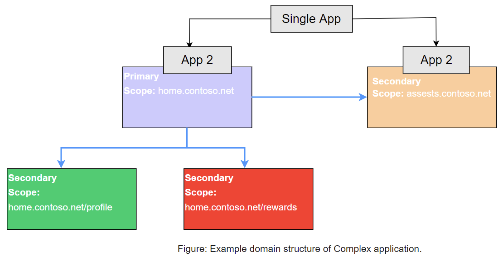
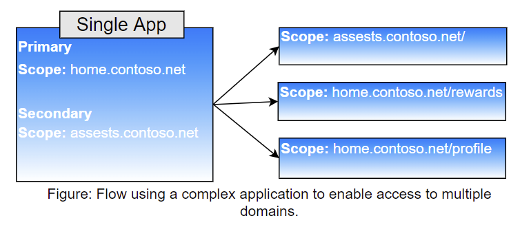

# Understanding Azure Active Directory Application Proxy Complex application scenario (Preview)

When applications are made up of multiple individual web application using different domain suffixes or different ports or paths in the URL, the individual web application instances must be published in separate Azure AD Application Proxy apps and the following problems might arise:
1.	Pre-authentication- The client must separately acquire an access token or cookie for each Azure AD Application Proxy app. This might lead to additional redirects to login.microsoftonline.com and CORS issues.
2.	CORS issues- Cross-origin resource sharing calls (OPTIONS request) might be triggered to validate if the caller web app is allowed to access the URL of the targeted web app. These will be blocked by the Azure AD Application Proxy Cloud service, since these requests cannot contain authentication information.
3.	Poor app management- Multiple enterprise apps are created to enable access to a private app adding friction to the app management experience.

The following figure shows an example for complex application domain structure.



With [Azure AD Application Proxy](application-proxy.md), you can address this issue by using complex application publishing that is made up of multiple URLs across various domains. 



A complex app has multiple app segments, with each app segment being a pair of an internal & external URL.
There is one conditional access policy associated with the app and access to any of the external URLs work with pre-authentication with the same set of policies that are enforced for all.

This solution that allows user to:

- by successfully authenticating 
- not being blocked by CORS errors
- including those that uses different domain suffixes or different ports or paths in the URL internally

This article provides you with the information you need to configure wildcard application publishing in your environment.

## Characteristics of application segment(s) for complex application. 
1. Application segments can be configured only for a wildcard application.
2. External and alternate URL should match the wildcard external and alternate URL domain of the application respectively.
3. Application segment URL’s (internal and external) need to maintain uniqueness across complex applications.
4. CORS Rules (optional) can be configured per application segment.
5. Access will only be granted to defined application segments for a complex application.
    - Note - If all application segments are deleted, a complex application will behave as a wildcard application opening access to all valid URL by specified domain. 
6. You can have an internal URL defined both as an application segment and a regular application.
    - Note - Regular application will always take precedence over a complex app (wildcard application).

## Pre-requisites
Before you get started with Application Proxy Complex application scenario apps, make sure your environment is ready with the following settings and configurations:
- You need to enable Application Proxy and install a connector that has line of site to your applications. See the tutorial [Add an on-premises application for remote access through Application Proxy](application-proxy-add-on-premises-application.md#add-an-on-premises-app-to-azure-ad) to learn how to prepare your on-premises environment, install and register a connector, and test the connector.


## Configure application segment(s) for complex application. 

To configure (and update) Application Segments for a complex app using the API, you first [create a wildcard application](application-proxy-wildcard.md#create-a-wildcard-application), and then update the application's onPremisesPublishing property to configure the application segments and respective CORS settings.

> [!NOTE]
> One application segment is supported in preview. Support for multiple application segment to be announced soon.

If successful, this method returns a `204 No Content` response code and does not return anything in the response body.
## Example

##### Request
Here is an example of the request.

```http
PATCH https://graph.microsoft.com/beta/applications/{<object-id-of--the-complex-app-under-APP-Registrations}
Content-type: application/json

{
    "onPremisesPublishing": {
		"onPremisesApplicationSegments": [
			{
				"externalUrl": "https://home.contoso.net/",
				"internalUrl": "https://home.test.com/",
				"alternateUrl": "",
				"corsConfigurations": []
			},
			{
				"externalUrl": "https://assets.constoso.net/",
				"internalUrl": "https://assets.test.com",
				"alternateUrl": "",
				"corsConfigurations": [
					{
						"resource": "/",
						"allowedOrigins": [
							"https://home.contoso.net/"
						],
						"allowedHeaders": [
							"*"
						],
						"allowedMethods": [
							"*"
						],
						"maxAgeInSeconds": 0
					}
				]
			}	
		]
	}
}

```
##### Response

```http
HTTP/1.1 204 No Content
```


## See also
- [Tutorial: Add an on-premises application for remote access through Application Proxy in Azure Active Directory](../app-proxy/application-proxy-add-on-premises-application.md) 
- [Plan an Azure AD Application Proxy deployment](application-proxy-deployment-plan.md) 
- [Remote access to on-premises applications through Azure Active Directory Application Proxy](application-proxy.md)
- [Understand and solve Azure Active Directory Application Proxy CORS issues](application-proxy-understand-cors-issues.md)
