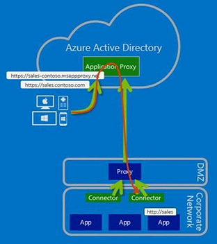

# Work with existing on-premises proxy servers

This article explains how to configure Microsoft Entra application proxy connectors to work with outbound proxy servers. It is intended for customers with network environments that have existing proxies.

We start by looking at these main deployment scenarios:

* Configure connectors to bypass your on-premises outbound proxies.
* Configure connectors to use an outbound proxy to access Microsoft Entra application proxy.
* Configure using a proxy between the connector and backend application.

For more information about how connectors work, see [Understand Microsoft Entra application proxy connectors](application-proxy-connectors.md).

## Bypass outbound proxies

Connectors have underlying OS components that make outbound requests. These components automatically attempt to locate a proxy server on the network using Web Proxy Auto-Discovery (WPAD).

The OS components attempt to locate a proxy server by carrying out a DNS lookup for wpad.domainsuffix. If the lookup resolves in DNS, an HTTP request is then made to the IP address for wpad.dat. This request becomes the proxy configuration script in your environment. The connector uses this script to select an outbound proxy server. However, connector traffic might still not go through, because of additional configuration settings needed on the proxy.

You can configure the connector to bypass your on-premises proxy to ensure that it uses direct connectivity to the Azure services. We recommend this approach, as long as your network policy allows for it, because it means that you have one less configuration to maintain.

To disable outbound proxy usage for the connector, edit the C:\Program Files\Microsoft Azure AD App Proxy Connector\ApplicationProxyConnectorService.exe.config file and add the *system.net* section shown in this code sample:

```xml
<?xml version="1.0" encoding="utf-8" ?>
<configuration>
  <system.net>
    <defaultProxy enabled="false"></defaultProxy>
  </system.net>
  <runtime>
    <gcServer enabled="true"/>
  </runtime>
  <appSettings>
    <add key="TraceFilename" value="AadAppProxyConnector.log" />
  </appSettings>
</configuration>
```

To ensure that the Connector Updater service also bypasses the proxy, make a similar change to the ApplicationProxyConnectorUpdaterService.exe.config file. This file is located at C:\Program Files\Microsoft Azure AD App Proxy Connector Updater.

Be sure to make copies of the original files, in case you need to revert to the default .config files.

## Use the outbound proxy server

Some environments require all outbound traffic to go through an outbound proxy, without exception. As a result, bypassing the proxy is not an option.

You can configure the connector traffic to go through the outbound proxy, as shown in the following diagram:

 

As a result of having only outbound traffic, there's no need to configure inbound access through your firewalls.

> [!NOTE]
> Application Proxy does not support authentication to other proxies. The connector/updater network service accounts should be able to connect to the proxy without being challenged for authentication.

### Step 1: Configure the connector and related services to go through the outbound proxy

If WPAD is enabled in the environment and configured appropriately, the connector automatically discovers the outbound proxy server and attempt to use it. However, you can explicitly configure the connector to go through an outbound proxy.

To do so, edit the C:\Program Files\Microsoft Azure AD App Proxy Connector\ApplicationProxyConnectorService.exe.config file, and add the *system.net* section shown in this code sample. Change *proxyserver:8080* to reflect your local proxy server name or IP address, and the port that it's listening on. The value must have the prefix http:// even if you are using an IP address.

```xml
<?xml version="1.0" encoding="utf-8" ?>
<configuration>
  <system.net>  
    <defaultProxy>   
      <proxy proxyaddress="http://proxyserver:8080" bypassonlocal="True" usesystemdefault="True"/>   
    </defaultProxy>  
  </system.net>
  <runtime>
    <gcServer enabled="true"/>
  </runtime>
  <appSettings>
    <add key="TraceFilename" value="AadAppProxyConnector.log" />
  </appSettings>
</configuration>
```

Next, configure the Connector Updater service to use the proxy by making a similar change to the C:\Program Files\Microsoft Azure AD App Proxy Connector Updater\ApplicationProxyConnectorUpdaterService.exe.config file.

> [!NOTE]
> The Connector service evaluates the **defaultProxy** configuration for usage in `%SystemRoot%\Microsoft.NET\Framework64\v4.0.30319\Config\machine.config`, if the **defaultProxy** is not configured (by default) in ApplicationProxyConnectorService.exe.config. The same applies to the Connector Updater service (ApplicationProxyConnectorUpdaterService.exe.config) too. 

### Step 2: Configure the proxy to allow traffic from the connector and related services to flow through

There are four aspects to consider at the outbound proxy:

* Proxy outbound rules
* Proxy authentication
* Proxy ports
* TLS inspection

#### Proxy outbound rules

Allow access to the following URLs:

| URL | Port | How it's used |
| --- | --- | --- |
| &ast;.msappproxy.net<br>&ast;.servicebus.windows.net | 443/HTTPS | Communication between the connector and the Application Proxy cloud service |
| crl3.digicert.com<br>crl4.digicert.com<br>ocsp.digicert.com<br>crl.microsoft.com<br>oneocsp.microsoft.com<br>ocsp.msocsp.com<br> | 80/HTTP | The connector uses these URLs to verify certificates. |
| login.windows.net<br>secure.aadcdn.microsoftonline-p.com<br>&ast;.microsoftonline.com<br>&ast;.microsoftonline-p.com<br>&ast;.msauth.net<br>&ast;.msauthimages.net<br>&ast;.msecnd.net<br>&ast;.msftauth.net<br>&ast;.msftauthimages.net<br>&ast;.phonefactor.net<br>enterpriseregistration.windows.net<br>management.azure.com<br>policykeyservice.dc.ad.msft.net<br>ctldl.windowsupdate.com | 443/HTTPS | The connector uses these URLs during the registration process. |
| ctldl.windowsupdate.com<br>www.microsoft.com/pkiops | 80/HTTP | The connector uses these URLs during the registration process. |

If your firewall or proxy allows you to configure DNS allow lists, you can allow connections to \*.msappproxy.net and \*.servicebus.windows.net.

If you can't allow connectivity by FQDN and need to specify IP ranges instead, use these options:

* Allow the connector outbound access to all destinations.
* Allow the connector outbound access to all of the Azure datacenter IP ranges. The challenge with using the list of Azure datacenter IP ranges is that it's updated weekly. You need to put a process in place to ensure that your access rules are updated accordingly. Only using a subset of the IP addresses may cause your configuration to break. To download the latest Azure Data Center IP ranges, navigate to [https://download.microsoft.com](https://download.microsoft.com) and search for "Azure IP Ranges and Service Tags". Be sure to select the relevant cloud. For example, the public cloud IP ranges can be found with "Azure IP Ranges and Service Tags – Public Cloud". The US Government cloud can be found by searching for "Azure IP Ranges and Service Tags – US Government Cloud".

#### Proxy authentication

Proxy authentication is not currently supported. Our current recommendation is to allow the connector anonymous access to the Internet destinations.

#### Proxy ports

The connector makes outbound TLS-based connections by using the CONNECT method. This method essentially sets up a tunnel through the outbound proxy. Configure the proxy server to allow tunneling to ports 443 and 80.

> [!NOTE]
> When Service Bus runs over HTTPS, it uses port 443. However, by default, Service Bus attempts direct TCP connections and falls back to HTTPS only if direct connectivity fails.

#### TLS inspection

Do not use TLS inspection for the connector traffic, because it causes problems for the connector traffic. The connector uses a certificate to authenticate to the Application Proxy service, and that certificate can be lost during TLS inspection.

## Configure using a proxy between the connector and backend application
Using a forward proxy for the communication towards the backend application might be a special requirement in some environments.
To enable this, please follow the next steps:

### Step 1: Add the required registry value to the server
1. To enable using the default proxy add the following registry value (DWORD) 
`UseDefaultProxyForBackendRequests = 1` to the Connector configuration registry key located in "HKEY_LOCAL_MACHINE\Software\Microsoft\Microsoft Azure AD App Proxy Connector".

### Step 2: Configure the proxy server manually using netsh command
1. Enable the group policy Make proxy settings per-machine. This is found in: Computer Configuration\Policies\Administrative Templates\Windows Components\Internet Explorer. This needs to be set rather than having this policy set to per-user.
2. Run `gpupdate /force` on the server or reboot the server to ensure it uses the updated group policy settings.
3. Launch an elevated command prompt with admin rights and enter `control inetcpl.cpl`.
4. Configure the required proxy settings. 

These settings make the connector use the same forward proxy for the communication to Azure and to the backend application. If the connector to Azure communication requires no forward proxy or a different forward proxy, you can set this up with modifying the file ApplicationProxyConnectorService.exe.config as described in the sections Bypass outbound proxies or Use the outbound proxy server.

> [!NOTE]
> There are various ways to configure the internet proxy in the operating system. Proxy settings configured via NETSH WINHTTP (run `NETSH WINHTTP SHOW PROXY` to verify) override the proxy settings you configured in Step 2. 

The connector updater service will use the machine proxy as well. This behavior can be changed by modifying the file ApplicationProxyConnectorUpdaterService.exe.config.

## Troubleshoot connector proxy problems and service connectivity issues

Now you should see all traffic flowing through the proxy. If you have problems, the following troubleshooting information should help.

The best way to identify and troubleshoot connector connectivity issues is to take a network capture while starting the connector service. Here are some quick tips on capturing and filtering network traces.

You can use the monitoring tool of your choice. For the purposes of this article, we used Microsoft Message Analyzer.

> [!NOTE]
> [Microsoft Message Analyzer (MMA) was retired](/openspecs/blog/ms-winintbloglp/dd98b93c-0a75-4eb0-b92e-e760c502394f) and its download packages removed from microsoft.com sites on November 25 2019.  There is currently no Microsoft replacement for Microsoft Message Analyzer in development at this time.  For similar functionality, please consider using a 3rd party network protocol analyzer tool such as Wireshark.

The following examples are specific to Message Analyzer, but the principles can be applied to any analysis tool.

### Take a capture of connector traffic

For initial troubleshooting, perform the following steps:

1. From services.msc, stop the Microsoft Entra application proxy Connector service.

   

1. Run Message Analyzer as an administrator.
1. Select **Start local trace**.
1. Start the Microsoft Entra application proxy Connector service.
1. Stop the network capture.

   

### Check if the connector traffic bypasses outbound proxies

If you configured your Application Proxy connector to bypass the proxy servers and connect directly to the Application Proxy service, you want to look in the network capture for failed TCP connection attempts.

Use the Message Analyzer filter to identify these attempts. Enter `property.TCPSynRetransmit` in the filter box and select **Apply**.

A SYN packet is the first packet sent to establish a TCP connection. If this packet doesn’t return a response, the SYN is reattempted. You can use the preceding filter to see any retransmitted SYNs. Then, you can check whether these SYNs correspond to any connector-related traffic.

If you expect the connector to make direct connections to the Azure services, SynRetransmit responses on port 443 are an indication that you have a network or firewall problem.

### Check if the connector traffic uses outbound proxies

If you configured your Application Proxy connector traffic to go through the proxy servers, you want to look for failed https connections to your proxy.

To filter the network capture for these connection attempts, enter `(https.Request or https.Response) and tcp.port==8080` in the Message Analyzer filter, replacing 8080 with your proxy service port. Select **Apply** to see the filter results.

The preceding filter shows just the HTTPs requests and responses to/from the proxy port. You're looking for the CONNECT requests that show communication with the proxy server. Upon success, you get an HTTP OK (200) response.

If you see other response codes, such as 407 or 502, that means that the proxy is requiring authentication or not allowing the traffic for some other reason. At this point, you engage your proxy server support team.

## Next steps

* [Understand Microsoft Entra application proxy connectors](application-proxy-connectors.md)
* If you have problems with connector connectivity issues, ask your question in the [Microsoft Q&A question page for Microsoft Entra ID](/answers/topics/azure-active-directory.html) or create a ticket with our support team.
