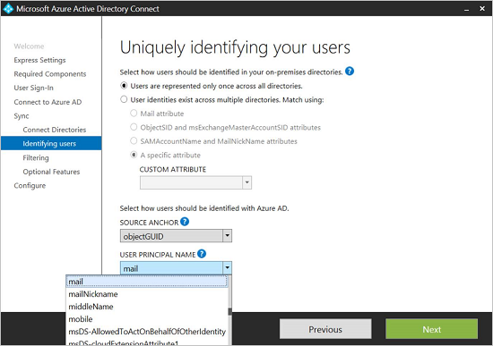

# Kerberos Constrained Delegation for single sign-on (SSO) to your apps with Application Proxy

You can provide single sign-on for on-premises applications published through Application Proxy that are secured with integrated Windows authentication. These applications require a Kerberos ticket for access. Application Proxy uses Kerberos Constrained Delegation (KCD) to support these applications.

To learn more about Single Sign-On (SSO), see [What is Single Sign-On?](../manage-apps/what-is-single-sign-on.md).

You can enable single sign-on to your applications using integrated Windows authentication (IWA) by giving Application Proxy connectors permission in Active Directory to impersonate users. The connectors use this permission to send and receive tokens on their behalf.

## How single sign-on with KCD works
This diagram explains the flow when a user attempts to access an on premises application that uses IWA.


1. The user enters the URL to access the on premises application through Application Proxy.
2. Application Proxy redirects the request to Microsoft Entra authentication services to preauthenticate. At this point, Microsoft Entra ID applies any applicable authentication and authorization policies, such as multifactor authentication. If the user is validated, Microsoft Entra ID creates a token and sends it to the user.
3. The user passes the token to Application Proxy.
4. Application Proxy validates the token and retrieves the User Principal Name (UPN) from it, and then the Connector pulls the UPN, and the Service Principal Name (SPN) through a dually authenticated secure channel.
5. The Connector performs Kerberos Constrained Delegation (KCD) negotiation with the on premises AD, impersonating the user to get a Kerberos token to the application.
6. Active Directory sends the Kerberos token for the application to the Connector.
7. The Connector sends the original request to the application server, using the Kerberos token it received from AD.
8. The application sends the response to the Connector, which is then returned to the Application Proxy service and finally to the user.

## Prerequisites
Before you get started with single sign-on for IWA applications, make sure your environment is ready with the following settings and configurations:

* Your apps, like SharePoint Web apps, are set to use integrated Windows authentication. For more information, see [Enable Support for Kerberos Authentication](/previous-versions/windows/it-pro/windows-server-2008-R2-and-2008/dd759186(v=ws.11)), or for SharePoint see [Plan for Kerberos authentication in SharePoint 2013](/SharePoint/security-for-sharepoint-server/kerberos-authentication-planning).
* All your apps have [Service Principal Names](https://social.technet.microsoft.com/wiki/contents/articles/717.service-principal-names-spns-setspn-syntax-setspn-exe.aspx).
* The server running the Connector and the server running the app are domain joined and part of the same domain or trusting domains. For more information on domain join, see [Join a Computer to a Domain](/previous-versions/windows/it-pro/windows-server-2012-R2-and-2012/dd807102(v=ws.11)).
* The server running the Connector has access to read the TokenGroupsGlobalAndUniversal attribute for users. This default setting might have been impacted by security hardening the environment.

### Configure Active Directory
The Active Directory configuration varies, depending on whether your Application Proxy connector and the application server are in the same domain or not.

#### Connector and application server in the same domain
1. In Active Directory, go to **Tools** > **Users and Computers**.
2. Select the server running the connector.
3. Right-click and select **Properties** > **Delegation**.
4. Select **Trust this computer for delegation to specified services only**. 
5. Select **Use any authentication protocol**.
6. Under **Services to which this account can present delegated credentials** add the value for the SPN identity of the application server. This enables the Application Proxy Connector to impersonate users in AD against the applications defined in the list.

   

#### Connector and application server in different domains
1. For a list of prerequisites for working with KCD across domains, see [Kerberos Constrained Delegation across domains](/previous-versions/windows/it-pro/windows-server-2012-R2-and-2012/hh831477(v=ws.11)).
2. Use the `principalsallowedtodelegateto` property of the service account (computer or dedicated domain user account) of the web application to enable Kerberos authentication delegation from the Application Proxy (connector). The application server is running in the context of `webserviceaccount` and the delegating server is `connectorcomputeraccount`. Run the commands below on a Domain Controller (running Windows Server 2012 R2 or later) in the domain of `webserviceaccount`. Use flat names (non UPN) for both accounts.

   If the `webserviceaccount` is a computer account, use these commands:

   ```powershell
   $connector= Get-ADComputer -Identity connectorcomputeraccount -server dc.connectordomain.com

   Set-ADComputer -Identity webserviceaccount -PrincipalsAllowedToDelegateToAccount $connector

   Get-ADComputer webserviceaccount -Properties PrincipalsAllowedToDelegateToAccount
   ```

   If the `webserviceaccount` is a user account, use these commands:

   ```powershell
   $connector= Get-ADComputer -Identity connectorcomputeraccount -server dc.connectordomain.com

   Set-ADUser -Identity webserviceaccount -PrincipalsAllowedToDelegateToAccount $connector

   Get-ADUser webserviceaccount -Properties PrincipalsAllowedToDelegateToAccount
   ```

## Configure single sign-on 
1. Publish your application according to the instructions described in [Publish applications with Application Proxy](../app-proxy/application-proxy-add-on-premises-application.md). Make sure to select **Microsoft Entra ID** as the **Preauthentication Method**.
2. After your application appears in the list of enterprise applications, select it and click **Single sign-on**.
3. Set the single sign-on mode to **Integrated Windows authentication**.  
4. Enter the **Internal Application SPN** of the application server. In this example, the SPN for our published application is `http/www.contoso.com`. This SPN needs to be in the list of services to which the connector can present delegated credentials.
5. Choose the **Delegated Login Identity** for the connector to use on behalf of your users. For more information, see [Working with different on-premises and cloud identities](#working-with-different-on-premises-and-cloud-identities).

     

## SSO for non-Windows apps

The Kerberos delegation flow in Microsoft Entra application proxy starts when Microsoft Entra authenticates the user in the cloud. Once the request arrives on-premises, the Microsoft Entra application proxy connector issues a Kerberos ticket on behalf of the user by interacting with the local Active Directory. This process is referred to as Kerberos Constrained Delegation (KCD). 

In the next phase, a request is sent to the backend application with this Kerberos ticket. 

There are several mechanisms that define how to send the Kerberos ticket in such requests. Most non-Windows servers expect to receive it in form of SPNEGO token. This mechanism is supported on Microsoft Entra application proxy, but is disabled by default. A connector can be configured for SPNEGO or standard Kerberos token, but not both.

If you configure a connector machine for SPNEGO, make sure that all other connectors in that Connector group are also configured with SPNEGO. Applications expecting standard Kerberos token should be routed through other connectors that are not configured for SPNEGO. Some web applications accept both formats without requiring any change in configuration. 
 

To enable SPNEGO:

1. Open a command prompt that runs as administrator.
2. From the command prompt, run the following commands on the connector servers that need SPNEGO.

    ```
    REG ADD "HKLM\SOFTWARE\Microsoft\Microsoft AAD App Proxy Connector" /v UseSpnegoAuthentication /t REG_DWORD /d 1
    net stop WAPCSvc & net start WAPCSvc
    ```

Non-Windows apps typically user usernames or SAM account names instead of domain email addresses. If that situation applies to your applications, you need to configure the delegated login identity field to connect your cloud identities to your application identities. 

## Working with different on-premises and cloud identities
Application Proxy assumes that users have exactly the same identity in the cloud and on-premises. But in some environments, due to corporate policies or application dependencies, organizations might have to use alternate IDs for sign-in. In such cases, you can still use KCD for single sign-on. Configure a **Delegated login identity** for each application to specify which identity should be used when performing single sign-on.  

This capability allows many organizations that have different on-premises and cloud identities to have SSO from the cloud to on-premises apps without requiring the users to enter different usernames and passwords. This includes organizations that:

* Have multiple domains internally (joe@us.contoso.com, joe@eu.contoso.com) and a single domain in the cloud (joe@contoso.com).
* Have non-routable domain name internally (joe@contoso.usa) and a legal one in the cloud.
* Do not use domain names internally (joe)
* Use different aliases on premises and in the cloud. For example, joe-johns@contoso.com vs. joej@contoso.com  

With Application Proxy, you can select which identity to use to obtain the Kerberos ticket. This setting is per application. Some of these options are suitable for systems that do not accept email address format, others are designed for alternative login.


If delegated login identity is used, the value might not be unique across all the domains or forests in your organization. You can avoid this issue by publishing these applications twice using two different Connector groups. Since each application has a different user audience, you can join its Connectors to a different domain.

If **On-premises SAM account name** is used for the logon identity, the computer hosting the connector must be added to the domain in which the user account is located.

### Configure SSO for different identities
1. Configure Microsoft Entra Connect settings so the main identity is the email address (mail). This is done as part of the customize process, by changing the **User Principal Name** field in the sync settings. These settings also determine how users log in to Office365, Windows10 devices, and other applications that use Microsoft Entra ID as their identity store.  
     
2. In the Application Configuration settings for the application you would like to modify, select the **Delegated Login Identity** to be used:

   * User Principal Name (for example, joe@contoso.com)
   * Alternate User Principal Name (for example, joed@contoso.local)
   * Username part of User Principal Name (for example, joe)
   * Username part of Alternate User Principal Name (for example, joed)
   * On-premises SAM account name (depends on the domain controller configuration)

### Troubleshooting SSO for different identities
If there is an error in the SSO process, it appears in the connector machine event log as explained in [Troubleshooting](application-proxy-back-end-kerberos-constrained-delegation-how-to.md).
But, in some cases, the request is successfully sent to the backend application while this application replies in various other HTTP responses. Troubleshooting these cases should start by examining event number 24029 on the connector machine in the Application Proxy session event log. The user identity that was used for delegation appears in the “user” field within the event details. To turn on session log, select **Show analytic and debug logs** in the event viewer view menu.

## Next steps

* [How to configure an Application Proxy application to use Kerberos Constrained Delegation](application-proxy-back-end-kerberos-constrained-delegation-how-to.md)
* [Troubleshoot issues you're having with Application Proxy](application-proxy-troubleshoot.md)
