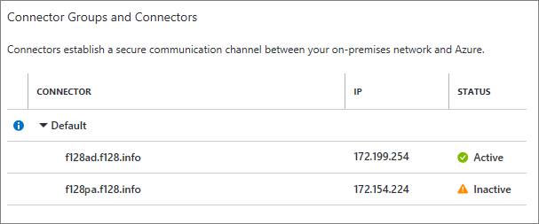

# Understand Microsoft Entra application proxy connectors

Connectors are what make Microsoft Entra application proxy possible. They're simple, easy to deploy and maintain, and super powerful. This article discusses what connectors are, how they work, and some suggestions for how to optimize your deployment.

## What is an Application Proxy connector?

Connectors are lightweight agents that sit on-premises and facilitate the outbound connection to the Application Proxy service. Connectors must be installed on a Windows Server that has access to the backend application. You can organize connectors into connector groups, with each group handling traffic to specific applications. For more information on Application proxy and a diagrammatic representation of application proxy architecture see [Using Microsoft Entra application proxy to publish on-premises apps for remote users](what-is-application-proxy.md#application-proxy-connectors)

## Requirements and deployment

To deploy Application Proxy successfully, you need at least one connector, but we recommend two or more for greater resiliency. Install the connector on a machine running Windows Server 2012 R2 or later. The connector needs to communicate with the Application Proxy service and the on-premises applications that you publish.

### Windows Server
You need a server running Windows Server 2012 R2 or later on which you can install the Application Proxy connector. The server needs to connect to the Application Proxy services in Azure, and the on-premises applications that you're publishing.

Starting from the version 1.5.3437.0, having the .NET version 4.7.1 or greater is required for successful installation (upgrade).

The server needs to have TLS 1.2 enabled before you install the Application Proxy connector. To enable TLS 1.2 on the server:

1. Set the following registry keys:

    ```
    [HKEY_LOCAL_MACHINE\SYSTEM\CurrentControlSet\Control\SecurityProviders\SCHANNEL\Protocols\TLS 1.2]
    [HKEY_LOCAL_MACHINE\SYSTEM\CurrentControlSet\Control\SecurityProviders\SCHANNEL\Protocols\TLS 1.2\Client] "DisabledByDefault"=dword:00000000 "Enabled"=dword:00000001
    [HKEY_LOCAL_MACHINE\SYSTEM\CurrentControlSet\Control\SecurityProviders\SCHANNEL\Protocols\TLS 1.2\Server] "DisabledByDefault"=dword:00000000 "Enabled"=dword:00000001
    [HKEY_LOCAL_MACHINE\SOFTWARE\Microsoft\.NETFramework\v4.8.4250.0] "SchUseStrongCrypto"=dword:00000001
    ```

    A `regedit` file you can use to set these values follows:
    
    ```
    Windows Registry Editor Version 5.00

    [HKEY_LOCAL_MACHINE\SYSTEM\CurrentControlSet\Control\SecurityProviders\SCHANNEL\Protocols\TLS 1.2]
    [HKEY_LOCAL_MACHINE\SYSTEM\CurrentControlSet\Control\SecurityProviders\SCHANNEL\Protocols\TLS 1.2\Client]
    "DisabledByDefault"=dword:00000000
    "Enabled"=dword:00000001
    [HKEY_LOCAL_MACHINE\SYSTEM\CurrentControlSet\Control\SecurityProviders\SCHANNEL\Protocols\TLS 1.2\Server]
    "DisabledByDefault"=dword:00000000
    "Enabled"=dword:00000001
    [HKEY_LOCAL_MACHINE\SOFTWARE\Microsoft\.NETFramework\v4.8.4250.0]
    "SchUseStrongCrypto"=dword:00000001
    ```
    
1. Restart the server

For more information about the network requirements for the connector server, see [Get started with Application Proxy and install a connector](application-proxy-add-on-premises-application.md).

## Maintenance

The connectors and the service take care of all the high availability tasks. They can be added or removed dynamically. Each time a new request arrives it is routed to one of the connectors that is currently available. If a connector is temporarily not available, it doesn't respond to this traffic.

The connectors are stateless and have no configuration data on the machine. The only data they store is the settings for connecting the service and its authentication certificate. When they connect to the service, they pull all the required configuration data and refresh it every couple of minutes.

Connectors also poll the server to find out whether there is a newer version of the connector. If one is found, the connectors update themselves.

You can monitor your connectors from the machine they are running on, using either the event log and performance counters. Or you can view their status from the Application Proxy page of the Microsoft Entra admin center:



You don't have to manually delete connectors that are unused. When a connector is running, it remains active as it connects to the service. Unused connectors are tagged as _inactive_ and are removed after 10 days of inactivity. If you do want to uninstall a connector, though, uninstall both the Connector service and the Updater service from the server. Restart your computer to fully remove the service.

## Automatic updates

Microsoft Entra ID provides automatic updates for all the connectors that you deploy. As long as the Application Proxy Connector Updater service is running, your connectors [update with the latest major connector release](application-proxy-faq.yml#why-is-my-connector-still-using-an-older-version-and-not-auto-upgraded-to-latest-version-) automatically. If you don’t see the Connector Updater service on your server, you need to [reinstall your connector](application-proxy-add-on-premises-application.md) to get any updates.

If you don't want to wait for an automatic update to come to your connector, you can do a manual upgrade. Go to the [connector download page](https://download.msappproxy.net/subscription/d3c8b69d-6bf7-42be-a529-3fe9c2e70c90/connector/download) on the server where your connector is located and select **Download**. This process kicks off an upgrade for the local connector.

For tenants with multiple connectors, the automatic updates target one connector at a time in each group to prevent downtime in your environment.

You may experience downtime when your connector updates if:
  
- You only have one connector we recommend you install a second connector and [create a connector group](application-proxy-connector-groups.md). This will avoid downtime and provide higher availability.  
- A connector was in the middle of a transaction when the update began. Although the initial transaction is lost, your browser should automatically retry the operation or you can refresh your page. When the request is resent, the traffic is routed to a backup connector.

To see information about previously released versions and what changes they include, see [Application Proxy- Version Release History](./application-proxy-release-version-history.md).

## Creating connector groups

Connector groups enable you to assign specific connectors to serve specific applications. You can group many connectors together, and then assign each application to a group.

Connector groups make it easier to manage large deployments. They also improve latency for tenants that have applications hosted in different regions, because you can create location-based connector groups to serve only local applications.

To learn more about connector groups, see [Publish applications on separate networks and locations using connector groups](application-proxy-connector-groups.md).

## Capacity planning

It is important to make sure you have planned enough capacity between connectors to handle the expected traffic volume. We recommend that each connector group has at least two connectors to provide high availability and scale. Having three connectors is optimal in case you may need to service a machine at any point.

In general, the more users you have, the larger a machine you'll need. Below is a table giving an outline of the volume and expected latency different machines can handle. Note it is all based on expected Transactions Per Second (TPS) rather than by user since usage patterns vary and can't be used to predict load. There will also be some differences based on the size of the responses and the backend application response time - larger response sizes and slower response times will result in a lower Max TPS. We also recommend having additional machines so that the distributed load across the machines always provides ample buffer. The extra capacity will ensure that you have high availability and resiliency.

|Cores|RAM|Expected Latency (MS)-P99|Max TPS|
| ----- | ----- | ----- | ----- |
|2|8|325|586|
|4|16|320|1150|
|8|32|270|1190|
|16|64|245|1200*|

\* This machine used a custom setting to raise some of the default connection limits beyond .NET recommended settings. We recommend running a test with the default settings before contacting support to get this limit changed for your tenant.

> [!NOTE]
> There is not much difference in the maximum TPS between 4, 8, and 16 core machines. The main difference between those is in the expected latency.
>
> This table also focuses on the expected performance of a connector based on the type of machine it is installed on. This is separate from the Application Proxy service's throttling limits, see [Service limits and restrictions](../enterprise-users/directory-service-limits-restrictions.md).

## Security and networking

Connectors can be installed anywhere on the network that allows them to send requests to the Application Proxy service. What's important is that the computer running the connector also has access to your apps. You can install connectors inside of your corporate network or on a virtual machine that runs in the cloud. Connectors can run within a perimeter network, also known as a demilitarized zone (DMZ), but it's not necessary because all traffic is outbound so your network stays secure.

Connectors only send outbound requests. The outbound traffic is sent to the Application Proxy service and to the published applications. You don't have to open inbound ports because traffic flows both ways once a session is established. You also don't have to configure inbound access through your firewalls.

For more information about configuring outbound firewall rules, see [Work with existing on-premises proxy servers](./application-proxy-configure-connectors-with-proxy-servers.md).

## Performance and scalability

Scale for the Application Proxy service is transparent, but scale is a factor for connectors. You need to have enough connectors to handle peak traffic. Since connectors are stateless, they aren't affected by the number of users or sessions. Instead, they respond to the number of requests and their payload size. With standard web traffic, an average machine can handle a couple thousand requests per second. The specific capacity depends on the exact machine characteristics.

The connector performance is bound by CPU and networking. CPU performance is needed for TLS encryption and decryption, while networking is important to get fast connectivity to the applications and the online service in Azure.

In contrast, memory is less of an issue for connectors. The online service takes care of much of the processing and all unauthenticated traffic. Everything that can be done in the cloud is done in the cloud.

If for any reason that connector or machine becomes unavailable, the traffic will start going to another connector in the group. This resiliency is also why we recommend having multiple connectors.

Another factor that affects performance is the quality of the networking between the connectors, including:

- **The online service**: Slow or high-latency connections to the Application Proxy service in Azure influence the connector performance. For the best performance, connect your organization to Azure with Express Route. Otherwise, have your networking team ensure that connections to Azure are handled as efficiently as possible.
- **The backend applications**: In some cases, there are additional proxies between the connector and the backend applications that can slow or prevent connections. To troubleshoot this scenario, open a browser from the connector server and try to access the application. If you run the connectors in Azure but the applications are on-premises, the experience might not be what your users expect.
- **The domain controllers**: If the connectors perform single sign-on (SSO) using Kerberos Constrained Delegation, they contact the domain controllers before sending the request to the backend. The connectors have a cache of Kerberos tickets, but in a busy environment the responsiveness of the domain controllers can affect performance. This issue is more common for connectors that run in Azure but communicate with domain controllers that are on-premises.

For more information about optimizing your network, see [Network topology considerations when using Microsoft Entra application proxy](application-proxy-network-topology.md).

## Domain joining

Connectors can run on a machine that is not domain-joined. However, if you want single sign-on (SSO) to applications that use integrated Windows authentication (IWA), you need a domain-joined machine. In this case, the connector machines must be joined to a domain that can perform [Kerberos](https://web.mit.edu/kerberos) Constrained Delegation on behalf of the users for the published applications.

Connectors can also be joined to domains in forests that have a partial trust, or to read-only domain controllers.

## Connector deployments on hardened environments

Usually, connector deployment is straightforward and requires no special configuration. However, there are some unique conditions that should be considered:

- Organizations that limit the outbound traffic must [open required ports](application-proxy-add-on-premises-application.md#prepare-your-on-premises-environment).
- FIPS-compliant machines might be required to change their configuration to allow the connector processes to generate and store a certificate.
- Organizations that lock down their environment based on the processes that issue the networking requests have to make sure that both connector services are enabled to access all required ports and IPs.
- In some cases, outbound forward proxies may break the two-way certificate authentication and cause the communication to fail.

## Connector authentication

To provide a secure service, connectors have to authenticate toward the service, and the service has to authenticate toward the connector. This authentication is done using client and server certificates when the connectors initiate the connection. This way the administrator’s username and password are not stored on the connector machine.

The certificates used are specific to the Application Proxy service. They get created during the initial registration and are automatically renewed by the connectors every couple of months.

After the first successful certificate renewal the Microsoft Entra application proxy Connector service (Network Service) has no permission to remove the old certificate from the local machine store. If the certificate has expired or it won't be used by the service anymore, you can delete it safely.

To avoid problems with the certificate renewal, ensure that the network communication from the connector towards the [documented destinations](./application-proxy-add-on-premises-application.md#prepare-your-on-premises-environment) is enabled.

If a connector is not connected to the service for several months, its certificates may be outdated. In this case, uninstall and reinstall the connector to trigger registration. You can run the following PowerShell commands:

```
Import-module AppProxyPSModule
Register-AppProxyConnector -EnvironmentName "AzureCloud"
```

For government, use `-EnvironmentName "AzureUSGovernment"`. For more details, see [Install Agent for the Azure Government Cloud](../hybrid/connect/reference-connect-government-cloud.md#install-the-agent-for-the-azure-government-cloud).

To learn more about how to verify the certificate and troubleshoot problems see [Verify Machine and backend components support for Application Proxy trust certificate](./application-proxy-connector-installation-problem.md#verify-machine-and-backend-components-support-for-application-proxy-trust-certificate).

## Under the hood

Connectors are based on Windows Server Web Application Proxy, so they have most of the same management tools including Windows Event Logs


and Windows performance counters.


The connectors have both **Admin** and **Session** logs. The **Admin** log includes key events and their errors. The **Session** log includes all the transactions and their processing details.

To see the logs, open **Event Viewer** and go to **Applications and Services Logs** > **Microsoft** > **AadApplicationProxy** > **Connector**. To make the **Session** log visible, on the **View** menu, select **Show Analytic and Debug Logs**. The **Session** log is typically used for troubleshooting, and it's disabled by default. Enable it to start collecting events and disable it when it's no longer needed.

You can examine the state of the service in the Services window. The connector is made up of two Windows Services: the actual connector, and the updater. Both of them must run all the time.

 

## Next steps

- [Publish applications on separate networks and locations using connector groups](application-proxy-connector-groups.md)
- [Work with existing on-premises proxy servers](./application-proxy-configure-connectors-with-proxy-servers.md)
- [Troubleshoot Application Proxy and connector errors](./application-proxy-troubleshoot.md)
- [How to silently install the Microsoft Entra application proxy Connector](./application-proxy-register-connector-powershell.md)
