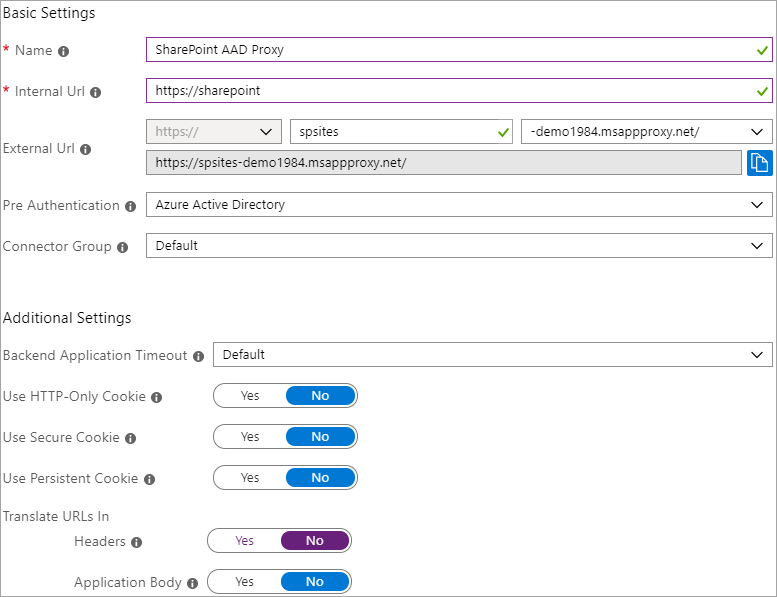
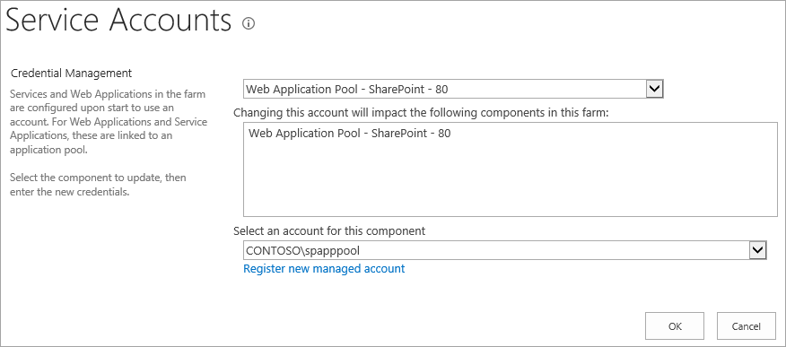

# Enable remote access to SharePoint with Microsoft Entra application proxy

This step-by-step guide explains how to integrate an on-premises SharePoint farm with Microsoft Entra application proxy.

## Prerequisites

To perform the configuration, you need the following resources:
- A SharePoint 2013 farm or newer.
- A Microsoft Entra tenant with a plan that includes Application Proxy. Learn more about [Microsoft Entra ID plans and pricing](https://www.microsoft.com/security/business/identity-access-management/azure-ad-pricing).
- A [custom, verified domain](../fundamentals/add-custom-domain.md) in the Microsoft Entra tenant.
- On-premises Active Directory synchronized with Microsoft Entra Connect, through which users can [sign in to Azure](../hybrid/connect/plan-connect-user-signin.md).
- An Application Proxy connector installed and running on a machine within the corporate domain.

Configuring SharePoint with Application Proxy requires two URLs:
- An external URL, visible to end-users and determined in Microsoft Entra ID. This URL can use a custom domain. Learn more about [working with custom domains in Microsoft Entra application proxy](application-proxy-configure-custom-domain.md).
- An internal URL, known only within the corporate domain and never used directly.

> [!IMPORTANT]
> To make sure the links are mapped correctly, follow these recommendations for the internal URL:
> - Use HTTPS.
> - Don't use custom ports.
> - In the corporate Domain Name System (DNS), create a host (A) to point to the SharePoint WFE (or load balancer), and not an alias (CName).

This article uses the following values:
- Internal URL: `https://sharepoint`
- External URL: `https://spsites-demo1984.msappproxy.net/`
- Application pool account for the SharePoint web application: `Contoso\spapppool`

<a name='step-1-configure-an-application-in-azure-ad-that-uses-application-proxy'></a>

## Step 1: Configure an application in Microsoft Entra ID that uses Application Proxy

In this step, you create an application in your Microsoft Entra tenant that uses Application Proxy. You set the external URL and specify the internal URL, both of which are used later in SharePoint.

1. Create the app as described with the following settings. For step-by-step instructions, see [Publishing applications using Microsoft Entra application proxy](../app-proxy/application-proxy-add-on-premises-application.md#add-an-on-premises-app-to-azure-ad).
   * **Internal URL**: SharePoint internal URL that will be set later in SharePoint, such as `https://sharepoint`.
   * **Pre-Authentication**: Microsoft Entra ID
   * **Translate URLs in Headers**: No
   * **Translate URLs in Application Body**: No

   

1. After your app is published, follow these steps to configure the single sign-on settings:

   1. On the application page in the portal, select **Single sign-on**.
   1. For **Single Sign-on Mode**, select **Integrated Windows Authentication**.
   1. Set **Internal Application SPN** to the value you set earlier. For this example, the value is `HTTP/sharepoint`.
   1. Under **Delegated Login Identity**, select the most suitable option for your Active Directory forest configuration. For example if you have a single Active Directory domain in your forest, select **On-premises SAM account name** (as shown in the following screenshot). But if your users aren't in the same domain as SharePoint and the Application Proxy Connector servers, select **On-premises user principal name** (not shown in the screenshot).

   

1. To finish setting up your application, go to the **Users and groups** section and assign users to access this application. 

## Step 2: Configure the SharePoint web application

The SharePoint web application must be configured with Kerberos and the appropriate alternate access mappings to work correctly with Microsoft Entra application proxy. There are two possible options:

- Create a new web application and use only the Default zone. This is the preferred option, as it offers the best experience with SharePoint (for example, the links in the email alerts generated by SharePoint always point to the Default zone).
- Extend an existing web application to configure Kerberos in a non-default zone.

> [!IMPORTANT]
> Regardless of the zone that's used, the application pool account of the SharePoint web application must be a domain account for Kerberos to work correctly.

### Provision the SharePoint web application

- If you create a new web application and use only the Default zone (preferred option):

    1. Start the **SharePoint Management Shell** and run the following script:

       ```powershell
       # This script creates a web application and configures the Default zone with the internal/external URL needed to work with Azure AD Application Proxy
       # Edit variables below to fit your environment. Note that the managed account must exist and it must be a domain account
       $internalUrl = "https://sharepoint"
       $externalUrl = "https://spsites-demo1984.msappproxy.net/"
       $applicationPoolManagedAccount = "Contoso\spapppool"
            
       $winAp = New-SPAuthenticationProvider -UseWindowsIntegratedAuthentication -DisableKerberos:$false
       $wa = New-SPWebApplication -Name "SharePoint - AAD Proxy" -Port 443 -SecureSocketsLayer -URL $externalUrl -ApplicationPool "SharePoint - AAD Proxy" -ApplicationPoolAccount (Get-SPManagedAccount $applicationPoolManagedAccount) -AuthenticationProvider $winAp
       New-SPAlternateURL -Url $internalUrl -WebApplication $wa -Zone Default -Internal
       ```

    2. Open the **SharePoint Central Administration** site.
    1. Under **System Settings**, select **Configure Alternate Access Mappings**. The **Alternate Access Mapping Collection** box opens.
    1. Filter the display with the new web application and confirm that you see something like this:

       

- If you extend an existing web application to a new zone (in case you can't use the Default zone):

    1. Start the SharePoint Management Shell and run the following script:

       ```powershell
       # This script extends an existing web application to Internet zone with the internal/external URL needed to work with Azure AD Application Proxy
       # Edit variables below to fit your environment
       $webAppUrl = "http://spsites/"
       $internalUrl = "https://sharepoint"
       $externalUrl = "https://spsites-demo1984.msappproxy.net/"
       
       $winAp = New-SPAuthenticationProvider -UseWindowsIntegratedAuthentication -DisableKerberos:$false
       $wa = Get-SPWebApplication $webAppUrl
       New-SPWebApplicationExtension -Name "SharePoint - AAD Proxy" -Identity $wa -SecureSocketsLayer -Zone Extranet -Url $externalUrl -AuthenticationProvider $winAp
       New-SPAlternateURL -Url $internalUrl -WebApplication $wa -Zone Extranet -Internal
       ```

    2. Open the **SharePoint Central Administration** site.
    1. Under **System Settings**, select **Configure Alternate Access Mappings**. The **Alternate Access Mapping Collection** box opens.
    1. Filter the display with the web application that was extended and confirm that you see something like this:

        

### Make sure the SharePoint web application is running under a domain account

To identify the account running the application pool of the SharePoint web application and to make sure it's a domain account, follow these steps:

1. Open the **SharePoint Central Administration** site.
1. Go to **Security** and select **Configure service accounts**.
1. Select **Web Application Pool - YourWebApplicationName**.

   

1. Confirm that **Select an account for this component** returns a domain account, and remember it, since it will be needed in the next step.

### Make sure that an HTTPS certificate is configured for the IIS site of the Extranet zone

Because the Internal URL uses HTTPS protocol (`https://SharePoint/`), a certificate must be set on the Internet Information Services (IIS) site.

1. Open the Windows PowerShell console.
1. Run the following script to generate a self-signed certificate and add it to the computer's MY store:

   ```powershell
   # Replace "SharePoint" with the actual hostname of the Internal URL of your Azure AD proxy application
   New-SelfSignedCertificate -DnsName "SharePoint" -CertStoreLocation "cert:\LocalMachine\My"
   ```

   > [!IMPORTANT]
   > Self-signed certificates are suitable only for test purposes. In production environments, we strongly recommend that you use certificates issued by a certificate authority instead.

1. Open the Internet Information Services Manager console.
1. Expand the server in the tree view, expand **Sites**, select the **SharePoint - Microsoft Entra ID Proxy** site, and select **Bindings**.
1. Select **https binding** and then select **Edit**.
1. In the TLS/SSL certificate field, choose **SharePoint** certificate and then select **OK**.

You can now access the SharePoint site externally through Microsoft Entra application proxy.

## Step 3: Configure Kerberos Constrained Delegation

Users will initially authenticate in Microsoft Entra ID and then to SharePoint by using Kerberos through the Microsoft Entra ID Proxy connector. To allow the connector to obtain a Kerberos token on behalf of the Microsoft Entra user, you must configure Kerberos Constrained Delegation (KCD) with protocol transition. To learn more about KCD, see [Kerberos Constrained Delegation overview](/previous-versions/windows/it-pro/windows-server-2012-R2-and-2012/jj553400(v=ws.11)).

### Set the SPN for the SharePoint service account

In this article, the internal URL is `https://sharepoint`, and so the service principal name (SPN) is `HTTP/sharepoint`. You must replace those values with the values that correspond to your environment.
To register SPN `HTTP/sharepoint` for the SharePoint application pool account `Contoso\spapppool`, run the following command from a command prompt, as an administrator of the domain:

`setspn -S HTTP/sharepoint Contoso\spapppool`

The `Setspn` command searches for the SPN before it adds it. If the SPN already exists, you see a **Duplicate SPN Value** error. In that case, consider removing the existing SPN if it's not set under the correct application pool account. You can verify that the SPN was added successfully by running the `Setspn` command with the -L option. To learn more about this command, see [Setspn](/previous-versions/windows/it-pro/windows-server-2012-R2-and-2012/cc731241(v=ws.11)).

### Make sure the connector is trusted for delegation to the SPN that was added to the SharePoint application pool account

Configure the KCD so that the Microsoft Entra application proxy service can delegate user identities to the SharePoint application pool account. Configure KCD by enabling the Application Proxy connector to retrieve Kerberos tickets for your users who have been authenticated in Microsoft Entra ID. Then, that server passes the context to the target application (SharePoint in this case).

To configure the KCD, follow these steps for each connector machine:

1. Sign in to a domain controller as a domain administrator, and then open Active Directory Users and Computers.
1. Find the computer running the Microsoft Entra ID Proxy connector. In this example, it's the computer that's running SharePoint Server.
1. Double-click the computer, and then select the **Delegation** tab.
1. Make sure the delegation options are set to **Trust this computer for delegation to the specified services only**. Then, select **Use any authentication protocol**.
1. Select the **Add** button, select **Users or Computers**, and locate the SharePoint application pool account. For example: `Contoso\spapppool`.
1. In the list of SPNs, select the one that you created earlier for the service account.
1. Select **OK** and then select **OK** again to save your changes.
  
   

You're now ready to sign in to SharePoint by using the external URL and to authenticate with Azure.

## Troubleshoot sign-in errors

If sign-in to the site isn't working, you can get more information about the issue in the Connector logs: From the machine running the connector, open the event viewer, go to **Applications and Services Logs** > **Microsoft** > **AadApplicationProxy** > **Connector**, and inspect the **Admin** log.

## Next steps

* [Working with custom domains in Microsoft Entra application proxy](application-proxy-configure-custom-domain.md)
* [Understand Microsoft Entra application proxy connectors](application-proxy-connectors.md)
