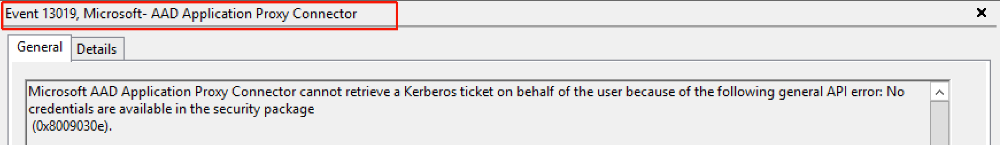
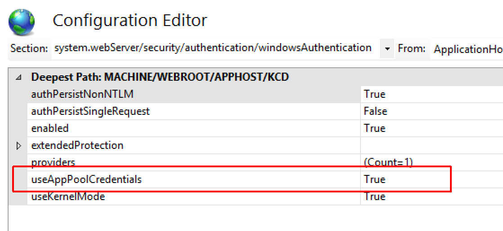

# How to configure an Application Proxy application to use Kerberos Constrained Delegation

The methods available for achieving SSO to published applications can somewhat vary from application to application and one of the options that Azure Application Proxy offers right out of the box, is Kerberos Constrained Delegation (KCD). This is where a connector host is configured to perform constrained kerberos authentication to backend applications, on behalf of users.

The actual procedure for enabling KCD is relatively straightforward and typically requires no more than a general understanding of the various components and authentication flow that facilitates SSO. Finding good sources of information to help troubleshoot scenarios where KCD SSO doesn’t function as expected, can be sparse.

As such, this article attempts to provide a single point of reference that should help troubleshoot and self-remediate some of the most common issues that we see. At the same time offer additional guidance for diagnosing the more complex and troubled of implementation.

note that this article makes the following assumptions:

-   Azure Application Proxy has been deployed as per our [documentation](https://docs.microsoft.com/azure/active-directory/active-directory-application-proxy-enable) and general access to non KCD applications is working as expected.

-   The published target application is based on IIS and Microsoft’s implementation of kerberos.

-   The server and application hosts reside in a single Active Directory domain. Detailed information on cross domain and forest scenarios can be found in our [KCD whitepaper](http://aka.ms/KCDPaper).

-   The subject application is published in an Azure tenant with pre-authentication enabled, and users are expected to authenticate to Azure via forms based authentication. Rich client authentication scenarios are not covered by this article, but be added at some point in the future.

## Prerequisites

Azure Application Proxy can be deployed into pretty much any type of infrastructure or environment and the architectures no doubt vary from organization to organization. One of the most common causes of KCD related issues are not the environments themselves, but rather simple mis-configurations, or general oversight.

For this reason, our advice is always to start by making sure you have met all the pre-requisites laid out in our main [Using KCD SSO with the Application Proxy article](https://docs.microsoft.com/azure/active-directory/active-directory-application-proxy-sso-using-kcd) before starting troubleshooting.

Particularly the section on configuring KCD on 2012R2, as this employs a fundamentally different approach to configuring KCD on previous versions of Windows, but also while being mindful of several other considerations:

-   It is not uncommon for a domain member server to open a secure channel dialog with a specific domain controller. Then move to another dialog at any given time, so connector hosts should generally not be restricted to being able to communicate with only specific local site DCs.

-   Similar to the above point, cross domain scenarios rely on referrals that direct a connector host to DCs that may reside outside of the local network perimeter. In this scenario it is equally important to make sure you are also allowing traffic onwards to DCs that represent other respective domains, or else delegation fail.

-   Where possible, you should avoid placing any active IPS/IDS devices between connector hosts and DCs, as these are sometimes over intrusive and interfere with core RPC traffic

As much as we’d like to resolve issues quickly and effectively, it can take time, so where possible you should try and test delegation in the simplest of scenarios. The more variables you introduce, the more you may have to contend with. For example, limiting your testing to a single connector can save valuable time, and additional connectors can be added after the issues has been resolved.

Some environmental factors may also be contributing to an issue, so again if possible try and minimize the architecture to a bare minimum for testing. For example, misconfigured internal firewall ACLs are not uncommon, so if possible have all traffic from a connector allowed straight through to the DCs and backend application. 

Actually the absolute best place to position connectors is as close to their targets as can be. Having a firewall sat inline whilst testing simply adds unnecessary complexity, and could just prolong your investigations.

So, what constitutes a KCD problem anyway? Well, there several classic indications of KCD SSO failing and the first signs of an issue usually manifest themselves in the browser.

   

   

all which bear the same symptom of failing to perform SSO, and consequently denying the user access to the application.

## Troubleshooting

How you then troubleshoot depend on the issue and observed symptoms. Before going any further we would suggest the following links, as they contain useful information you may not yet have come across:

-   [Troubleshoot Application Proxy problems and error messages](https://docs.microsoft.com/azure/active-directory/active-directory-application-proxy-troubleshoot)

-   [Kerberos errors and symptoms](https://docs.microsoft.com/azure/active-directory/active-directory-application-proxy-troubleshoot#kerberos-errors)

-   [Working with SSO when on-premises and cloud identities are not identical](https://docs.microsoft.com/azure/active-directory/active-directory-application-proxy-sso-using-kcd#working-with-sso-when-on-premises-and-cloud-identities-are-not-identical)

If you’ve got this far, then the main issue definitely exists. You need to dig deeper, so start by separating the flow into three distinct stages that you can troubleshoot.

**Client pre-authentication** - The external user authenticating to Azure via a browser.

Being able to pre-authenticate to Azure is imperative for KCD SSO to function. This should be tested and addressed first, if there are any issues. Note that the pre-authentication stage has no relation to KCD or the published application. It should be fairly easy to correct any discrepancies by sanity checking the subject account exists in Azure, and that it is not disabled/blocked. The error response in the browser is usually descriptive enough to understand the cause. You can also check our other Troubleshoot docs to verify if you aren’t sure.

**Delegation service** - The Azure Proxy connector obtaining a kerberos service ticket from a KDC (Kerberos Distribution Center), on behalf of users.

The external communications between the client and the Azure front end should have no bearing on KCD whatsoever, other than ensuring that it works. This is so the Azure Proxy service can be provided with a valid user ID that be used to obtain a kerberos ticket. Without this KCD is not possible and would fail.

As mentioned previously, the browser error messages usually provide some good clues on why things are failing. Make sure to note down the activity ID and timestamp in the response as this allow you to correlate the behavior to actual events in the Azure Proxy event log.

   

And the corresponding entries seen the event log would be seen as events 13019 or 12027. You can find the connector event logs in **Applications and Services Logs** &gt; **Microsoft** &gt; **AadApplicationProxy** &gt; **Connector**&gt;**Admin**.

   

   

-   Use an A record in your internal DNS for the application’s address, and not a CName

-   Re-confirm that the connector host has been granted the rights to delegate to the designated target account’s SPN, and that **Use any authentication protocol** is selected. This is covered in our main [SSO configuration article](https://docs.microsoft.com/azure/active-directory/active-directory-application-proxy-sso-using-kcd)

-   Verify that there is only a single instance of the SPN in existence in AD by issuing a **setspn -x** from a cmd prompt on any domain member host

-   Check to see if a domain policy is being enforced to limit the [max size of issued kerberos tokens](https://blogs.technet.microsoft.com/askds/2012/09/12/maxtokensize-and-windows-8-and-windows-server-2012/), as this prevent the connector from obtaining a token if found to be excessive

A network trace capturing the exchanges between the connector host and a domain KDC would then be the next best step in obtaining more low level detail on the issues. You can find this in [deep dive Troubleshoot paper](https://aka.ms/proxytshootpaper).

If ticketing looks good, you should see an event in the logs stating that authentication failed due to the application returning a 401. This typically indicates that the target application rejecting your ticket, so proceed with the following next stage.

**Target application** - The consumer of the kerberos ticket provided by the connector

At this stage the connector is expected to have sent a kerberos service ticket to the backend, as a header within the first application request.

-   Using the application’s internal URL defined in the portal, validate that the application is accessible directly from the browser on the connector host. Then you can login successfully. Details on doing this can be found on the connector Troubleshoot page.

-   Still on the connector host, confirm that the authentication between the browser and the application is using kerberos, by doing one of the following:

1.  Run Dev tools(**F12**) in Internet Explorer, or use [Fiddler](https://blogs.msdn.microsoft.com/crminthefield/2012/10/10/using-fiddler-to-check-for-kerberos-auth/) from the connector host. Go to the application using the internal URL, and inspect the offered WWW authorization headers returned in the response from the application, to ensure that either negotiate or kerberos is present. A subsequent kerberos blob returned in the response from the browser to the application typically start with **YII**, so this is a good indication of kerberos being in play. NTLM on the other hand always start with **TlRMTVNTUAAB**, which reads NTLMSSP when decoded from Base64. If you see **TlRMTVNTUAAB** at the start of the blob, this means that Kerberos is **not** available. If you don’t see this, Kerberos is likely available.

  * Note, if using Fiddler, this method would require temporarily disabling extended protection on the application’s config in IIS.

     

    *Figure:* Since this does not start with TIRMTVNTUAAB, this is an example that Kerberos is available. This is an example of a Kerberos Blob that doesn’t start with YII.

2.  Temporarily remove NTLM from the providers list on IIS site and access app directly from IE on connector host. With NTLM no longer in the providers list, you should be able to access the application using Kerberos only. If this fails, then that suggests that there is a problem with the application’s configuration and Kerberos authentication is not functioning.

If Kerberos is not available, then check the application’s authentication settings in IIS to make sure negotiate is listed topmost, with NTLM just beneath it. (Not Negotiate:kerberos or Negotiate:PKU2U). Only continue if Kerberos is functional.

   
   
-   With Kerberos and NTLM in place, lets now temporarily disable pre-authentication for the application in the portal. See if you can access it from the internet using the external URL. You should be prompted to authenticate and should be able to do so with the same account used in the previous step. If not, this indicates a problem with the backend application and not KCD at all.

-   Now re-enable pre-authentication in the portal and authenticate through Azure by attempting to connect to the application via it’s external URL. If SSO has failed, then you should see a forbidden error message in the browser, plus event 13022 in the log:

    *Microsoft AAD Application Proxy Connector cannot authenticate the user because the backend server responds to Kerberos authentication attempts with an HTTP 401 error.*

    

-   Check the IIS application to ensure the configured application pool is configured to use the same account that the SPN has been configured against in AD, by navigating in IIS as illustrated below

    

    Once you know the identity, issue the following from a cmd prompt to make sure this account is definitely configured with the SPN in question. For example,  **setspn – q http/spn.wacketywack.com**

    

-   Check that the SPN defined against the application’s settings in the portal is the same SPN that is configured against the target AD account in use by the application’s app pool

   
   
-   Go into IIS and select the **Configuration Editor** option for the application, and navigate to **system.webServer/security/authentication/windowsAuthentication** to make sure that **UseAppPoolCredentials** is set to true

   

While being useful in improving the performance of Kerberos operations, leaving Kernel mode enabled also causes the ticket for the requested service to be decrypted using machine account. This is also called the Local system, so having this set to true break KCD when the application is hosted across multiple servers in a farm.

-   As an additional check, you may also want to disable the **Extended** protection too. There have been encountered scenarios where this has proved to break KCD when enabled in very specific configurations, where an application is published as a sub folder of the Default Web site. This itself is configured for Anonymous authentication only, leaving the entire dialogs greyed out suggesting child objects would not be inheriting any active settings. But where possible we would always recommend having this enabled, so by all means test, but don’t forget to restore this to enabled.

These additional checks should have put you on track to start using your published application. You can go ahead and spin up additional connectors that are also configured to delegate, but if things are no further then we would suggest a read of our more in-depth technical walkthrough [The complete guide for Troubleshoot Azure AD Application Proxy](https://aka.ms/proxytshootpaper)

If you’re still unable to progress your issue, support would be more than happy to assist and continue from here. Create a support ticket directly within the portal and our engineers will reach out to you.

## Other scenarios

-   Azure Application Proxy requests a Kerberos ticket before sending its request to an application. Some 3rd party applications such as Tableau Server do not like this method of authenticating, and rather expects the more conventional negotiations to take place,. The first request is anonymous, allowing the application to respond with the authentication types that it supports through a 401.

-   Double hop authentication - Commonly used in scenarios where an application is tiered, with a backend and front end, both requiring authentication, such as SQL Reporting Services.

## Next steps
[Configure kerberos constrained delegation (KCD) on a managed domain](https://docs.microsoft.com/azure/active-directory-domain-services/active-directory-ds-enable-kcd)
