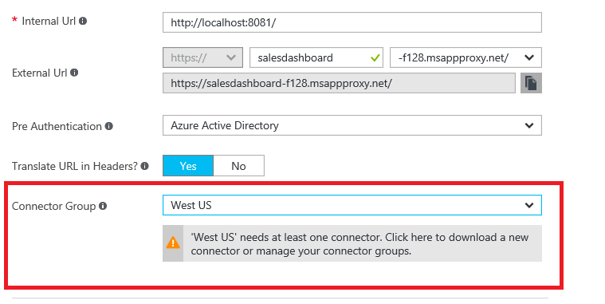
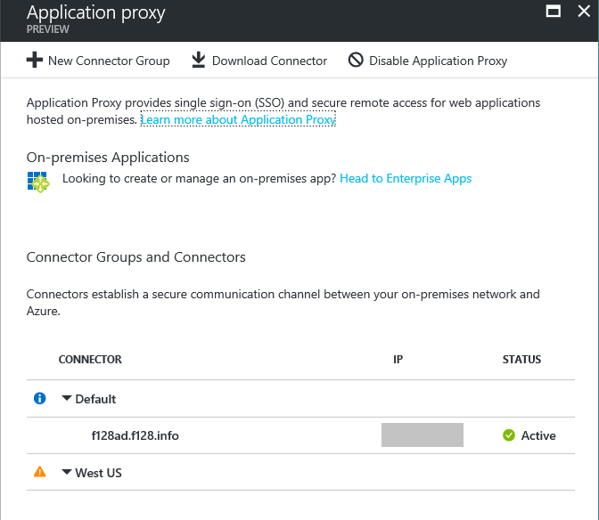
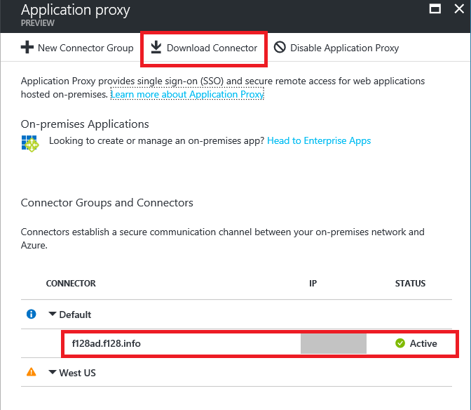

# No working connector group found for an Application Proxy application

This article help you to resolve the common issues faced when there is not a connector detected for an Application Proxy application integrated with Azure Active Directory.

## Overview of steps
If there is no working Connector in a Connector Group for your application, there are a few ways to resolve the problem:

-   If you have no connectors in the group, you can:

    -   Download a new Connector on the right on-prem server, and assign it to this group

    -   Move an active Connector into the group

-   If you have no active connectors in the group, you can:

    -   Identify the reason your Connector is inactive and resolve

    -   Move an active Connector into the group

To know which of these is the issue, open the “Application Proxy” menu in your Application, and look at the Connector Group warning message. It specify either that the group needs at least one Connector (you have none in the group) or that it has no active Connectors (though you likely have inactive Connectors).

   

For details on each of these options, see the corresponding section below. Each of these assumes that you are starting from the Connector management page. If you are looking at the error message above, you can go to this page by clicking on the warning message. Otherwise this can be found by going to **Azure Active Directory**, clicking on **Enterprise Applications**, then **Application Proxy.**

   

## Download a new Connector

To download a new Connector, use the “Download Connector” button at the top of the page.

note the Connector needs to be installed on a machine with direct line of sight to the backend application, and is typically placed on the same server as the application. After downloading, the Connector should appear in this menu. click the Connector, and use the “Connector Group” drop-down to make sure it belongs to the right group. Save the change.

   
   
## Move an Active Connector

If you have an active Connector that should belong to the group and has line of sight to the target backend application, you can move the Connector into the assigned group. To do so, click the Connector. In the “Connector Group” field, use the drop-down to select the correct group, and click Save.

## Resolve an inactive Connector

If the only Connectors in the group are inactive, they are likely on a machine that does not have all the necessary ports unblocked.

see the ports Troubleshoot document for details on investigating this problem.

## Next steps
[Understand Azure AD Application Proxy connectors](application-proxy-understand-connectors.md)

