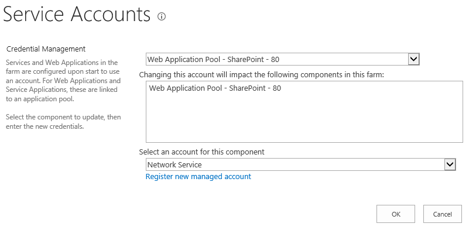
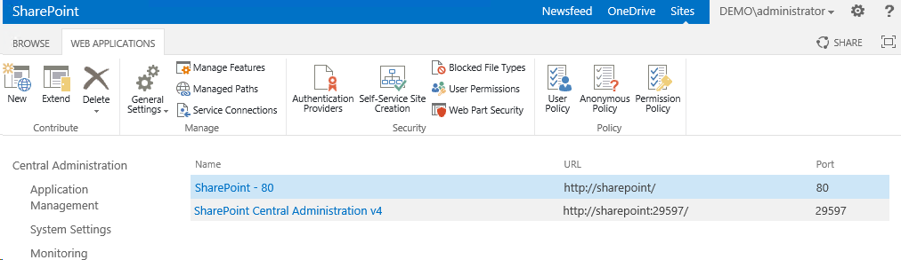
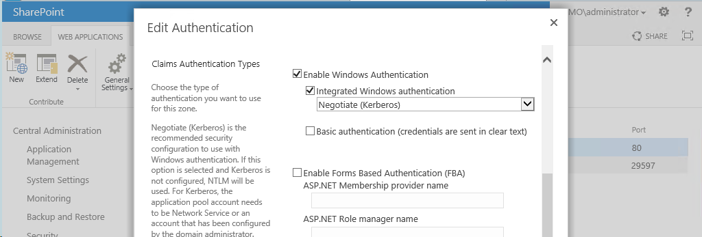
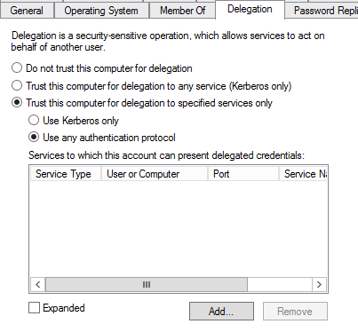
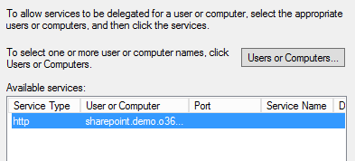
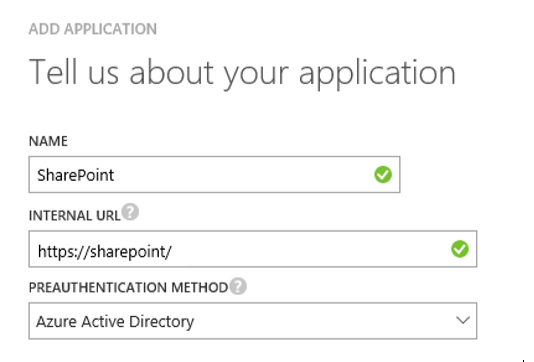
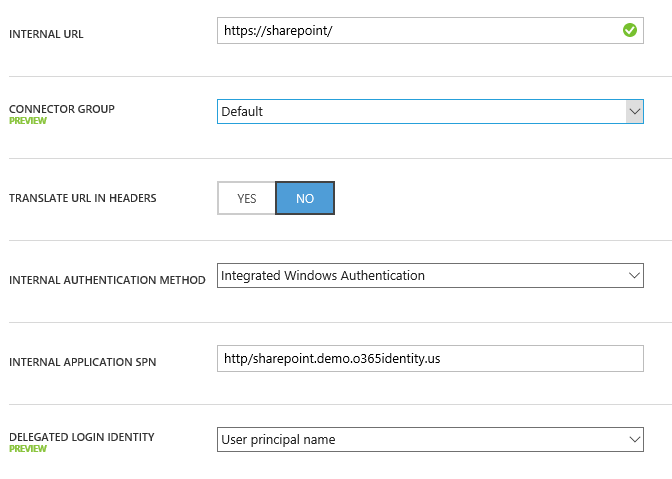
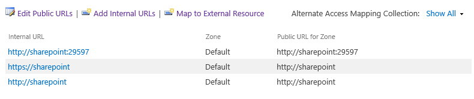
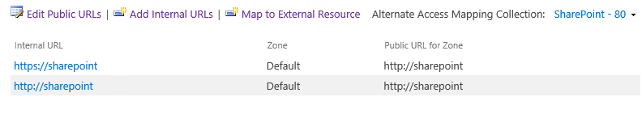
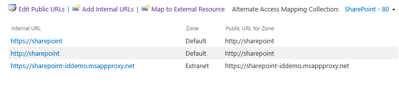

# Enable remote access to SharePoint with Azure AD Application Proxy

This article discusses how to integrate an on-premises SharePoint server with Azure Active Directory (Azure AD) Application Proxy.

To enable remote access to SharePoint with Azure AD Application Proxy, follow the sections in this article step by step.

## Prerequisites

This article assumes that you already have SharePoint 2013 or newer already set up and running in your environment. In addition, consider the following prerequisites:

* The Application Proxy feature is available only if you upgraded to the Premium or Basic edition of Azure Active Directory. For more information, see [Azure Active Directory editions](active-directory-editions.md).

* SharePoint includes native Kerberos support. Therefore, users who are accessing internal sites remotely through Azure AD Application Proxy can assume to have a seamless single sign-on (SSO) experience.

* You will need to make a few configuration changes to your SharePoint server. We recommend using a staging environment. This way, you can make updates to your staging server first, and then facilitate a testing cycle before going into production.

* We assume that you have already set up SSL for SharePoint, because we require SSL on the published URL. You need to have SSL enabled on your internal site, to ensure that links are sent/mapped correctly. If you haven't configured SSL, see [Configure SSL for SharePoint 2013](https://blogs.msdn.microsoft.com/fabdulwahab/2013/01/20/configure-ssl-for-sharepoint-2013) for instructions. Also, make sure that the connector machine trusts the certificate that you issue. (The certificate does not need to be publicly issued.)

## Step 1: Set up single sign-on to SharePoint

Our customers want the best SSO experience for their back-end applications, SharePoint server in this case. In this common Azure AD scenario, the user is authenticated only once, because they will not be prompted for authentication again.

For on-premises applications that require or use Windows authentication, you can achieve SSO by using the Kerberos authentication protocol and a feature called Kerberos constrained delegation (KCD). KCD, when configured, allows the Application Proxy connector to obtain a windows ticket/token for a user, even if the user hasn’t signed in to Windows directly. To learn more about KCD, see [Kerberos Constrained Delegation Overview](https://technet.microsoft.com/library/jj553400.aspx).

To set up KCD for a SharePoint server, use the procedures in the following sequential sections.

### Ensure that SharePoint is running under a service account

First, make sure that SharePoint is running under a defined service account--not local system, local service, or network service. You need to do this so that you can attach service principal names (SPNs) to a valid account. SPNs are how the Kerberos protocol identifies different services. And you will need the account later to configure the KCD.

To ensure that your sites are running under a defined service account, do the following:

1. Open the **SharePoint 2013 Central Administration** site.
2. Go to **Security** and select **Configure service accounts**.
3. Select **Web Application Pool - SharePoint - 80**. The options may be slightly different based on the name of your web pool, or if the web pool uses SSL by default.

  

4. If **Select an account for this component** is **Local Service** or **Network Service**, you need to create an account. If not, you're finished and can move to the next section.
5. Select **Register new managed account**. After your account is created, you must set **Web Application Pool** before you can use the account.

> [!NOTE]
You need to have a previously created Azure AD account for the service. We suggest that you allow for an automatic password change. For more information about the full set of steps and troubleshooting issues, see [Configure automatic password change in SharePoint 2013](https://technet.microsoft.com/library/ff724280.aspx).

### Configure SharePoint for Kerberos

You use KCD to perform single sign-on to the SharePoint server, and this works only with Kerberos.

To configure your SharePoint site for Kerberos authentication:

1. Open the **SharePoint 2013 Central Administration** site.
2. Go to **Application Management**, select **Manage web applications**, and select your SharePoint site. In this example, it's **SharePoint - 80**.

  

3. Click **Authentication Providers** on the toolbar.
4. In the **Authentication Providers** box, click **Default Zone** to view the settings.
5. In the **Edit Authentication** dialog box, scroll down until you see **Claims Authentication Types** and ensure that both **Enable Windows Authentication** and **Integrated Windows Authentication** are selected.
6. In the drop-down box, make sure that **Negotiate (Kerberos)** is selected.

  

7. At the bottom of the **Edit Authentication** dialog box, click **Save**.

### Set a service principal name for the SharePoint service account

Before you configure the KCD, you need to identify the SharePoint service running as the service account that you've configured. You do this by setting an SPN. For more information, see [Service Principal Names](https://technet.microsoft.com/library/cc961723.aspx).

The SPN format is:

```
<service class>/<host>:<port>
```

In the SPN format:

* _service class_ is a unique name for the service. For SharePoint, you use **HTTP**.

* _host_ is the fully qualified domain or NetBIOS name of the host that the service is running on. In the case of a SharePoint site, this might need to be the URL of the site, depending on the version of IIS that you're using.

* _port_ is optional.

If the FQDN of the SharePoint server is:

```
sharepoint.demo.o365identity.us
```

Then the SPN is:

```
HTTP/ sharepoint.demo.o365identity.us demo
```

You might also need to set SPNs for specific sites on your server. For more information, see [Configure Kerberos authentication](https://technet.microsoft.com/library/cc263449(v=office.12).aspx). Pay close attention to the section "Create Service Principal Names for your Web applications using Kerberos authentication."

The easiest way for you to set SPNs is to follow the SPN formats that may already be present for your sites. Copy those SPNs to register against the service account. To do this:

1. Browse to the site with the SPN from another machine.
 When you do, the relevant set of Kerberos tickets is cached on the machine. These tickets contain the SPN of the target site that you browsed to.

2. You can pull the SPN for that site by using a tool called [Klist](http://web.mit.edu/kerberos/krb5-devel/doc/user/user_commands/klist.html). In a command window that's running in the same context as the user who accessed the site in the browser, run the following command:
```
Klist
```
Klist then returns the set of target SPNs. In this example, the highlighted value is the SPN that's needed:

  

4. Now that you have the SPN, you need to make sure that it's configured correctly on the service account that you set up for the web application earlier. Run the following command from the command prompt as an administrator of the domain:

 ```
 setspn -S http/sharepoint.demo.o365identity.us demo\sp_svc
 ```

 This command sets the SPN for the SharePoint service account running as _demo\sp_svc_.

 Replace _http/sharepoint.demo.o365identity.us_ with the SPN for your server and _demo\sp_svc_ with the service account in your environment. The Setspn command will search for the SPN before it adds it. In this case, you might see a **Duplicate SPN Value** error. If you see this error, make sure that the value is associated with the service account.

You can verify that the SPN was added by running the Setspn command with the -l option. To learn more about this command, see [Setspn](https://technet.microsoft.com/library/cc731241.aspx).

### Ensure that the connector is set as a trusted delegate to SharePoint

Configure the KCD so that the Azure AD Application Proxy service can delegate user identities to the SharePoint service. You do this by enabling the Application Proxy connector to retrieve Kerberos tickets for your users who have been authenticated in Azure AD. Then that server will pass the context to the target application, or SharePoint in this case.

To configure the KCD, repeat the following steps for each connector machine:

1. Log in as a domain administrator to a DC, and then open **Active Directory Users and Computers**.
2. Find the computer that the connector is running on. In this example, it's the same SharePoint server.
3. Double-click the computer, and then click the **Delegation** tab.
4. Ensure that the delegation settings are set to **Trust this computer for delegation to the specified services only**, and then select **Use any authentication protocol**.

  

5. Click the **Add** button, click **Users or Computers**, and locate the service account.

  

6. In the list of SPNs, select the one that you created earlier for the service account.
7. Click **OK**. Click **OK** again to save the changes.

## Step 2: Enable remote access to SharePoint

Now that you’ve enabled SharePoint for Kerberos and configured KCD, you're ready to set up single sign-on to SharePoint. Then from the connector, you can publish the SharePoint farm for remote access through Azure AD Application Proxy.

To perform the following steps, you need to be a member of the Global Administrator Role in your organization's Azure Active Directory account.

1. Sign in to the [Azure portal](https://manage.windowsazure.com) and find your Azure AD tenant.
2. Click **Applications**, and then click **Add**.
3. Select **Publish an application that will be accessible from outside your network**. If you don’t see this option, make sure that you have Azure AD Basic or Premium set up in the tenant.
4. Complete each of the options as follows:
 * **Name**: Use any value that you want--for example, **SharePoint**.
 * **Internal URL**: This is the URL of the SharePoint site internally, such as **https://SharePoint/**. In this example, make sure to use **https**.
 * **Preauthentication Method**: Select **Azure Active Directory**.

  

5. After the app is published, click the **Configure** tab.
6. Scroll down to the option **Translate URL in Headers**. The default value is **YES**. Change it to **NO**.

 SharePoint uses the _Host Header_ value to look up the site. It also generates links based on this value. The net effect is to make sure that any link that SharePoint generates is a published URL that is correctly set to use the external URL. Setting the value to **YES** also enables the connector to forward the request to the back-end application. However, setting the value to **NO** means that the connector will not send the internal host name. Instead, the connector will send the host header as the published URL to the back-end application.

 Also, to ensure that SharePoint accepts this URL, you need to complete one more configurations on the SharePoint server. You'll do that in the next section.

7. Change **Internal Authentication Method** to **Integrated Windows Authentication**. If your Azure AD tenant uses a UPN in the cloud that's different from the UPN on-premises, remember to update **Delegated Login Identity** as well.
8. Set **Internal Application SPN** to the value that you set earlier. For example, use **http/sharepoint.demo.o365identity.us**.
9. Assign the application to your target users.

Your application should look similar to the following:

  

## Step 3: Ensure that SharePoint knows about the external URL

Your last step to ensure that SharePoint can find the site based on the external URL, so that it will render links based on that external URL. You do this by configuring alternate access mappings for the SharePoint site.

1. Open the **SharePoint 2013 Central Administration** site.
2. Under **System Settings**, select **Configure Alternate Access Mappings**.

 This opens the **Alternate Access Mappings** box.

  

3. In the drop-down list beside **Alternate Access Mapping Collection**, select **Change Alternate Access Mapping Collection**.
4. Select your site--for example, **SharePoint - 80**.

  

5. You can choose to add the published URL as either an internal URL or a public URL. This example uses a public URL as the extranet.
6. Click **Edit Public URLs** in the **Extranet** path, and then enter the path for the published application, as in the previous step. For example, enter **https://sharepoint-iddemo.msappproxy.net**.

  

7. Click **Save**.

 You can now access the SharePoint site externally via Azure AD Application Proxy.

## Next steps

- [How to provide secure remote access to on-premises applications](active-directory-application-proxy-get-started.md)
- [Understand Azure AD Application Proxy connectors](application-proxy-understand-connectors.md)
- [Publishing SharePoint 2016 and Office Online Server with Azure AD Application Proxy](https://blogs.technet.microsoft.com/dawiese/2016/06/09/publishing-sharepoint-2016-and-office-online-server-with-azure-ad-application-proxy/)
