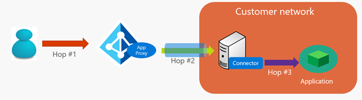
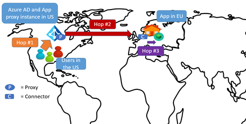

# Network topology considerations when using Azure Active Directory Application Proxy

This article explains network topology considerations when using Azure Active Directory (Azure AD) Application Proxy for publishing and accessing your applications remotely.

## Traffic flow

When an application is published through Azure AD Application Proxy, all traffic from the users to the target back-end applications flows through the following hops:

* Hop 1: User to Azure AD Application Proxy service’s public endpoint on Azure
* Hop 2: Application Proxy service to the connector
* Hop 3: Connector to target application

 

## Tenant location and Application Proxy service

When you sign up for an Azure AD tenant, the region of your tenant is determined by the country you specify. When you enable Application Proxy, the Application Proxy service instances for your tenant are displayed in the same region as your Azure AD tenant, or the closest region to it.

For example, if your Azure AD tenant’s region is the European Union (EU), all your Application Proxy connectors are using service instances in Azure datacenters in the EU. This also means that all your users go through the Application Proxy service instances in this location, when trying to access published applications.

## Considerations for reducing latency

All proxy solutions introduce latency into your network connection. No matter which proxy or VPN solution you choose as your remote access solution, it always includes a set of servers enabling the connection to inside your corporate network.

Organizations have typically included server endpoints in their perimeter network. But with Azure AD Application Proxy, no perimeter network is required. This is because traffic flows through the proxy service in the cloud, while the connectors reside on your corporate network.

### Connector placement

Application Proxy chooses the location of instances for you, based on your tenant location. Therefore, you get to decide where to install the connector, giving you the power to define the latency characteristics of your network traffic.

When setting up the Application Proxy service, you should ask the following questions:

* Where is the app located?
* Where are most users accessing the app located?
* Where is the Application Proxy instance located (this is based on your tenant)?
* Do you already have a dedicated network connection to Azure datacenters set up (such as Azure ExpressRoute or a similar VPN)?

The placement of the connector determines the latency of hops 2 and 3 (described in the preceding section). When evaluating the placement of the connector, you should consider the following:

* The connector needs a line of sight to a datacenter. This allows the connector to perform Kerberos constrained delegation (KCD) operations, when you want single sign-on (SSO) to back-end applications.
* The connector is typically installed closer to the application, to reduce time from the connector to the application.

### General approach to minimize latency

You can try to minimize the latency of the end-to-end traffic by optimizing each of the network hops. Each hop can be optimized by:

* Reducing the distance between the two ends of the hop.
* Choosing the right network to traverse. For example, traversing a private network rather than the public Internet may be faster, due to dedicated links.

If you have a dedicated VPN or ExpressRoute link between Azure and your corporate network, you may want to use that.

## Focus your optimizing strategy

Because your users may access apps remotely over the Internet, you should always focus on optimizing hops 2 and 3. The following are some of the common patterns you can incorporate.

### Pattern 1: Optimize hop 3

To optimize hop 3, the connector is placed close to the target application in the customer network. The advantage of doing this is that the connector is likely to need a line of sight to the domain controller. This approach is sufficient for most scenarios. (In fact, most of our customers follow this pattern.)

 

> [!NOTE]
There are some scenarios where you need to optimize both hop 2 and hop 3 to get the latency characteristics you want. For example, if you have a VPN or ExpressRoute set up between your network and the Azure datacenter, you can optimize both of these hops.

### Pattern 2: Take advantage of ExpressRoute with public peering

If you have ExpressRoute set up with public peering, you can make use of the faster ExpressRoute connection for hop 2. (Hop 3 is already optimized, by placing the connector close to the app in your network.)

### Pattern 3: Take advantage of ExpressRoute with private peering

If you have a dedicated VPN or ExpressRoute set up with private peering between Azure and your corporate network, you have another option. In this configuration, the virtual network in Azure is typically considered as an extension of the corporate network. So you can install the connector in the Azure datacenter, and still satisfy the low latency requirements of the connector-to-app connection for hop 3.

Latency is not compromised, because traffic is flowing over a dedicated connection. You also get the added benefit of improving the latency characteristics of hop 2. This is because the Application Proxy service-to-connector connection is now a shorter hop. The connector is installed in an Azure datacenter close to your Azure AD tenant (and therefore Application Proxy) location.

### Other approaches

Although the focus of this article is connector placement, you can also change the placement of the application to get better latency characteristics.

Increasingly, organizations are moving their networks into hosted environments. This enables them to place their apps in a hosted environment that is also part of their corporate network, and still be within the domain. In this case, the patterns discussed in the preceding sections can be applied to the new application location.

Consider using connector groups to target apps that are in different locations and networks. If you're considering this option, see [Azure AD Domain Services](../active-directory-domain-services/active-directory-ds-overview.md).

## Common scenarios

In this section, we walk through a few use cases. Assume that the Azure AD tenant (and therefore proxy service endpoint) is located in the United States (US). The considerations discussed in these use cases usually also apply to other regions around the globe.

### Use case 1

The app is in an organization's network in the US, with users in the same region. No ExpressRoute or VPN exists between the Azure datacenter and the corporate network.

**Recommendation:** Follow pattern 1, explained in the previous section. For improved latency, consider using ExpressRoute, if needed.

This is a simple pattern. You optimize hop 3, by placing the connector near the app. This is also a natural choice, because the connector typically is installed with line of sight to the app and to the datacenter to perform KCD operations.

### Use case 2

The app is in an organization's network in the US, with users spread out globally. No ExpressRoute or VPN exists between the Azure datacenter and the corporate network.

**Recommendation:** Follow pattern 2, explained in the previous section. For improved latency, consider using ExpressRoute, if needed.

Again, the common pattern is to optimize hop 3, where you place the connector near the app. Hop 3 is not typically expensive, if it is all within the same region. However, hop 1 can be more expensive depending on where the user is, because all users access the Application Proxy instance in the US. It's worth noting that any proxy solution has similar characteristics regarding users being spread out globally.

### Use case 3

The app is in an organization's network in the US. ExpressRoute with public peering exists between Azure and the corporate network.

**Recommendation:** Place the connector as close as possible to the app. The system automatically uses ExpressRoute for hop 2. This follows pattern 2, explained in the previous section.

If the ExpressRoute link is using public peering, the traffic between the proxy and the connector flows over that link. Hop 2 has optimized latency.

### Use case 4

The app is in an organization's network in the US. ExpressRoute with private peering exists between Azure and the corporate network.

**Recommendation:** Place the connector in the Azure datacenter that is connected to the corporate network through ExpressRoute private peering. This follows pattern 3, explained in the previous section.

The connector can be placed in the Azure datacenter. Since the connector still has a line of sight to the application and the datacenter through the private network, hop 3 remains optimized. In addition, hop 2 is optimized further.

### Use case 5

The app is in an organization's network in the EU, with most users in the US.

**Recommendation:** Place the connector near the app. Because US users are accessing an Application Proxy instance that happens to be in the same region, hop 1 is not too expensive. Hop 3 is optimized. However, hop 2 is typically expensive in this use case.

Consider using ExpressRoute, as described in preceding sections about patterns 2 and 3.

You can also consider using one other variant in this situation. If most users in the organization are in the US, then chances are that your network extends to the US as well. If that is the case, the connector can be placed in the US, and can use the dedicated internal corporate network line to the application in the EU. This way hops 2 and 3 are optimized.

## Next steps

- [Enable Application Proxy](active-directory-application-proxy-enable.md)
- [Enable single-sign on](active-directory-application-proxy-sso-using-kcd.md)
- [Enable conditional access](active-directory-application-proxy-conditional-access.md)
- [Troubleshoot issues you're having with Application Proxy](active-directory-application-proxy-troubleshoot.md)
