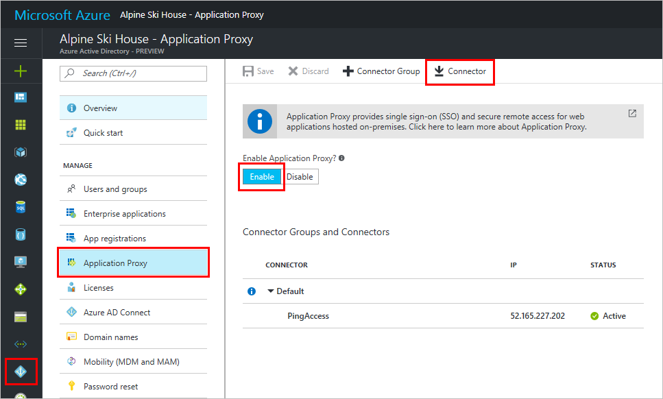
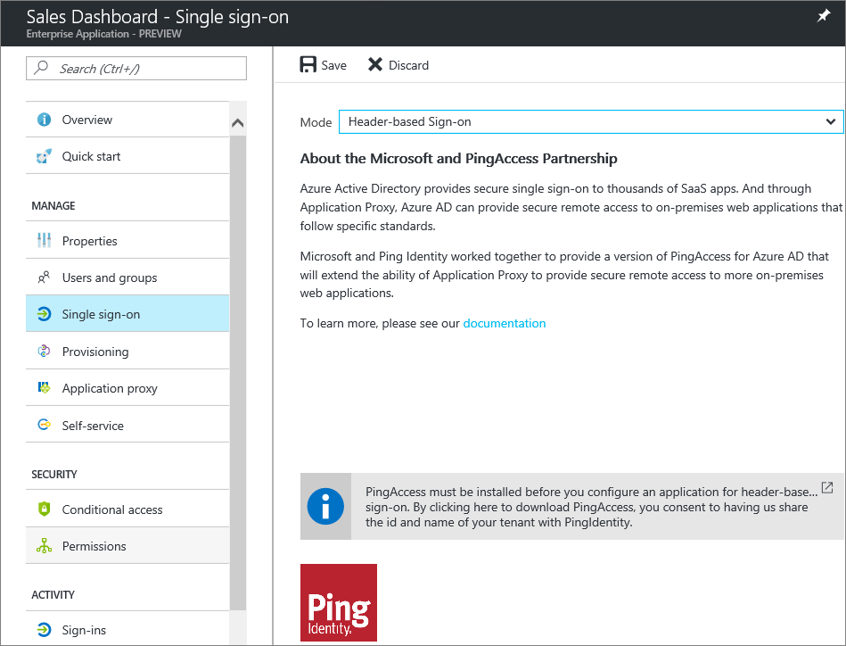

# Publish applications that support header-based authentication with Azure AD Application Proxy and PingAccess

Azure Active Directory Application Proxy and PingAccess have partnered together to provide Azure Active Directory customers with access to even more applications. PingAccess expands the [existing Application Proxy offerings](active-directory-application-proxy-get-started.md) to include remote access to applications that use headers for authentication.

## What is PingAccess for Azure AD?

To give your users access to apps that use headers for authentication, you publish the app for remote access in both Application Proxy and PingAccess. Application Proxy treats these apps like any other, using Azure AD to authenticate access and then passing traffic through the connector service. PingAccess sits in front of the apps and translates the access token from Azure AD into a header so that the application receives the authentication in the format it can read.

Your users won’t notice anything different when they sign in to use your corporate apps. They can still work from anywhere on any device. When your users are at the office, neither Application Proxy nor PingAccess intercept the traffic, so your users get the same experience as always.

Since the Application Proxy connectors direct remote traffic to all apps regardless of their authentication type, they’ll continue to load balance automatically, as well.

## How do I get access?

Since this scenario is offered through a partnership between Azure Active Directory and PingAccess, you need licenses for both services. Azure Active Directory Premium subscriptions come with a starter PingAccess license so that you can configure up to 20 applications with this flow.

For more information, see [Azure Active Directory editions](active-directory-editions.md).

## Publish your first application

This article is intended for people who are publishing an app with this scenario for the first time. It walks through how to get started with both Application and PingAccess, in addition to the publishing steps. If you’ve already configured both services but want a refresher on the publishing steps, you can skip the two registration sections.

>[!NOTE]
>Since this scenario is a partnership between Azure AD and PingAccess, some of the instructions exist on the Ping Identity site.

### Install an Application Proxy connector

If you already have Application Proxy enabled, and have a connector installed, you can skip these steps.

The Application Proxy connector is a Windows Server service that directs the traffic from your remote employees to your published apps. For more detailed installation instructions, see [Enable Application Proxy in the Azure portal](active-directory-application-proxy-enable.md).

1. Sign in to the [Azure portal](https://portal.azure.com) as a global administrator.
2. Select **Azure Active Directory** > **Application proxy**.
3. Select **Download Connector** to start the Application Proxy connector download. Follow the installation instructions.
4. Downloading the connector should automatically enable Application Proxy for your directory, but if not you can select **Enable Application Proxy**.

### Add your app to Azure AD with Application Proxy

There are two parts to this section. First, you need to publish the app to Azure AD. Then, you need to collect some information about that app that you can use during the PingAccess steps.

#### Publish the app

1. If you didn't in the last section, sign in to the [Azure portal](https://portal.azure.com) as a global administrator.
2. Select **Azure Active Directory** > **Enterprise applications**.
3. Select **Add** at the top of the blade.
4. Select **On-premises application**.
5. Fill out the required fields with information about your new app. Use the following guidance for the settings:
   - **Internal URL**: Normally you provide the URL that takes you to the app’s sign in page when you’re on the corporate network. For this partnership the connector needs to treat the PingAccess proxy as the front page of the app. Use this format: `https://<host name of your PA server>:<port>`. The port is 3000 by default, but you can configure it in PingAccess.
   - **Pre-authentication method**: Azure Active Directory
   - **Translate URL in Headers**: No

   >[!NOTE]
   >If this is your first application, use port 3000 to start and come back to update this setting if you change your Ping Access configuration. If this is your second or later app, this will need to match the Listener you’ve configured in PingAccess. Learn more about [listeners in PingAccess](https://documentation.pingidentity.com/pingaccess/pa31/index.shtml#Listeners.html).

6. Select **Add** at the bottom of the blade. Your application is added, and the quick start menu opens.
7. In the quick start menu,
select **Assign a user for testing**, and add at least one user to the application. Make sure this test account has access to the on-premises application.
8. Select **Assign** to save the test user assignment.
9. On the app management blade, select **Single sign-on**.
10. Choose **Header-based sign-on** from the drop-down menu. Select **Save**.

  

11. Close the Enterprise applications blade or scroll all the way to the left to return to the Azure Active Directory menu.
12. Select **App registrations**.
13. Select the app you just added, then **Reply URLs**.
14. Check to see if the external URL that you assigned to your app in step 5 is in the Reply URLs list. If it’s not, add it now.
15. On the app settings blade, select **Required permissions**.
16. Select **Add**. For the API, choose **Windows Azure Active Directory**, then **Select**. For the permissions, choose **Read and write all applications** and **Sign in and read user profile**, then **Select** and **Done**.  

  

#### Collect information for the PingAccess steps

1. Still on your app settings blade, select **Properties**. Save the **Application Id** value. This is used for the client ID when you configure PingAccess.
2. On the app settings blade, select **Keys**.
3. Create a key by entering a key description and choosing an expiration date from the drop-down menu.
4. Select **Save**. A GUID appears in the **Value** field.

  Save this value now, as you won’t be able to see it again after you close this window.

5. Close the App registrations blade or scroll all the way to the left to return to the Azure Active Directory menu.
6. Select **Properties**.
7. Save the **Directory ID** GUID.

### Download PingAccess and configure your app

The detailed steps for the PingAccess part of this scenario continue in the Ping Identity documentation, [Configure PingAccess for Azure AD](https://docs.pingidentity.com/bundle/paaad_m_ConfigurePAforMSAzureADSolution_paaad43/page/pa_c_PAAzureSolutionOverview.html).

Those steps walk you through the process of getting a PingAccess account if you don't already have one, installing the PingAccess Server, and creating an Azure AD OIDC Provider connection with the Directory ID that you copied from the Azure portal. Then, you use the Application ID and Key values to create a Web Session on PingAccess. After that, you can set up identity mapping and create a virtual host, site, and application.

### Test your app

When you've completed all these steps, your app should be up and running. To test it, open a browser and navigate to the external URL that you created when you published the app in Azure. Sign in with the test account that you assigned to the app.

## Next steps

- [Troubleshoot Application Proxy](active-directory-application-proxy-troubleshoot.md)
