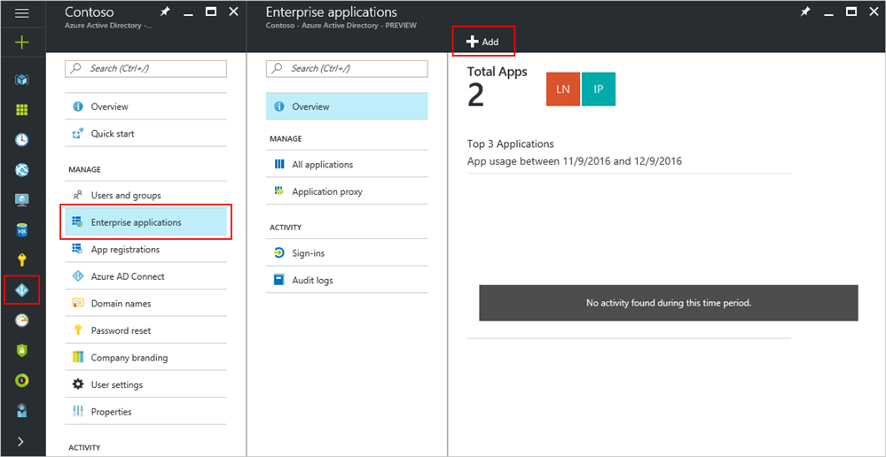
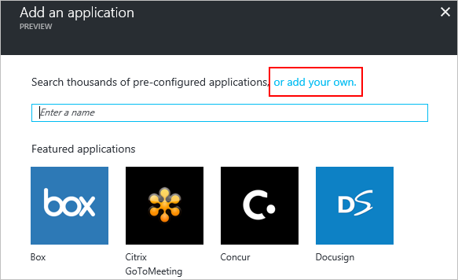
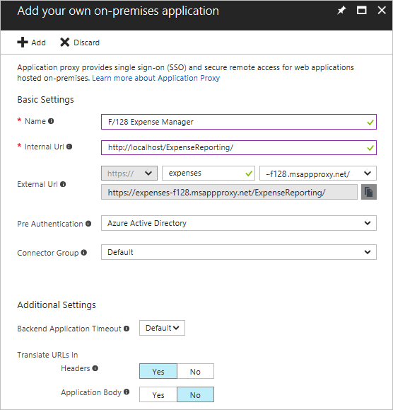
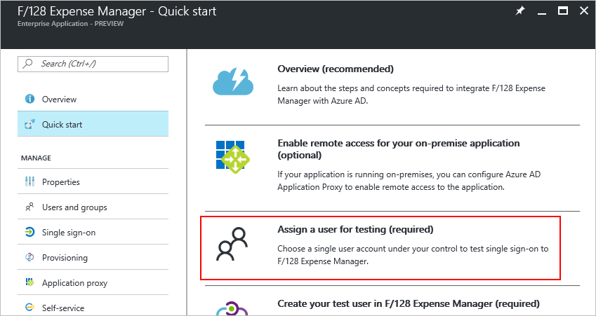
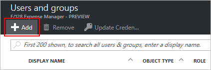
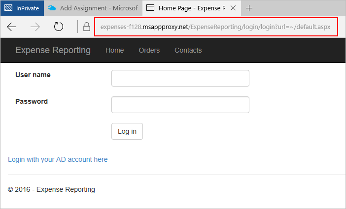

# Publish applications using Azure AD Application Proxy

> [!div class="op_single_selector"]
> * [Azure portal](application-proxy-publish-azure-portal.md)
> * [Azure classic portal](active-directory-application-proxy-publish.md)

Azure Active Directory (AD) Application Proxy helps you support remote workers by publishing on-premises applications to be accessed over the internet. Through the Azure portal, you can publish applications that are running on your local network and provide secure remote access from outside your network.

This article walks you through the steps to publish an on-premises app with Application Proxy. After you complete this article, you'll be ready to configure the application with single sign-on, personalized information, or security requirements.

If you're new to Application Proxy, learn more about this feature with the article [How to provide secure remote access to on-premises applications](active-directory-application-proxy-get-started.md).

## Publish an on-premises app for remote access

> [!TIP]
> If this is your first time using Application Proxy, choose an application that's already set up for password-based authentication. Application Proxy supports other types of authentication, but password-based apps are the easiest to get up and running quickly. 

1. Sign in as an administrator in the [Azure portal](https://portal.azure.com/).
2. Select **Azure Active Directory** > **Enterprise applications** > **New application**.

  

3. On the Categories page, select **On-premises application**.  

  

4. Provide the following information about your application:

   - **Name**: The name of the application that will appear on the access panel. 

   - **Internal URL**: The address that the Application Proxy Connector uses to access the application from inside your private network. You can provide a specific path on the backend server to publish, while the rest of the server is unpublished. In this way, you can publish different sites on the same server as different apps, and give each one its own name and access rules.

     > [!TIP]
     > If you publish a path, make sure that it includes all the necessary images, scripts, and style sheets for your application. For example, if your app is at https://yourapp/app and uses images located at https://yourapp/media, then you should publish https://yourapp/ as the path.

   - **External URL**: The address your users will go to in order to access the app from outside your network.
   - **Pre Authentication**: How Application Proxy verifies users before giving them access to your application. 

     - Azure Active Directory: Application Proxy redirects users to sign in with Azure AD, which authenticates their permissions for the directory and application. We recommend keeping this option as the default.
     - Passthrough: Users don't have to authenticate against Azure Active Directory to access the application. You can still set up authentication requirements on the backend.
   - **Translate URL in Headers?**: Choose whether to translate the URL in the headers, or keep the original. 
   - **Connector Group**: Connectors process the remote access to your application, and connector groups help you organize connectors and apps by region, network, or purpose. If you don't have any connector groups created yet, your app is assigned to **Default** and you'll see a warning message asking you to [create a connector group](active-directory-application-proxy-connectors-azure-portal.md).

   

8. Select **Add**.

## Add a test user 

To test that your app was published correctly, add a user account that you have access to. 

1. Back on the Quick start blade, select **Assign a user for testing**.

  

2. On the Users and groups blade, select **Add**.

  

3. On the Add assignment blade, select **Users and groups** then choose the account you want to add. 
4. Select **Assign**.

## Test your published app

In your browser, navigate to the external URL that you configured during the publish step. You should see the start screen, and be able to sign in with the test account you set up.

## Next steps
- [Download connectors](active-directory-application-proxy-enable.md) and [create connector groups](active-directory-application-proxy-connectors-azure-portal.md) to publish applications on separate networks and locations.

- [Set up single sign-on](application-proxy-sso-azure-portal.md) for your newly-published app
