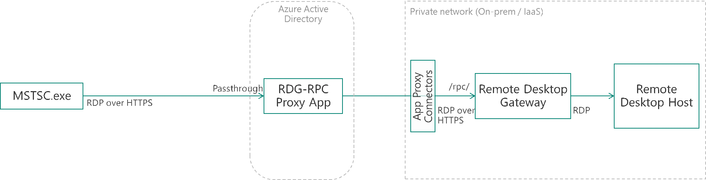
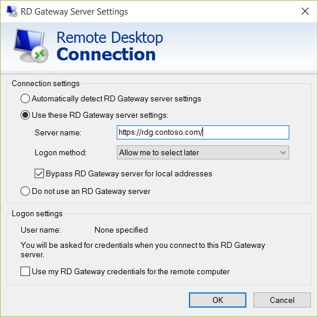
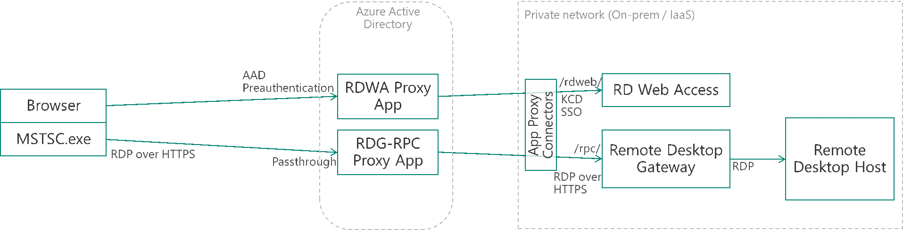
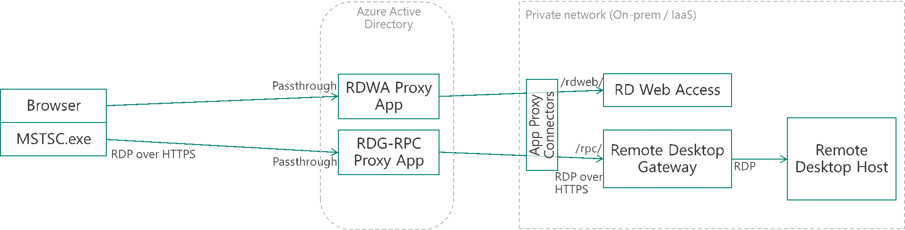

# Publish Remote Desktop with Azure AD Application Proxy

This article discusses how to make Windows Remote Desktop deployments accessible to remote users. Remote Desktop deployments can reside on-premises or on private networks, such as IaaS deployments.

> [!NOTE]
> The Application Proxy feature is available only if you upgraded to the Premium or Basic edition of Azure Active Directory (Azure AD). For more information, see [Azure Active Directory editions](active-directory-editions.md).

Remote Desktop Protocol (RDP) traffic can be published through Azure AD Application Proxy as a pass-through proxy application. This solution solves the connectivity problem and provides basic security protection such as network buffering, hardened Internet front-end, and distributed denial-of-service (DDoS) protection.

## Remote Desktop deployment

Within the Remote Desktop deployment, Remote Desktop Gateway is published so that it can convert the remote procedure call (RPC) over HTTPS traffic to RDP over User Datagram Protocol (UDP) traffic.

You can configure the clients to use Remote Desktop clients, such as MSTSC.exe, to access the Azure AD Application Proxy. In this way, you create a new HTTPS connection to Remote Desktop Gateway by using its connectors. As a result, the gateway is not directly exposed to the Internet, and all HTTPS requests will first be terminated in the cloud.

The topology is shown in the following diagram:

 

## Configure the Remote Desktop Gateway URL

When users configure the Remote Desktop Gateway URL and trigger RDP traffic, as they typically do, they can access files and other methods.

You can publish either by using the domain name provided by Application Proxy (msappproxy.net) or by using a custom domain name configured on Azure AD (for example, rdg.contoso.com).

If the client devices and RDP file are already configured with a Remote Desktop Gateway URL, you can choose to use the same domain name and, therefore, avoid the change. In this case, the certificate that covers this domain should be provided to Application Proxy, and its certificate revocation list (CRL) should be accessible over the Internet.

If no Remote Desktop Gateway URL is configured, users or admins can specify it in the Remote Desktop clients (MSTSC) by using the Remote Desktop Connection dialog box, as shown here.

 

The **Connection settings** dialog box appears when you click **Settings** on the **Advanced** tab.

 

## Remote Desktop Web Access

If your organization uses the Remote Desktop Web Access (RDWA) portal, you can also publish by using the Azure AD Application Proxy. You can publish to this portal with pre-authentication and single sign-on (SSO).

The topology of the RDWA scenario is shown in the following diagram:

 

In the preceding case, users are authenticated on Azure AD before accessing RDWA. If they have already been authenticated on Azure AD (for example, they are using Office 365), they do not have to authenticate again for RDWA.

When users start the RDP session, they need to authenticate again over the RDP channel. This happens because SSO from RDWA to Remote Desktop Gateway is based on storing the user credentials on the client by using ActiveX. This process is triggered from RDWA form-based authentication. When RDWA authentication is using Kerbros, no form-based authentication is presented and, therefore, the RDWA to RDP SSO doesn't work.

If RDWA needs SSO to the RDP traffic, or RDWA form-based authentication has been heavily customized, you can publish RDWA without preauthentication.

The topology of this scenario is shown in the following diagram:

 

In the preceding case, users must authenticate to RDWA by using form-based authentication, but they don't need to authenticate over RDP.

>[!NOTE]
>In both preceding cases, no pre-authentication is required on the RDP traffic. Therefore, users can access it without going through RDWA first.

## Next steps

[Enable remote access to SharePoint with Azure AD Application Proxy](application-proxy-enable-remote-access-sharepoint.md)  
[Enable Application Proxy in the Azure portal](active-directory-application-proxy-enable.md)
