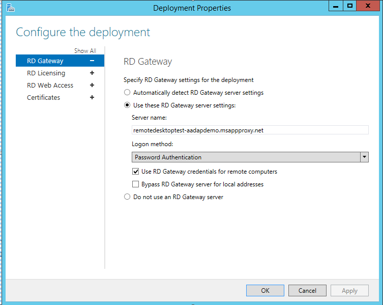

# Publish Remote Desktop with Azure AD Application Proxy

This article covers how to deploy Remote Desktop Services (RDS) with Application Proxy so that remote users can still be productive.

The intended audience for this article is:
- Current Azure AD Application Proxy customers who want to offer more applications to their end users by publishing on-premises applications through Remote Desktop Services.
- Current Remote Desktop Services customers who want to reduce the attack surface of their deployment by using Azure AD Application Proxy. This scenario gives a limited set of two-step verification and conditional access controls to RDS.

## How Application Proxy fits in the standard RDS deployment

A standard RDS deployment includes various Remote Desktop role services running on Windows Server. Looking at the [Remote Desktop Services architecture](https://technet.microsoft.com/windows-server-docs/compute/remote-desktop-services/desktop-hosting-logical-architecture), there are multiple deployment options. The most noticeable difference between the [RDS deployment with Azure AD Application Proxy](https://technet.microsoft.com/windows-server-docs/compute/remote-desktop-services/desktop-hosting-logical-architecture) (shown in the following diagram) and the other deployment options is that the Application Proxy scenario has a permanent outbound connection from the server running the connector service. Other deployments leave open inbound connections through a load balancer.


In an RDS deployment, the RD Web role and the RD Gateway role run on Internet-facing machines. These endpoints are exposed for the following reasons:
- RD Web provides the user a public endpoint to sign in and view the various on-premises applications and desktops they can access. Upon selecting a resource, an RDP connection is created using the native app on the OS.
- RD Gateway comes into the picture once a user launches the RDP connection. The RD Gateway handles the encrypted RDP traffic coming over the Internet and translates it to the on-premises server that the user is connecting to. In this scenario, the traffic the RD Gateway is receiving comes from the Azure AD Application Proxy.

>[!TIP]
>If you haven't deployed RDS before, or want more information before you begin, learn how to [seamlessly deploy RDS with Azure Resource Manager and Azure Marketplace](https://technet.microsoft.com/windows-server-docs/compute/remote-desktop-services/rds-in-azure).

## Requirements

- Both the RD Web and RD Gateway endpoints must be located on the same machine, and with a common root. RD Web and RD Gateway will be published as a single application so you can have a single sign-on experience between the two applications.

- You should already have [deployed RDS](https://technet.microsoft.com/windows-server-docs/compute/remote-desktop-services/rds-in-azure), and [enabled Application Proxy](active-directory-application-proxy-enable.md).

- This scenario assumes that your end users go through Internet Explorer on Windows 7 or Windows 10 desktops that connect through the RD Web page. If you need to support other operating systems, see [Support for other client configurations](#support-for-other-client-configurations).

  >[!NOTE]
  >Windows 10 Creator's Update is not currently supported.

- On Internet Explorer, enable the RDS ActiveX add-on.

## Deploy the joint RDS and Application Proxy scenario

After setting up RDS and Azure AD Application Proxy for your environment, follow the steps to combine the two solutions. These steps walk through publishing the two web-facing RDS endpoints (RD Web and RD Gateway) as applications, and then directing traffic on your RDS to go through Application Proxy.

### Publish the RD host endpoint

1. [Publish a new Application Proxy application](application-proxy-publish-azure-portal.md) with the following values:
   - Internal URL: https://\<rdhost\>.com/, where \<rdhost\> is the common root that RD Web and RD Gateway share.
   - External URL: This field is automatically populated based on the name of the application, but you can modify it. Your users will go to this URL when they access RDS.
   - Preauthentication method: Azure Active Directory
   - Translate URL headers: No
2. Assign users to the published RD application. Make sure they all have access to RDS, too.
3. Leave the single sign-on method for the application as **Azure AD single sign-on disabled**. Your users are asked to authenticate once to Azure AD and once to RD Web, but have single sign-on to RD Gateway.
4. Go to **Azure Active Directory** > **App Registrations** > *Your application* > **Settings**.
5. Select **Properties** and update the **Home-page URL** field to point to your RD Web endpoint (like https://\<rdhost\>.com/RDWeb).

### Direct RDS traffic to Application Proxy

Connect to the RDS deployment as an administrator and change the RD Gateway server name for the deployment. This ensures that connections go through the Azure AD Application Proxy.

1. Connect to the RDS server running the RD Connection Broker role.
2. Launch **Server Manager**.
3. Select **Remote Desktop Services** from the pane on the left.
4. Select **Overview**.
5. In the Deployment Overview section, select the drop-down menu and choose **Edit deployment properties**.
6. In the RD Gateway tab, change the **Server name** field to the External URL that you set for the RD host endpoint in Application Proxy.
7. Change the **Logon method** field to **Password Authentication**.

  

8. For each collection, run the following command. Replace *\<yourcollectionname\>* and *\<proxyfrontendurl\>* with your own information. This command enables single sign-on between RD Web and RD Gateway, and optimizes performance:

   ```
   Set-RDSessionCollectionConfiguration -CollectionName "<yourcollectionname>" -CustomRdpProperty "pre-authentication server address:s:<proxyfrontendurl>`nrequire pre-authentication:i:1"
   ```

   **For example:**
   ```
   Set-RDSessionCollectionConfiguration -CollectionName "QuickSessionCollection" -CustomRdpProperty "pre-authentication server address:s:https://gateway.contoso.msappproxy.net/`nrequire pre-authentication:i:1"
   ```

9. To verify the modification of the custom RDP properties as well as view the RDP file contents that will be downloaded from RDWeb for this collection, run the following command:
    ```
    (get-wmiobject -Namespace root\cimv2\terminalservices -Class Win32_RDCentralPublishedRemoteDesktop).RDPFileContents
    ```

Now that you've configured Remote Desktop, Azure AD Application Proxy has taken over as the internet-facing component of RDS. You can remove the other public internet-facing endpoints on your RD Web and RD Gateway machines.

## Test the scenario

Test the scenario with Internet Explorer on a Windows 7 or 10 computer.

1. Go to the external URL you set up, or find your application in the [MyApps panel](https://myapps.microsoft.com).
2. You are asked to authenticate to Azure Active Directory. Use an account that you assigned to the application.
3. You are asked to authenticate to RD Web.
4. Once your RDS authentication succeeds, you can select the desktop or application you want, and start working.

## Support for other client configurations

The configuration outlined in this article is for users on Windows 7 or 10, with Internet Explorer plus the RDS ActiveX add-on. If you need to, however, you can support other operating systems or browsers. The difference is in the authentication method that you use.

| Authentication method | Supported client configuration |
| --------------------- | ------------------------------ |
| Pre-authentication    | Windows 7/10 using Internet Explorer + RDS ActiveX add-on |
| Passthrough | Any other operating system that supports the Microsoft Remote Desktop application |

The pre-authentication flow offers more security benefits than the passthrough flow. With pre-authentication you can leverage Azure AD authentication features like single sign-on, conditional access, and two-step verification for your on-premises resources. You also ensure that only authenticated traffic reaches your network.

To use passthrough authentication, there are just two modifications to the steps listed in this article:
1. In [Publish the RD host endpoint](#publish-the-rd-host-endpoint) step 1, set the Preauthentication method to **Passthrough**.
2. In [Direct RDS traffic to Application Proxy](#direct-rds-traffic-to-application-proxy), skip step 8 entirely.

## Next steps

[Enable remote access to SharePoint with Azure AD Application Proxy](application-proxy-enable-remote-access-sharepoint.md)  
[Security considerations for accessing apps remotely by using Azure AD Application Proxy](application-proxy-security-considerations.md)
