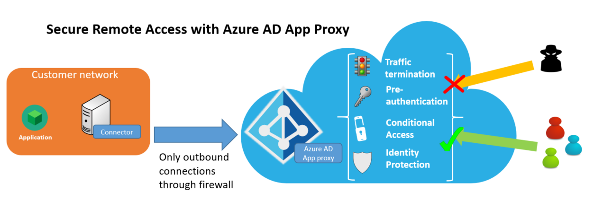

# Security considerations when accessing apps remotely using Azure AD Application Proxy

>[!NOTE]
>Application Proxy is a feature that is available only if you upgraded to the Premium or Basic edition of Azure Active Directory. For more information, see [Azure Active Directory editions](active-directory-editions.md).
>  

This article explains how Azure AD Application Proxy provides a secure service for publishing and accessing your applications remotely. 

Azure AD Application Proxy offers the following security benefits:

**Authenticated access:** Only authenticated connections can accces your network

* Azure AD App Proxy relies on the Azure AD STS for all authentication. For applications published with pre-authentication, no traffic is allowed to pass through the app proxy service to your environment, without a valid STS token.
* Pre-authentication, by its very nature, blocks a significant number of anonymous attacks, as only authenticated identities are allowed to access the backend application.

**Conditional access:** Apply richer policy controls before connections to your network are established

* With conditional access, it is possible to further define restrictions on what traffic is allowed to access your backend applications. You can define restrictions based on location, strength of authentication, and user risk profile.
* This feature enables additional barriers for attackers. You can read more about conditional access [Getting started with Azure Active Directory Conditional Access](https://azure.microsoft.com/en-us/documentation/articles/active-directory-conditional-access-azuread-connected-apps).

**Traffic termination:** All traffic is terminated in the cloud

* The Azure AD App Proxy is a reverse-proxy, so all traffic to backend applications is terminated at the service. The session can only get reestablished with the backend server. This means that your backend servers are not exposed to direct HTTP traffic. For example, you can more easily mitigate targeted attacks.

**All access is outbound:** No inbound connections need be opened to the corporate network

* Azure AD connectors maintain outbound connections to the Azure AD App proxy service. This means there is no need to open firewall ports for incoming connections. 
* Traditional approaches required a DMZ and opening access to unauthenticated connections at the network edge. This resulted in the need for lot of additional investment in WAF products to analyze traffic and offer addition protections to the environment. With App Proxy, you can avoid this scenario. You can even consider going without your DMZ, as all connections are outbound and over a secure channel.

**Security analytics and machine language-based intelligence:** Cutting-edge security protection

* Azure AD's identity protection with machine-learning driven intelligence with data feeds from our Digital Crimes Unit and Microsoft Security Response Center. Together we proactively identify compromised accounts and offer real-time protection from high-risk sign-ins. We take into account numerous factors, such as access from infected devices and through anonymizing networks, and from atypical and unlikely locations.
* Many of these reports and events are already available through an API for integration with your SIEM systems.
* You can read more about Azure AD Identity Protection [Azure Active Directory Identity Protection](https://azure.microsoft.com/en-us/documentation/articles/active-directory-identityprotection).
!
**Remote access as a service:** You don’t have to worry about maintaining and patching on-prem servers

* The Azure AD App Proxy is an internet scale service that we own, so you can be assured you always get the latest security patches and upgrades. Thererfore, we take care of your network's security.
* Unpatched software still accounts for a large number of attacks. With our service model, you don’t have to carry the burden of managing edge servers any longer. 

The remote access services provided with Azure AD operate in accordance with the guidelines and standards outlined at the [Azure Trust Center](https://azure.microsoft.com/en-us/support/trust-center). 

The diagram below shows how Azure AD enables secure remote access to your on-prem applications.

 

>[!NOTE] 
>To improve the security of applications published by Azure AD Appl Proxy, we block Web crawler robots from indexing and archiving your applications. Each time a Web crawler robot tries to retrieve the robots settings for a published app, App Proxy replies with a robots.txt file that includes the following:  
>   _User-agent: *_ 
>   _Disallow: /_
>

## Components of the Azure AD App Proxy solution

Azure AD Application Proxy consists of two parts:

* The cloud based service (AAD AP). This is where the external client/user connections are made.
* An on-premises component called the AAD App Proxy Connector.  The connector listens for requests from the AAD AP service and handles connections to the internal applications, including taking care of items such as KCD (Kerberos Constrained Delegation) for SSO.

### Traffic flows—and how they are secured
This section includes details about how the flows are secured. A flow between the connector and the App Proxy service is established when: 

* The Connector is first set up.
* The Connector pulls configuration information from the App Proxy service, including the connector group that each connector is a member of.
* A user accesses a published application.

>[!NOTE]
>All communications occur over SSL, and always originate at the Connector to the App Proxy service. This service is outbound only.
>

The connector uses a client certificate to authenticate to the App Proxy service for all calls. The only exception to this is the initial setup step where the client certificate is established.

#### Install the Connector

The following flow happens when the connector is first set up.

1. The Connector registration to the service happens as part of the installation of the Connector. At this time, the user is prompted to enter their Azure AD admin credentials. The token acquired is then presented to the Azure AD App Proxy service.
2. App Proxy evaluates the token to ensure that the user is a member of the company admin role within the tenant the token was issued for. If not, the process is terminated.
3. The connector generates a client certificate request and passes this with the token to the App Proxy service, which in turn verifies the token and signs the client certificate request. 
4. The connector uses this client certificate for future communication with the App Proxy service.
4. The connector performs an initial pull of the system configuration data from the srvice using its client certificate and is ready to take requests.

#### Periodic configuration updates

The following flow happens periodically, every time the App Proxy service updates the configuration settings.

1. The connector connects to the configuration endpoint within the App Proxy service using its client certificate.
2. Once the client certificate has been validated, the App Proxy service returns configuration data to the connector; for example, the connector group that the connector should be part of.
3. The connector generates a new certificate request if the current certificate is more than 30 days old, effectively rolling the client certificate every 30 days.

#### Accesss published applications

The following flow happens when users access a published application.

1. When a user accesses a published application, the App Proxy service checks the configuration settings for the app.  If the app is configured to use Pre-Authentication with Azure AD, the user is redirected to the Azure AD STS to authenticate.  This is skipped if you publish the app using pass through.
 * During authentication with Azure AD, we will check for any conditional access policy requirements for the specific application. This is to ensure that the user has been assigned to the application; (for example, if MFA is required, the authentication sequence will prompt the user for a second factor authentication).
 * Once all checks have passed, the Azure AD STS issues a signed token for the application, and redirects the user back to the App Proxy service.
 * App Proxy then validates the token to ensure that it was issued to the application that the user was requesting access to. It does this along with other checks, such as ensuring that the token was signed by Azure AD, and is still within the valid window, etc.
 * App Proxy sets an encrypted authentication cookie (such as a non-persisted cookie) to indicate that authentication to the application has occurred.  This cookie includes an expiration timestamp based on the token from Azure AD and other data, such as the user name that the authentication is based on.  This cookie is encrypted using a private key known only to the App Proxy service.
 * App Proxy redirects the user back to the originally requested URL.
 >[!NOTE] 
 >If any part of the pre-authentication steps fails, the user’s request is denied, and the user is shown a message indicating the source of the problem.
 >

2. App Proxy, upon receiving the request from the client, validates that the pre-authentication condition has been meet and that the cookie is still valid (as required). It then places a request in the appropriate queue for an on-premises connector to handle. 

 >[!NOTE]
 >All requests from the connector are outbound to the App Proxy service. Connectors keep an outbound connection open to App Proxy. When a request comes in, the App Proxy queues up the request on one of the open connections for the connector to pick up.
 >

 * The request includes items from the application, such as the headers of the request and data from the encrypted cookie, the user making the request, and the request ID.  But, the encrypted authentication cookie is not sent to the connector.
3. The connector receives the request from the queue, based on a long-lived outbound connection. App Proxy will do one of the following based on the request:
 * The connector confirms whether it can identify the application.  If not, the connector establishes a connection to the App Proxy service to gather details about the application, and caches it locally.
 * If the request is a simple operation, such as there is no data within the body as is with a RESTful “GET” request, the connector makes a connection to the target internal resource, and waits for a response.
 * If the request has data associated with it in the body, for example a RESTful “POST” operation, the connector makes an outbound connection using the client certificate to the App Proxy instance. It does this to request the data and open a connection to the internal resource.  Upon receipt of the request from the connector, the App Proxy service begins accepting content from the user and forwards this to the connector.  The connector, in turn, forwards the data to the internal resource.
4. Once the request/transmission of all content to the backend is complete, the connector waits for a response.
5. Once a response is received, the connector makes an outbound connection to the App Proxy service, to return the header details and begin streaming the return data.
6. App Proxy "streams" the data to the user.  Some processing of the headers may occur here, as needed and defined by the application.

If you need assistance communicating from an Azure web application by way of a client browser to an on-premise Windows-authenticated Simple Object Access Protocal (SOAP) endpoint, see this [Azure Field Notes Blog](http://www.azurefieldnotes.com/2016/12/02/claims-to-windows-identity-translation-solutions-and-its-flaws-when-using-azure-ad-application-proxy). 

##Next steps
[Understand Azure AD Application Proxy connectors](application-proxy-understand-connectors.md)

